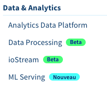
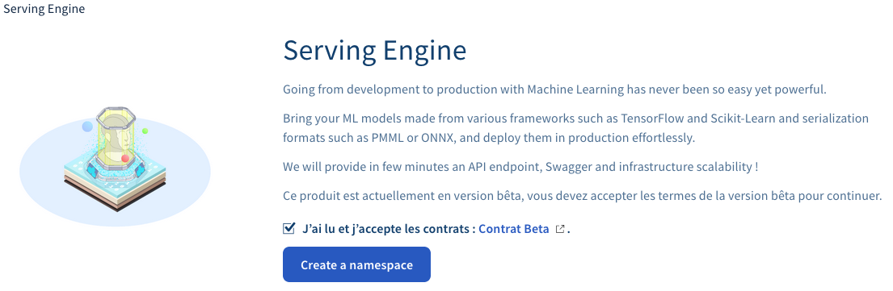
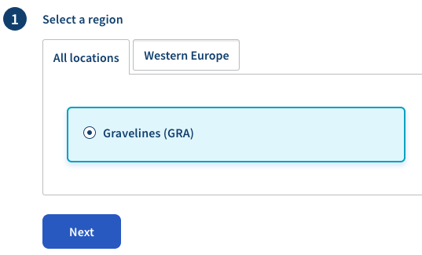
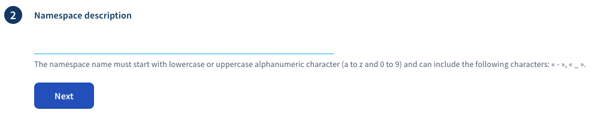
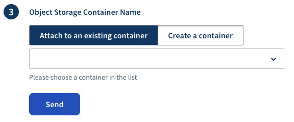
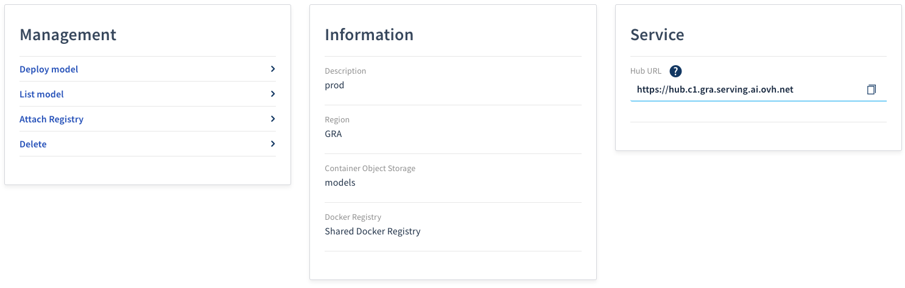
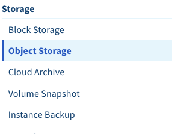
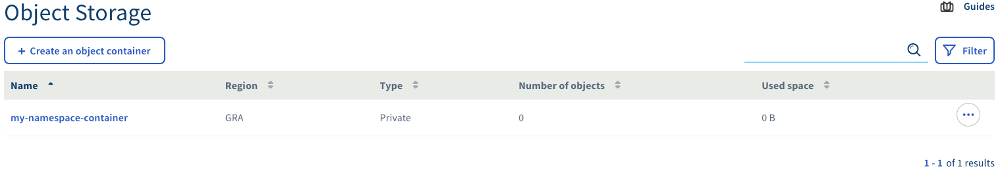

*Last updated 10th January, 2020.*

## Objective

Before being able to deploy a **machine learning model**, you need to
create a namespace on your **public cloud** project. This guide covers
this first step.

## Requirements

-   A **public cloud** project

## Instructions

### Step 1 - Go to the serving engine menu

All actions on the **serving engine** are made on the `Public Cloud`
section of the **OVHcloud control panel** and are located under
`Data & Analytics` \> `Serving Engine`

{.align-center}

### Step 2 - Start the creation of a new namespace

Once you read general information and validated this product's contract terms, you can start the creation of a namespace by clicking on
the `Create a namespace` button.

{.align-center}

### Step 3 - Select the region for your namespace

One or several regions are available for your namespace. Each region
corresponds to a physical OVHcloud datacenter. Just select the region in
which you want your namespace to be deployed and click `next`.

{.align-center}

### Step 4 - Choose a name for your namespace

You can create as many namespaces as you want in your **public cloud**
project. Just choose a name identifying your namespace and click `next`.

{.align-center}

### Step 5 - Attach your object storage container

Each namespace is linked to a data **container** inside **public cloud
object storage**.

You can choose to link to an existing container or create a new one.

{.align-center}

### Step 6 - Check that everything is created

Your namespace is now created and you can check general information
about it.

{.align-center}

You can check that the **data container** was created (if it was not
already) by going on the menu under `Storage` \> `Object Storage`.

{.align-center}

Your container should appear in the list.

{.align-center}

## Going Further

-   You can check the official documentation of the open source product
    **serving engine** about
    [Namespaces](https://serving-doc-mlg.ai.ovh.net/component/namespaces.html)
