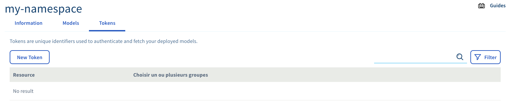
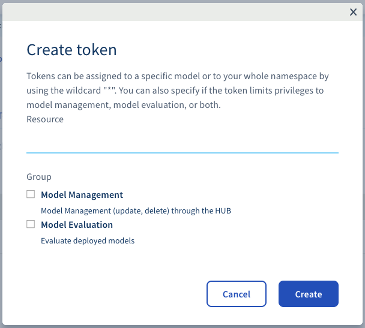
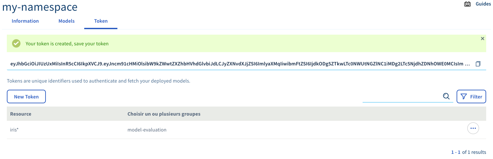
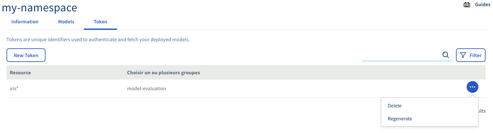

*Last updated 10th January, 2020.*

## Objective

Managing a **serving engine namespace** through the **OVHcloud manager**
make you an admin of that namespace. However you probably want to
delegate access rights and restrictions to other people inside your
organization.

This guide guide you through the process of creating tokens that you can
then gives to your users.

## Requirements

-   Having previously created a **serving engine namespace**. Steps are
    described in section [Initializing
    namespace](../initialize-namespace)

## Creating a token

### Step 1 - Reach token page

Inside your **serving engine namespace** page there is a dedicated tab
for managing tokens : `Tokens`.

{.thumbnail}

You can start the creation of a new token by clicking the `New Token`
button.

### Step 2 - Fill token information

The creation of a token implies to indicates two information :

-   The authorized `resource(s)` of the token
-   The `user groups` of the token

{.thumbnail}

You can validate the creation of your token by clicking the `Create`
button.

### Step 3 - Copy and save your token

A green box indicates that your token has correctly been created and
that token is displayed under it.

{.thumbnail}

This is that token that you can give to your user or use it yourself to
interact with the **serving engine** platform.

> [!warning]
>
> This is the only moment that the token is diplayed to you. We strongly
> advise you to save it and keep it otherwise you will need to renew it.

## Renewing a token

In the case that a token has been lost or compromised, you can
regenerate it directly on the `Token` interface by clicking the `...`
button and then `Regenerate`.

{.thumbnail}

## Going Further

-   You can check the official documentation of the open source product
    **serving engine** about
    [Tokens](https://serving-doc-mlg.ai.ovh.net/component/tokens.html)
