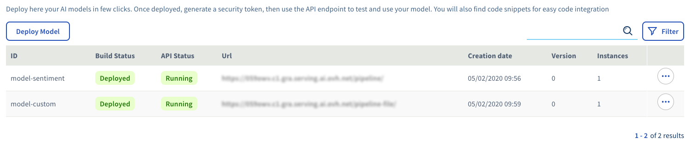
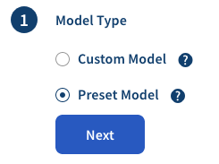
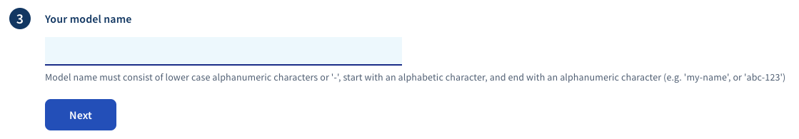
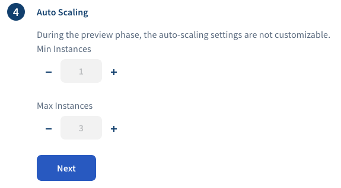
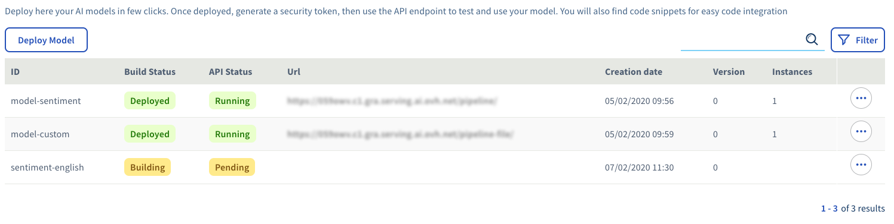
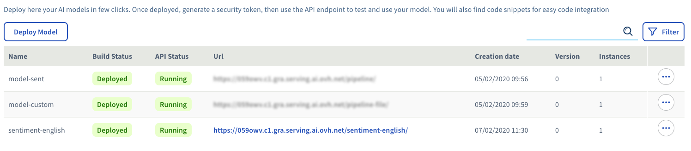

*Last updated 10th January, 2020.*

## Objective

Deploying models is the main feature of the **serving engine**. This
guide provides step by step instructions on how to deploy a **preset
model**.

## Requirements

-   Having previously created a **serving engine namespace**. Steps are
    described in section [Initializing
    namespace](../initialize-namespace)

## Instructions

### Step 1 - Reach model page

Inside your **serving engine namespace** page there is a dedicated tab
for managing models : `Models`.

{.align-center}

You can start the deployment of a new model by clicking the
`Deploy Model` button.

### Step 2 - Select the preset model

In this guide, we explain how to deploy a **preset model**. Just select
**preset model** and click `Next`.

{.align-center}

Then you have to choose which preset model to deploy.

{.align-center}

Just select the chosen one and click `Next`.

### Step 3 - Choose a name for your model

That name identifies your model among others on your namespace.

{.align-center}

Once you chose a name, click the `Next` button.

### Step 4 - Choose your auto-scaling options

A model is composed of one or several running instance(s). These
instances are automaticaly scaled by the **serving engine** depending on
the input load of your model. That step allows you to configure the
minimum and maximum number of instances that you want to run.

{.align-center}

> [!warning]
>
> During the beta phase, the auto-scaling feature is not customizable
> and we reserve the right to remove unused models

### Step 5 - Choose your instances configuration

Each model instance is related to a **CPU & RAM flavor**. You can choose
the wanted flavor among a list of existing ones.

{.align-center}

> [!warning]
>
> During the beta phase only one type of instance is available and is
> free of charges. Additional flavors will be created to fit specific
> needs.

### Step 6 - Wait for model deployment

The **serving engine** sequentially performs the following tasks :

-   The **building** of the model : you should see the **build status**
    as `Building`.
-   The **deployment** task : you should see the **API Status**
    as`Pending`.

{.align-center}

When everything is up and running you see the **build status** as
`Deployed` and the **api status** as `Running`. The URL where to reach
your model is also displayed so you can start requesting it.

{.align-center}

## Going Further

-   You can check the official documentation of the open source product
    **serving engine** about
    [Models](https://serving-doc-mlg.ai.ovh.net/component/models.html)
