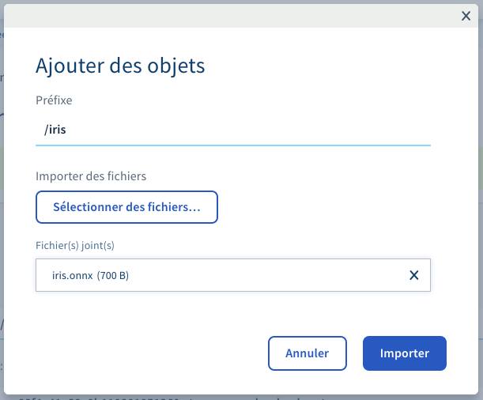
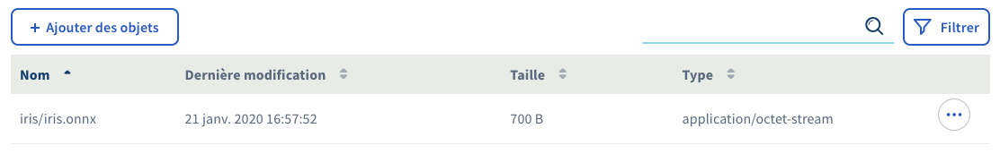
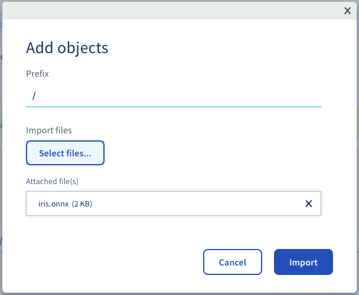
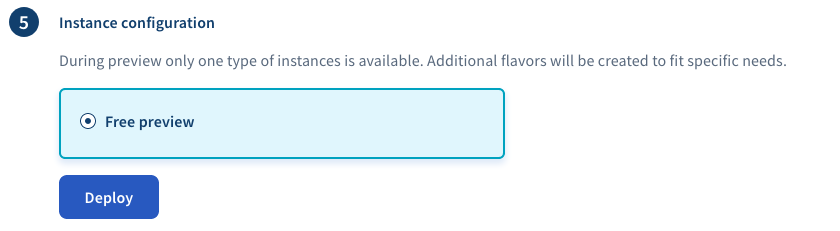
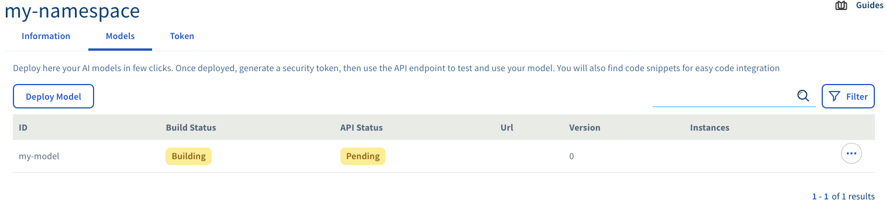
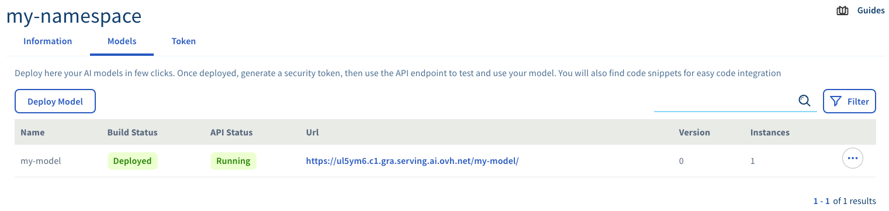
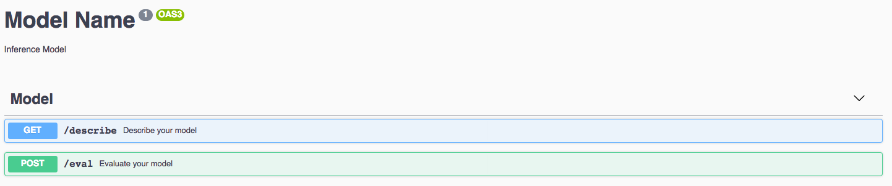

*Last updated 10th January, 2020.*

## Objective

Deploying models is the main feature of the **serving engine**. This
guide explains step by step how to deploy a **serialized model**.

## Requirements

-   Having previously created a **serving engine namespace**. Steps are
    described in section [Initializing
    namespace](../initialize-namespace)
-   Having previously exported your **machine learning model** into a
    supported format. Steps to export **TensorFlow** models are
    described [here](../export-tensorflow-models), steps to export
    **Scikit-Learn** models are described
    [here](../export-sklearn-models).

## Instructions

### Step 1 - Upload the serialized model into the public cloud object storage

You need to upload your serialized model into the **object storage
container** which is linked with your [namespace](../namespaces). On the
main page of your wanted [namespace](../namespaces) you can click on the
name of your linked container under the `Information` \>
`Container Object Storage` section.

This step is just a redirection on `Public Cloud` \> `Storage` \>
`Object Storage` \> `<your container>`.

You can then click the `Add object` button and select your exported
model from your local file storage.

After clicking the `Import` button you should be your exported model in
the list of containers object.

### Step 2 - Reach model page

Inside your **serving engine namespace** page there is a dedicated tab
for managing models : `Models`.

{.align-center}

You can start the deployment of a new model by clicking the
`Deploy Model` button.

### Step 3 - Select the custom model

In this guide, we explain how to deploy a **serialized model** also
called **custom model**. Just select **custom model** and click `Next`.

{.align-center}

### Step 4 - Select your exported file

Here you will click on file and search on the dropdown list your model
and click `Next`.

{.align-center}

### Step 5 - Choose a name for your model

That name identifies your model among others on your namespace.

{.align-center}

After you filled your wanted name, click the `Next` button.

### Step 6 - Choose your auto-scaling options

A model is composed of one or several running instance(s). These
instances are automaticaly scaled by the **serving engine** depending on
the input load of your model. That step allow you to configure the
minimum and maximum number of instances that you want to run.

{.align-center}

> [!warning]
>
> During the beta phase, the auto-scaling feature is not customizable
> and we reserve the right to remove unused models

### Step 7 - Choose your instances configuration

Each model instance is related to a **CPU & RAM flavor**. You can choose
the wanted flavor among a list of existing ones.

{.align-center}

> [!warning]
>
> During the beta phase only one type of instance is available and is
> free of charges. Additional flavors will be created to fit specific
> needs.

### Step 8 - Wait for model deployment

The **serving engine** chains the following tasks :

-   The **building** of the model : you see the **build status** as
    `Building`.
-   The **deployment** task : you see the **API Status** as `Pending`.

{.align-center}

When everything is up and running you see the **build status** as
`Deployed` and the **api status** as `Running`. The URL where to reach
your model is also displayed so you can start requesting it.

{.align-center}

## Step 9 - Check the model web interface

When you follow the model URL in your web browser, you should arrive on
the web page that describes the available API.

> [!warning]
>
> On your first visit, you will need to provide credentials to access
> the web page. Just log in with **no username** and your
> [model-evaluation token](../tokens) as pasword.

This page should look like this :

There are two endpoints available on that kind of model :

-   A endpoint to describe model's **inputs** and **outputs**
-   A endpoint to query the model

The web interface allows you to interactively execute queries on the
different endpoints of your model if you want to test quickly.

## Going Further

-   You can check the official documentation of the open source product
    **serving engine** about
    [Models](https://serving-doc-mlg.ai.ovh.net/component/models.html)
