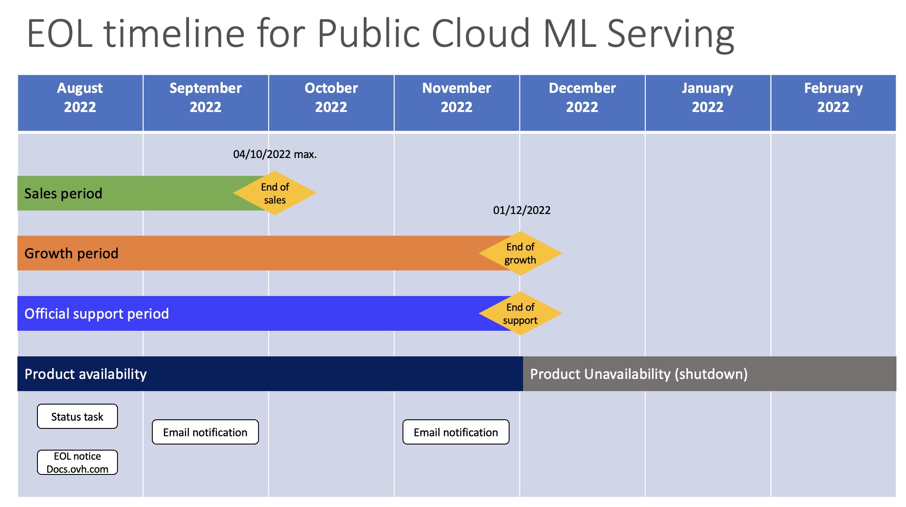

**Last updated 17th August 2022**

## Summary

OVHcloud has announced the end of its ML Serving solution (inference for machine learning models, as a service).

Active services will be supported until December 1st 2022, when support ends.
All operations can be tracked via [the official status task](https://public-cloud.status-ovhcloud.com/incidents/w76csw7y52jf).

New inference solution AI Deploy is available, see the [workaround](#workaround) section of this guide.

## End of Life Planning

In August 2022, customers with active services will receive an email notification on their NIC-admin.

### Schedule table 

| Milestone                | Definition                                                                                                          | Date                |
|--------------------------|---------------------------------------------------------------------------------------------------------------------|---------------------|
| End of Life announcement | The date of the service status task that announces end of sales and end of support.                                 | August 2022         |
| End of Sales             | Last day to purchase a new service on OVHcloud.                                                                     | 04/10/2022 10h CEST |
| End of Growth            | Last day to add more models to existing ML Serving namespaces.                                                      | 01/12/2022 10h CEST |
| End of Support           | Last day to use services. After this date, all associated services and backups will be unavailable (shutdown).      | 01/12/2022 10h CEST |

All operations can be tracked via [the official status task](https://public-cloud.status-ovhcloud.com/incidents/w76csw7y52jf).

### Visual timeline

{.thumbnail}

## End of life scope

This End of Life involves:

- All ML Serving services and solutions (free or paid) worldwide. 
- OVHcloud /cloud/project/{serviceName}/ai/serving/* API endpoints

This end of life **does not concern**:

- AI Notebooks
- AI Training
- AI Deploy (formerly AI Apps)

## Workaround 

OVHcloud does not have alternatives to automatically migrate, but in our Public Cloud universe, we provide AI Deploy (formerly known as AI Apps), a managed solution for inference.

While ML Serving was focused on deploying exported ML models files, requiring intensive and complex worfklows, the new AI Deploy solution is much more agnostic and future-proof. 
AI Deploy supports inference from Docker images, allowing customers to deploy any models but also web applications. 

Full documentation is available on <https://docs.ovh.com/ie/en/publiccloud/ai/>.

Here is a comparative matrix:

| Feature                                | ML Serving                       | AI Deploy              (new)  |
|----------------------------------------|----------------------------------|-------------------------------|
| Managed services                       | Yes                              | Yes                           |
| High-availability inference            | Yes                              | Yes                           |
| CPU or GPU compute resources           | No                               | Yes                           |
| Model serialization                    | Yes                              | No                            |
| Model inference via Docker images      | No                               | Yes                           |
| WebApp inference via Docker images     | No                               | Yes                           |
| Observability tools (metrics and logs) | Partially                        | Yes                           |
| Public network                         | Yes                              | Yes                           |
| Private network                        | No                               | No                            |
| Billing model                          | Per minute billing               | Per minute billing            |

Discover the Public Cloud offers and prices:

- French (Euros): <https://www.ovhcloud.com/fr/public-cloud/ai-machine-learning/>.
- English (Euros): <https://www.ovhcloud.com/en-ie/public-cloud/ai-machine-learning/>.

## Migration options

There is no automatic migration option so far. 

You can migrate to AI Deploy by containerizing your application.

Consult [our AI Deploy (formerly AI Apps) guides here](https://docs.ovh.com/ie/en/publiccloud/ai/).

If you need assistance, please contact our support directly. We provide a catalog of professional services.
