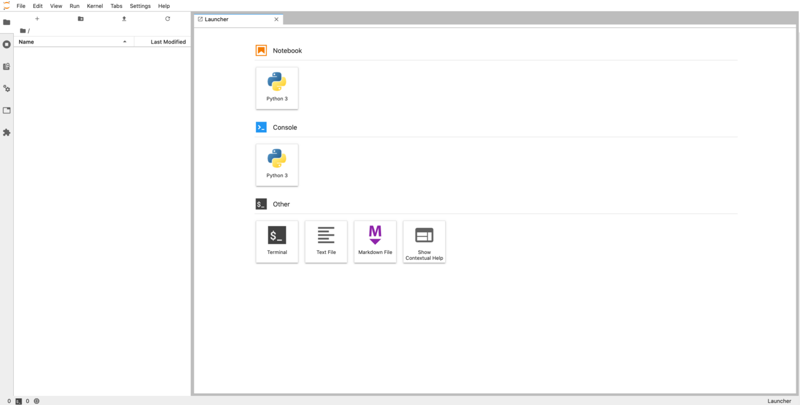

## Objective

This guide covers the submission of new [** AI Notebooks**](/pages/public_cloud/ai_machine_learning/notebook_guide_introduction_definition) through the **ovhai** CLI.

## Requirements

To follow this guide, ensure that you **have the `ovhai` CLI installed** and that you are logged in as a user of one of your Public Cloud Projects, with the necessary permissions (at least *AI Training Operator* and *ObjectStore operator*), to use OVHcloud AI Products. 

For more information on **installing and configuring the ovhai CLI, see the guide on [Installing the OVHcloud AI CLI](/pages/public_cloud/ai_machine_learning/cli_10_howto_install_cli)**.

## Instructions

### Run a new notebook

To run a new notebook, the basic command is `ovhai notebook run`. This command needs to be followed by some arguments that will indicate the specifications of your notebook.

You can see the full list of options by running `ovhai notebook run --help` or `ovhai notebook run -h`:

``` {.console}
ovhai notebook run -h

Run a new notebook

Usage: ovhai notebook run [OPTIONS] <FRAMEWORK_ID> <EDITOR_ID>

Arguments:
  <FRAMEWORK_ID>  Framework ID to use in the notebook The list of available frameworks is available under capabilities `ovhai capabilities framework`
  <EDITOR_ID>     Editor ID to use in the notebook The list of available editors is available under capabilities `ovhai capabilities editor`

Options:
      --token <TOKEN>
          Authentication using Token rather than OAuth
      --unsecure-http
          HTTP services inside job will not require authentication to be accessed from the outside
  -g, --gpu <GPU>
          Number of GPUs
  -f, --flavor <flavor>
          the flavor to use, `ovhai capabilities flavor list` to get the whole list
  -c, --cpu <CPU>
          Number of CPUs (ignored if GPUs is specified)
  -v, --volume <VOLUME_DEFINITION>
          Volumes mounted on the image (multiple)
  -n, --name <NAME>
          Optional name, only informative
  -l, --label <name=value>
          Optional labels, only informative
  -o, --output <OUTPUT>
          Command output format [possible values: json, yaml]
  -s, --ssh-public-keys <ssh-public-key-file>
          Enable the job ssh feature, specify each ssh public key files or give the public key directly
      --framework-version <FRAMEWORK_VERSION>
          Version of the selected framework
  -e, --envvar <name=value>
          Environment variable to be set inside the notebook
      --restart-on-timeout [<RESTART_ON_TIMEOUT>]
          Automatically restart on timeout [possible values: true, false]
      --no-color
          Remove colors from output
  -h, --help
          Print help (see more with '--help')
```

As you can see, `<FRAMEWORK_ID>` and `<EDITOR_ID>` are two mandatory arguments that will specify which framework and editor you want to use inside your notebook.

You can find a list of available frameworks and editors by running the `ovhai capabilities framework list` and `ovhai capabilities editor list` commands:

``` {.console}
ovhai capabilities framework list
ID              NAME                               DESCRIPTION                                                                                                                           DOC_URL                                                        VERSIONS
alicebob        Alice & Bob Felis                  Run fault-tolerant quantum algorithms with logical qubits. Study quantum error correction with superconducting cat qubits.                                                                           alice_and_bob0.4.1
myqlm           Atos myQLM                         Quantum Computing Framework by Atos                                                                                                                                                                  myqlm1.7.3-py39-cpu-v22-4
autogluon-mxnet AutoGluon + MXNet                  AutoGluon + MXNet                                                                                                                                                                                    0.1.0-ovh.beta.1
c12             C12                                C12 Quantum Electronics environment                                                                                                   https://github.com/c12qe/c12simulator-clients/tree/master/docs c122.0.1-py311-cpu,c120.0.6-py310-cpu-v22-4
fastai          fastai Course                      fastai simplifies training fast and accurate neural nets using modern best practices                                                  https://docs.fast.ai/                                          2021-08-04-ovh.beta.1,fastai2.7.10-py310-cuda11.6-v22-4
huggingface     Hugging Face Transformers          State-of-the-art Machine Learning. Includes Transformers + Datasets                                                                   https://huggingface.co/docs/transformers/index                 hf4.34.0-py311-cuda11.8,hf4.26.0-py310-cuda11.6-v22-4
jax             JAX                                JAX is Autograd and XLA, brought together for high-performance numerical computing, including large-scale machine learning research.  https://jax.readthedocs.io/en/latest/                          jax0.4.20
conda           Miniconda                          Images with conda available for you to install your requirements yourself                                                             https://docs.conda.io/en/latest/miniconda.html                 conda-py311-cudaDevel11.8,conda-py311-cpu,conda-py310-cpu-v22-4,conda-py310-cudaDevel11.8-v22-4,conda-py310-cuda11.8-v22-4,conda-py310-cudaDevel11.7-v22-4,conda-py310-cuda11.7-v22-4,conda-py310-cudaDevel11.6-v22-4,conda-py310-cuda11.6-v22-4,conda-py310-cudaDevel11.5-v22-4,conda-py310-cuda11.5-v22-4,conda-py310-cudaDevel11.4-v22-4,conda-py310-cuda11.4-v22-4,conda-py310-cudaDevel11.3-v22-4,conda-py310-cuda11.3-v22-4,conda-py310-cudaDevel11.2-v22-4,conda-py310-cuda11.2-v22-4,conda-py310-cudaDevel11.1-v22-4,conda-py310-cuda11.1-v22-4,conda-py310-cudaDevel11.0-v22-4,conda-py310-cuda11.0-v22-4,conda-py310-cudaDevel10.2-v22-4,conda-py310-cuda10.2-v22-4,conda-py310-cudaDevel10.1-v22-4,conda-py310-cuda10.1-v22-4,conda-py310-cudaDevel10.0-v22-4,conda-py310-cuda10.0-v22-4,conda-py39-cpu-v22-4,conda-py39-cudaDevel11.8-v22-4,conda-py39-cuda11.8-v22-4,conda-py39-cudaDevel11.7-v22-4,conda-py39-cuda11.7-v22-4,conda-py39-cudaDevel11.6-v22-4,conda-py39-cuda11.6-v22-4,conda-py39-cudaDevel11.5-v22-4,conda-py39-cuda11.5-v22-4,conda-py39-cudaDevel11.4-v22-4,conda-py39-cuda11.4-v22-4,conda-py39-cudaDevel11.3-v22-4,conda-py39-cuda11.3-v22-4,conda-py39-cudaDevel11.2-v22-4,conda-py39-cuda11.2-v22-4,conda-py39-cudaDevel11.1-v22-4,conda-py39-cuda11.1-v22-4,conda-py39-cudaDevel11.0-v22-4,conda-py39-cuda11.0-v22-4,conda-py39-cudaDevel10.2-v22-4,conda-py39-cuda10.2-v22-4,conda-py39-cudaDevel10.1-v22-4,conda-py39-cuda10.1-v22-4,conda-py39-cudaDevel10.0-v22-4,conda-py39-cuda10.0-v22-4,conda-py38-cpu-v22-4,conda-py38-cudaDevel11.8-v22-4,conda-py38-cuda11.8-v22-4,conda-py38-cudaDevel11.7-v22-4,conda-py38-cuda11.7-v22-4,conda-py38-cudaDevel11.6-v22-4,conda-py38-cuda11.6-v22-4,conda-py38-cudaDevel11.5-v22-4,conda-py38-cuda11.5-v22-4,conda-py38-cudaDevel11.4-v22-4,conda-py38-cuda11.4-v22-4,conda-py38-cudaDevel11.3-v22-4,conda-py38-cuda11.3-v22-4,conda-py38-cudaDevel11.2-v22-4,conda-py38-cuda11.2-v22-4,conda-py38-cudaDevel11.1-v22-4,conda-py38-cuda11.1-v22-4,conda-py38-cudaDevel11.0-v22-4,conda-py38-cuda11.0-v22-4,conda-py38-cudaDevel10.2-v22-4,conda-py38-cuda10.2-v22-4,conda-py38-cudaDevel10.1-v22-4,conda-py38-cuda10.1-v22-4,conda-py38-cudaDevel10.0-v22-4,conda-py38-cuda10.0-v22-4
colatible       Miniconda with Colab compatibility This image is based on our miniconda image. It has everything preinstalled to be compatible with your Google Colab notebooks.                                                                        colatible-py310-cudaDevel11.8,colatible-py37-cudaDevel11.1-v22-4
mlr3            MLR3                               An open-source collection of R packages providing a unified interface for machine learning in the R language. Successor of mlr.       https://mlr3book.mlr-org.com/                                  mlr3-py310-cudaDevel11.8
mxnet           MXNet                              A flexible and efficient library for deep learning                                                                                    https://mxnet.apache.org/versions/1.5.0/                       mxnet1.9.1-py310-cuda11.2-v22-4
one-for-all     One image to rule them all         Tensorflow 2 + Pytorch + Fast.ai + MXNet + Transformers + And many more (incompatible with JupyterLab Real-Time collaboration editor)                                                                v98-ovh.beta.1
pasqal          Pulser                             Library for pulse-level/analog control of neutral atom devices. Emulator with QuTiP.                                                                                                                 pulser0.17.0
pytorch         PyTorch                            PyTorch is an optimized tensor library for deep learning using GPUs and CPUs                                                          https://pytorch.org/docs/stable/index.html                     pytorch2.4.0-py311-cuda11.8,pytorch2.1.0-py311-cuda11.8,pytorch2.0.0-py310-cuda11.8-v22-4,pytorch1.12.1-py310-cuda11.6-v22-4,pytorch1.11.0-py310-cuda11.3-v22-4,pytorch1.10.1-py39-cuda10.2-v22-4,pytorch1.9.0-py39-cuda10.2-v22-4
qiskit          Qiskit                             Qiskit is an open-source SDK for working with quantum computers at the level of extended quantum circuits, operators, and primitives. https://docs.quantum.ibm.com/                                  qiskit1.0.2
perceval        Quandela Perceval                  Simulation and Control Library for quantum photonic circuits                                                                                                                                         perceval0.10.2-py311,perceval0.9.1-py310-cpu-v22-4,perceval0.8.1-py310-cpu-v22-4
sklearn         Scikit Learn                       Simple and efficient tools for predictive data analysis                                                                               https://scikit-learn.org/stable/user_guide.html                sklearn1.3.0-py311-cpu,sklearn1.0.2-py39-cpu-v22-4
tensorflow      Tensorflow                         An end-to-end open source machine learning platform                                                                                   https://www.tensorflow.org/api_docs                            tf2.15-py311-cudaDevel12.2,tf2.12-py311-cudaDevel11.8,tf2.11-py310-cuda11.2-v22-4,tf2.10-py310-cuda11.2-v22-4,tf2.9-py310-cuda11.2-v22-4,tf2.8-py39-cuda11.2-v22-4,tf2.7-py39-cuda11.2-v22-4,tf2.6-py39-cuda11.2-v22-4,tf2.5-py39-cuda11.2-v22-4,tf2.4-py38-cuda11.0-v22-4,tf2.3-py38-cuda10.1-v22-4,tf2.2-py38-cuda10.1-v22-4
```

``` {.console}
ovhai capabilities editor list
ID         NAME       DOC_URL
jupyterlab              JupyterLab              https://jupyterlab.readthedocs.io/en/stable/
jupyterlabcollaborative JupyterLab Experimental https://jupyterlab.readthedocs.io/en/stable/user/rtc.html
vscode                  VSCode                  https://code.visualstudio.com/docs
```

From there, you can launch a first basic notebook.

Here is an example command for launching a notebook with `PyTorch` and `JupyterLab`:

```bash
ovhai notebook run pytorch jupyterlab
```

For `VSCode`, you can run:

```bash
ovhai notebook run pytorch vscode
```

By default, this notebook will be ran on a single `V100S GPU`, in a `restricted access`, with the `latest version` available of the framework you have selected.

As we saw with the execution of `ovhai notebook run -h`, there are many options available for customizing your notebook. One of them (`--flavor <FLAVOR_ID>`) allows you to specify the flavor you want to use (Type of CPUs/GPUs) by specifying the `flavor ID`. The flavor list can be accessed by running:

```{.console}
ovhai capabilities flavor list
ID           TYPE DESCRIPTION        CPU-PER-UNIT MEMORY-PER-UNIT GPU_INFORMATION.INFO DEFAULT MAX
a100-1-gpu   gpu  NVIDIA Ampere A100 13           160.0 GiB       Ampere-A100 NVIDIA   false   2
ai1-1-cpu    cpu  Intel CPU vCores   1            4.0 GiB         ~                    true    12
ai1-1-gpu    gpu  NVIDIA Tesla V100S 13           40.0 GiB        Tesla-V100S NVIDIA   true    4
ai1-le-1-gpu gpu  NVIDIA Tesla V100S 13           40.0 GiB        Tesla-V100S NVIDIA   false   4
h100-1-gpu   gpu  NVIDIA H100        28           350.0 GiB       H100 NVIDIA          false   4
l40s-1-gpu   gpu  NVIDIA L40s        13           80.0 GiB        L40s NVIDIA          false   4
l4-1-gpu     gpu  NVIDIA L4          20           80.0 GiB        L4 NVIDIA            false   4
```

For example, to launch a notebook with the `a100-1-gpu` flavor, you would use the following command: 

```bash
ovhai notebook run pytorch jupyterlab \
  --flavor a100-1-gpu
```

Then, you can add to your command the `--cpu <NUMBER>` or `--gpu <NUMBER>` flag to specify how many CPUs/GPUs you want. The following example will run the same notebook but on `2 A100` GPUs:

```bash
ovhai notebook run pytorch jupyterlab \
  --flavor a100-1-gpu \
  --gpu 2
```

An example of what a slightly more specific notebook launch would look like:

```bash
ovhai notebook run pytorch jupyterlab \
  --name my_first_notebook \
  --framework-version pytorch2.4.0-py311-cuda11.8 \
  --flavor ai1-1-cpu \
  --cpu 6 \
  --label my_label_key=my_label_value
```

This will launch a new AI Notebook with `PyTorch 2.4.0`, `Jupyterlab`, and `6 CPUs`, in a restricted access.

### Accessing a new notebook

Launching a new notebook using `ovhai notebook run` will display the following information in the terminal, which are the specifications of your notebook:

``` {.console}
Id:         7600dda5-27f7-4937-9260-e24c987ae3c6
Created At: 11-09-24 10:12:29
Updated At: 11-09-24 10:12:29
User:       user-fu9ThaHERbAT
Spec:
  Name:                 my_first_notebook
  Labels: {}
  Resources:
    Cpu:               6
    Ephemeral Storage: 240.0 GiB
    Flavor:            ai1-1-cpu
    Gpu:               0
    Gpu Brand:         ~
    Gpu Memory:        ~
    Gpu Model:         ~
    Memory:            24.0 GiB
    Private Network:   0 bps
    Public Network:    3.0 Gbps
  Volumes: []
  Unsecure Http:        false
  Env:
    Framework Id:      pytorch
    Framework Version: pytorch2.4.0-py311-cuda11.8
    Editor Id:         jupyterlab
  Env Vars:             ~
  Ssh Public Keys:      ~
  Timeout Auto Restart: false
Status:
  Last Transition Date: ~
  Info:
    Message:   Notebook is starting
  State:                STARTING
  Duration:             0
  Url:                  https://7600dda5-27f7-4937-9260-e24c987ae3c6.notebook.gra.ai.cloud.ovh.net
  Grpc Address:         7600dda5-27f7-4937-9260-e24c987ae3c6.nb-grpc.gra.ai.cloud.ovh.net:443
  Info Url:             https://ui.gra.ai.cloud.ovh.net/notebook/7600dda5-27f7-4937-9260-e24c987ae3c6
  Monitoring Url:       ~
  Ssh Url:              ~
  Last Started At:      ~
  Last Stopped At:      ~
```

The first line in the output shows the new `AI Notebook ID`: `7600dda5-27f7-4937-9260-e24c987ae3c6`.

In the last lines, the `Url` field corresponds to your JupyterLab server. You will need to wait a few seconds for the notebook to start and reach the `RUNNING` status. Once it is running, the notebook URL will be accessible.

To follow the notebook state, you can get the notebook information again using its `ID`.

If you don't have the ID of the notebook you want to access, you can list all your notebooks using:

``` {.console}
ovhai notebook ls
```

To get the notebook information again using its `ID`, run the following command:

``` {.console}
ovhai notebook get 7600dda5-27f7-4937-9260-e24c987ae3c6

Id:         7600dda5-27f7-4937-9260-e24c987ae3c6
Created At: 11-09-24 10:12:29
Updated At: 11-09-24 10:12:29
User:       user-fu9ThaHERbAT
Spec:
  Name:            my_first_notebook
  Labels: {}
  Resources:
    Cpu:               6
    Ephemeral Storage: 240.0 GiB
    Flavor:            ai1-1-cpu
    Gpu:               0
    Gpu Brand:         ~
    Gpu Memory:        ~
    Gpu Model:         ~
    Memory:            24.0 GiB
    Private Network:   0 bps
    Public Network:    3.0 Gbps
  Volumes: []
  Unsecure Http:   false
  Env:
    Framework Id:      pytorch
    Framework Version: pytorch2.4.0-py311-cuda11.8
    Editor Id:         jupyterlab
Status:
  Last Transition Date: ~
  Info:
    Message: Notebook is running
  State:                RUNNING
  Duration:             592
  Url:                  https://7600dda5-27f7-4937-9260-e24c987ae3c6.notebook.gra.ai.cloud.ovh.net
  Grpc Address:         7600dda5-27f7-4937-9260-e24c987ae3c6.nb-grpc.gra.ai.cloud.ovh.net:443
  Info Url:             https://ui.gra.ai.cloud.ovh.net/notebook/7600dda5-27f7-4937-9260-e24c987ae3c6
  Monitoring Url:       https://monitoring.gra.ai.cloud.ovh.net/d/job?var-notebook=7600dda5-27f7-4937-9260-e24c987ae3c6&from=1726049489545
  Ssh Url:              ~
  Last Started At:      11-09-24 10:12:39
  Last Stopped At:      ~
  …
```

Now that the notebook is in the `RUNNING` state, a https address is defined in the `Url` field. This `URL` corresponds to your JupyterLab server. Pasting this `URL` in your browser displays the following screen:

{.thumbnail}

You can now start writing code in your notebook. Since we used the PyTorch framework in our example, we will be able to use it without having to install anything ourselves.

As you explore your notebook, you will find an `ai-training-examples` folder already included in your workspace. This repository is automatically cloned for each notebook and includes a variety of examples that you can use with OVHcloud AI products, such as AI Notebooks.

### Stopping a notebook

Once you are done with your notebook, you can stop it with the command below:

``` {.console}
ovhai notebook stop <NOTEBOOK_ID>
```

*In our example above, the `NOTEBOOKD_ID` is `7600dda5-27f7-4937-9260-e24c987ae3c6`*

When you stop a notebook, it becomes unavailable for a certain period of time, during which your data is synchronized on the Object Storage. This allows you to retrieve your work later.

Once the synchronization is complete, the notebook will reach the `STOPPED` state. At this point, you can either start the notebook again or delete it.

### Restarting a stopped notebook

Being able to restart a notebook is one of the main differences compared to using [AI Training jobs](/pages/public_cloud/ai_machine_learning/training_guide_03_concepts_jobs). Restarting a notebook will restore your notebook code as it was when you stopped it. However, you will need to re-run your code to reload your variables because the program state is not saved.

To restart a notebook, run this command:

``` {.console}
ovhai notebook start <NOTEBOOK_ID>
```

You are billed for `RUNNING` notebooks but not for `STARTING`, `STOPPING` and `STOPPED` notebooks.
However, to restore your code when you restart a `STOPPED` notebook, it needs to be stored in your Object Storage, which you are billed for. You can find more information about the AI Notebooks billing in the [Billing and Lifecycle guide](/pages/public_cloud/ai_machine_learning/notebook_guide_billing_concept).

This is useful when you work on a notebook for some time.

### Deleting a notebook

If you know you will not use a notebook anymore, you can delete it:

``` {.console}
ovhai notebook delete <NOTEBOOK_ID>
```

Note that even if a notebook is still running, you can delete it. Of course, a deleted notebook cannot be restarted.

> [!primary]
>
> The notebook state stored in the Object Storage (including your notebook files) is not cleaned up automatically after notebook deletion.
> You can find it and delete it in the `notebooks_workspace` container of your Object Storage, under the notebook ID directory.

## Going further

Learn how to access your Object Storage data and Git repositories from your notebooks [here](/pages/public_cloud/ai_machine_learning/cli_17_how_to_cli_data_notebooks).

Learn how to share your notebooks with other people [here](/pages/public_cloud/ai_machine_learning/cli_14_howto_cli_sharing).

If you need training or technical assistance to implement our solutions, contact your sales representative or click on [this link](https://www.ovhcloud.com/es/professional-services/) to get a quote and ask our Professional Services experts for a custom analysis of your project.

## Feedback

Please send us your questions, feedback and suggestions to improve the service:

- On the OVHcloud [Discord server](https://discord.com/invite/vXVurFfwe9)
