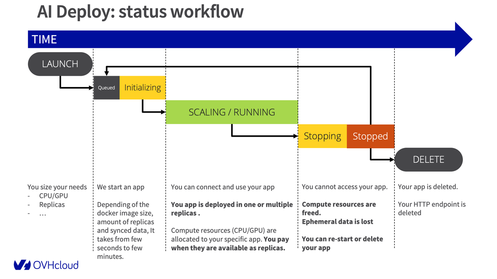
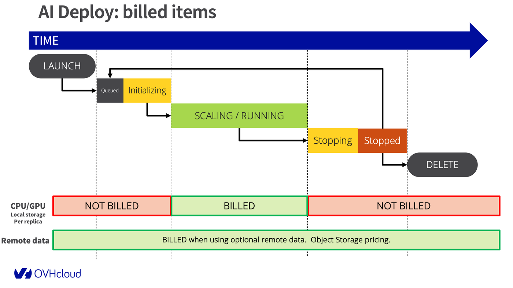

**Last updated 4th April, 2023.**

> [!primary]
>
> AI Deploy is covered by **[OVHcloud Public Cloud Special Conditions](https://storage.gra.cloud.ovh.net/v1/AUTH_325716a587c64897acbef9a4a4726e38/contracts/d2a208c-Conditions_particulieres_OVH_Stack-WE-9.0.pdf)**.
>

## Objective

OVHcloud AI Deploy service provides easiness in AI models and application deployments. You can deploy Docker images to HTTP endpoints, linked to CPU or GPU resources, without the hassle of installing or operating them. 

**This guide will cover the lifecycle of an AI Deploy `app`, and associated billing.**

## Introduction

AI Deploy is linked to a Public Cloud project. The whole project is billed at the end of the month, with pay-as-you-go. This means you will only pay for what you consume, based on the compute resources you use (CPus and GPUs) and their running time. At this time, we do not support a "pay per call" pricing.

## AI Deploy apps lifecycle

OVHcloud AI deploy allows deployment of Docker images, and each deployment is called an `app`. 
During its lifetime, the app will go through the following status:

- `QUEUED`: the app deployment request is about to be processed. First arrived, first deployed.
- `INITIALIZING`: the app is being started and, if any, the remote data is synchronized. To learn more about data synchronization, please check out the [Data - How it works](/pages/public_cloud/ai_machine_learning/gi_02_concepts_data#how-it-works) documentation.
- `RUNNING`: the app is running, you can connect to it and use it. Compute resources (GPUs/CPUs) are allocated to your specific app and an HTTP endpoint is available.
- `SCALING`: the app deployment is scaling up or down, depending of the scaling configuration. While scaling, the app is still available if it was running before.
- `STOPPING`: the app is stopping, your compute resources are freed. Ephemeral data is deleted.
- `STOPPED`: the app ended normally. You can restart it whenever you want or delete it.
- `FAILED`: the app ended in error, e.g. the Docker image is invalid (unreachable, built with linux/arm, ...).
- `ERROR`: the app ended due to a backend error (issue on OVHcloud side). You may reach our support.
- `DELETING`: the app is being removed. When it is deleted, you will no longer see it, it will no longer exist.
- `DELETED`: the app is fully deleted.

{.thumbnail}

## Billing principles

AI Deploy apps are a pay-per-use solution. You only pay for the resources consumption, also known as available replicas, during a period of time (during the `RUNNING` and `SCALING` phases of your apps).

The billing principle is quite simple, you select the amount of compute resource (CPUs or GPUs) you would like to work with and pay only for this.

We **do not provide** a pay-per-call pricing so far.

**Included** resources in AI Deploy are:

- AI Deploy managed service (zero infrastructure to manage).
- Dedicated CPU/GPU compute resources (based on the selected amount).
- Ephemeral storage when the app is running (storage space related to compute resources sizing).
- Ingress/Egress network traffic.
- Monitoring tool and live metrics (Grafana).

**Optional** resources, not included with AI Deploy, are:

- Remote storage space, based on OVHcloud Object Storage pricing.
- For this optional Object Storage, Egress traffic when communicated outside OVHcloud
- Private Docker registry if any.

Visual explanations about paid items:

{.thumbnail}

A more detailed view:

{.thumbnail}

### Compute resources details

During the app creation, you can select **compute resources**, known as CPUs or GPUs.
Their official pricing is available in the [OVHcloud Control Panel](https://www.ovh.com/auth/?action=gotomanager&from=https://www.ovh.co.uk/&ovhSubsidiary=GB) or on the [OVHcloud Public Cloud website](https://www.ovhcloud.com/en-gb/public-cloud/prices/).

Rates for compute are mentioned per hour to facilitate reading of the prices, but the billing granularity remains **per minute**.

Once you select the compute resources, you can specify the scaling strategy:

- **Fixed scaling**: you can specify a fixed amount of replicas, starting at one. Please note that with one replica, you will not benefit from high-availability.
- **Auto-scaling**: you can specify a minimum and maximum amount of replicas, and a metric that will act as a trigger for scaling up or down (CPU or RAM usage). Each replica will benefit from the compute resource selected before.

### Storage details

#### Ephemeral local storage

Each compute resource (CPU or GPU) comes with local storage, that we can consider ephemeral since this storage space is not saved when you stop or delete an AI Deploy app.

The sizing depends on the selected amount of compute resources, check the details on the [OVHcloud Public Cloud website](https://www.ovhcloud.com/en-gb/public-cloud/prices/).

This storage space can be used by your Docker image, for local operations.

#### Remote Object Storage

When working with remote data, you pay separately for the storage of this data.
The pricing of Object Storage is separate from the app pricing.

### Pricing examples

For these examples, we will take a pricing of 1,95€ / hour per GPU NVIDIA V100s and 0,03€ / hour per CPU.
Pricing may vary, please refer to the official pricing page.

#### Example 1: a GPU app for 10 hours then deleted

We deploy one AI Deploy app, with 2 x GPUs and we keep it running for 10 hours then we **delete it**.

We receive thousands of calls: it's included (no pay per call provided, you pay running compute).

- compute resources per replica : 2 x GPU NVIDIA V100s (1,95€ / hour)
- scaling : fixed
- replicas : 1 only
- amount of calls : unlimited
- duration: 10 hours then deleted

Price calculation for compute: 10 (hours) x 2 (GPU) x 1 (replica) x 1,93€ (price / GPU) = **39 euros**, billed at the end of the month.

#### Example 2: multiple AI Deploy apps for 5 hours then deleted

We start 15 x AI Deploy apps in parallel, each of them with one vCPU.

We receive thousands of calls: it's included (no pay per call provided, you pay running compute).

- compute resources per app with fixed scaling: 1 x vCPU (0,03€ /hour /cpu)
- scaling : fixed
- replica : 1 only
- amount of calls : unlimited
- duration: 5 hours then deleted

Price calculation for compute: 15 (app) x 5 (hours) x 1 (CPU) x 0,03€ (price / CPU) = **2,25 euros**, billed at the end of the month.

#### Example 3: GPUs and autoscaling

We start 1 x AI Deploy app with autoscaling configured to 1 replica minimum, and 3 replicas maximum.

We receive thousands of calls: it's included (no pay per call provided, you pay running compute).

- compute resources per replica : 1 x GPU (1,93€ /hour /gpu)
- scaling : auto-scaling, from 1 to 3 replicas
- amount of calls : unlimited
- duration: 5 hours with 1 replica running, then a peak with 1 hour at 3 replicas, then stopped and deleted.

Price calculation for compute will vary over time due to auto-scaling: 
1 (app) x 5 (hours) x 1 (replica) x 1 (GPU) x 1,93€ (price / GPU) = **9,65 euros**
+
1 (app) x 1 (hour) x 3 (replicas) x 1 (GPU) x 1,93€ (price / GPU) = **5,79 euros**
Total is **15,44 euros**, billed at the end of the month.

## Feedback

Please send us your questions, feedback and suggestions to improve the service:

- On the OVHcloud [Discord server](https://discord.gg/ovhcloud)

If you need training or technical assistance to implement our solutions, contact your sales representative or click on [this link](https://www.ovhcloud.com/en-gb/professional-services/) to get a quote and ask our Professional Services experts for a custom analysis of your project.

