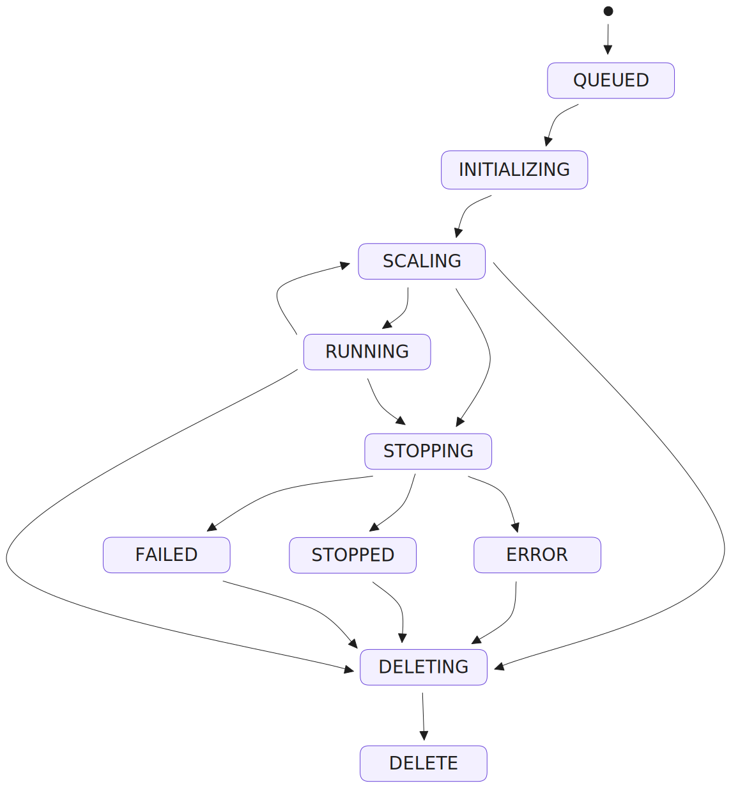

## Definition

An **app** in **AI Deploy** is the workload unit submitted to the cluster. An **app** runs as a Docker container within OVHcloud infrastructure.

Each AI Deploy app is linked to a **Public Cloud** project and specifies an amount of resources to use to run the inference task along with a Docker image either publicly available, in the **AI Deploy** shared registry scoped to your project or the private registry of your choosing that you added. For the latter, see the [OVHcloud documentation on how to add use and manage registries](/pages/public_cloud/ai_machine_learning/gi_07_manage_registry).

## Considerations

> [!warning]
>
> An app will run indefinitely until manual interruption.
>

- [Data](/pages/public_cloud/ai_machine_learning/gi_02_concepts_data) can be attached to a app to serve either/both as input (e.g. model weights).
- If you do not customize your resource request, the default requested is 1 GPU (Tesla V100S). Memory is not customizable.
- [Scaling](/pages/public_cloud/ai_machine_learning/deploy_guide_04_scaling_strategies) for applications depends on the chosen configuration. It can be **static** or **automatic**, and is based on a trigger threshold according to the metric chosen by the user.
- [Billing](/pages/public_cloud/ai_machine_learning/deploy_guide_06_billing_concept) for **apps** is minute-based and applies during the `SCALING` and `RUNNING` states of the application. Each commenced minute is billed completely.
- You can read further on app limitations [here](/pages/public_cloud/ai_machine_learning/deploy_guide_01_capabilities).

## Under the hood

**Apps** in **AI Deploy** are Docker containers within OVHcloud infrastructure.

## App lifecycle

During its lifetime the app will transit between the following states:

> [!primary]
>
> Only the `RUNNING` and `SCALING` time of the app **are billed**. For more information about apps billing, refer to this [documentation](/pages/public_cloud/ai_machine_learning/deploy_guide_06_billing_concept).
>

- `QUEUED`: the app deployment request is about to be processed
- `INITIALIZING`: the app is being started and, if any, the remote data is synchronized
- `RUNNING`: the app is running, you can connect to it, compute resources (GPUs/CPUs) are allocated to your specific app and an HTTP endpoint is available
- `SCALING`: the app deployment is scaling up or down, depending of the scaling configuration. While scaling, the app is still available if it was running before
- `STOPPING`: the app is stopping, your compute resources are freed and ephemeral data is deleted
- `STOPPED`: the app ended normally and you can restart it whenever you want or delete it
- `FAILED`: the app ended in error, e.g. the Docker image is invalid (unreachable, built with linux/arm, ...)
- `ERROR`: the app ended due to a backend error (issue on OVHcloud side)
- `DELETING`: the app is being removed
- `DELETED`: the app is fully deleted

{.thumbnail}

## Going further

-   You can check the [OVHcloud documentation on how to create a data container](/pages/storage_and_backup/object_storage/pcs_create_container).
-   You can check the [OVHcloud documentation on how to submit an app](/pages/public_cloud/ai_machine_learning/deploy_guide_02_getting_started)

If you need training or technical assistance to implement our solutions, contact your sales representative or click on [this link](https://www.ovhcloud.com/en-gb/professional-services/) to get a quote and ask our Professional Services experts for a custom analysis of your project.

## Feedback

Please send us your questions, feedback and suggestions to improve the service:

- On the OVHcloud [Discord server](https://discord.com/invite/vXVurFfwe9)
