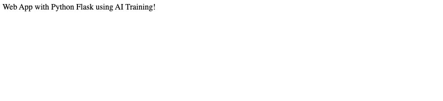

**Last updated 4th April, 2023.**

> [!primary]
>
> AI Deploy is covered by **[OVHcloud Public Cloud Special Conditions](https://storage.gra.cloud.ovh.net/v1/AUTH_325716a587c64897acbef9a4a4726e38/contracts/d2a208c-Conditions_particulieres_OVH_Stack-WE-9.0.pdf)**.
>

## Objective

[Flask](https://flask.palletsprojects.com/en/2.0.x/) is an open-source micro framework for web development in Python.

The purpose of this tutorial is to show you how to build and use a custom Docker image for a Flask application.

## Requirements

- Access to the [OVHcloud Control Panel](https://www.ovh.com/auth/?action=gotomanager&from=https://www.ovh.de/&ovhSubsidiary=de);
- An **AI Deploy project** created inside a [Public Cloud project](https://www.ovhcloud.com/de/public-cloud/) in your OVHcloud account;
- A [user for AI Deploy](/pages/public_cloud/ai_machine_learning/gi_01_manage_users);
- [Docker](https://www.docker.com/get-started) installed on your local computer;
- Some knowledge about building image and [Dockerfile](https://docs.docker.com/engine/reference/builder/).

## Instructions

### Write a simple Flask application

Create a simple Python file with name `app.py`.

Inside that file, import your required modules:

```python
from flask import Flask
```

Create Flask app:

```python
app = Flask(__name__)
```

Define a simple function:

```python
@app.route('/')
def index():
    return 'Web App with Python Flask using AI Deploy!'
```

Start your app:

```python
if __name__ == '__main__':
    # starting app
    app.run(debug=True,host='0.0.0.0')
```

- More information about Flask can be found [here](https://flask.palletsprojects.com/en/2.0.x/).
- Direct link to the full python file can be found here [here](https://github.com/ovh/ai-training-examples/tree/main/apps/flask/hello-world).

### Write the requirements.txt for your applications

The `requirements.txt` file will allow us to write all the modules needed to make our application work. This file will be useful when writing the `Dockerfile`.

```console
Flask==1.1.2
```

### Write the Dockerfile for your application

Your Dockerfile should start with the `FROM` instruction indicating the parent image to use. In our case we choose to start from a classic Python image.

```console
FROM python
```

Install the `requirements.txt` file which contains your needed Python modules using a `pip install ...` command:

```console
RUN pip install -r requirements.txt
```

Define your default launching command to start the application.

```console
CMD [ "python" , "/workspace/app.py" ]
```

Give correct access rights to ovhcloud user `(42420:42420)`:

```console
RUN chown -R 42420:42420 /workspace
ENV HOME=/workspace
```

- More information about Dockerfiles can be found [here](https://docs.docker.com/engine/reference/builder/).
- Direct link to the full Dockerfile can be found here [here](https://github.com/ovh/ai-training-examples/blob/main/apps/flask/hello-world/Dockerfile).

### Build the Docker image from the Dockerfile

Launch the following command from the Dockerfile directory to build your application image:

```console
docker build . -t flask-app:latest
```

> [!primary]
>
> The dot `.` argument indicates that your build context (place of the **Dockerfile** and other needed files) is the current directory.
>
> The `-t` argument allows you to choose the identifier to give to your image. Usually image identifiers are composed of a **name** and a **version tag** `<name>:<version>`. For this example we chose **flask-app:latest**.
>

> [!warning]
>
> Please make sure that the docker image you will push in order to run containers using AI products respects the **linux/AMD64** target architecture. You could, for instance, build your image using **buildx** as follows:
>
> `docker buildx build --platform linux/amd64 ...`
>

### Test it locally (optional)

Launch the following **docker command** to launch your application locally on your computer:

```console
docker run --rm -it -p 5000:5000 --user=42420:42420 flask-app:latest
```

> [!primary]
>
> The `-p 5000:5000` argument indicates that you want to execute a port rediction from the port **5000** of your local machine into the port **5000** of the docker container. The port **5000** is the default port used by **Flask** applications.
>


> [!warning]
>
> Don't forget the `--user=42420:42420` argument if you want to simulate the exact same behavior that will occur on **AI Deploy apps**. It executes the docker container as the specific OVHcloud user (user **42420:42420**).
>

Once started, your application should be available on `http://localhost:5000 `.

### Push the image into the shared registry

> [!warning]
>
> The shared registry of AI Deploy should only be used for testing purposes. Please consider attaching your own docker registry. More information about this can be found [here](/pages/public_cloud/ai_machine_learning/training_guide_05_howto_add_registry).
>

Find the address of your shared registry by launching this command:

```console
ovhai registry list
```

Log in on the shared registry with your usual OpenStack credentials:

```console
docker login -u <user> -p <password> <shared-registry-address>
```

Push the compiled image into the shared registry:

```console
docker tag flask-app:latest <shared-registry-address>/flask-app:latest
docker push <shared-registry-address>/flask-app:latest
```

### Launch the AI Deploy app

The following command starts a new app running your Flask application:

```console
ovhai app run --default-http-port 5000 --cpu 1 <shared-registry-address>/flask-app:latest
```

> [!primary]
>
> `--default-http-port 5000` indicates that the port to reach on the app url is the `5000`.
>
> `--cpu 1` indicates that we request 1 cpu for that app.
>
> Consider adding the `--unsecure-http` attribute if you want your application to be reachable without any authentication.
>

Once the app is running you can access your Flask application directly from the app's URL.

{.thumbnail}

## Go further

- To go further with **Flask**, imagine creating an app to deploy an Object Detection model. Refer to this [tutorial](/pages/public_cloud/ai_machine_learning/deploy_tuto_04_flask_yolov5).
- **Flask** allows you to do sentiment classification on texts using Hugging Face models. [Here it is](/pages/public_cloud/ai_machine_learning/deploy_tuto_06_flask_hugging_face).

If you need training or technical assistance to implement our solutions, contact your sales representative or click on [this link](https://www.ovhcloud.com/de/professional-services/) to get a quote and ask our Professional Services experts for a custom analysis of your project.

## Feedback

Please send us your questions, feedback and suggestions to improve the service:

- On the OVHcloud [Discord server](https://discord.com/invite/vXVurFfwe9)