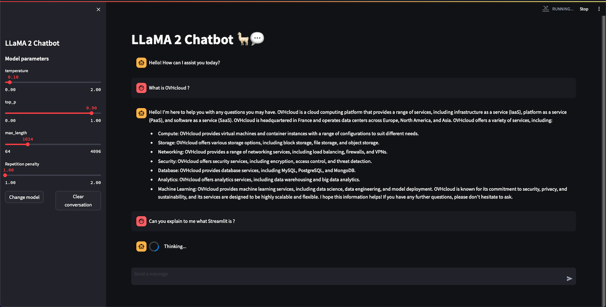

On July 18, 2023, [Meta](https://about.meta.com/) released [LLaMA 2](https://ai.meta.com/llama/), the latest version of their open-source Large Language Model (LLM).

Trained between January 2023 and July 2023 on 2 trillion tokens, LLaMA 2 outperforms other LLMs on many benchmarks, including reasoning, coding, proficiency, and knowledge tests. This release comes in different flavors, with parameter sizes of 7B, 13B, and a mind-blowing 70B. Models are intended for free for both commercial and research use in English.

## Objective

The purpose of this tutorial is to show you how to **deploy LLaMA 2 in an application**, which allows to interact with the model from an interface, such as ChatGPT. Deploying your app will allow you to benefit from **very powerful resources** which will make your chatbot application extremely fast. It can also be easily shared, unlike a local application.

In order to do this, we will use [Streamlit](https://streamlit.io/), a Python framework that turns scripts into a shareable web application. You will also learn how to build and use a custom Docker image for a Streamlit application. 

Here is an overview of our image segmentation app:

{.thumbnail}

## Requirements

To deploy your app, you need:

- Access to the [OVHcloud Control Panel](/links/manager)
- An AI Deploy Project created inside a [Public Cloud project](https://www.ovhcloud.com/it/public-cloud/) in your OVHcloud account
- A [user for AI Deploy](/pages/public_cloud/ai_machine_learning/gi_01_manage_users)
- [The OVHcloud AI CLI](/pages/public_cloud/ai_machine_learning/cli_10_howto_install_cli) installed on your local computer
- [Docker](https://www.docker.com/get-started) installed on your local computer, **or** access to a Debian Docker Instance, which is available on the [Public Cloud](https://www.ovh.com/manager/public-cloud/).
- Some knowledge about building image and [Dockerfile](https://docs.docker.com/engine/reference/builder/)
- The full code of the application, which can be found on this [GitHub repository](https://github.com/ovh/ai-training-examples/tree/main/apps/streamlit/llama-2-chatbot), which we advise you to clone.
- An **access to Llama 2 Models**. To obtain Llama 2, you will need to:
    - Fill Meta's form to [request access to the next version of Llama](https://ai.meta.com/resources/models-and-libraries/llama-downloads/). Indeed, the use of Llama 2 is governed by the Meta license, that you must accept in order to download the model weights and tokenizer.
    - Have a [Hugging Face](https://huggingface.co/) account (with the same email address you entered in Meta's form).
    - Have a [Hugging Face token](https://huggingface.co/settings/tokens).
    - Visit the page of one of the LLaMA 2 available models (version [7B](https://huggingface.co/meta-llama/Llama-2-7b-chat-hf), [13B](https://huggingface.co/meta-llama/Llama-2-13b-chat-hf) or [70B](https://huggingface.co/meta-llama/Llama-2-70b-chat-hf)), and accept Hugging Face's license terms and acceptable use policy. Once you have accepted this, you will get the following message: *Your request to access this repo has been successfully submitted, and is pending a review from the repo's authors*, which a few hours later should change to: *You have been granted access to this model*. 

## Instructions

We are going to follow different steps to deploy our **LLaMA 2 chatbot application**:

- **Write the requirements.txt** that contains the required libraries that need to be installed so that our application can work.
- **Write the `Dockerfile`** that contains all the commands to launch our LLaMA 2 Streamlit application.
- **Build the Docker image** from the Dockerfile.
- **Push the image into a registry.**
- **Deploy the app**.

*If you have cloned the [app's repository](https://github.com/ovh/ai-training-examples/tree/main/apps/streamlit/llama-2-chatbot), you will not need to rewrite the files (`requirements.txt` and `Dockerfile`) since you already have them. In this case, you can go directly to the "Build the Docker image" step, even if it is better to understand the global process.*

### Write the requirements.txt file for the application

The `requirements.txt` file will allow us to write all the modules needed by our application. This file will be useful for the `Dockerfile`.
Put this file (and the next ones) in the same directory as your python scripts.

```console
streamlit==1.26.0
torch==2.0.0
transformers==4.33.1
tokenizers==0.13.3
```

### Write the Dockerfile for the application

A `Dockerfile` is a text document that contains all the commands a user could call on the command line to build an image.

This file should start with the `FROM` instruction, indicating the parent image to use. In our case, we choose to start from the official `python:3.10-slim` image:

```console
FROM python:3.10-slim
```

Then, define the home directory and add all your files (python scripts, requirements.txt and the Dockerfile) to it thanks to the following commands:

```console
WORKDIR /workspace
ADD . /workspace
```

With AI Deploy, `workspace` will be your home directory.

Now, let's indicate that we must install the `requirements.txt` file which contains our needed Python modules, by using a `pip install` command:

```console
RUN pip install -r requirements.txt
```

Give correct access rights to the **OVHcloud user** (`42420:42420`).

```console
RUN chown -R 42420:42420 /workspace
ENV HOME=/workspace
```

Finally, define the command to run the Streamlit application when the container is launched:

```console
CMD [ "streamlit" , "run" , "/workspace/main.py", "--server.address=0.0.0.0" ]
```

### Build the Docker image from the Dockerfile

Before continuing, **make sure you are in the directory containing the application files** (requirements.txt, Dockerfile, python files).

Once you are in it, launch the following command to build your application image:

```console
docker build . -t llama_app:latest
```

> [!primary]
> **Notes**
>
> - The dot `.` argument indicates that your build context (place of the **Dockerfile** and other needed files) is the current directory.
>
> - The `-t` argument allows you to choose the identifier to give to your image. Usually image identifiers are composed of a **name** and a **version tag** `<name>:<version>`. For this example we chose **llama_app:latest**.

> [!warning]
>
> In order to run containers using AI products, please make sure that the docker image you will push respects the **linux/AMD64** target architecture. You could, for instance, build your image using **buildx** as follows:
>
> `docker buildx build --platform linux/amd64 ...`
>

### Test it locally (optional)

Launch the following **Docker command** to launch the application locally on your computer:

```console
docker run --rm -it -p 8501:8051 --user=42420:42420 llama_app:latest
```

> [!primary]
> **Notes**
>
> - The `-p 8501:8501` argument indicates that you want to execute a port redirection from the port **8501** of your local machine into the port **8501** of the Docker container. The port **8501** is the default port used by **Streamlit** applications.
>
> - Don't forget the `--user=42420:42420` argument if you want to simulate the exact same behaviour that will occur on **AI Deploy apps**. It executes the Docker container as the specific OVHcloud user (user **42420:42420**).

Once started, your application should be available on `http://localhost:8501`.

### Push the image into the shared registry

> [!warning]
> **Warning**
> The shared registry should only be used for testing purposes. Please consider creating and attaching your own registry. More information about this can be found [here](/pages/public_cloud/ai_machine_learning/gi_07_manage_registry). The images pushed to this registry are for AI Tools workloads only, and will not be accessible for external uses.

Find the address of your shared registry by launching this command:

```console
ovhai registry list
```

Log in on your shared registry with your usual AI Platform user credentials:

```console
docker login -u <user> -p <password> <shared-registry-address>
```

Tag the compiled image and push it into your shared registry:

```console
docker tag llama_app:latest <shared-registry-address>/llama_app:latest
docker push <shared-registry-address>/llama_app:latest
```

### Launch the AI Deploy app

The following command starts a new app running your LLaMA 2 Streamlit application:

```console
ovhai app run <shared-registry-address>/llama_app:latest \
      --gpu 1 \
      --default-http-port 8501 \
      --name llama_app
```

> [!primary]
> **Notes**
>
> - `--default-http-port 8501` indicates that the port to reach on the app URL is `8501`.
>
> - `--gpu 1` indicates that we request 1 GPU for that app. We recommend that you use at least 1 GPU for proper performance when using LLMs. Keep in mind that **the more parameters your model has, the more memory it will require**. Depending on the model you want to use, **using more than one GPU may be essential**.
>
> - Consider adding the `--unsecure-http` attribute if you want your application to be reachable without any authentication.

## Go further

- Discover how to [fine-tune LLaMA 2 on your own dataset](/pages/public_cloud/ai_machine_learning/notebook_tuto_13_fine_tune_llama_v2)
- Create a voice chatbot with [Speech to Text](/pages/public_cloud/ai_machine_learning/notebook_tuto_08_speech_to_text)

If you need training or technical assistance to implement our solutions, contact your sales representative or click on [this link](https://www.ovhcloud.com/it/professional-services/) to get a quote and ask our Professional Services experts for a custom analysis of your project.

## Feedback

Please send us your questions, feedback and suggestions to improve the service:

- On the OVHcloud [Discord server](https://discord.com/invite/vXVurFfwe9)
