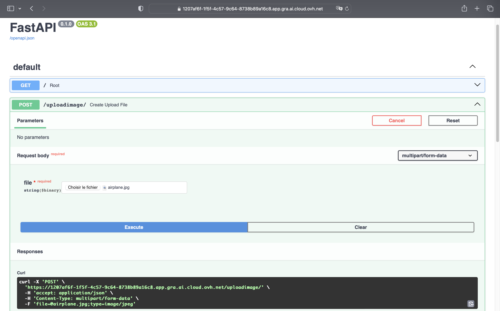
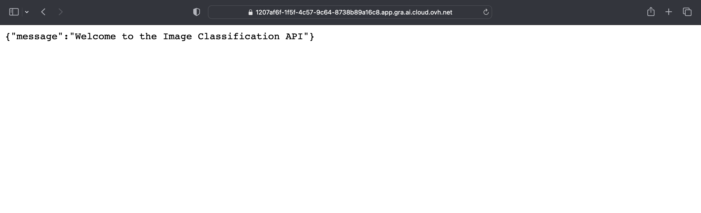
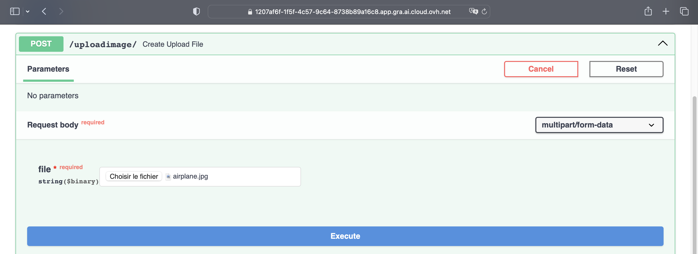
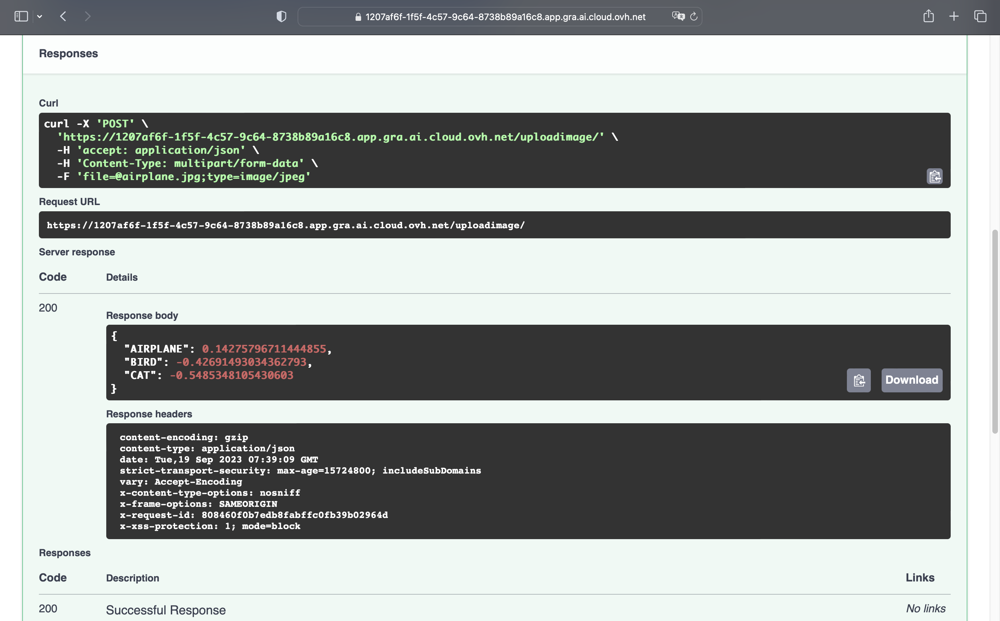

## Objective

The purpose of this tutorial is to show you how to deploy an **ONNX model** for optimized inference thanks to **AI Deploy**.

In order to do this, you will use a **DenseNet model** trained on [CIFAR-10 dataset](https://www.cs.toronto.edu/~kriz/cifar.html) to classify images and the [FastAPI](https://fastapi.tiangolo.com/) Python framework to create the API. Developing an API will enable you to use your Machine Learning model for inference.
You will also learn how to build and use a custom Docker image for a FastAPI deployment.

For more information on how to train DenseNet on a CIFAR-10 dataset, refer to the following [documentation](/pages/public_cloud/ai_machine_learning/notebook_tuto_15_finetune_export_onnx_model).

Here is an overview of the **image classification** API:

{.thumbnail}

## Requirements

- Access to the [OVHcloud Control Panel](/links/manager)
- An AI Deploy project created inside a Public Cloud project
- A [user for AI Deploy](/pages/public_cloud/ai_machine_learning/gi_01_manage_users)
- [Docker](https://www.docker.com/get-started) installed on your local computer or a deployed Public Cloud Docker Instance
- Some knowledge about building images and [Dockerfile](https://docs.docker.com/engine/reference/builder/)
- Your weights obtained from fine-tuning **DenseNet model** on the **CIFAR-10 dataset** (refer to the *"Export ONNX model for inference"* part of the [notebook about DenseNet fine-tuning](https://github.com/ovh/ai-training-examples/blob/main/notebooks/go-further/onnx/notebook_finetune_densenet_export_onnx.ipynb))

## Instructions

You are going to follow different steps to build your FastAPI app.

- More information about FastAPI capabilities can be found [here](https://fastapi.tiangolo.com/).
- A direct link to the full code can be found [here](https://github.com/ovh/ai-training-examples/tree/main/apps/fastapi/image-classification-densenet-onnx-api).

> [!warning]
> **Warning**
> You must have previously created a `densenet-cifar10-onnx-model` Object Storage bucket when training your model via [AI Notebooks](/pages/public_cloud/ai_machine_learning/notebook_tuto_15_finetune_export_onnx_model).
>
> Check that this container contains your **DenseNet weights in ONNX**. They will be necessary for the deployment of the API!
>

Here we will mainly discuss how to write the `app.py` code, the `requirements.txt` file and the `Dockerfile`.

### Create the FastAPI app

Create a Python file named `app.py`.

Inside that file, import your required modules:

```python
import uvicorn
import numpy as np
from fastapi import FastAPI, File, UploadFile, Request
from torchvision import transforms
import onnxruntime
from PIL import Image
from io import BytesIO
import itertools
```

Initialize an instance of **FastAPI**:

```python
app = FastAPI()
```

Load the **DenseNet model** in ONNX format:

```python
session = onnxruntime.InferenceSession("/workspace/models/densenet_onnx_cifar10/1/densenet_onnx_cifar10.onnx", device="cuda")
```

Create the dictionary with class index and name:

*Find more information about these classes ID and name on the notebook [tutorial](https://github.com/ovh/ai-training-examples/blob/main/notebooks/go-further/onnx/notebook_finetune_densenet_export_onnx.ipynb).*

```python
idx_to_class = {0: 'AIRPLANE', 1: 'AUTOMOBILE', 2: 'BIRD', 3: 'CAT', 4: 'DEER', \
                5: 'DOG', 6: 'FROG', 7: 'HORSE', 8: 'SHIP', 9: 'TRUCK'}
```

Define the Python function that processes the input images:

```python
def process_img(file) -> Image.Image:

    transform = transforms.Compose([
            transforms.Resize(size=224),
            transforms.CenterCrop(size=224),
            transforms.ToTensor(),
            transforms.Normalize([0.485, 0.456, 0.406],
                                 [0.229, 0.224, 0.225])
        ])

    test_image = Image.open(BytesIO(file))
    test_image_tensor = transform(test_image).unsqueeze(0)
    test_image_tensor = test_image_tensor.view(1, 3, 224, 224)

    np_image = test_image_tensor.numpy()

    return np_image.astype(np.float32)
```

Create the Python function to get the prediction result:

```python
def get_prediction(data):

    input_name = session.get_inputs()[0].name
    output_name = session.get_outputs()[0].name

    result = session.run([output_name], {input_name: data})

    return result
```

Define the `GET` method:

```python
@app.get('/')
def root():
    return {'message': 'Welcome to the Image Classification API'}
```

Create the `POST` method:

```python
@app.post("/uploadimage/")
async def create_upload_file(file: bytes = File(...)):

    data = process_img(file)

    result = get_prediction(data)

    predictions_result = {}
    for i in range(10):
        p = np.array(result).squeeze()
        predictions_result[idx_to_class[i]]=p[i]

    top_classes = dict(sorted(predictions_result.items(), key=lambda x:x[1], reverse=True))
    for value in top_classes:
        top_classes[value] = top_classes[value].item()

    return dict(itertools.islice(top_classes.items(), 3))
```

### Write the requirements.txt file for the application

The `requirements.txt` file will allow us to write all the modules needed to make our application work. This file will be useful when writing the `Dockerfile`.

```console
uvicorn==0.23.2
numpy==1.25.2
fastapi==0.103.1
python-multipart==0.0.6
torch==2.0.1
torchvision==0.15.2
onnx==1.14.1
onnxruntime==1.15.1
pillow==10.0.0
```

### Write the Dockerfile for the application

Your Dockerfile should start with the `FROM` instruction indicating the parent image to use. In our case we choose to start from a `python:3.10` image:

```console
FROM python:3.10
```

Create the home directory and add your files to it:

```console
WORKDIR /workspace
ADD . /workspace
```

Install the `requirements.txt` file which contains your needed Python modules using a `pip install ...` command:

```console
RUN pip install -r requirements.txt
```

Define your default launching command to start the application:

```console
ENTRYPOINT ["uvicorn"]
CMD ["app:app", "--host", "0.0.0.0", "--port", "8080"]
```

Give correct access rights to the **OVHcloud user** (`42420:42420`):

```console
RUN chown -R 42420:42420 /workspace
ENV HOME=/workspace
```

### Build the Docker image from the Dockerfile

Launch the following command from the **Dockerfile** directory to build your application image:

```console
docker build . -t densenet-onnx-fastapi:latest
```

> [!primary]
> **Notes**
>
> - The dot `.` argument indicates that your build context (place of the **Dockerfile** and other needed files) is the current directory.
>
> - The `-t` argument allows you to choose the identifier to give to your image. Usually image identifiers are composed of a **name** and a **version tag** `<name>:<version>`. For this example we chose **densenet-onnx-fastapi:latest**.
>

### Push the image into the shared registry

> [!warning]
> **Warning**
> The shared registry of AI Deploy should only be used for testing purposes. Please consider attaching your own Docker registry. More information about this can be found [here](/pages/public_cloud/ai_machine_learning/gi_07_manage_registry). The images pushed to this registry are for AI Tools workloads only, and will not be accessible for external uses.
>

> [!warning]
>
> In order to run containers using AI products, please make sure that the docker image you will push respects the **linux/AMD64** target architecture. You could, for instance, build your image using **buildx** as follows:
>
> `docker buildx build --platform linux/amd64 ...`
>

Find the address of your shared registry by launching this command:

```console
ovhai registry list
```

Log in to the shared registry with your usual AI Platform user credentials:

```console
docker login -u <user> -p <password> <shared-registry-address>
```

Push the compiled image into the shared registry:

```console
docker tag densenet-onnx-fastapi:latest <shared-registry-address>/densenet-onnx-fastapi:latest
docker push <shared-registry-address>/densenet-onnx-fastapi:latest
```

### Launch the AI Deploy app

The following command starts a new app running your FastAPI app:

```console
ovhai app run <shared-registry-address>/densenet-onnx-fastapi:latest \
	   --gpu 1 \
	   --volume densenet-cifar10-onnx-model@GRA/:/workspace/models:RO
```

> [!primary]
> **Notes**
>
> - `--gpu 1` : The use of the model requires **GPU** (`device="cuda"`). Please choose at least 1 GPU.
>
> - Consider adding the `--unsecure-http` attribute if you want your application to be reachable without any authentication.
>

## Interact with the deployed API through the dashboard

By clicking on the link of your AI Deploy app, you will land on the following page.

{.thumbnail}

**How to interact with your API?**

You can add `/docs` at the end of the URL of your app.

In our example, the URL is as follows: https://1207af6f-1f5f-4c57-9c64-8738b89a16c8.app.gra.ai.cloud.ovh.net/docs

It provides a complete dashboard for interacting with the API!

{.thumbnail}

To be able to send an image for classification, select `/uploadimage/` in the green box. Click on `Try it out` and add the image of your choice in the dedicated zone.

{.thumbnail}

To get the result of the prediction, click on the `Execute`{.action} button.

{.thumbnail}

Congratulations! You have obtained the results of the prediction with the labels and the confidence scores.

## Go further

- You can imagine deploying an image segmentation app through this [tutorial](/pages/public_cloud/ai_machine_learning/deploy_tuto_14_img_segmentation_app).
- Feel free to use **Streamlit** to [deploy a Speech-to-Text app](/pages/public_cloud/ai_machine_learning/deploy_tuto_09_streamlit_speech_to_text_app).

If you need training or technical assistance to implement our solutions, contact your sales representative or click on [this link](https://www.ovhcloud.com/en-gb/professional-services/) to get a quote and ask our Professional Services experts for a custom analysis of your project.
