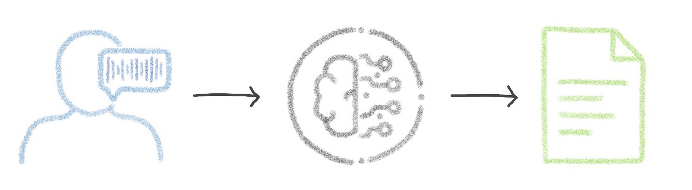
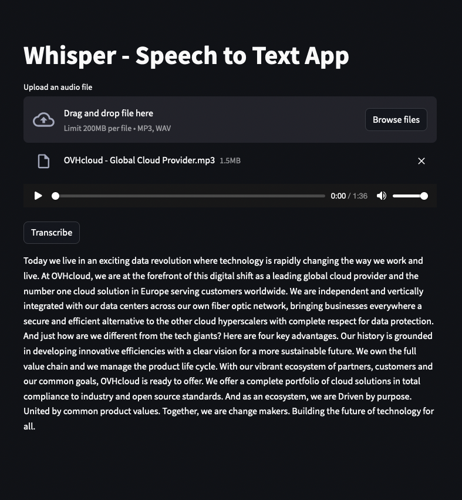

> [!primary]
>
> AI Deploy is covered by **[OVHcloud Public Cloud Special Conditions](https://storage.gra.cloud.ovh.net/v1/AUTH_325716a587c64897acbef9a4a4726e38/contracts/d2a208c-Conditions_particulieres_OVH_Stack-WE-9.0.pdf)**.
>

## Introduction

[OpenAI's Whisper](https://openai.com/research/whisper) large-v3 is the latest iteration of the open-source Whisper Automatic Speech Recognition (ASR) model. 

Released on November 6, 2023, Whisper large-v3 has gained recognition in various benchmarks as the top-performing automatic speech recognition (ASR) model. This is why it represents the state of the art in the ASR field. More generally, Whisper has become a powerful tool for transcribing speech in approximately 100 languages, including non-english speech transcription and translation into English.

{.thumbnail}

## Objective

In this tutorial, we will guide you through the process of deploying the Whisper large-v3 model in a simple application on AI Deploy for production use. 

Unlike a locally hosted application, using AI Deploy offers extremely fast inference since it is deployed on powerful resources (GPUs), and other features like sharing capabilities. You will also learn how to build and use a custom Docker image as part of the deployment process.

## Requirements

To build and deploy your Whisper app, you need:

- Access to the [OVHcloud Control Panel](/links/manager)
- An AI Deploy Project created inside a [Public Cloud project](https://www.ovhcloud.com/es-es/public-cloud/) in your OVHcloud account
- A [user for AI Deploy & Object Storage](/pages/public_cloud/ai_machine_learning/gi_01_manage_users)
- [The OVHcloud AI CLI](/pages/public_cloud/ai_machine_learning/cli_10_howto_install_cli) installed on your local computer
- [Docker](https://www.docker.com/get-started) installed on your local computer, **or** access to a Debian Docker Instance, which is available on the [Public Cloud](https://www.ovh.com/manager/public-cloud/)

## Instructions

You are going to follow different steps to deploy your Whisper application:

- [Whisper Model Sslection](#step-1-whisper-model-selection)
- [Download Whisper Model in the Object Storage](#step-2-download-whisper-model-in-the-object-storage)
- [Whisper app development](#step-3-whisper-app-development)
- [Whisper app deployment](#step-4-whisper-app-deployment)

### Step 1: Whisper Model selection

While there are various implementations of the Whisper model (Distil-Whisper, WhisperX, faster-whisper, Whisper JAX, ...), we will use the [original Whisper implementation](https://github.com/openai/whisper) for this tutorial. Feel free to explore other implementations based on your needs (memory constraints and desired inference speed (live transcription or post-transcription)).

Original Whisper implementation comes in five distinct model sizes (`tiny`, `base`, `small`, `medium`, and `large`), each designed with specific use cases in mind. Each size has an English-only counterpart (`tiny.en` for `tiny` size for example), which demonstrates optimized performance for English applications, outperforming the multilingual variant.

Memory requirements and relative inference speeds are key considerations when selecting your Whisper model. The tiny and base models, requiring approximately 1 GB of VRAM, offer speeds up to 32x and 16x, respectively, compared to the large model. As the models increase in size, the required VRAM and relative speed change accordingly.

In this tutorial, we will deploy the latest version of the `large` Whisper model in order to obtain the best possible transcription quality, whatever the language spoken. However, you can easily change to another model.

### Step 2: Download Whisper Model in the Object Storage

Once you have selected your model, it is time to download it for use in inference. 

This can be done within the deployed application, by installing the `open-whisper` library and executing the following python code that downloads the Whisper model:

```bash
pip install -U openai-whisper
```

```python
import whisper
model_path = "whisper_model"
model_id = 'large-v3'

# Download model 
model = whisper.load_model(model_id, download_root=model_path)
```

As AI Deploy is based on Docker images, it is advisable to avoid directly downloading the model within the Python code and the Docker image for better manageability and flexibility. Moreover, you should not store the Whisper model directly in the Docker image because it will significantly increase the size of the Docker image.

To do things more efficiently, it is better to save the model in a remote storage, like the [OVHcloud Object Storage](https://www.ovhcloud.com/es-es/public-cloud/object-storage/). This storage will be linked to the AI Deploy app, which will allow the use of the Whisper model within the app. This way, you can easily access the model and make updates without messing with the Docker container itself. 

#### Create an Object Storage bucket for you Whisper model

You can create your Object Storage bucket using either the UI (OVHcloud Control Panel) or the `ovhai` CLI, which can be downloaded [here](/pages/public_cloud/ai_machine_learning/cli_10_howto_install_cli).

> [!tabs]
> **Using the Control Panel (UI)**
>>
>> If you do not feel comfortable with commands, this method may be more intuitive.
>> 
>> First, go to the `Public Cloud`{.action} section of the [OVHcloud Control Panel](/links/manager).
>>
>> Then, select the `Object Storage`{.action} section (in the Storage category) and create a new object container by clicking `Storage`{.action} > `Object Storage`{.action} > `Create an object container`{.action}.
>>
>> {.thumbnail}
>>
>> You can create the bucket that will store your Whisper model. Select the container *type* and the *datastore_alias* that match your needs, and name it as you wish. *`GRA` alias and `whisper-model` name will be used in this tutorial.*
>>
> **Using ovhai CLI**
>>
>> To follow this part, make sure you have installed the [ovhai CLI](https://cli.bhs.ai.cloud.ovh.net/) on your computer or on an instance.
>>
>> As in the Control Panel, you will have to specify the `datastore_alias` and the `name` of your bucket. Create your Object Storage bucket as follows:
>>
>> ```bash
>> ovhai bucket create <datastore_alias> <bucket_name>
>> ```
>>
>> You can access the full alias list by running:
>>
>> ```bash
>> ovhai datastore list
>> ```
>>
>> To avoid encountering latencies, a good practice is to use the same alias as the one on which you are going to deploy your AI Solutions.
>> 
>> *`GRA` alias and `whisper-model` will be used in this tutorial.*
>>
>> For your information, the previous command is applicable to both Swift and S3 buckets. However, it's important to note that for S3 usage, a proper configuration is necessary. If S3 is not configured yet and you wish to use it, please read the [S3 compliance guide](/pages/public_cloud/ai_machine_learning/gi_08_s3_compliance).

#### Download whisper in the created bucket

To download the model, we will use AI Training. The created job will be based on an official OVHcloud Docker image `ovhcom/ai-training-pytorch` which is compliant with the product.

Using 5 CPUs will be enough to download the model, ensuring sufficient memory resources are available.

Two volumes will be associated with this job:

- The first volume will contain the `ai-training-examples` [GitHub repository](https://github.com/ovh/ai-training-examples/), containing the Python script used to download the Whisper model. For security, this volume is configured with Read-Only (RO) permission, as we just need access to the Python script, located at `ai-training-examples/apps/streamlit/whisper/download_model.py`.
- The second volume corresponds to the created bucket, where we will store the Whisper model once downloaded. Therefore, this bucket needs to be with Read-Write (RW) permission, since we will write in it. Make sure to name it correctly, and specify the alias you used during bucket creation.

To launch this job, we will use a `pip install` command, to install the necessary libraries (from the `ai-training-examples/apps/streamlit/whisper/requirements.txt` file) and, subsequently, we will execute the python script for Whisper download.

These steps can be summed up in the following command, which contains all the points mentioned above:

```bash
ovhai job run ovhcom/ai-training-pytorch \
    --cpu 5 \
    --volume https://github.com/ovh/ai-training-examples.git:/workspace/github_repo:RO \
    --volume whisper-model@GRA/:/workspace/whisper-model:RW \
    -- bash -c 'pip install -r /workspace/github_repo/apps/streamlit/whisper/requirements.txt && python /workspace/github_repo/apps/streamlit/whisper/download_model.py large-v3 /workspace/whisper-model'
```

> [!warning]
> **Warning**
> In the last line of the command above, you can see that the `download_model.py` file takes two arguments.
>
> The first one indicates which model you want to download (here `large-v3`). You can change it to one of the followings: `tiny.en`, `tiny`, `base.en`, `base`, `small.en`, `small`, `medium.en`, `medium`, `large-v1`, `large-v2`, `large-v3`, `large`.
>
> The second one indicates where the model will be saved. **It must be the same place** as where you mounted the first volume. This will allow the model to be backed up in the bucket, and not in the job's ephemeral storage. Here, we use the `/workspace/whisper-model` path.
>
> Moreover, you may have to **change the bucket name and datastore_alias** of the last `--volume` parameter, based on the name you gave to it and the alias where you created it.

The job will then be launched. It will take a few minutes for the two volumes to be added to the job, the environment to be installed and the Whisper model to be downloaded and synchronized with your bucket (`FINALZING` status).

If you have configured your volumes correctly with the right permissions, and given the right paths to the python script, then you should see your Whisper model in your bucket. This can be checked on the Control Panel, or with the CLI with the following command that will list all the objects of your bucket:

```bash
`ovhai bucket object list <bucket_name>@<datastore_alias>`
```

*Following the example given in this tutorial, we will use:

```bash
`ovhai bucket object list whisper-model@GRA`
```

> [!primary]
> **Why is nothing returned when I run the command?**
>
> If nothing is returned when you list your bucket objects, do not hesitate to check your job logs by running `ovhai job logs <job_id>` to see if the model has been downloaded well.
>
> If an exception occured during the model download, it is probably because you do not have enough memory in your AI Training job. To be sure, check the URL monitoring to see if the total memory has been reached.
> 
> If the model has been successfully downloaded, but you don't see anything when you list your bucket objects, it may be because the model's output path differs from your attached bucket path. They need to match for the model to be saved in the correct location. Otherwise, the model might not have been saved in the right place.

### Step 3: Whisper app development

Now that the Whisper model is in a bucket, you can easily attach it to an AI Deploy app, using the same method as you just did with AI Training. 

But in order to interact with the model, we are going to build a very simple application, using [Streamlit](https://streamlit.io/), which will allow a user to upload an audio file and then transcribe it.

#### Building a Docker image

As for AI Training, you will need to use a Docker image when using AI Deploy. However you can't use the `ovhcom/ai-training-pytorch` Docker image this time. Indeed, using the Whisper model requires some system packages to be installed, such as `ffmpeg`, which is not the case in the previous image. This is why you need to build a new Docker image, dedicated to your AI project.

To do this, you will need [Docker](https://www.docker.com/get-started), either installed directly on your computer, or using a Debian Docker Instance, available on the [Public Cloud](https://www.ovh.com/manager/public-cloud/).

The Dockerfile to use is already provided. Clone the [ai-training-examples GitHub repository](https://github.com/ovh/ai-training-examples/):

```console
git clone https://github.com/ovh/ai-training-examples.git
```

Then run `cd ai-training-examples/apps/streamlit/whisper/` to move to the Whisper app folder. If you run `ls` to list the existing files, you should see several ones, including the following:

- `app.py`: The python code of the Whisper application.
- `requirements.txt`: Contains the libraries needed by the Whisper application (streamlit, openai-whisper, ...).
- `Dockerfile`: Contains all the commands you could call on the command line to run your application (installing `requirements.txt`, running the python script, ...).

Then, launch the following command to build your application image. The created image will be named `whisper_app`. You can change it if you wish, but make sure you keep the same identifier throughout the next commands.

```console
docker build . -t whisper_app:latest
```

> [!primary]
> **Command explanation**
>
> - The dot `.` argument indicates that our build context (place of the **Dockerfile** and other needed files) is the current directory.
>
> - The `-t` argument allows us to choose the identifier to give to our image. Usually image identifiers are composed of a **name** and a **version tag** `<name>:<version>`. For this example we choose **whisper_app:latest**.

During the build process, Docker reads the instructions from the Dockerfile and executes them step by step. For your information, here are the steps of this Dockerfile:

```dockerfile
# 🐳 Base image (official small Python image)
FROM python:3.10-slim

# Install missing system packages (ffmpeg is needed for Whisper and is not installed in the small Python image)
RUN apt-get update && \
    apt-get install -y ffmpeg libsndfile1-dev

# 👱 Set the working directory inside the container
WORKDIR /workspace

# 🐍 Copy all folder files (requirements.txt, python code, ...) into the /workspace folder
ADD . /workspace

# 📚 Install the Python dependencies
RUN pip install -r requirements.txt

# 🔑 Give correct access rights to the OVHcloud user
RUN chown -R 42420:42420 /workspace
ENV HOME=/workspace

# 🌐 Set default values for 'model_id' & 'model_path' variables. Will be changeable using --env parameter when launching AI Deploy app
ENV MODEL_ID="large-v3"
ENV MODEL_PATH="/workspace/whisper-model"

# 🚀 Define the command to run the Streamlit application when the container is launched
CMD [ "streamlit" , "run" , "/workspace/app.py", "--server.address=0.0.0.0", "$MODEL_ID", "$MODEL_PATH"]
```

#### Push the image into a registry

Once your image is built, you will need to tag it and push it to a registry. Several registries can be used ([OVHcloud Managed Private Registry](https://www.ovhcloud.com/es-es/public-cloud/managed-private-registry/), [Docker Hub](https://hub.docker.com/), [GitHub packages](https://github.com/features/packages), ...). In this tutorial, we will use the **OVHcloud shared registry**.

> [!warning]
> **Warning**
> The shared registry should only be used for testing purposes. Please consider creating and attaching your own registry. More information about this can be found [here](/pages/public_cloud/ai_machine_learning/gi_07_manage_registry). The images pushed to this registry are for AI Tools workloads only, and will not be accessible for external uses.

You can find the address of your shared registry by launching this command:

```console
ovhai registry list
```

Log in on your shared registry with your usual AI Platform user credentials:

```console
docker login -u <user> -p <password> <shared-registry-address>
```

Tag the compiled image and push it into your shared registry:

```console
docker tag whisper_app:latest <shared-registry-address>/whisper_app:latest
docker push <shared-registry-address>/whisper_app:latest
```

### Step 4: Whisper app deployment

Once your image has been pushed, it can be used to deploy new AI solutions. 

Run the following command to deploy your Whisper speech-to-text application by running your customised Docker image:

```console
ovhai app run <shared-registry-address>/whisper_app:latest \
      --name whisper_app \
      --gpu 1 \
      --default-http-port 8501 \
      --volume whisper-model@GRA/:/workspace/whisper-model:RO \
      --env MODEL_ID="large-v3" \
      --env MODEL_PATH="/workspace/whisper-model"
```

> [!primary]
> **Parameters explanation**
> 
> - `<shared-registry-address>/whisper_app:latest` is the image on which the app is based.
>
> - `--name whisper_app` is an optional argument that allows you to give your app a custom name, making it easier to manage all your apps.
> 
> - `--default-http-port 8501` indicates that the port to reach on the app URL is `8501` (Default Streamlit port).
>
> - `--gpu 1` indicates that we request 1 GPU for that app.
>
> - `--volume` allows you to specify what volume you want to add to your app. As mentioned, we add the **Whisper** bucket we created, in `RO` mode. This means that we will only be able to read the data from these volumes and not modify them. This will enable the model to be used. As before, make sure to use the same bucket name and alias as when you created the bucket.
>
> `--env` parameter allows to set environment variables within the Docker container, that will be accessed in the Python scripts. Two values are specified `MODEL_ID` & `MODEL_PATH`. This will allow the code to load the model from the right place, depending on the one you have chosen (`MODEL_ID`=`"large-v3"`), and the path where you have mounted your Whisper model volume (`MODEL_PATH`=`"/workspace/whisper-model"`).
>
> - Consider adding the `--unsecure-http` attribute if you want your application to be reachable without any authentication.

Once your application is in `RUNNING` status, you can transcribe audio files using the powerful Whisper model!

{.thumbnail}

## Go further

This tutorial has walked you through deploying the openAI Whisper model implementation for speech-to-text transcription in a Streamlit app. 

To continue your project, you can add many more features, such as the specification of the spoken language, or options for translating the transcript and many more!

You could also combine your transcripts with an LLM. Learn how to [Deploy LLaMA 2 on AI Deploy](/pages/public_cloud/ai_machine_learning/deploy_tuto_15_streamlit_chatbot_llama_v2).

If you need training or technical assistance to implement our solutions, contact your sales representative or click on [this link](https://www.ovhcloud.com/es-es/professional-services/) to get a quote and ask our Professional Services experts for a custom analysis of your project.

## Feedback

Please send us your questions, feedback and suggestions to improve the service:

- On the OVHcloud [Discord server](https://discord.com/invite/vXVurFfwe9)
