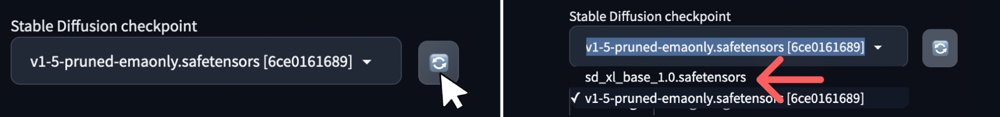

> [!primary]
>
> AI Deploy is covered by **[OVHcloud Public Cloud Special Conditions](https://storage.gra.cloud.ovh.net/v1/AUTH_325716a587c64897acbef9a4a4726e38/contracts/d2a208c-Conditions_particulieres_OVH_Stack-WE-9.0.pdf)**.
>

## Introduction

[Stable Diffusion](https://stability.ai/stable-diffusion) is a deep learning model released in 2022. It is primarily used to generate detailed images and videos conditioned on text descriptions, though it can also be applied to other tasks such as inpainting, outpainting, and generating image-to-image translations guided by a text prompt. What makes it stand out is that it is **open-source**, making it more accessible than its predecessors.

[Stable Diffusion WebUI](https://github.com/AUTOMATIC1111/stable-diffusion-webui), also known as *AUTOMATIC1111* (its creator), is the **default Web User Interface (WebUI)** for many advanced users of Stable Diffusion. This interface lets you choose your Stable Diffusion models (checkpoints), extensions and generation parameters.

{.thumbnail}

## Objective

In this tutorial, we will guide you through the process of deploying the [AUTOMATIC1111 Stable Diffusion WebUI](https://github.com/AUTOMATIC1111/stable-diffusion-webui) on AI Deploy. We will also show you how to add new model checkpoints to your application.

Unlike a locally hosted application, using AI Deploy offers extremely fast inference since it is deployed on powerful resources (GPUs). So you can generate the content you want in as little time as possible.

## Requirements

To build and deploy your Stable Diffusion app, you need:

- Access to the [OVHcloud Control Panel](/links/manager)
- An AI Deploy Project created inside a [Public Cloud project](https://www.ovhcloud.com/fr-ca/public-cloud/) in your OVHcloud account
- A [user for AI Deploy & Object Storage](/pages/public_cloud/ai_machine_learning/gi_01_manage_users)
- [The OVHcloud AI CLI](/pages/public_cloud/ai_machine_learning/cli_10_howto_install_cli) installed on your local computer
- [Docker](https://www.docker.com/get-started) installed on your local computer, **or** access to a Debian Docker Instance, which is available on the [Public Cloud](https://www.ovh.com/manager/public-cloud/)

## Instructions

You are going to follow different steps to deploy your Stable Diffusion application:

- [Step 1: Set up the environment](#step-1-set-up-the-environment)
- [Step 2: Stable Diffusion app deployment](#step-2-stable-diffusion-app-deployment)
- [Step 3: Add Stable Diffusion checkpoints](#step-3-add-stable-diffusion-checkpoints)

### Step 1: Set up the environment

In this section, we will guide you through the process of using a Docker image that will serve as the foundation for deploying the Stable Diffusion model on AI Deploy.

To do this, you will need [Docker](https://www.docker.com/get-started), either installed directly on your computer, or using a Debian Docker Instance, available on the [Public Cloud](https://www.ovh.com/manager/public-cloud/).

#### Build a Docker image

The Dockerfile that builds the image to use is already provided. Clone the [ai-training-examples GitHub repository](https://github.com/ovh/ai-training-examples/):

```console
git clone https://github.com/ovh/ai-training-examples.git
```

Then run `cd ai-training-examples/apps/gradio/stable-diffusion/` to move to the Stable Diffusion Web UI folder. If you run `ls` to list the existing files, you should see the `Dockerfile`, which contains all the commands you can call on the command line to run your application (like installing system packages for example). Here is the `Dockerfile`:

```dockerfile
# 🐳 Base image
FROM pytorch/pytorch:2.1.0-cuda12.1-cudnn8-runtime

# 🚫 Remove interactivity since using the base image will ask for a timezone - This allows to not provide it
ENV DEBIAN_FRONTEND=noninteractive

# 📚 Install missing system packages (git, libgl1, ..., are needed for Stable Diffusion and are not installed in the base image)
RUN apt-get update && \
    apt-get install -y wget git python3 python3-venv libgl1 libglib2.0-0

# 👱 Set the working directory inside the container
WORKDIR /workspace

# 📥 Download the webui.sh script from the specified URL
RUN wget -q https://raw.githubusercontent.com/AUTOMATIC1111/stable-diffusion-webui/master/webui.sh

# 👮‍♀️ Make the webui.sh script executable
RUN chmod +x webui.sh

# ⌛️ Install the webui.sh file (--exit parameter allows to only install it without without running it)
RUN ./webui.sh -f --exit

# 🔑 Give correct access rights to the OVHcloud user
RUN chown -R 42420:42420 /workspace
ENV HOME=/workspace
```

As you can see from the comments, this `Dockerfile` installs several packages, downloads the interface installation script and then runs it. These instructions will be executed step by step during the build process.

To launch this process, make sure you are in the `Dockerfile` folder (`ai-training-examples/apps/gradio/stable-diffusion/`). Once you are in it, launch the following command to build your application image.

```console
docker build . -t sd_webui:latest
```

> [!primary]
> **Command explanation**
>
> - The dot `.` argument indicates that our build context (place of the **Dockerfile** and other needed files) is the current directory.
>
> - The `-t` argument allows us to choose the identifier to give to our image. Usually image identifiers are composed of a **name** and a **version tag** `<name>:<version>`. For this example we choose **sd_webui:latest**. You can change the image name if you wish, but make sure you keep the same identifier throughout the next commands.

#### Push the image into a registry

Once your image is built, you will need to tag it and push it to a registry. When working with OVHcloud AI Solutions, several registries can be used ([OVHcloud Managed Private Registry](https://www.ovhcloud.com/en/public-cloud/managed-private-registry/), [Docker Hub](https://hub.docker.com/), GitHub packages, ...). In this tutorial, we will use the **OVHcloud shared registry**, a solution dedicated to AI Solutions.

> [!warning]
> **Warning**
> The shared registry should only be used for testing purposes. Please consider creating and attaching your own registry. More information about this can be found [here](/pages/public_cloud/ai_machine_learning/gi_07_manage_registry). The images pushed to this registry are for AI Tools workloads only, and will not be accessible for external uses.

You can find the address of your shared registry by launching this command:

```console
ovhai registry list
```

You should see a registry with the `SHARED` kind. Then, log in on your shared registry with your usual AI Platform user credentials:

```console
docker login -u <user> -p <password> <shared-registry-address>
```

Tag the compiled image and push it into your shared registry:

```console
docker tag sd_webui:latest <shared-registry-address>/sd_webui:latest
docker push <shared-registry-address>/sd_webui:latest
```

### Step 2: Stable Diffusion app deployment

Once your image has been pushed, it can be used to deploy new AI Solutions. 

Run the following command to deploy your Stable Diffusion application by running your customised Docker image:

```console
ovhai app run <shared-registry-address>/sd_webui:latest \
    --name stable-diffusion-webui \
    --gpu 1 \
    --default-http-port 7860 \
    --volume stable_diff_checkpoints@GRA:/workspace/stable-diffusion-webui/models/:rw \
    -- bash -c './webui.sh --xformers --enable-insecure-extension-access --listen --api'
```

> [!primary]
> **Parameters explanations**
> 
> - `<shared-registry-address>/sd_webui:latest` is the image on which the app is based. Replace the registry address with yours. Also, make sure to use the right image name.
>
> - `--name stable_diffusion_webui` is an optional argument that allows you to give your app a custom name, making it easier to manage all your apps.
> 
> - `--default-http-port 7860` indicates that the port to reach on the app URL is `7860` (Default [Gradio](https://www.gradio.app/) port).
>
> - `--gpu 1` indicates that we request 1 GPU for that app.
>
> - `--volume` allows to specify what bucket you want to add to your app. The Stable Diffusion Web UI retrieves model checkpoints from the `stable-diffusion-webui/models/` directory. That is why we mount a volume on this directory. This will allow to interact with it, by adding new model checkpoints, and then use them within the Web UI. This volume is mounted with the RW permission (Read-Write), as this allows models to be added and accessed. However, checkpoints cannot be added directly to the volume. They will have to be added in sub-directories, corresponding to their nature (Stable Diffusion / Variational Autoencoders (VAEs)). The use and addition of new checkpoints will be detailed in [Step 3](#step-3-add-stable-diffusion-checkpoints).
>
> - `-- bash -c` allows you to launch the Web UI by running the `webui.sh` script with command line arguments. Customise the arguments to suit your needs. The list of available options is available on the [AUTOMATIC1111's Stable Diffusion Web UI GitHub repository](https://github.com/AUTOMATIC1111/stable-diffusion-webui/wiki/Command-Line-Arguments-and-Settings).
>
> - Consider adding the `--unsecure-http` attribute if you want your application to be reachable without any authentication.

After executing the command, the volume will be created if it doesn't exist, and the Docker image will be pulled. Subsequently, the Web UI will download a default Stable Diffusion checkpoint, making it ready for use. 

You can follow the progress of your app's deployment and these steps using the "Info Url" link, or via your app's logs using (`--follow` parameter allows to stream the logs):

```console
ovhai app logs <app_id> --follow
```

When your app is ready for use, you will be able to generate your first images using the default checkpoint.

For your information, the `--volume` parameter allows to use both Swift and S3 buckets. However, it's important to note that for S3 usage, a proper configuration is necessary. If S3 is not configured yet and you wish to use it, please read the [S3 compliance guide](/pages/public_cloud/ai_machine_learning/gi_08_s3_compliance).

### Step 3: Add Stable Diffusion checkpoints

It is likely that you will be interested in adding new checkpoints to generate images in a specific style, of better quality than those provided by the default checkpoint.

As explained before in the `--volume` parameter, model files are saved in the `stable-diffusion-webui/models/` directory. This directory contains several sub-directories. For example, Stable diffusion checkpoints are stored in the `stable-diffusion-webui/models/Stable-diffusion` directory, while Variational Autoencoder (VAE) ones are saved in `stable-diffusion-webui/models/VAE`.

To add a new Stable Diffusion checkpoint, you need to download it and add it to the corresponding folder (`stable-diffusion-webui/models/Stable-diffusion`).

For example, if you want to add and use the XL version of Stable Diffusion, you will have to:

- Look for the model checkpoint. Many are available on the [Stability AI Hugging Face page](https://huggingface.co/stabilityai). 
- Download the model checkpoint. This can be done manually or via the command line, running:

```bash
curl -L -O https://huggingface.co/stabilityai/stable-diffusion-xl-base-1.0/resolve/main/sd_xl_base_1.0.safetensors
```

- Add the checkpoint to the bucket you have mounted on your app. Here is the default command to do that:

```bash
ovhai bucket object upload <bucket_name>@<datastore_alias> object1 --add-prefix /model_subdirectory/
```

Following the example given in this tutorial (bucket named `stable_diff_checkpoints` and created on `GRA`), we will use:

```bash
ovhai bucket object upload stable_diff_checkpoints@GRA sd_xl_base_1.0.safetensors --add-prefix /Stable-diffusion/
```

> [!primary]
> **Do not forget to use a prefix**
>
> As explained above, it is very important to place the checkpoint in the subfolder (`stable-diffusion-webui/models/Stable-diffusion`), and not in the main `models` folder, otherwise the checkpoint will be unusable. 
>
> This can be done using the `--add-prefix /Stable-diffusion/` parameter, which will place the `sd_xl_base_1.0.safetensors` checkpoint into the `stable-diffusion-webui/models/Stable-diffusion/` directory.
>
> **Can I not specify a prefix?**
> 
> If you only intend to add Stable Diffusion checkpoints, you could also mount your volume (when deploying the app) directly on `@GRA:/workspace/stable-diffusion-webui/models/Stable-diffusion/` rather than `@GRA:/workspace/stable-diffusion-webui/models/`. This will spare you from having to specify a prefix when uploading a checkpoint, as the volume will be mounted directly in the right place.


Once the checkpoint has been uploaded, you should see it when you list the objects in your volume:

```console
`ovhai bucket object list <bucket_name>@<datastore_alias>`
```

Following the example given in this tutorial, we will use:

```console
`ovhai bucket object list stable_diff_checkpoints@GRA`
```

Adding an object to a bucket will not make it immediately available in the app. You will need to manually **trigger a data synchronization**. 

To do this, you will need the `UUID` of your app. It has been given to you when you deployed it. If you've lost it, you can find it again in the OVHcloud Control Panel, or via the CLI by listing all your apps, using `ovhai app list`. You will have to find the `UUID` of the app named `stable-diffusion-webui`.

You can then start a datasync to synchronize your app with your bucket, which contains your new model checkpoint, by running:

```console
ovhai app pull-data <app_id>
```

Depending on the size and number of checkpoints added, this will take more or less time. The progress of the data sync can be tracked via the app's information:

```console
ovhai app get <app_id>
```

In the information displayed, there will be a `Data Sync:` field containing all the data syncs performed on your app. In your case, you are interested in the most recent one (displayed furthest down). If it's in `RUNNING` state, it means that it has not finished. You can also see the progress of uploaded data. It will be ready when it reaches `DONE` status.

{.thumbnail}

Then, on the Web UI, reload the list of usable Stable Diffusion checkpoints at the top left, by clicking on the 🔄 icon. You should see your new model checkpoint in it and ready for use!

## Go further

This tutorial has walked you through deploying a Stable Diffusion Web UI for image generation. 

If you are interested in using an API, you can use the `--api` parameter and refer to the [AUTOMATIC1111 documentation](https://github.com/AUTOMATIC1111/stable-diffusion-webui/wiki/API). 

Note that other projects exist as APIs, such as [One Diffusion](https://github.com/bentoml/OneDiffusion), from *BentoML*, which is very easy to implement. Here is the One Diffusion command to deploy Stable Diffusion XL:

```console
ovhai app run pytorch/pytorch:2.1.0-cuda12.1-cudnn8-runtime \
    --name sdxl \
    --default-http-port 3000 \
    --volume standalone:/workspace:rw \
    --probe-path /healthz \
    -- bash -c 'pip install onediffusion && /workspace/.local/bin/onediffusion start stable-diffusion-xl'
```

If you are interested in image generation concepts, you can learn how image generation networks work and train your own Generative Adversarial Network. Check out this AI Notebooks guide: [Create and train an image generation model](/pages/public_cloud/ai_machine_learning/notebook_tuto_14_image-generation-dcgan).

If you need training or technical assistance to implement our solutions, contact your sales representative or click on [this link](https://www.ovhcloud.com/fr-ca/professional-services/) to get a quote and ask our Professional Services experts for a custom analysis of your project.

## Feedback

Please send us your questions, feedback and suggestions to improve the service:

- On the OVHcloud [Discord server](https://discord.com/invite/vXVurFfwe9)
