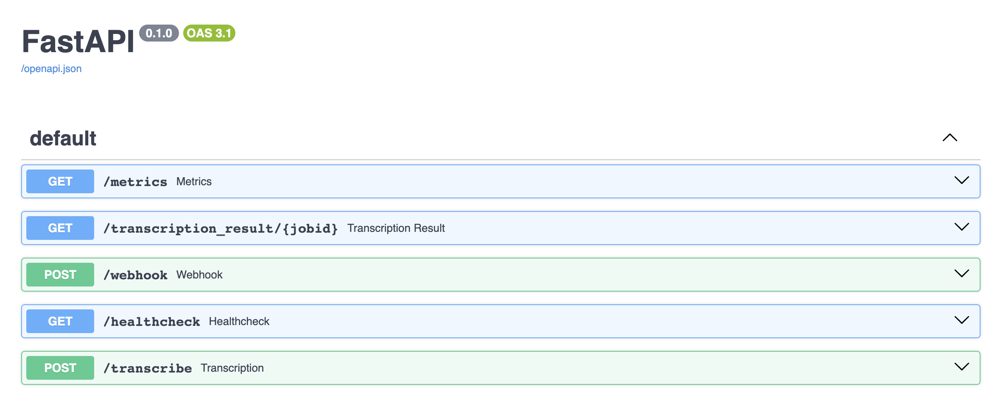

## Objective

OVHcloud offers different Artificial Intelligence services through its AI Partners Ecosystem. You will benefit from a catalogue of **ready-to-use applications** provided by our partners which you will be able to easily deploy according to your needs through **AI Deploy**.

**Voxist is an OVHcloud partner that offers AI services dedicated to Speech to Text (ASR). This guide will introduce Voxist solution features, as well as covering how it works and associated billing.**

## Introduction

**Voxist** is a start-up specialized in **Speech Recognition**. The platform enables all organizations, from start-ups to large corporations, to perform automatic speech recognition (`ASR`).

Speech recognition is supported through two APIs:

- **REST API** for asynchronous speech recognition, with support for diarization
- **WebSocket API** for synchronous speech recognition, without support for diarization

## Voxist models features

The Voxist ASR solution, available at OVHcloud, provides several key features:

- **punctuation**
- **diarization**
- **real time transcription**

To take advantage of these different features, you have two types of APIs to choose from: `REST` and `WebSocket`.

### REST

Voxist gives you the possibility to transcribe audio into text. The principle is to send an audio file with your needed configuration. For example, the **Voxist REST API** will allow you to benefit from **diarization** and **punctuation** features.

- Input configuration:

```json
config='{"lang": "en", "sample_rate": 16000, "punctuation": true, "wait":true}'
```

- Output result:

```json
[
  {
    "Lexical":"Ai Deploy service makes easy the deployment of machine learning models and applications in production hosted on our infrastructures.",
    "Confidence":1,
    "Start_time":0.0,
    "Speaker":1,
    "Duration":7.62
  }
]
```

### WebSocket

Voxist gives you the possibility to have a real time transcription. Indeed, the **WebSocket API** allows you to benefit from a **streaming recognition**.

- Input configuration:

```json
{ "config" : { "sample_rate" : %d, "lang" : "en"} }
```

- Output result:

```json
{"Sentence_id": 0, "Text": "Ai Deploy service makes easy the deployment of machine learning models and applications in production hosted on our infrastructures.", "Confidence": 1, "Words": null}
```

> [!primary]
>
> To learn more about **Voxist ASR service**, please refer to this [documentation](https://www.voxist.com/voice-ai/documentation).
>

## Voxist quick start

To be able to query the Voxist Service, you must first deploy one of the Voxist images with AI Deploy.

In this example, we will use the **REST API** Docker image.

> [!primary]
>
> To know how to use the **WebSocket API**, please follow this [guide](/pages/public_cloud/ai_machine_learning/ecosystem_04_voxist_models).
>

### Launch a Voxist app

To launch an AI Deploy app, there are several possibilities. You can do it from the [OVHcloud Control Panel](/links/manager) or the CLI `ovhai`.

#### Launch an app from the OVHcloud Control Panel

To launch your Voxist app from the UI, you have to fill in some information:

- **Location**
- **Application to deploy** - *in this example, we choose the "asr-rest" image with gpu compliance*

{.thumbnail}

> [!warning]
>
> Please be careful with the required image resources.
>
> Voxist apps contain `gpu` in their tags, therefore choose one or more **GPUs** as resources.
>

- **Resources** - *we advise you to use at least 1 GPU*
- **Configure your app** - *add a label if you have chosen a restricted access*

> [!primary]
>
> To know how to launch an app from the [OVHcloud Control Panel](/links/manager), refer to this [guide](/pages/public_cloud/ai_machine_learning/deploy_guide_02_getting_started).
>

#### Launch an app with ovhai CLI

You can also start this app with the `ovhai` [CLI](/pages/public_cloud/ai_machine_learning/cli_10_howto_install_cli) by running the following command:

```console
ovhai app run \
    --gpu 1 \
    --label <name=value> \
    --partner voxist \
    asr-rest:v1.0.9-gpu
```

> [!primary]
>
> Replace `<label=name>` by the variables corresponding to your **token**. To know more about the management of the token, refer to this [documentation](/pages/public_cloud/ai_machine_learning/deploy_guide_03_tokens).
>

#### Access to your Voxist app

Once the app is launched and in `RUNNING` status, you can copy the URL and access your app. To be able to access the API documentation, add the `/docs` endpoint at the end of the app URL.

{.thumbnail}

### Get transcription from Voxist Speech Recognition

You can now use the **Voxist Service** to transcribe audio files.

> [!primary]
>
> For more detailed information on Voxist models, please refer to this [documentation](/pages/public_cloud/ai_machine_learning/ecosystem_04_voxist_models).
>

#### Generate a cURL query

Now that your Voxist app is running with AI Deploy, you are ready for questioning the AI models.

You can use the following example and parameters:

- url of the app - *replace `<app_url>` with yours*
- access token (since we are on restricted access) - *replace `<your_token_bearer>` with yours*
- data format
- audio to process - *replace `<path_wav_file>` by the local path to your audio file named `tts_definition.wav`*
- transcription configuration - *set up your required configuration, for more information about the features, follow this [documentation](/pages/public_cloud/ai_machine_learning/ecosystem_04_voxist_models)*

> [!warning]
>
> Please be careful with the format of your audio file. Only the **wav** format and **mono** channel are supported by Voxist models.
>

- Audio:

In the following cURL query, we will use the following audio file: [audio-sample-en.wav](https://github.com/ovh/ai-training-examples/blob/main/partners-ecosystem/voxist/audios/audio-sample-en.wav).

- cURL query:

```bash
curl --request POST \
     --url <app_url>/transcribe \
     -H "Authorization: Bearer <your_token_bearer>" \
     -H "Content-Type: multipart/form-data" \
     -F "file_channel1=@audio-sample-en.wav;type=audio/x-wav" \
     -F config='{"lang": "en", "sample_rate": 16000, "punctuation": true, "wait":true}'
```

- Result:

```json
[
  {
    "Lexical":"Notre rapporteur politique, Jack Fink, a organisé une discussion live sur l'Obamacare. Il a demandé au panel s'ils s'agissaient avec le président, qui dit de laisser l'obamacare imploser.",
    "Confidence":1,
    "Start_time":0.06,
    "Speaker":1,
    "Duration":9.719999999999999
  },
  {
    "Lexical":"Quand est-ce qu'on s'arrête d'être menacés par les compagnies d'insurance ? C'est la question. C'est la vraie question. Quand est-ce qu'on s'arrête d'être menacés par eux ? Quand nous nous réunissons d'un système pour-profit à un système non-for-profit dans notre livret de soins de santé. Être un vétéran, l'unique exemple de single-payer de l'Union-Est de l'Amérique est le hôpital VA ?",
    "Confidence":1,
    "Start_time":10.14,
    "Speaker":1,
    "Duration":20.13
  },
  {
    "Lexical":"Ce n'est pas une bonne réponse.",
    "Confidence":1,
    "Start_time":30.27,
    "Speaker":1,
    "Duration":1.8000000000000007
  },
  {
    "Lexical":"C'était une excellente discussion. Si vous l'avez oubliée, vous pouvez encore la regarder. C'est sur notre page Facebook de CBS DFW.",
    "Confidence":1,
    "Start_time":32.07,
    "Speaker":1,
    "Duration":6.18
  }
]
```

## Voxist billing concept

The pricing of Voxist differs slightly from the usual AI Deploy offer. In order for you to better understand your invoice, please find more details below about the [price calculation](https://www.ovhcloud.com/pt/public-cloud/prices/).

> [!primary]
>
> The total cost of your app will include the price of the resources you have selected as well as the partner's model license price.
>

*Please bear in mind Voxist models are billed on pay-per-use. We do not offer yet pay-per-call billing.*

### Estimate the cost of a Voxist app

**How to calculate the total cost of a Voxist app?**

The total price is composed of two different parts:

- `Resources price`
- `Voxist model licencing price`

#### Resources price

The first step consists in calculating the price of an AI Deploy app according to the chosen computing resources.

*Please keep in mind we bill per second although pricing is displayed per hour ex. VAT for a more user-friendly experience.*

> [!primary]
>
> To launch your app you have to choose `GPU` resources.
>

```console
Resources price = (nb app) x (nb gpu resources) x (nb replicas) x [ (unit price per hour ex. VAT) x (nb hours) ]
```

To learn more about the basic cost of an app launched with AI Deploy, please refer to this [documentation](/pages/public_cloud/ai_machine_learning/deploy_guide_06_billing_concept).

#### Voxist model licenses price

The second step consists in calculating the cost of one of the Voxist partners services according to the number of minutes.

Find the Voxist prices table below:

| Threshold                           | Price per hour of audio | API call count |
| ----------------------------------- | ----------------------- | -------------- |
| From 0 to 100 000 minutes           | 0,88€                   | Unlimited      |
| From 100 001 to 500 000 minutes     | 0,67€                   | Unlimited      |
| From 500 001 to 1 000 000 minutes   | 0,53€                   | Unlimited      |
| From 1 000 001 to 3 000 000 minutes | 0,39€                   | Unlimited      |
| From 3 000 001 to 6 000 000 minutes | 0,35€                   | Unlimited      |

#### Total price

To obtain the total cost of a Voxist app started with AI Deploy, add the two amounts from the previous calculations:

```console
Total price = Resources price + Voxist model licencing price
```

> [!primary]
>
> To learn more about the basic cost (resource price) of an app launched with AI Deploy, please refer to this [documentation](/pages/public_cloud/ai_machine_learning/deploy_guide_06_billing_concept).
>
> Please refer to the [OVHcloud Public Cloud website](https://www.ovhcloud.com/pt/public-cloud/prices/) for all information about resources and partners models prices.
>

### Examples

#### Example 1: 1 GPU app for 5 hours

We deploy one Voxist app with AI Deploy, with 1 GPU and we keep it running for 5 hours then we **delete it**.

*You receive thousands of calls: it's included (no pay per call provided, you pay running compute).*

- compute resources per replica: 1 x GPU NVIDIA V100s (1,93€ /hour /gpu)
- scaling: fixed
- replicas: 1
- amount of calls: unlimited
- duration: 5 hours then deleted
- voxist service: 1 x Voxist service for 5 hours (5 hour x 60 minutes = 300 minutes) => (0,88€ /hour /gpu)

Price calculation for **compute**: 1,93€ (price /hour /gpu) x 1 (gpu) x 1 (replica) x 5 (hours) = `9,65€`
Price calculation for **Voxist service**: 0,88€ (price /hour /gpu) x 5 (hours) = `4,40€`

**Total price calculation: `9,65€` + `4,40€` = `14,05€`**

#### Example 2: 2 GPUs for 250 000 minutes

We deploy one Voxist app with 2 CPUs, and we keep it running for 250 000 minutes.

*You receive thousands of calls: it's included (no pay per call provided, you pay running compute).*

- compute resources per replica: 2 x GPUs NVIDIA V100s (1,93€ /hour /gpu)
- scaling : fixed
- amount of calls : unlimited
- duration: 250 000 minutes then stopped and deleted
- voxist service: 2 x Voxist services for 250 000 minutes (250 000 minutes) => (0,67€ /hour /gpu)

Price calculation for **compute**: 1,93€ (price /hour /gpu) x 2 (gpu) x 1 (replica) x (250 000 minutes /60) (hours) = `16 083,33€`
Price calculation for **Voxist service**: 0,88€ (price /hour /gpu) x (100 000 minutes /60) (hours) + 0,67€ (price /hour /gpu) x (150 000 minutes /60) (hours) = `3 141,66€`

**Total price calculation: `16 083,33€` + `3 141,66€` = `19 224,99€`**

## Feedback

Please send us your questions, feedback and suggestions to improve the service:

- On the OVHcloud [Discord server](https://discord.gg/ovhcloud)
