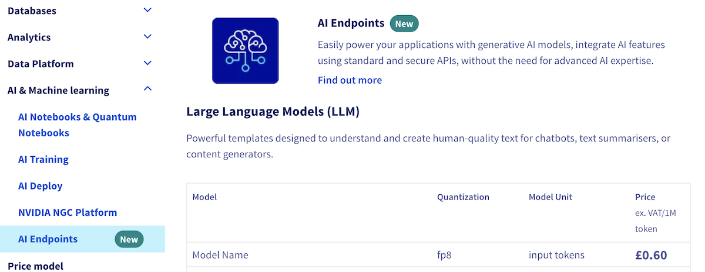

> [!primary]
>
> AI Endpoints is covered by the **[OVHcloud AI Endpoints Conditions](https://storage.gra.cloud.ovh.net/v1/AUTH_325716a587c64897acbef9a4a4726e38/contracts/48743bf-AI_Endpoints-ALL-1.1.pdf)** and the **[OVHcloud Public Cloud Special Conditions](https://storage.gra.cloud.ovh.net/v1/AUTH_325716a587c64897acbef9a4a4726e38/contracts/d2a208c-Conditions_particulieres_OVH_Stack-WE-9.0.pdf)**.
>

## Introduction

[AI Endpoints](/links/public-cloud/ai-endpoints) is a serverless platform provided by OVHcloud that offers easy access to a selection of world-renowned, pre-trained AI models. The platform is designed to be simple, secure, and intuitive, making it an ideal solution for developers who want to enhance their applications with AI capabilities without extensive AI expertise or concerns about data privacy.

## Objective

This documentation provides an overview of the billing and lifecycle management of various AI model categories offered on [AI Endpoints](/links/public-cloud/ai-endpoints). We will cover the cost structure for Large Language Models (LLM), Audio models, Image models, Embedding models, and more. Additionally, we will explain the lifecycle of our models, including model decommissioning and redirecting, ensuring that you have all the necessary information to effectively manage your AI Endpoints.

## AI Endpoints model lifecycle

OVHcloud AI Endpoints follows a model lifecycle process to ensure a seamless experience for our customers. This process includes the following steps:

- **Track model usage metrics**: We continuously monitor the usage of each model on our platform to identify underutilized or obsolete models that may no longer serve the needs of our customers.
- **Decommissioning decision**: Once a model is identified as a candidate for decommissioning, we make a decision to retire the model. At this point, we communicate the decision to our customers via email and the [#ai-news channel](https://discord.com/channels/850031577277792286/1045441414521180281) of the OVHcloud [Discord server](https://discord.gg/ovhcloud). The email is only sent to customers who have been **using the model in the last 3 months** and informs them that the model **will be removed in 3 months** to ensure a smooth transition.
- **Grace period**: After the decommissioning decision is made, a grace period of 3 months is provided for the model we communicated about. This period allows customers to transition to an alternative model, which is provided in our communications. During this time, the model remains accessible via the API but is hidden from our website catalog.
- **Removal from active deployment**: Once the grace period ends, the model is completely removed from our APIs and returns a 404 error for any new requests.

By following this model lifecycle process, OVHcloud ensures that customers are well informed and prepared for any changes, while also maintaining a lean and up to date selection of AI models.

> [!warning]
>
> Our email communications are sent to the billing contact related to your OVHcloud account. If your team is using a different OVHcloud account than the billing one, they might not receive our communications. To ensure every collaborator receives these notifications, follow the steps from [this guide](/pages/account_and_service_management/account_information/manage-messages):
>
> - Log in to the [OVHcloud Control Panel](/links/manager) using your billing OVHcloud account, click on your name in the top right corner, then click on `My messages`{.action}. Add the emails of persons who should receive these communications (or a global mailing list). This allows adding them as contact points. This will send them an email and they will need to click a link in that email to accept your mailing invitation.
>
> - Once the email addresses are added, go to the `Delivery settings`{.action} tab and configure a new rule (category: `Product` and priority: `Medium`). You can add a new condition to your delivery rule for each colleague that should receive the notification, following the same process.

## Billing principles

For detailed information on models, quantization, pricing units, and prices, please visit the `AI Endpoints`{.action} section of the `AI and Machine Learning` drop-down menu, on the [OVHcloud website](/links/public-cloud/prices-ai):

{.thumbnail}

## Feedback

Please send us your questions, feedback and suggestions to improve the service:

- On the OVHcloud [Discord server](https://discord.gg/ovhcloud)

If you need training or technical assistance to implement our solutions, contact your sales representative or click on [this link](/links/professional-services) to get a quote and ask our Professional Services experts for a custom analysis of your project.
