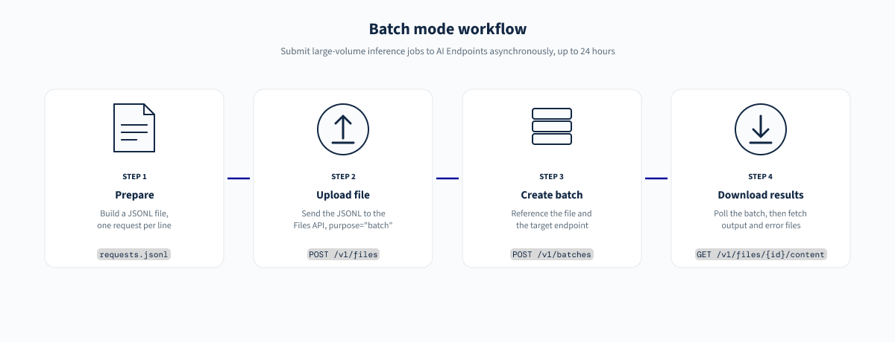
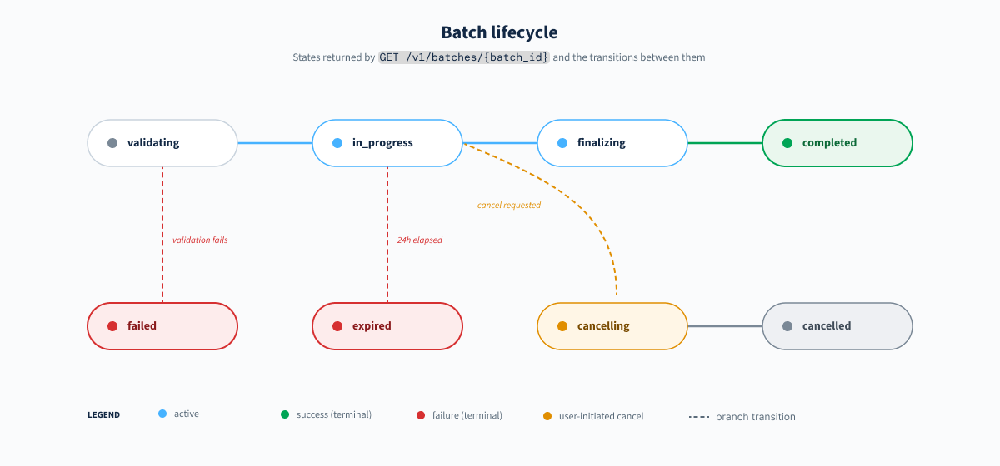

> [!primary]
>
> AI Endpoints is covered by the **[OVHcloud AI Endpoints Conditions](https://storage.gra.cloud.ovh.net/v1/AUTH_325716a587c64897acbef9a4a4726e38/contracts/48743bf-AI_Endpoints-ALL-1.1.pdf)** and the **[OVHcloud Public Cloud Special Conditions](https://storage.gra.cloud.ovh.net/v1/AUTH_325716a587c64897acbef9a4a4726e38/contracts/d2a208c-Conditions_particulieres_OVH_Stack-WE-9.0.pdf)**.
>

## Introduction

[AI Endpoints](/links/public-cloud/ai-endpoints) is a serverless platform provided by OVHcloud that offers easy access to a selection of world-renowned, pre-trained AI models.

The **Batch API** (`/v1/batches`) is an **OpenAI-compatible** route that lets you submit a large number of inference requests in a single asynchronous job, instead of sending them one by one through synchronous endpoints such as `v1/chat/completions` or `v1/responses`.

Batch mode is ideal when you do not need an immediate answer, but rather want to process a high volume of prompts (evaluations, offline labelling, content generation at scale, dataset preparation, etc.) in a **cost-efficient** and **throughput-oriented** way. Batch jobs have a completion window of up to **24 hours**. Any job not completed within this period will expire.

{.thumbnail}

## Objective

This documentation provides an overview of the `v1/batches` route on [AI Endpoints](/links/public-cloud/ai-endpoints), including:

- The typical end-to-end batch workflow
- Preparing an input JSONL file
- Usage examples in **Python**, **JavaScript**, and **cURL**
- Retrieving and parsing batch results
- Known limitations on the platform

## Requirements

- Access to the [OVHcloud Control Panel](/links/manager)
- A [Public Cloud project](/links/public-cloud/public-cloud) in your OVHcloud account
- An AI Endpoints API key (see [AI Endpoints - Getting started](/pages/public_cloud/ai_machine_learning/endpoints_guide_01_getting_started))

The examples provided during this guide can be used with one of the following environments:

> [!tabs]
> **Python**
>> 
>> A [Python](https://www.python.org/) environment with the [openai client](https://pypi.org/project/openai/).
>>
>> ```sh
>> pip install openai
>> ```
>>
> **JavaScript**
>> 
>> A [Node.js](https://nodejs.org/en) environment with the official [openai](https://www.npmjs.com/package/openai) SDK.
>>
>> ```sh
>> npm install openai
>> ```
>>
> **cURL**
>> 
>> A standard terminal with cURL installed on your system.
>>

## Authentication

Examples provided in this guide are using the authenticated mode and expect the `AI_ENDPOINT_API_KEY` environment variable to be set. The anonymous mode is not available with the batch and files endpoints.

To specify your own API key, set in the environment (`export AI_ENDPOINT_API_KEY='your_api_key'`).

Follow the instructions in the [AI Endpoints - Getting Started](/pages/public_cloud/ai_machine_learning/endpoints_guide_01_getting_started) guide for more information on authentication.

## How batch mode works

A batch job is processed in **four stages**:

1. **Prepare** a JSONL file where each line describes a single request (model, endpoint, body).
2. **Upload** this file to AI Endpoints through the Files API (`/v1/files`) with `purpose="batch"`.
3. **Create** a batch (`/v1/batches`) referencing the uploaded file and the target endpoint.
4. **Poll** the batch status until it is `completed`, then **download** the output file (and the error file, if any).

{.thumbnail}

Each line of the input file is processed independently. Successful responses are written to the **output file**, failed ones to the **error file**. Both files are retrieved through the Files API.

## Preparing the input file (JSONL)

The input file must be in [JSON Lines](https://jsonlines.org/) format (`.jsonl`): one JSON object per line, with no trailing comma and no wrapping array.

> [!warning]
>
> Your file must not exceed a size of 200 MB or contain more than 50,000 entries.
>

Each line represents **one independent request** and must contain the following fields:

| Field       | Description                                                                                               |
|-------------|-----------------------------------------------------------------------------------------------------------|
| `custom_id` | A unique string you choose. It is echoed back in the output so you can correlate each result to its input. |
| `method`    | HTTP method of the targeted endpoint, typically `POST`.                                                    |
| `url`       | The relative path of the inference endpoint to call, for example `/v1/chat/completions`.                   |
| `body`      | The JSON body that would normally be sent to the synchronous endpoint (same schema as `v1/chat/completions`). |

Example `requests.jsonl` with two requests:

```json
{"custom_id": "request-1", "method": "POST", "url": "/v1/chat/completions", "body": {"model": "gpt-oss-20b", "messages": [{"role": "user", "content": "Summarise the plot of Hamlet in two sentences."}]}}
{"custom_id": "request-2", "method": "POST", "url": "/v1/chat/completions", "body": {"model": "gpt-oss-20b", "messages": [{"role": "user", "content": "Translate 'Good morning' into French, Spanish and German."}]}}
```

> [!primary]
>
> `custom_id` values must be **unique within a batch**. They are the only reliable way to map outputs back to your original inputs, since the order of the output file is not guaranteed.
>

## Quickstart

The following examples walk through the full lifecycle of a batch: uploading the input file, creating the batch, checking its status, and downloading the results.

### 1. Upload the input file

Upload the `.jsonl` file to the Files API with `purpose="batch"`. The response contains a file identifier (e.g. `file-abc123`) that you will reference when creating the batch.

> [!tabs]
> **Python**
>>
>> ```python
>> import os
>> from openai import OpenAI
>>
>> api_key = os.environ["AI_ENDPOINT_API_KEY"]  # export AI_ENDPOINT_API_KEY='your_api_key'
>>
>> client = OpenAI(
>>     base_url="https://oai.endpoints.kepler.ai.cloud.ovh.net/v1",
>>     api_key=api_key,
>> )
>>
>> batch_input_file = client.files.create(
>>     file=open("requests.jsonl", "rb"),
>>     purpose="batch",
>> )
>>
>> print(batch_input_file.id)
>> ```
>>
> **JavaScript**
>>
>> ```javascript
>> import fs from "node:fs";
>> import OpenAI from "openai";
>>
>> const client = new OpenAI({
>>   baseURL: "https://oai.endpoints.kepler.ai.cloud.ovh.net/v1",
>>   apiKey: process.env.AI_ENDPOINT_API_KEY || "", // Read from environment variable
>> });
>>
>> const batchInputFile = await client.files.create({
>>   file: fs.createReadStream("requests.jsonl"),
>>   purpose: "batch",
>> });
>>
>> console.log(batchInputFile.id);
>> ```
>>
> **cURL**
>>
>> ```sh
>> curl https://oai.endpoints.kepler.ai.cloud.ovh.net/v1/files \
>>   -H "Authorization: Bearer $AI_ENDPOINT_API_KEY" \
>>   -F purpose="batch" \
>>   -F file="@requests.jsonl"
>> ```

### 2. Create the batch

Create a batch by referencing the uploaded file identifier, the target endpoint and the completion window.

> [!tabs]
> **Python**
>>
>> ```python
>> batch = client.batches.create(
>>     input_file_id=batch_input_file.id,
>>     endpoint="/v1/chat/completions",
>>     completion_window="24h",
>>     metadata={"description": "Evaluation run - April 2026"},
>> )
>>
>> print(batch.id, batch.status)
>> ```
>>
> **JavaScript**
>>
>> ```javascript
>> const batch = await client.batches.create({
>>   input_file_id: batchInputFile.id,
>>   endpoint: "/v1/chat/completions",
>>   completion_window: "24h",
>>   metadata: { description: "Evaluation run - April 2026" },
>> });
>>
>> console.log(batch.id, batch.status);
>> ```
>>
> **cURL**
>>
>> ```sh
>> curl https://oai.endpoints.kepler.ai.cloud.ovh.net/v1/batches \
>>   -H "Authorization: Bearer $AI_ENDPOINT_API_KEY" \
>>   -H "Content-Type: application/json" \
>>   -d '{
>>     "input_file_id": "file-abc123",
>>     "endpoint": "/v1/chat/completions",
>>     "completion_window": "24h",
>>     "metadata": {"description": "Evaluation run - April 2026"}
>>   }'
>> ```

The response contains the batch object with its identifier and an initial status (typically `validating`).

### 3. Check the batch status

Batches are asynchronous. Poll the batch object until it reaches a terminal state (`completed`, `failed`, `expired` or `cancelled`).

> [!tabs]
> **Python**
>>
>> ```python
>> import time
>>
>> while True:
>>     current = client.batches.retrieve(batch.id)
>>     print(current.status, current.request_counts)
>>     if current.status in ("completed", "failed", "expired", "cancelled"):
>>         break
>>     time.sleep(30)
>> ```
>>
> **JavaScript**
>>
>> ```javascript
>> while (true) {
>>   const current = await client.batches.retrieve(batch.id);
>>   console.log(current.status, current.request_counts);
>>   if (["completed", "failed", "expired", "cancelled"].includes(current.status)) break;
>>   await new Promise((r) => setTimeout(r, 30_000));
>> }
>> ```
>>
> **cURL**
>>
>> ```sh
>> curl https://oai.endpoints.kepler.ai.cloud.ovh.net/v1/batches/batch_abc123 \
>>   -H "Authorization: Bearer $AI_ENDPOINT_API_KEY"
>> ```

A batch object progresses through the following states:

| Status        | Meaning                                                                               |
|---------------|---------------------------------------------------------------------------------------|
| `validating`  | The input file is being validated before processing starts.                           |
| `failed`      | The input file did not pass validation.                                               |
| `in_progress` | The batch is currently being processed.                                               |
| `finalizing`  | Processing is done. The results are being compiled into the output file.              |
| `completed`   | The batch finished successfully. Output file (and error file if any) are ready.       |
| `expired`     | The batch could not be completed within the requested completion window.              |
| `cancelling`  | A cancellation has been requested and is being applied.                               |
| `cancelled`   | The batch has been cancelled by the user.                                             |

The `request_counts` field reports how many individual requests were `total`, `completed`, and `failed`. It is the easiest way to monitor progress.

### 4. Download the results

Once the batch reaches the `completed` state, the batch object exposes two file identifiers:

- `output_file_id`: JSONL file containing the successful responses.
- `error_file_id`: JSONL file containing the failed requests (present only when at least one request failed).

Retrieve their content through the Files API:

> [!tabs]
> **Python**
>>
>> ```python
>> final = client.batches.retrieve(batch.id)
>>
>> if final.output_file_id:
>>     output = client.files.content(final.output_file_id)
>>     with open("results.jsonl", "wb") as f:
>>         f.write(output.read())
>>
>> if final.error_file_id:
>>     errors = client.files.content(final.error_file_id)
>>     with open("errors.jsonl", "wb") as f:
>>         f.write(errors.read())
>> ```
>>
> **JavaScript**
>>
>> ```javascript
>> import fs from "node:fs";
>>
>> const finalBatch = await client.batches.retrieve(batch.id);
>>
>> if (finalBatch.output_file_id) {
>>   const output = await client.files.content(finalBatch.output_file_id);
>>   fs.writeFileSync("results.jsonl", Buffer.from(await output.arrayBuffer()));
>> }
>>
>> if (finalBatch.error_file_id) {
>>   const errors = await client.files.content(finalBatch.error_file_id);
>>   fs.writeFileSync("errors.jsonl", Buffer.from(await errors.arrayBuffer()));
>> }
>> ```
>>
> **cURL**
>>
>> ```sh
>> curl https://oai.endpoints.kepler.ai.cloud.ovh.net/v1/files/file-xyz789/content \
>>   -H "Authorization: Bearer $AI_ENDPOINT_API_KEY" \
>>   -o results.jsonl
>> ```

## Output file format

Each line of the output file is a JSON object matching one input line, with the following shape:

```json
{
  "id": "batch_req_abc123",
  "custom_id": "request-1",
  "response": {
    "status_code": 200,
    "request_id": "req_...",
    "body": {
      "id": "chatcmpl-...",
      "object": "chat.completion",
      "model": "gpt-oss-20b",
      "choices": [
        {
          "index": 0,
          "message": {"role": "assistant", "content": "..."},
          "finish_reason": "stop"
        }
      ],
      "usage": {"prompt_tokens": 42, "completion_tokens": 128, "total_tokens": 170}
    }
  },
  "error": null
}
```

The `body` field mirrors exactly what the synchronous endpoint would have returned for the corresponding request, which means you can reuse the same parsing code you already use for `v1/chat/completions` or `v1/responses`.

Use the `custom_id` field to map each response back to your original input, as the order of the output file is not guaranteed.

Failed requests are written to the **error file** with a populated `error` object instead of `response.body`.

## Listing and cancelling batches

### List your batches

> [!tabs]
> **Python**
>>
>> ```python
>> for b in client.batches.list(limit=20):
>>     print(b.id, b.status, b.created_at)
>> ```
>>
> **JavaScript**
>>
>> ```javascript
>> const page = await client.batches.list({ limit: 20 });
>> for (const b of page.data) {
>>   console.log(b.id, b.status, b.created_at);
>> }
>> ```
>>
> **cURL**
>>
>> ```sh
>> curl "https://oai.endpoints.kepler.ai.cloud.ovh.net/v1/batches?limit=20" \
>>   -H "Authorization: Bearer $AI_ENDPOINT_API_KEY"
>> ```

### Cancel a batch

A batch can be cancelled while it is in the `validating` or `in_progress` state. Already-processed requests remain available in the output file.

> [!tabs]
> **Python**
>>
>> ```python
>> client.batches.cancel(batch.id)
>> ```
>>
> **JavaScript**
>>
>> ```javascript
>> await client.batches.cancel(batch.id);
>> ```
>>
> **cURL**
>>
>> ```sh
>> curl -X POST https://oai.endpoints.kepler.ai.cloud.ovh.net/v1/batches/batch_abc123/cancel \
>>   -H "Authorization: Bearer $AI_ENDPOINT_API_KEY"
>> ```

## When to use batch mode

Batch mode is a good fit when:

- You have a **large volume** of prompts to process (thousands to millions).
- You do **not** need a real-time answer: results within a few hours are acceptable.
- Your workload is **embarrassingly parallel**: each request is independent from the others.

Typical use cases include:

- **Dataset annotation and labelling** (classification, tagging, summarisation).
- **Offline evaluation** of a model or a prompt on a benchmark dataset.
- **Bulk content generation** (product descriptions, SEO content, translations).
- **Retrospective enrichment** of logs, tickets, or any historical corpus.

For interactive workloads (chat UIs, low-latency tools, real-time agents), prefer the synchronous [`v1/chat/completions`](/pages/public_cloud/ai_machine_learning/endpoints_guide_02_capabilities) or [`v1/responses`](/pages/public_cloud/ai_machine_learning/endpoints_guide_09_responses_api) routes.

## Endpoint limitations

The `v1/batches` endpoint is still undergoing development and all features may not be available.
If you are interested in specific features that you would like us to prioritise, don't hesitate to let us know on the OVHcloud [Discord server](https://discord.gg/ovhcloud).

- All requests inside a single batch must target the **same endpoint** (the one declared at batch creation time).
- A batch cannot reference models that are not available on the AI Endpoints [catalog](/links/public-cloud/ai-endpoints-catalog).
- We only accepts at the moment our **LLMs and embeddings** models.
- Input files must be valid JSONL with unique `custom_id` values; malformed lines cause the batch to move to the `failed` state during validation.
- The `completion_window` currently accepts the `24h` value. Batches that cannot be completed within this window transition to `expired`.
- Output and error files are subject to the **Files API** retention policy. Download them as soon as possible once the batch is `completed`.
- Model-specific limitations (context length, structured outputs, function calling, etc.) documented for the synchronous route also apply to the corresponding requests inside a batch.

## Conclusion

The **Batch API** provides a cost-efficient, asynchronous way to run large volumes of inference requests on OVHcloud **AI Endpoints**. By reusing the same request body as the synchronous endpoints, it fits naturally into existing integrations built on top of `v1/chat/completions` or `v1/responses`.

To maximise success rate, verify supported features for your chosen model in the [AI Endpoints catalog](/links/public-cloud/ai-endpoints-catalog), keep `custom_id` values unique, and always correlate results through `custom_id` rather than relying on file ordering.

## Go further

Browse the full [AI Endpoints documentation](/products/public-cloud-ai-and-machine-learning-ai-endpoints) to explore other guides and tutorials.

If you need training or technical assistance to implement our solutions, contact your sales representative or click on [this link](/links/professional-services) to get a quote and ask our Professional Services experts for a custom analysis of your project.

## Feedback

Please send us your questions, feedback, and suggestions to improve the service:

- On the OVHcloud [Discord server](https://discord.gg/ovhcloud).
