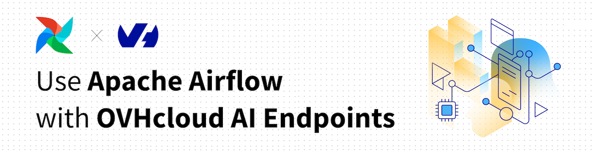
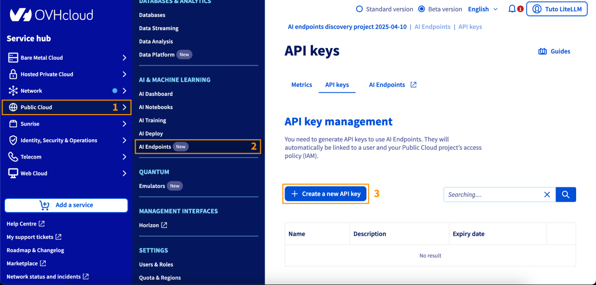

> [!primary]
>
> AI Endpoints is covered by the [OVHcloud AI Endpoints conditions](https://storage.gra.cloud.ovh.net/v1/AUTH_325716a587c64897acbef9a4a4726e38/contracts/48743bf-AI_Endpoints-ALL-1.1.pdf) and the [OVHcloud Public Cloud special conditions](https://storage.gra.cloud.ovh.net/v1/AUTH_325716a587c64897acbef9a4a4726e38/contracts/d2a208c-Conditions_particulieres_OVH_Stack-WE-9.0.pdf).
>

**New integration available:** We're excited to announce a new integration for [AI Endpoints](/links/public-cloud/ai-endpoints) with [Apache Airflow](https://airflow.apache.org/). This integration allows you to seamlessly orchestrate AI workloads on OVHcloud infrastructure directly from your Airflow DAGs, and continues our commitment to integrating AI Endpoints into as many open-source tools as possible to simplify its usage.

## Objective

OVHcloud [AI Endpoints](/links/public-cloud/ai-endpoints) allows developers to easily add AI features to their day-to-day developments.

In this guide, we will show how to use [Apache Airflow](https://airflow.apache.org/) to integrate OVHcloud [AI Endpoints](/links/public-cloud/ai-endpoints) into your workflow orchestration pipelines.

With Apache Airflow's powerful workflow management capabilities and OVHcloud's scalable AI infrastructure, you can programmatically author, schedule, and monitor AI-powered workflows with ease.

{.thumbnail}

## Definition

- [Apache Airflow](https://airflow.apache.org/): An open-source platform to programmatically author, schedule, and monitor workflows. Airflow allows you to define complex workflows as Directed Acyclic Graphs (DAGs) using Python, making it ideal for orchestrating data pipelines, AI workloads, and automated tasks.
- [AI Endpoints](/links/public-cloud/ai-endpoints): A serverless platform by OVHcloud providing easy access to a variety of world-renowned AI models including Mistral, LLaMA, and more. This platform is designed to be simple, secure, and intuitive with data privacy as a top priority.

### Why is this integration important?

This new integration offers you several advantages:

- **Workflow Orchestration**: Schedule and monitor AI tasks as part of your data pipelines.
- **Scalability**: Leverage Airflow's distributed architecture for parallel AI processing.
- **Reliability**: Built-in retry mechanisms and error handling for production workflows.
- **Flexibility**: Combine AI tasks with other data operations in unified workflows.
- **Observability**: Monitor AI task execution through Airflow's rich UI and logging.
- **Models**: All of our models are available through the Airflow provider.

## Requirements

Before getting started, make sure you have:

- An OVHcloud account with access to AI Endpoints.
- Python 3.8 or higher installed.
- Apache Airflow 2.3.0 or higher installed.
- An API key generated from the [OVHcloud Control Panel](/links/manager), in the `Public Cloud`{.action} section > `AI Endpoints` > `API keys`{.action}.

{.thumbnail}

## Instructions

### Installation

Install the OVHcloud AI Endpoints provider for Apache Airflow using pip:

```bash
pip install apache-airflow-provider-ovhcloud-ai
```

You are now ready to get started.

### Basic configuration

#### Setting up Airflow connection

The recommended method to configure your API key is using Airflow connections. You can create a connection through the Airflow UI or CLI.

**Using Airflow UI:**

1. Go to **Admin** > **Connections**.
2. Click the **+** button to add a new connection.
3. Fill in the details:

| Attribute       | Value                              |
|-----------------|------------------------------------|
| Connection Id   | `ovh_ai_endpoints_default`         |
| Connection Type | `generic`                          |
| Password        | Your OVHcloud AI Endpoints API key |

**Using Airflow CLI:**

```bash
airflow connections add ovh_ai_endpoints_default \
    --conn-type generic \
    --conn-password your-api-key-here
```

### Basic usage

Here's a simple usage example for generating text with Large Language Models:

```python
from airflow import DAG
from apache_airflow_provider_ovhcloud_ai.operators.ai_endpoints import (
    OVHCloudAIEndpointsChatCompletionsOperator
)
from datetime import datetime

with DAG(
    dag_id='llm_text_generation',
    start_date=datetime(2024, 1, 1),
    schedule=None,
    catchup=False,
) as dag:

    generate_text = OVHCloudAIEndpointsChatCompletionsOperator(
        task_id='generate_response',
        model='ovhcloud/gpt-oss-120b',
        messages=[
            {"role": "system", "content": "You are a helpful AI assistant."},
            {"role": "user", "content": "Explain machine learning in simple terms."}
        ],
        temperature=0.7,
        max_tokens=200,
    )
```

### Advanced features

#### Dynamic content with Jinja templating

Use Airflow's Jinja templating for dynamic content in your AI tasks:

```python
from airflow import DAG
from apache_airflow_provider_ovhcloud_ai.operators.ai_endpoints import (
    OVHCloudAIEndpointsChatCompletionsOperator
)
from datetime import datetime

with DAG(
    dag_id='dynamic_llm_generation',
    start_date=datetime(2024, 1, 1),
    schedule=None,
    catchup=False,
) as dag:

    analyze_sentiment = OVHCloudAIEndpointsChatCompletionsOperator(
        task_id='analyze_sentiment',
        model='ovhcloud/gpt-oss-120b',
        messages=[
            {
                "role": "system", 
                "content": "You are a sentiment analysis expert. Respond only with: positive, negative, or neutral."
            },
            {
                "role": "user", 
                "content": "Analyze the sentiment: {{ dag_run.conf['text'] }}"
            }
        ],
        temperature=0.3,
        max_tokens=10,
    )
```

Trigger this DAG with configuration:

```bash
airflow dags trigger dynamic_llm_generation \
    --conf '{"text": "I love this product! It works great!"}'
```

#### Embeddings

Create vector embeddings for semantic search and similarity matching:

```python
from airflow import DAG
from apache_airflow_provider_ovhcloud_ai.operators.ai_endpoints import (
    OVHCloudAIEndpointsEmbeddingOperator
)
from datetime import datetime

with DAG(
    dag_id='create_embeddings',
    start_date=datetime(2024, 1, 1),
    schedule=None,
    catchup=False,
) as dag:

    embed_text = OVHCloudAIEndpointsEmbeddingOperator(
        task_id='create_embedding',
        model='ovhcloud/BGE-M3',
        input="Apache Airflow is a platform to programmatically author, schedule and monitor workflows."
    )
```

#### Batch embeddings

Process multiple texts in a single operation:

```python
from airflow import DAG
from apache_airflow_provider_ovhcloud_ai.operators.ai_endpoints import (
    OVHCloudAIEndpointsEmbeddingOperator
)
from datetime import datetime

with DAG(
    dag_id='batch_embeddings',
    start_date=datetime(2024, 1, 1),
    schedule=None,
    catchup=False,
) as dag:

    embed_documents = OVHCloudAIEndpointsEmbeddingOperator(
        task_id='embed_documents',
        model='ovhcloud/BGE-M3',
        input=[
            "First document to embed",
            "Second document to embed",
            "Third document to embed"
        ]
    )
```

#### Task output and XCom

Access operator outputs in downstream tasks using Airflow's XCom feature:

```python
from airflow import DAG
from apache_airflow_provider_ovhcloud_ai.operators.ai_endpoints import (
    OVHCloudAIEndpointsChatCompletionsOperator
)
from airflow.operators.python import PythonOperator
from datetime import datetime

def process_llm_response(**context):
    # Pull the response from XCom
    ti = context['ti']
    llm_response = ti.xcom_pull(task_ids='generate_text')
    print(f"LLM said: {llm_response}")
    
    # Process the response
    return {"processed": True}

with DAG(
    dag_id='xcom_example',
    start_date=datetime(2024, 1, 1),
    schedule=None,
    catchup=False,
) as dag:

    generate = OVHCloudAIEndpointsChatCompletionsOperator(
        task_id='generate_text',
        model='ovhcloud/gpt-oss-120b',
        messages=[
            {"role": "user", "content": "Say hello!"}
        ],
    )

    process = PythonOperator(
        task_id='process_response',
        python_callable=process_llm_response,
    )

    generate >> process
```

#### Error handling and retries

Configure retries and error handling for production workflows:

```python
from airflow import DAG
from apache_airflow_provider_ovhcloud_ai.operators.ai_endpoints import (
    OVHCloudAIEndpointsChatCompletionsOperator
)
from datetime import datetime, timedelta

default_args = {
    'owner': 'data-team',
    'depends_on_past': False,
    'email_on_failure': True,
    'email_on_retry': False,
    'retries': 3,
    'retry_delay': timedelta(minutes=5),
}

with DAG(
    dag_id='production_llm_pipeline',
    default_args=default_args,
    start_date=datetime(2024, 1, 1),
    schedule='@hourly',
    catchup=False,
) as dag:

    generate_text = OVHCloudAIEndpointsChatCompletionsOperator(
        task_id='generate_text',
        model='ovhcloud/gpt-oss-120b',
        messages=[
            {"role": "user", "content": "Generate content"}
        ],
        execution_timeout=timedelta(minutes=10),
    )
```

#### Parallel processing

Run multiple AI tasks in parallel to maximize throughput:

```python
from airflow import DAG
from apache_airflow_provider_ovhcloud_ai.operators.ai_endpoints import (
    OVHCloudAIEndpointsChatCompletionsOperator,
    OVHCloudAIEndpointsEmbeddingOperator
)
from datetime import datetime

with DAG(
    dag_id='parallel_ai_tasks',
    start_date=datetime(2024, 1, 1),
    schedule=None,
    catchup=False,
) as dag:

    tasks = []
    
    # Generate multiple responses in parallel
    for i in range(5):
        task = OVHCloudAIEndpointsChatCompletionsOperator(
            task_id=f'generate_response_{i}',
            model='ovhcloud/gpt-oss-120b',
            messages=[
                {"role": "user", "content": f"Generate idea number {i}"}
            ],
        )
        tasks.append(task)
    
    # All tasks run in parallel (no dependencies)
```

## Go further

You can find more information about Apache Airflow on their [official documentation](https://airflow.apache.org/docs/). You can also browse the [AI Endpoints catalog](/links/public-cloud/ai-endpoints-catalog) to explore the models that are available through the Airflow provider.

For detailed information about the provider, including additional operators and advanced features, visit the [OVHcloud Apache Airflow Provider documentation](https://ovh.github.io/apache-airflow-provider-ovhcloud-ai/).

Browse the full [AI Endpoints documentation](/products/public-cloud-ai-and-machine-learning-ai-endpoints) to further understand the main concepts and get started.

If you need training or technical assistance to implement our solutions, contact your sales representative or click on [this link](/links/professional-services) to get a quote and ask our Professional Services experts for a custom analysis of your project.

## Feedback

Please feel free to send us your questions, feedback, and suggestions regarding AI Endpoints and its features:

- In the #ai-endpoints channel of the [OVHcloud Discord server](https://discord.gg/ovhcloud), where you can engage with the community and OVHcloud team members.
- On the [GitHub repository](https://github.com/ovh/apache-airflow-provider-ovhcloud-ai) for bug reports and contributions.