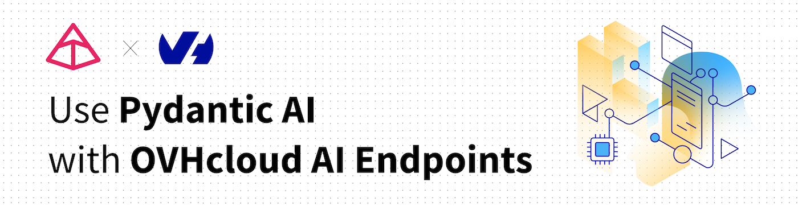

> [!primary]
>
> AI Endpoints is covered by the [OVHcloud AI Endpoints conditions](https://storage.gra.cloud.ovh.net/v1/AUTH_325716a587c64897acbef9a4a4726e38/contracts/48743bf-AI_Endpoints-ALL-1.1.pdf) and the [OVHcloud Public Cloud special conditions](https://storage.gra.cloud.ovh.net/v1/AUTH_325716a587c64897acbef9a4a4726e38/contracts/d2a208c-Conditions_particulieres_OVH_Stack-WE-9.0.pdf).
>

**New integration available:** We're excited to announce a new integration for [AI Endpoints](/links/public-cloud/ai-endpoints) with [Pydantic AI](https://ai.pydantic.dev/). This integration allows you to build production-grade applications with Generative AI using Pydantic's data validation and type safety, and continues our commitment to integrating AI Endpoints into as many open-source tools as possible to simplify its usage.

## Objective

OVHcloud [AI Endpoints](/links/public-cloud/ai-endpoints) allows developers to easily add AI features to their day-to-day developments.

In this guide, we will show how to use [Pydantic AI](https://ai.pydantic.dev/) to integrate OVHcloud [AI Endpoints](/links/public-cloud/ai-endpoints) into your Python applications for building type-safe, production-ready AI agents.

With Pydantic AI's agent framework and OVHcloud's scalable AI infrastructure, you can quickly build reliable applications that leverage Pydantic's validation capabilities to ensure structured and type-safe interactions with LLMs.

{.thumbnail}

## Definition

- [Pydantic AI](https://ai.pydantic.dev/): A Python agent framework designed to build production-grade applications with Generative AI. It leverages Pydantic for data validation and type safety, ensuring structured and reliable interactions with LLMs. Pydantic AI provides a simple yet powerful API for creating AI agents with built-in validation, error handling, and type checking.
- [AI Endpoints](/links/public-cloud/ai-endpoints): A serverless platform by OVHcloud providing easy access to a variety of world-renowned AI models including Mistral, LLaMA, and more. This platform is designed to be simple, secure, and intuitive with data privacy as a top priority.

### Why is this integration important?

This new integration offers you several advantages:

- **Type Safety**: Leverage Pydantic's validation to ensure structured, validated outputs from LLMs.
- **Production-Ready**: Built-in error handling, retry logic, and validation for reliable applications.
- **Simplicity**: Create AI agents in just a few lines of code.
- **Flexibility**: Use any OVHcloud AI model in your Pydantic AI applications.
- **Models**: All of our models are available through Pydantic AI.

## Requirements

Before getting started, make sure you have:

- An OVHcloud account with access to AI Endpoints.
- Python 3.8 or higher installed.
- An API key generated from the [OVHcloud Control Panel](/links/manager), in the `Public Cloud`{.action} section > `AI Endpoints` > `API keys`{.action}.

{.thumbnail}

## Instructions

### Installation

Install Pydantic AI via pip:

```bash
pip install pydantic-ai
```

Or using uv:

```bash
uv add pydantic-ai
```

You are now ready to get started.

### Basic configuration

#### Environment variables

The recommended method to configure your API key is using environment variables:

```bash
export OVHCLOUD_API_KEY="your-api-key"
```

Or use a `.env` file:

```bash
OVHCLOUD_API_KEY=your-api-key
```

### Basic usage

Here's a simple usage example - you're ready in less than 5 lines of code:

```python
from pydantic_ai import Agent

agent = Agent('ovhcloud:gpt-oss-120b')
result = agent.run_sync('What is the capital of France?')
print(result.output)
```

#### Using custom provider configuration

If you need to configure the provider explicitly, you can use the `OVHcloudProvider` class:

```python
from pydantic_ai import Agent
from pydantic_ai.models.openai import OpenAIChatModel
from pydantic_ai.providers.ovhcloud import OVHcloudProvider

model = OpenAIChatModel(
    'gpt-oss-120b',
    provider=OVHcloudProvider(api_key='your-api-key'),
)
agent = Agent(model)
result = agent.run_sync('What is the capital of France?')
print(result.output)
```

### Advanced features

#### Structured output with Pydantic models

Use Pydantic models to get validated, structured outputs:

```python
from pydantic import BaseModel
from pydantic_ai import Agent

class LocationInfo(BaseModel):
    city: str
    country: str
    population: int
    capital: bool

agent = Agent('ovhcloud:gpt-oss-120b', result_type=LocationInfo)

result = agent.run_sync(
    'Extract information about Paris: it is the capital of France with a population of about 2.1 million.'
)

print(result.data)
# LocationInfo(city='Paris', country='France', population=2100000, capital=True)
```

#### System prompts and context

Add system prompts and context to guide your agent:

```python
from pydantic_ai import Agent

agent = Agent(
    'ovhcloud:gpt-oss-120b',
    system_prompt='You are a helpful assistant specialized in geography.',
)

result = agent.run_sync(
    'What are the three largest cities in France?',
    message_history=[
        {'role': 'user', 'content': 'Tell me about France'},
        {'role': 'assistant', 'content': 'France is a country in Western Europe...'},
    ],
)

print(result.output)
```

#### Async operations

Use async/await for better performance in concurrent applications:

```python
import asyncio
from pydantic_ai import Agent

async def main():
    agent = Agent('ovhcloud:gpt-oss-120b')
    
    result = await agent.run('What is the capital of France?')
    print(result.output)
    
    # Run multiple queries concurrently
    results = await asyncio.gather(
        agent.run('What is the capital of France?'),
        agent.run('What is the capital of Germany?'),
        agent.run('What is the capital of Italy?'),
    )
    
    for result in results:
        print(result.output)

asyncio.run(main())
```

#### Function calling / tool use

Enable agents to call functions for extended capabilities:

```python
from pydantic import BaseModel
from pydantic_ai import Agent
from pydantic_ai.tools import tool

class WeatherRequest(BaseModel):
    location: str
    unit: str = "celsius"

@tool
def get_weather(request: WeatherRequest) -> str:
    """Get the current weather for a location."""
    # Simulated weather function
    if request.unit == "celsius":
        return f"The weather in {request.location} is sunny, 22°C"
    else:
        return f"The weather in {request.location} is sunny, 72°F"

agent = Agent(
    'ovhcloud:gpt-oss-120b',
    tools=[get_weather],
)

result = agent.run_sync('What is the weather like in Paris?')
print(result.output)
```

#### Streaming responses

Stream responses for real-time user experience:

```python
from pydantic_ai import Agent

agent = Agent('ovhcloud:gpt-oss-120b')

for event in agent.run_stream('Write a short story about a robot learning to cook.'):
    if event.event == 'result':
        print(event.data.output)
    elif event.event == 'stream_token':
        print(event.data, end='', flush=True)
```

#### Error handling and retries

Configure error handling and retry logic:

```python
from pydantic_ai import Agent
from pydantic_ai.exceptions import PydanticAIError

agent = Agent(
    'ovhcloud:gpt-oss-120b',
    retries=3,
    retry_delay=1.0,
)

try:
    result = agent.run_sync('What is the capital of France?')
    print(result.output)
except PydanticAIError as e:
    print(f"Error: {e}")
```

#### Custom model configuration

Configure model parameters for fine-tuned behavior:

```python
from pydantic_ai import Agent
from pydantic_ai.models.openai import OpenAIChatModel
from pydantic_ai.providers.ovhcloud import OVHcloudProvider

model = OpenAIChatModel(
    'gpt-oss-120b',
    provider=OVHcloudProvider(api_key='your-api-key'),
    temperature=0.7,
    max_tokens=500,
    top_p=0.9,
)

agent = Agent(model)

result = agent.run_sync('Generate three creative business ideas for sustainable fashion.')
print(result.output)
```

### Available models

OVHcloud AI Endpoints offers a wide range of models accessible via Pydantic AI. For the complete and up-to-date list, visit our [model catalog](/links/public-cloud/ai-endpoints-catalog).

## Go further

You can find more information about Pydantic AI on their [official documentation](https://ai.pydantic.dev/). You can also browse the [AI Endpoints catalog](/links/public-cloud/ai-endpoints-catalog) to explore the models that are available through Pydantic AI.

For detailed information about Pydantic AI features, including advanced agent patterns and best practices, visit the [Pydantic AI documentation](https://ai.pydantic.dev/).

Browse the full [AI Endpoints documentation](/products/public-cloud-ai-and-machine-learning-ai-endpoints) to further understand the main concepts and get started.

If you need training or technical assistance to implement our solutions, contact your sales representative or click on [this link](/links/professional-services) to get a quote and ask our Professional Services experts for a custom analysis of your project.

## Feedback

Please feel free to send us your questions, feedback, and suggestions regarding AI Endpoints and its features:

- In the #ai-endpoints channel of the OVHcloud [Discord server](https://discord.gg/ovhcloud), where you can engage with the community and OVHcloud team members.
- Join the [Pydantic community](https://logfire.pydantic.dev/docs/join-slack/) for questions about Pydantic AI.
