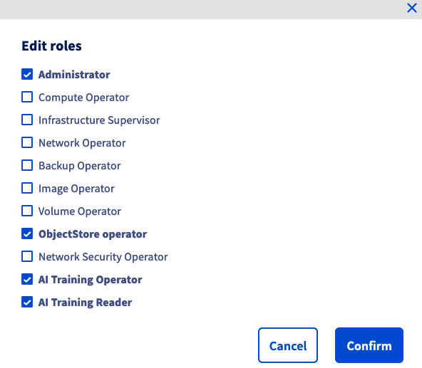
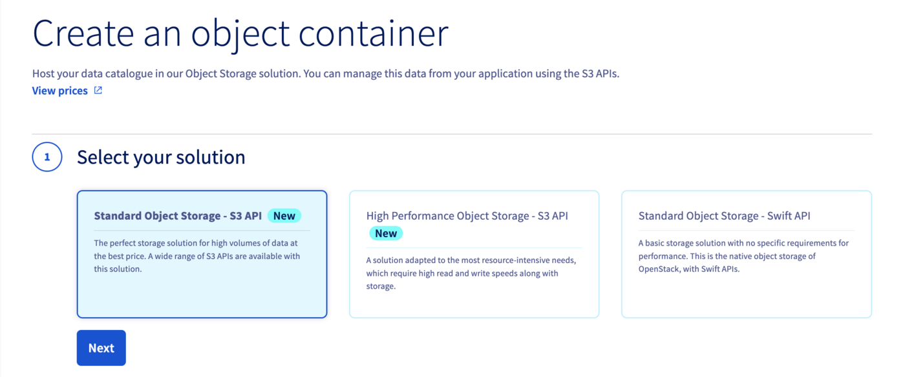
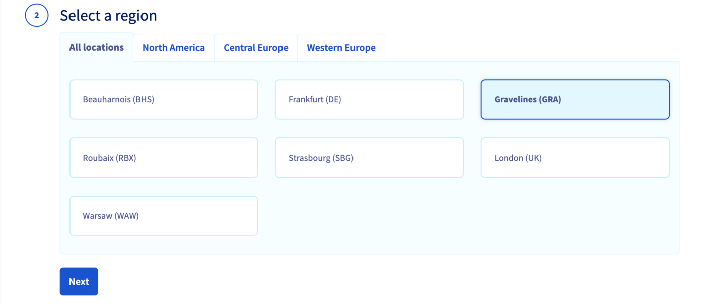
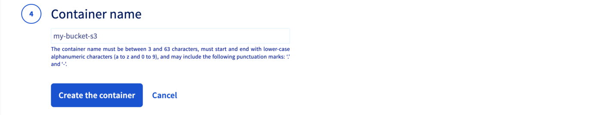
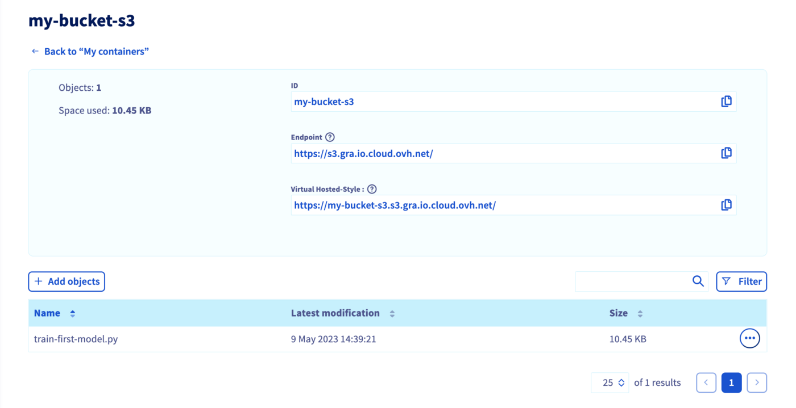

## Objective

This guide is intended to help you to use `S3 buckets` with **AI Tools** via the OVHcloud Control Panel and `ovhai` CLI. This will help you to manage your data when working with AI Notebooks, AI Training and AI Deploy.

## Requirements

- A **Public Cloud project**.
- Access to the [OVHcloud Control Panel](https://ca.ovh.com/auth/?action=gotomanager&from=https://www.ovh.com/world/&ovhSubsidiary=we).
- A working `ovhai` CLI. See our guide on [how to install ovhai CLI](/pages/public_cloud/ai_machine_learning/cli_10_howto_install_cli).

## Instructions

In the next steps, you will be able to **create a user to manage your S3 buckets**, **add a new datastore** dedicated to your buckets, then **create and increment a bucket**.

Then, you will be able to use this bucket with the different **OVHcloud AI Tools** through the `ovhai` CLI.

### Creating an S3 user

First of all, you must have an S3-user with the correct rights to manage S3 buckets. 

To do this, log in to the [OVHcloud Control Panel](https://ca.ovh.com/auth/?action=gotomanager&from=https://www.ovh.com/world/&ovhSubsidiary=we), go to the `Public Cloud`{.action} section and select the Public Cloud project concerned. Then click on `Object Storage`{.action} in the left-hand menu.

Here, you can create your S3 user by clicking on `Create User`{.action}. If you already have OpenStack users, you can use them to use S3 buckets, instead of creating a new one.

> [!warning]
>
> In both cases, make sure to save your S3 credentials: **S3 user name**, **S3 access key** and **S3 secret key**. You will use them later to create an S3 datastore.
>

For more information about S3 users creation, you can check this [Object Storage documentation](/pages/storage_and_backup/object_storage/s3_identity_and_access_management).

### Editing your S3 user roles

Once your S3 user has been created, you need to check that this user has the necessary rights to interact with your data and OVHcloud AI products.

In the OVHcloud Control Panel left-hand menu, click on `Users & Roles`{.action} in the `Project management`{.action} category.

Whether you have created a *new user* or use an *existing one*, check that this user has at least the following rights: `AI Training Operator` and `ObjectStore Operator`, as shown below:



For more information about editing user rights, you can check this [documentation](/pages/public_cloud/ai_machine_learning/gi_01_manage_users).

### Adding a new datastore

Now that you have a user for S3 buckets management, you have to add a dedicated datastore through `ovhai CLI`.

> [!warning]
>
> Please make sure you are connected to the `ovhai CLI` with the right user.
>

You can list the existing datastores with the following command:

```console
ovhai datastore list
```

You should obtain the following result:

```console
ALIAS STORE_TYPE OWNER    ENDPOINT
BHS   swift      ovhcloud ~
DE    swift      ovhcloud ~
GRA   swift      ovhcloud ~
SBG   swift      ovhcloud ~
SGP   swift      ovhcloud ~
UK    swift      ovhcloud ~
WAW   swift      ovhcloud ~
```

> [!primary]
>
> Here you can see that there are **no S3 stores** in the list. That's why you will create your own!
>

If you want to know more about adding **S3 datastores**, run the following command:

```console
ovhai datastore add s3 --help
```

You can see the different arguments to fill in your command line.

```console
Add an S3 data store

Usage: ovhai datastore add s3 [OPTIONS] <ALIAS> <ENDPOINT_URL> <REGION> <ACCESS_KEY> <SECRET_KEY>

Arguments:
  <ALIAS>         Alias for the data store
  <ENDPOINT_URL>  Data store connection URL
  <REGION>        Data store region
  <ACCESS_KEY>    Connection access key
  <SECRET_KEY>    Connection secret key

Options:
      --store-credentials-locally  Whether or not to store the data store credentials locally when creating or updating a data store
      --token <TOKEN>              Authentication using Token rather than OAuth
      --no-color                   Remove colors from output
  -h, --help                       Print help
```

> [!primary]
>
> In this guide, an **OVHcloud S3 datastore** will be used. You are free to use the S3 datastore of your choice.
>

Here is the basic command to create an OVHcloud S3 datastore:

```console
ovhai datastore add s3 <alias> https://s3.<region>.io.cloud.ovh.net/ <region> <my-access-key> <my-secret-key> --store-credentials-locally
```

In this example, the datastore created will be located in Gravelines (`GRA`) and its alias will be `S3GRA`.

```console
ovhai datastore add s3 S3GRA https://s3.gra.io.cloud.ovh.net/ gra <my-access-key> <my-secret-key> --store-credentials-locally
```

You can now check the datastore list:

```console
ovhai datastore list
```

You should see your S3 datastore in the list.

```console
ALIAS STORE_TYPE OWNER    ENDPOINT
BHS   swift      ovhcloud ~
DE    swift      ovhcloud ~
GRA   swift      ovhcloud ~
S3GRA s3         customer https://s3.gra.io.cloud.ovh.net/
SBG   swift      ovhcloud ~
SGP   swift      ovhcloud ~
UK    swift      ovhcloud ~
WAW   swift      ovhcloud ~
```

Now that you have a dedicated datastore, you can create some S3 buckets via the OVHcloud Control Panel or the `ovhai` CLI.

### Creating an S3 bucket

There are two methods to [create a new S3 bucket](/pages/storage_and_backup/object_storage/s3_create_bucket). The first one is to use the UI.

#### Using the Control Panel

To create an **Object Storage bucket**, first log in to your [OVHcloud Control Panel](https://ca.ovh.com/auth/?action=gotomanager&from=https://www.ovh.com/world/&ovhSubsidiary=we) and open your `Public Cloud`{.action} project. Click on `Object Storage`{.action} in the side bar and then on the `My containers`{.action} tab. Now, click the `Create an object container`{.action} button.

First, select the solution you need.

*In this tutorial, a `Standard Object Storage S3` will be created.*



Select a region (`GRA`):



You have to link your user to the bucket:


Finally, name your bucket. Keep in mind that its name must be between 3 and 63 characters, can consist only of lowercase letters, numbers, dots (.), and hyphens (-) and must start and end with lower-case alphanumeric characters (a to z and 0 to 9).



Once your bucket is created, you can add files (images, codes, templates,...).

*In this example, the python file `train-first-model.py` is added.*



> [!warning]
>
> Warning! You have to make sure that your user has the rights to **all the files** in your S3 bucket. Otherwise you may encounter permission issues. Indeed, even if your user has the rights to your bucket, it is important to indicate the files which the user can access. You can grant access to an object for your user by clicking on the `...`{.action} button, and then on `Add a user to my object`{.action}.
>

#### Using the `ovhai` CLI

You can also create an S3 bucket using the OVHcloud `ovhai` CLI.

To do this, connect to your CLI with your user credentials: 

```console
ovhai login
```

Then, run the following command:

*In this guide, the S3 bucket name will be `my-bucket-s3`.*

```console
ovhai bucket create S3GRA my-bucket-s3
```

> [!warning]
>
> The bucket name must be between 3 and 63 characters, can consist only of lowercase letters, numbers, dots (.), and hyphens (-) and must start and end with lower-case alphanumeric characters (a to z and 0 to 9). 
>

You can check that your S3 bucket has been created:

```console
ovhai bucket list S3GRA
```

You should see your bucket in the list.

```console
DATE                     NAME
2023-05-09T12:36:36.000Z my-bucket-s3
```

Now, you can upload all the objects you want:

*In this example, the python file `train-first-model.py` is added.*

```console
ovhai bucket object upload my-bucket-s3@S3GRA train-first-model.py
```

You are now able to list the content of your S3 bucket:

```console
ovhai bucket object list my-bucket-s3@S3-GRA
```

You should see your object (here the python file).

```console
DATE                     BYTES    NAME                 DESCRIPTION ETAG
2023-05-09T12:39:21.000Z 10.4 KiB train-first-model.py STANDARD    092da9edf113d84e65ba4866892cf249
```

### Using S3 buckets with AI Tools

Now that your **S3 bucket** has been created, you are free to use it with any OVHcloud AI tool.

> [!primary]
>
> Please note that for the moment this feature can be used through `ovhai` CLI and API only. It will soon be available from the OVHcloud Control Panel.
>
> *For more information about this, refer to our [Public Roadmap](https://github.com/ovh/public-cloud-roadmap/projects/4).*
>

You can now link your **S3 buckets** to AI notebooks, AI Training and AI Deploy.

If you want to use the `boto3` library to manage your bucket objects, here is a [notebook](https://github.com/ovh/ai-training-examples/blob/main/notebooks/getting-started/S3/use-s3-buckets-with-ai-tools.ipynb) that contains basic commands.

#### AI Notebooks

In the following command, replace the **editor** and **framework** by those of your choice:

*For more information about the notebooks commands, please check this [documentation](/pages/public_cloud/ai_machine_learning/cli_11_howto_run_notebook_cli).*

```console
ovhai notebook run <framework-id> <editor-id> \
      --volume my-bucket-s3@S3GRA/:/workspace/my-codes:rw
```

> [!primary]
>
> In this example the simplest command is used. To learn more about the capabilities, run the following command:
>
> `ovhai notebook run --help`
>

#### AI Training

In the following command, replace the **docker image** by yours:

*For more information about the jobs commands, please check this [documentation](/pages/public_cloud/ai_machine_learning/cli_12_howto_run_job_cli).*

```console
ovhai job run <docker-image> \
      --volume my-bucket-s3@S3GRA/:/workspace/my-codes:rw
```

> [!primary]
>
> In this example the simplest command is used. To learn more about the capabilities, run the following command:
>
> `ovhai job run --help`
>

#### AI Deploy

In the following command, replace the **docker image** by yours:

```console
ovhai app run <docker-image> \
      --volume my-bucket-s3@S3GRA/:/workspace/my-codes:rw
```

> [!primary]
>
> In this example the simplest command is used. To learn more about the capabilities, run the following command:
>
> `ovhai app run --help`
>

## Feedback

Please send us your questions, feedback and suggestions to improve the service:

- On the OVHcloud [Discord server](https://discord.com/invite/vXVurFfwe9)

If you need training or technical assistance to implement our solutions, contact your sales representative or click on [this link](https://www.ovhcloud.com/en/professional-services/) to get a quote and ask our Professional Services experts for a custom analysis of your project.
