## Objective

The OVHcloud AI Notebooks service provides you Jupyter or VSCode notebooks, linked to CPU or GPU resources, without the hassle of installing or operating them. This guide will cover the creation of a new notebook.

## Requirements

- A [Public Cloud project](https://www.ovhcloud.com/en-gb/public-cloud/) in your OVHcloud account
- Access to the [OVHcloud Control Panel](https://www.ovh.com/auth/?action=gotomanager&from=https://www.ovh.co.uk/&ovhSubsidiary=GB)
- A Public Cloud user with the **Administrator** or **AI Training Operator** role

## Definition

**Notebooks** are files which contain both computer code (e.g. python) and rich text elements (paragraph, equations, figures, links, etc…). Notebooks are both human-readable documents containing the analysis description and the results (figures, tables, etc..) as well as executable files which can be run to perform data analysis. It's vastly used across developer world, especially in the data and artificial intelligence fields.

**OVHcloud AI Notebook** is our solution for managed Jupyter or VSCode notebooks. You can launch your notebooks quickly with the CPUs and GPUs resources you need.
You also get secure user access, simplified use of your data, and the most popular artificial intelligence frameworks (TensorFlow, PyTorch, Hugging Face, Scikit-learn, ...).

The advantage compared to doing your own setup is that everything is already installed for you, and that you pay only for your notebooks while they are running.

Each notebook is linked to a **Public Cloud** project and specifies hardware resources along with a machine learning framework and an editor among those available.

## Instructions

You can create your first notebook using one of four methods: the OVHcloud Control Panel (UI), the [ovhai](/pages/public_cloud/ai_machine_learning/cli_11_howto_run_notebook_cli) command-line interface (CLI), the AI API, or the `ovhai` Python SDK.

Each method offers its own advantages, depending on your level of expertise and preferred workflow. 

### OVHcloud AI Solutions Authorization Process 

If this is the first time you are using the AI Products, you will need to complete an authorization process before using the AI API, CLI, or Python SDK. However, if you are using the Control Panel, this step is not required.

To complete the authorization process before using the AI API, ovhai CLI, or AI Python SDK, follow these steps using the OVHcloud Control Panel:

Log in to the [OVHcloud Control Panel](https://www.ovh.com/auth/?action=gotomanager&from=https://www.ovh.co.uk/&ovhSubsidiary=GB), and navigate to the `Public Cloud`{.action}section. Select the Public Cloud project you want to use. To launch your first AI Notebook, click the "Create a notebook" button. The authorization process will take place silently in the background.

Once the authorization process is complete, you can continue creating your notebook using the API, SDK, or CLI as desired. You do not need to complete the entire creation process in the Control Panel—clicking the button is sufficient.

### Launch your first AI Notebook

In the following menu, we will guide you through the steps to create a notebook using each of these methods.

> [!tabs]
> **Using the Control Panel (UI)**
>>
>> The manager is the more intuitive way to launch an AI Notebook. To get started, follow these steps:
>>
>> First, navigate to the `Public Cloud`{.action} section of the [OVHcloud Control Panel](/links/manager) by clicking on it in the horizontal menu at the top of the website.
>>
>> From there, click on the `AI & Machine Learning`{.action} category in the left-hand vertical menu to access the `AI Notebooks`{.action} section.
>>
>> Once there, you can create your first notebook by clicking the `Create a Notebook`{.action} button.
>>
>> 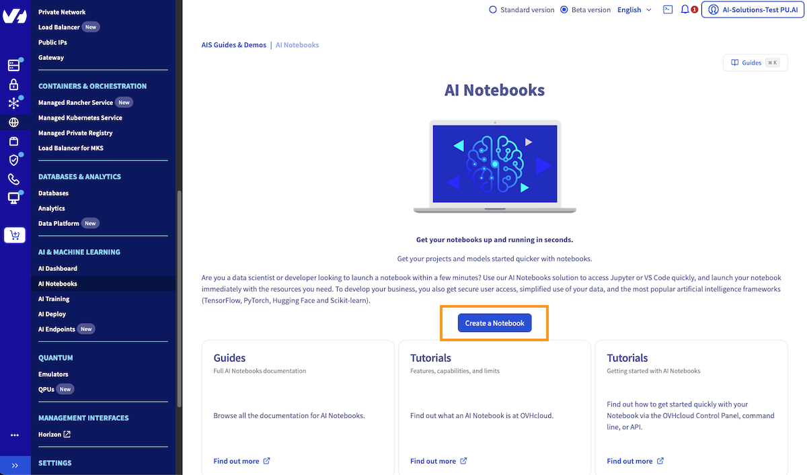{.thumbnail}
>> 
>> Then, you will be able to click the `...`{.action} button, and stop your AI Deploy application.
>>
>> 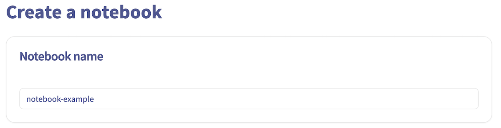{.thumbnail}
>>
>> Give a name to your Notebook.
>> Next, click on the `Next`{.action} button.
>>
>> 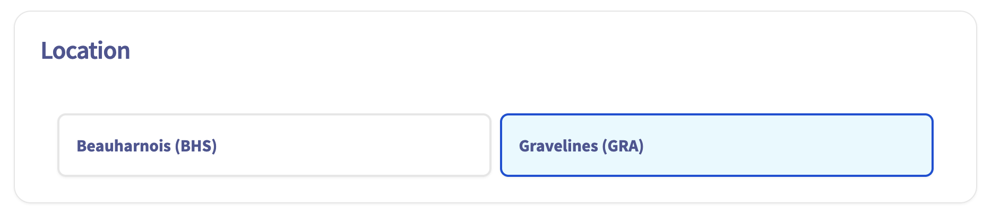{.thumbnail}
>>
>> Choose the code editor you want.
>> In this example, it's _JupyterLab_, but you can choose _Visual Studio Code_.
>>
>> Both of them have their own pros and cons, but usually we can consider Jupyter as easier to user for a start.
>>
>> Select _JupyterLab_, then click on the `Next`{.action} button.
>>
>> Choose the AI framework you want to use and click on the `Next`{.action} button.
>>
>> 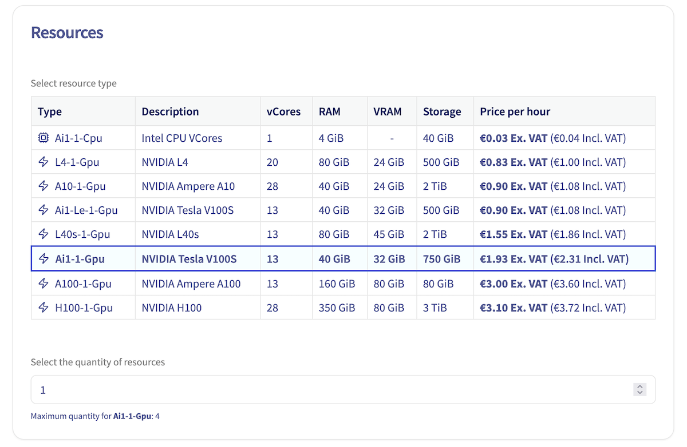{.thumbnail}
>>
>> > [!primary]
>> >
>> > As you can see, a wide range of machine learning frameworks are available in different versions. You can select the version that suits your needs when creating your notebook. This guide uses one of the most famous, _PyTorch_.
>> > As you can guess all of these frameworks are _deployed_ as container based on images.
>> >
>>
>> Next, select your privacy settings and click on the `Next`{.action} button.
>>
>> 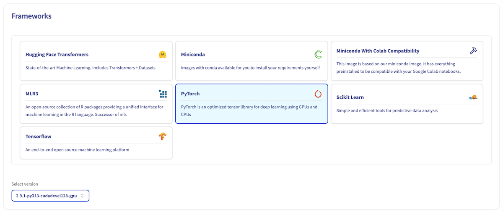{.thumbnail}
>>
>> > [!warning]
>> >
>> > _Public access_ will expose your data and code to anyone getting the AI Notebook link. Be careful and don't use it with sensitive data.
>> >
>> 
>> Next, select a location for your new cluster.
>>
>> 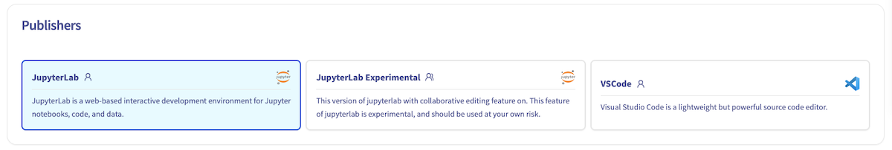{.thumbnail}
>>
>> Next, select and adjust the amount of computing resources for your notebook. Use the `+`{.action} and `-`{.action} buttons to increase or decrease the number of CPUs and GPUs, depending on your needs.
>> 
>> Click on the `Next`{.action} button.
>>
>> 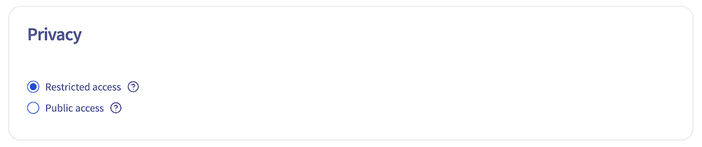{.thumbnail}
>>
>> Next step is about **Storage Options**.
>>
>> By default, you will have an ephemeral storage space (local storage) and in this step you can link Object Storage containers to your AI Notebook, and directly play with your data.
>>
>>
>> By default, your AI Notebook comes with ephemeral storage (local storage), but in this step, you can also link Object Storage containers and Git repositories to your AI Notebook to easily access your data. 
>>
>> If you want to learn more about configuring containers and git repositories in the notebook, you can refer to this [documentation](/pages/public_cloud/ai_machine_learning/notebook_guide_data_ui). For now, we will launch a classic notebook without any external volumes added to it.
>>
>> Click on the `Next`{.action} button.
>>
>> 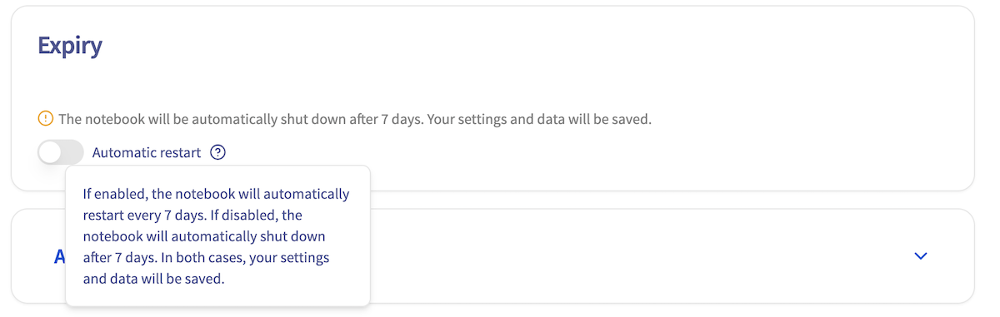{.thumbnail}
>>
>> SSH public keys allow you to access your notebook remotely. This section is optional, click on the `Next`{.action} button.
>>
>> 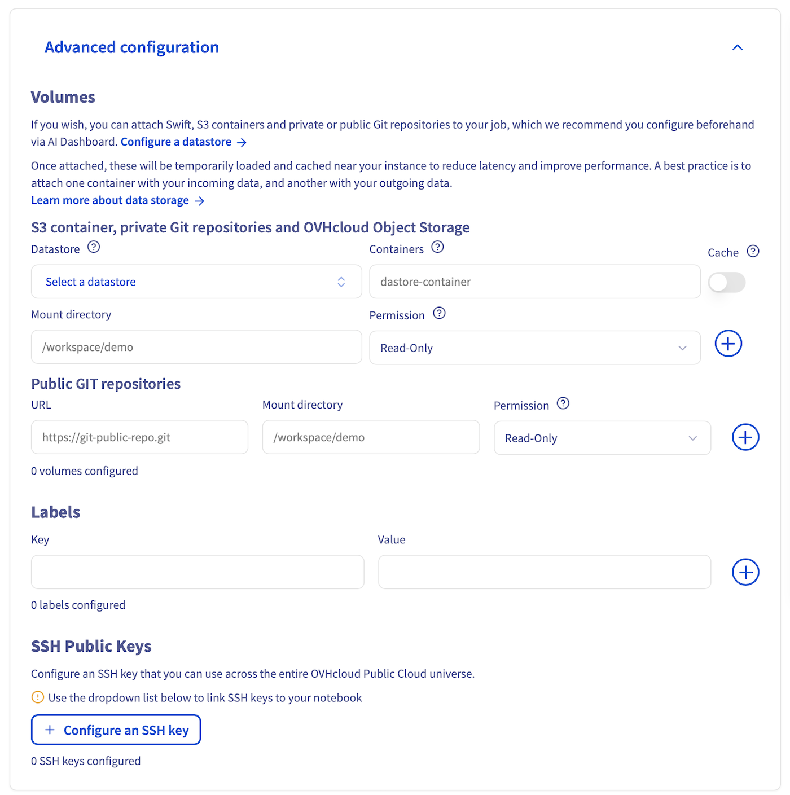{.thumbnail}
>>
>> At the end of the process, review your settings and click on the `Create a Notebook`{.action} button to confirm and launch the creation of your notebook.
>> 
>> 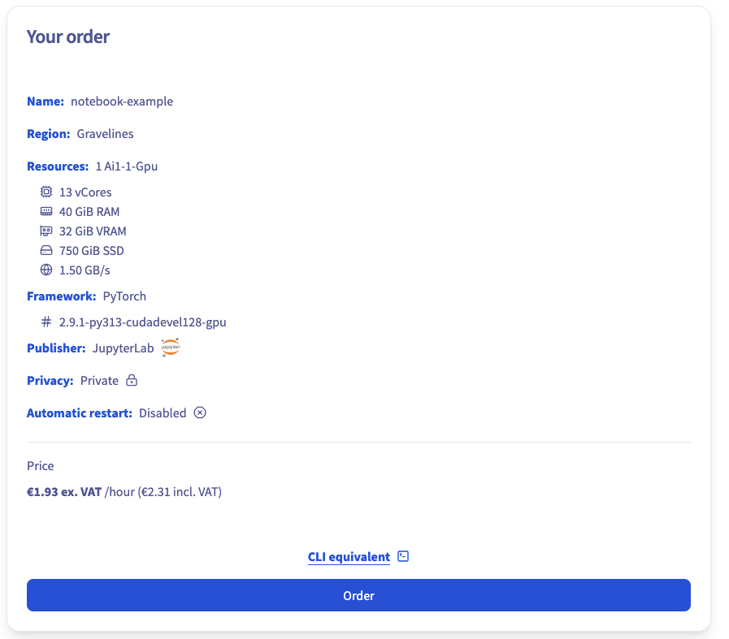{.thumbnail}
>>
>> > [!primary]
>> >
>> > Note at the bottom of the screen the equivalent of all these steps with the OVHcloud AI CLI, named `ovhai`.
Note at the bottom of the screen the equivalent `ovhai` CLI command. This command allows you to run the exact same notebook using the Command-Line Interface.
>> >
>> > Discover how to [install the OVHcloud AI CLI (ovhai)](/pages/public_cloud/ai_machine_learning/cli_10_howto_install_cli).
>> >
>>
>> When your notebook is created, it will appear on your AI Dashboard.
>>
>> 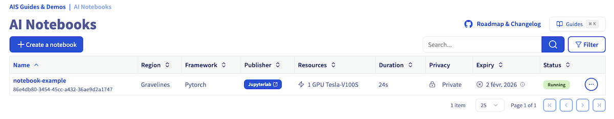{.thumbnail}
>>
> **Using ovhai CLI**
>>
>> If you prefer to use the OVHcloud AI command line interface (`ovhai` CLI) to launch your AI Notebook, please refer to the following guide: [CLI - Launch an AI notebook](/pages/public_cloud/ai_machine_learning/cli_11_howto_run_notebook_cli).
>>
>> The guide covers the installation and configuration of the `ovhai` CLI, as well as the specific commands you need to use to launch a notebook.
>>
>> {.thumbnail}
>>
> **Using the AI API**
>>
>> To create an AI Notebook using the OVHcloud AI API, follow these steps:
>>
>> First, navigate to the AI API for the desired region among the ones that are available for the AI Products usage:
>>
>> - GRA (Gravelines, France): https://gra.training.ai.cloud.ovh.net/#/
>> - BHS (Beauharnois, Canada): https://bhs.training.ai.cloud.ovh.net/#/
>> 
>> Upon visiting the API URL, you will notice various endpoint categories on the left side of the screen.
>>
>> Click 'Notebook' category to display the endpoints related to AI Notebooks. Among them, you will find a `POST Submit a new notebook` method. This is the endpoint for submitting a new notebook. 
>>
>> *The exact link for GRA region is as follows: https://gra.training.ai.cloud.ovh.net/#/operations/notebookNew.*
>>
>> 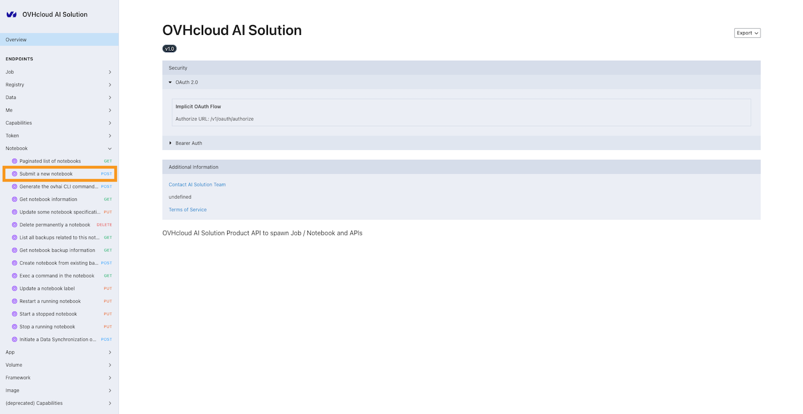{.thumbnail}
>>
>> In the `Submit a new notebook` endpoint page, you will find the detailed schema for the Notebook Specification and its various possible parameters. Examples of responses (`200`, `400`, `401`, `402`, `403`) are also provided in case of success or different error scenarios.
>> 
>> Before using any method of the API, you will need to log in. This can be done using a token. 
>>
>> Click on the right-hand corner and provide your token in the 'Auth' section. This token should be created from the OVHcloud AI Dashboard, or the `ovhai` CLI. Make sure to select `Bearer Auth` instead of `OAuth 2.0`.
>>
>> 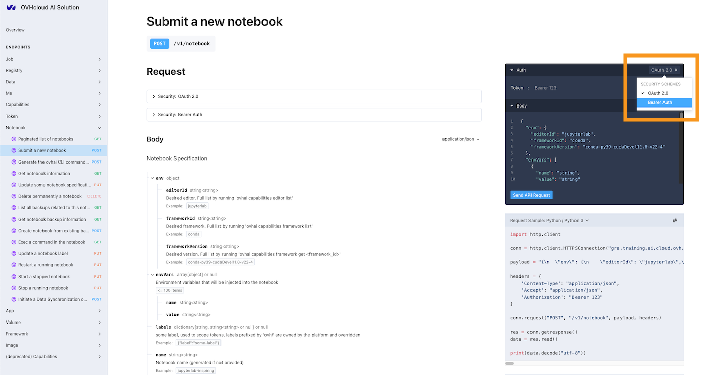{.thumbnail}
>>
>> After logging in, you may specify the body (notebook specifications) for the notebook you wish to create. A default example is provided.
>>
>> Once your body is filled, click the `Send API request` button. If your body is correctly written, the notebook will be created. You will receive all the necessary information about the created notebook (ID, access URL, etc.) in the `Responses` field.
>>
>> >> 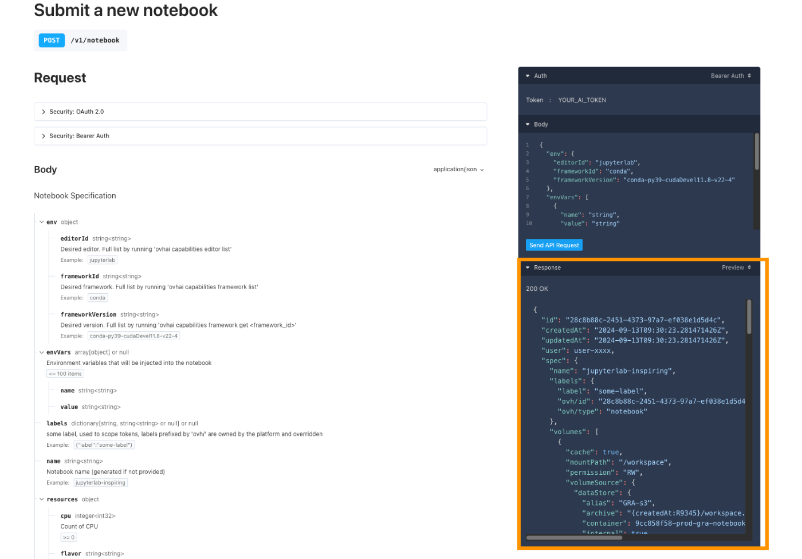{.thumbnail} 
>>
>> In addition to the API interface, the API provides Python code examples to help you use the endpoint and reproduce the same result programmatically.
>>
> **Using the Python SDK**
>>
>> The `ovhai` library is a Python client that allows developers to easily use the OVHcloud AI API. With this SDK, you can run, manage, automate your notebooks, training and deployments in the cloud using OVHcloud's AI products (AI Notebooks, AI Training, AI Deploy).
>>
>> > [!warning]
>> > 
>> > **Alpha Warning**: This package is currently in the **alpha phase** of development. The APIs and functionalities of the package may not be fully tested.
>>
>> To launch an AI Notebook using the [ovhai Python SDK](https://pypi.org/project/ovhai/), you first need to install the `ovhai` library. You can do this using `pip`. Open your terminal and run the following command:
>>
>> ```bash
>> pip install ovhai
>> ```
>> 
>> Once installed, we invite you to follow the instructions provided in the [ovhai PyPI](https://pypi.org/project/ovhai/) page to learn how to create a token for authentication, understand the SDK's functionality, and launch an AI Notebook using the `ovhai` Python SDK. Here is a basic example of how to do it, making it easy for you to get started:
>>
>>
>> ```python
>> from ovhai import AuthenticatedClient
>> from ovhai.api.notebook import notebook_new
>> from ovhai.models import NotebookSpec, Notebook
>> from ovhai.ovhai_types import Response
>>
>> client = AuthenticatedClient(
>>     base_url="https://gra.training.ai.cloud.ovh.net",
>>     token="YOUR_AI_TOKEN",
>> )
>> 
>> # Define notebook parameters
>> editor_id = "jupyterlab"
>> framework_id = "conda"
>> framework_version = "conda-py39-cudaDevel11.8-v22-4"
>> nb_cpu = 2
>> 
>> # Create the notebook creation request
>> notebook_specs = {
>>     "env": {"editorId": editor_id, "frameworkId": framework_id, "frameworkVersion": framework_version},
>>     "resources": {"cpu": nb_cpu},
>> }
>> 
>> with client as client:
>>     response: Response[Notebook] = notebook_new.sync_detailed(
>>         client=client, body=NotebookSpec.from_dict(notebook_specs)
>>     )
>>     import json
>>    # Assuming `response` is your Response object
>>    response_content = response.content.decode('utf-8')  # Decode bytes to a string
>>    response_dict = json.loads(response_content)
>>
>>    status_code = response.status_code
>>    id_ = response_dict['id']
>>    spec = response_dict['spec']
>>    status = response_dict['status']
>>    state = status['state']
>>    info = status['info']
>>    url = response_dict['status']['url']
>>
>>    print(f"Status code: {status_code}")
>>    print(f"ID: {id_}")
>>    print(f"Spec: {spec}")
>>    print(f"State: {state}")
>>    print(f"Info: {info}")
>>    print(f"URL: {url}")
>> ```
>>
>> This will launch a new AI Notebook based on the specifications you provided. 
>>

### Accessing your AI Notebook

At this point your AI Notebook is created. You will need to wait a few seconds for the notebook to start and reach the `RUNNING` status. Once it has, the notebook URL will be accessible.

> [!tabs]
> **Using the Control Panel (UI)**
>>
>> {.thumbnail}
>>
>> You can access your notebook by clicking the `JupyterLab`{.action} link in the `Access` column, in the array that lists all your AI Notebooks.
>>
>> {.thumbnail}
>>
> **Using ovhai CLI**
>>
>> If you no longer have the `notebook ID` and `URL` displayed in your terminal, you can easily list all your AI Notebooks by running:
>>
>> ```bash
>> ovhai notebook list
>> ```
>>
>> This will allow you to retrieve the `URL` of the Notebook you want to access.
>>
> **Using the AI API**
>>
>> If you no longer have the `notebook ID` and `URL` displayed in your terminal, you can easily list all your AI Notebooks by using the `Paginated list of notebooks` GET endpoint method, in the `Notebook` category.
>>
>> This will allow you to retrieve the `URL` of the Notebook you want to access.
>>
> **Using the Python SDK**
>>
>> If you no longer have the `notebook ID` and `URL` displayed in your Python IDE, you can easily list all your AI Notebooks by running:
>>
>> ```python
>> from ovhai.api.notebook import notebook_get_all
>> from ovhai.models import NotebookList
>> from ovhai.ovhai_types import Response
>>
>> from ovhai import AuthenticatedClient
>>
>> client = AuthenticatedClient(
>>    base_url="https://gra.training.ai.cloud.ovh.net",
>>    token="YOUR_AI_TOKEN",
>> )
>>
>> with client as client:
>>    response: Response[NotebookList] = notebook_get_all.sync_detailed(client=client)
>>    import json
>>    response = json.loads(response.content.decode())
>>    for notebook_info in response["items"]:
>>        print(f"ID: {notebook_info['id']}")
>>        print(f"Name: {notebook_info['spec']['name']}")
>>        print(f"Status: {notebook_info['status']['state']}")
>>        print(f"Framework: {notebook_info['spec']['env']['frameworkId']}")
>>        print(f"Framework version: {notebook_info['spec']['env']['frameworkVersion']}")
>>        print(f"Editor: {notebook_info['spec']['env']['editorId']}")
>>        print(f"Access link: {notebook_info['status']['url']}")
>>        print("---------------")
>> ```
>>
>> This will allow you to retrieve the `URL` of the Notebook you want to access.
>>

Once you have clicked on the notebook `URL` you want to access, you will be redirected to the notebook page where you will need to authenticate to ensure you have the necessary rights to access it. 

There are two ways to authenticate: using a **username and password** combination or using an **access token**.

> [!tabs]
> **Using a Username and Password**
>>
>> To authenticate using a username and password, please follow these steps:
>>
>> Enter one of your Public Cloud project user's username and password in the respective fields, as shown in the screenshot below. The user needs to belong to the same Public Cloud Project you used to create the notebook and must have sufficient permissions.
>>
>> If you have not yet created a Public Cloud user for your project, or require more information on how to do so, please refer to the following [guide](/pages/public_cloud/ai_machine_learning/gi_01_manage_users).
>>
>> Once you have entered your username and password, click the `Connect`{.action} button to log in to your AI Notebook.
>>
>> 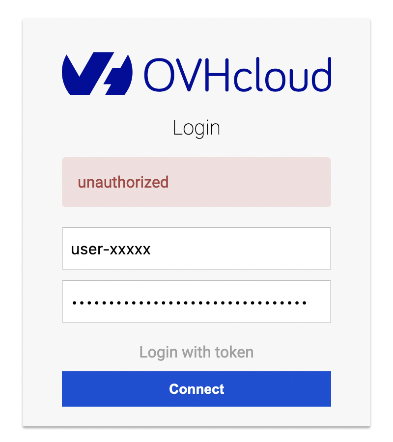{.thumbnail}
>>
> **Using an Access Token**
>>
>> To authenticate using an access token, please follow these steps:
>>
>> First you will need to obtain an access token from the AI Dashboard or the ovhai CLI. For more information on how to create an access token, please refer to this documentation.
>>
>> Enter the access token in the "Access Token" field, as shown in the screenshot below.
>> Click the `Connect`{.action} button to log in to your AI Notebook.
>>
>> {.thumbnail}
>>

Once you have successfully reached JupyterLab, you can create your first notebook by clicking on the `Python 3 (ipykernel)`{.action} button (or a similar button name depending on the framework you have selected).

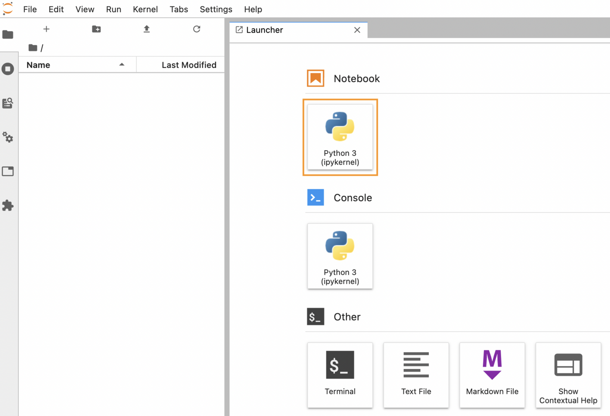{.thumbnail}

With your new notebook open, enter some Python code in the code section. We can test it with a simple _Hello World_ :

```python
print("Hello World")
```

To execute the code, simply press the `▶️`{.action} located in the toolbar above the code section. You should then see the output:

```bash
Hello World
```

Your code is executed in your browser and will consume the CPU and GPU resources linked to your AI Notebook.

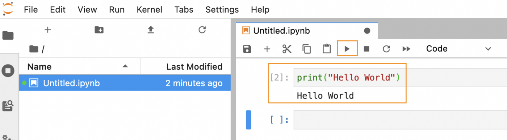{.thumbnail}

To save your notebook, click on the sub-menu `Save`{.action} of the `File` menu. Alternatively, you can use the keyboard shortcut `Ctrl+S`, or `CMD+S`, to save the notebook quickly.

### Stopping the AI Notebook

At any time, you can easily stop your Notebook.

> [!tabs]
> **Using the Control Panel (UI)**
>>
>> Go back to the `AI Notebooks`{.action} board, from the `Public Cloud`{.action} section of the [OVHcloud Control Panel](/links/manager).
>>
>> Then, select the Notebook you want to stop by clicking on its `UUID`. 
>> 
>> From there, you will be able to click the `...`{.action} button, and stop your AI Notebook by clicking `Stop`{.action}.
>>
>> {.thumbnail}
>>
>> Once stopped, your AI Deploy app will free up the previously allocated compute resources. Your endpoint is kept and if you restart your AI Deploy app, the same endpoint can be reused seamlessly.
>> Also, when you stop your app, you no longer book compute resources which means you don't have expenses for this part. Only expenses for attached storage may occur.
>>
>> If you want to completely **delete** your AI Deploy app, just click on the `delete`{.action} action.
>> Be sure to also delete your Object Storage data if you don't need it anymore, by going in the `Object Storage`{.action} section (in the Storage category).
>>

>

From the list of jobs you can list the available actions at the far right of each entry and interrupt the job by clicking Stop. Alternatively, from the job details you can also interrupt the job from the list of actions.
>>
>>
>>
>>
>>


> **Using ovhai CLI**
>>
>>
>> You can easily stop your Notebook using the following command:
>>
>> ```bash
>> ovhai notebook stop <NOTEBOOK_UUID>
>> ```
>>
>> Once stopped, your AI Deploy app will free up the previously allocated compute resources. Your endpoint is kept and if you restart your AI Deploy app, the same endpoint can be reused seamlessly.
>>
>> ```bash
>> ovhai app start <APP_UUID>
>> ```
>>
>> Also, when you stop your app, you no longer book compute resources which means you don't have expenses for this part. Only expenses for attached storage may occur.
>>
>> If you want to completely **delete** your AI Deploy app, just run the following command:
>>
>> ```bash
>> ovhai app delete <APP_UUID>
>> ```
>> 
>> Be sure to also delete your Object Storage data if you don't need it anymore. To do this, you will need to empty it first, then delete it:  
>>
>> ```bash
>> ovhai bucket object delete --all <object_storage_name>@<region>
>>
>> ovhai bucket delete <region> <object_storage_name>
>> ```


### Restarting a stopped notebook

### Deleting a notebook


### Considerations

- A notebook will run indefinitely until manual interruption, meaning that you will pay for it.
- When you stop an AI Notebook, you release the compute resources, but we keep the data from your workspace. It will be billed at the price of OVHcloud Object storage.
- Billing is per minute. Each started minute is due.

## Notebook lifecycle

During its lifetime the AI Notebook will transition between the following statuses:

> [!primary]
> * Billing starts once a notebook is `Pending` and ends when its status switches to `Cancelling`.
> * Only notebooks in states `Pending` and `In service` are included in the resource quota computation.

- `Pending`: The AI Notebook is starting, and volumes are synchronized from the Object Storage.
- `In service`: The AI Notebook is running and can be accessed from your browser.
- `Cancelling`: The AI Notebook is still running, but an interruption order was received and `RW` volumes are uploaded to your Object Storage.
- `Stopped`: The AI Notebook is stopped and `RW` volumes have been synchronized back to your Object Storage. Compute resources are released.
- `Deleted`: The AI Notebook data is fully deleted, you don't pay anything.

## Feedback

Please send us your questions, feedback and suggestions to improve the service:

- On the OVHcloud [Discord server](https://discord.com/invite/vXVurFfwe9)

If you need training or technical assistance to implement our solutions, contact your sales representative or click on [this link](links/professional-services) to get a quote and ask our Professional Services experts for a custom analysis of your project.


Subscribe to AI Notebooks OPTIONAL ???? 
Monitoring Link ? 
AI token guide
Mention AI Labels when creating ht enotenbook ? 
Rename les images
Check size des images < 1400px>
Clean mes projects + users + Tokens 
Considerations on les met ou pas ? Ça reprend la doc Noteboko Concept
Ask Elea several questions to know if guide is clear:
- Authorization to AI Notebooks ? (first part)
rEPLACE les .action - c'est réserve qu'aux boutons
Check que j'ai bien pas mis mon token client sdk Fz4EZWzhT/WXNIWjN20uz8tqFYCg6Tb0n/TSwrZGUbZWBH+2i+t7moxGx2dtL1vb
notebook / Notebopk
Pre-req token - 2 authentication ways - > should be at the begginning for sdk api cli
UUID Or ID 

## Go further

- To discover the AI Notebooks lifecycle and billing, explore this [guide](pages/public_cloud/ai_machine_learning/notebook_guide_capabilities).

If you need training or technical assistance to implement our solutions, contact your sales representative or click on [this link](links/professional-services) to get a quote and ask our Professional Services experts for a custom analysis of your project.