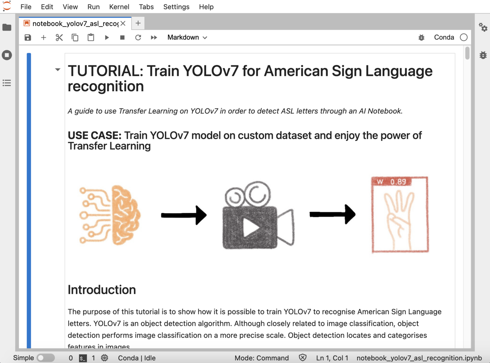

## Objective

The purpose of this tutorial is to show how it is possible to train YOLOv7 to recognize **American Sign Language letters**. YOLOv7 is an object detection algorithm. Although closely related to image classification, object detection performs image classification on a more precise scale. Object detection locates and categorizes features in images.

{.thumbnail}

It is based on the YOLOv7 open source [repository](https://github.com/WongKinYiu/yolov7).

## Requirements

- Access to the [OVHcloud Control Panel](https://www.ovh.com/auth/?action=gotomanager&from=https://www.ovh.pt/&ovhSubsidiary=pt)
- An AI Notebooks project created inside a [Public Cloud project](https://www.ovhcloud.com/pt/public-cloud/) in your OVHcloud account
- A user for AI Notebooks
- A [Public Roboflow](https://public.roboflow.com/) account to access and download the [American Sign Language Letters Dataset](https://public.roboflow.com/object-detection/american-sign-language-letters/1)

## Instructions

This tutorial is based on the [American Sign Language Letters Dataset](https://public.roboflow.com/object-detection/american-sign-language-letters/1). It is available for free on [Roboflow](https://public.roboflow.com/).

> *The American Sign Language Letters dataset is an object detection dataset of each ASL letter with a bounding box. [David Lee](https://www.linkedin.com/in/daviddaeshinlee/), a data scientist focused on accessibility, curated and released the dataset for public use.*

> [!primary]
>
> To learn more about the license of this dataset, please follow this [link](https://creativecommons.org/publicdomain/zero/1.0/).
>

### Create Object Storage containers

If you want to create it from the [OVHcloud Control Panel](https://www.ovh.com/auth/?action=gotomanager&from=https://www.ovh.pt/&ovhSubsidiary=pt), go to the Object Storage section and create a new object container by clicking `Object Storage` > `Create an object container`.

{.thumbnail}

If you want to run it with the CLI, just follow this [guide](/pages/public_cloud/ai_machine_learning/cli_17_how_to_cli_data_notebooks). You have to choose the region, the name of your container and the path where your data is located and use the following commands.

> [!warning]
>
> In this tutorial, you have to create 2 object containers.
>

- An object container `asl-volov7-data` dedicated to the dataset:

```bash
ovhai bucket create <region> asl-volov7-data
```

- An object container `asl-volov7-model` to save the model weights (for a future inference for example):

```bash
ovhai bucket create <region> asl-volov7-model
```

> [!warning]
>
> These two Object Storage containers will be empty initially. You will add data from the notebook.
>

### Launch and access Jupyter notebook with Miniconda framework

You need to attach a volume if your data is in your OVHcloud Object Storage and you want to use it during your experiment, or if you need to save the results of your work in the Object Storage. For more information on data, volumes and permissions, see [our guide on data](/pages/public_cloud/ai_machine_learning/cli_17_how_to_cli_data_notebooks).

If you want to launch it from the [OVHcloud Control Panel](https://www.ovh.com/auth/?action=gotomanager&from=https://www.ovh.pt/&ovhSubsidiary=pt), just follow this [guide](/pages/public_cloud/ai_machine_learning/notebook_guide_introduction_definition).

1. `Name your notebook`
2. `Choose Jupyterlab editor`
3. `Select the Miniconda framework`
4. `Choose the access type`
5. `Select the datacenter location`
6. `Choose the number of GPUs or CPUs you need`
7. `Attach your two containers`
8. `Attach public ssh keys only if you want to`
9. `Check that everything is ok and launch your notebook`

Once the repository has been cloned, find the YOLOv7 notebook by following this path: `ai-training-examples` > `notebooks` > `computer-vision` > `object-detection` > `miniconda` > `yolov7` > `notebook_object_detection_yolov7.ipynb`.

If you want to launch it with the CLI, choose the [volumes](/pages/public_cloud/ai_machine_learning/cli_17_how_to_cli_data_notebooks) you want to attach and the number of GPUs (`<nb-gpus>`) to use on your notebook and use the following command:

```bash
ovhai notebook run conda jupyterlab \
	--name <name> \
	--gpu <nb-gpus> \
	--volume asl-volov7-data@<region>/:/workspace/data:RW \
	--volume asl-volov7-model@<region>/:/workspace/models_train:RW
```

> [!primary]
>
> For this tutorial, we advise you to use at least **2 GPUs**.
>

You can then reach your notebook’s URL once it is running.

### Experimenting YOLOv7 notebook

You are now able to train the YOLOv7 model to recognize sign language!

A preview of this notebook can be found on GitHub [here](https://github.com/ovh/ai-training-examples/blob/main/notebooks/computer-vision/object-detection/miniconda/yolov7/notebook_object_detection_yolov7_asl.ipynb).

### Go further

- Do you want to observe the evolution of your metrics during the training of your model? Click [here](/pages/public_cloud/ai_machine_learning/notebook_tuto_03_weight_biases)!
- Do you want to use your YOLOv7 model in an app? [Here it is](/pages/public_cloud/ai_machine_learning/deploy_tuto_13_streamlit_yolov7).

If you need training or technical assistance to implement our solutions, contact your sales representative or click on [this link](https://www.ovhcloud.com/pt/professional-services/) to get a quote and ask our Professional Services experts for a custom analysis of your project.

## Feedback

Please send us your questions, feedback and suggestions to improve the service:

- On the OVHcloud [Discord server](https://discord.com/invite/vXVurFfwe9)
