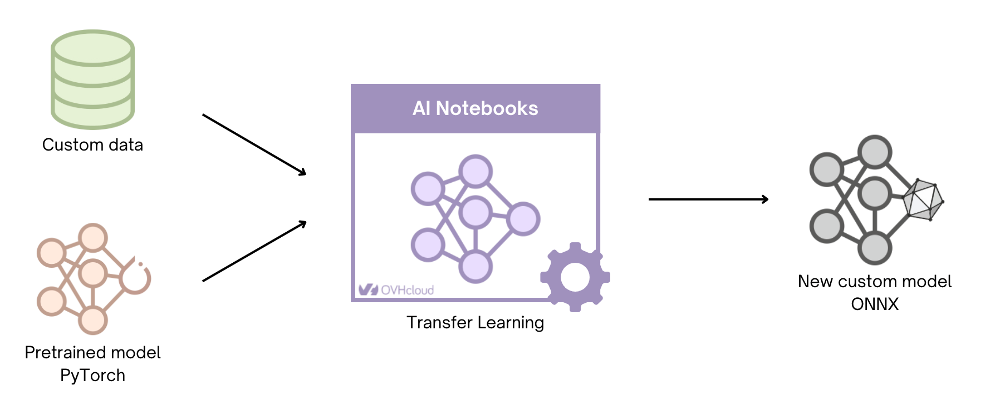

## Objective

The aim of this tutorial is to show you how to **Fine-Tune** a PyTorch model and export it in **ONNX** ([Open Neural Network Exchange](https://onnx.ai/)) format.

For this purpose, we use an **image classification** model: [DenseNet](https://pytorch.org/hub/pytorch_vision_densenet/).

> [!primary]
>
> DenseNet models are pre-trained on [ImageNet](https://www.image-net.org/) dataset.
>

The goal is to Fine-Tune a **DenseNet121** model to classify daily life images with the **CIFAR-10** dataset. It is composed of 10 classes:

- airplane
- automobile
- bird
- cat
- deer
- dog
- frog
- horse
- ship
- truck

*Find out more information about CIFAR-10 dataset on the following [link](https://www.cs.toronto.edu/~kriz/cifar.html).*

At the end of training, the DenseNet model is saved in PyTorch format (`.pth`). It will then be transformed into ONNX.

Exporting your model in ONNX format allows you to **optimize the inference** of a Machine Learning model.

{.thumbnail}

## Requirements

- Access to the [OVHcloud Control Panel](/links/manager)
- An AI Notebooks project created inside a [Public Cloud project](https://www.ovhcloud.com/es-es/public-cloud/) in your OVHcloud account
- A user for AI Notebooks
- A [Kaggle](https://www.kaggle.com/) account to download the dataset

## Instructions

You can launch the notebook from the [OVHcloud Control Panel](/links/manager) or via the ovhai [CLI](/pages/public_cloud/ai_machine_learning/cli_11_howto_run_notebook_cli).

### Launching a Jupyter notebook with "Conda" via UI (Control Panel)

To launch your notebook from the [OVHcloud Control Panel](/links/manager), refer to the following steps.

#### Code editor

Choose the `Jupyterlab` code editor.

#### Framework

In this tutorial, the `conda` framework is used.

#### Resources

Using GPUs is recommended to train the image classification model: **densenet121**.

> [!primary]
>
> Here, using `1 GPU` is sufficient.
>

### Launching a Jupyter notebook with "conda" via CLI

*If you do not use our CLI yet, follow [this guide](/pages/public_cloud/ai_machine_learning/cli_10_howto_install_cli) to install it.*

If you want to launch your notebook with the OVHcloud AI CLI, choose the `jupyterlab` editor and the `conda` framework.

To access the different versions of `conda` available, run the following command:

```console
ovhai capabilities framework get conda -o yaml
```

You will also need to choose the number of GPUs to use in your notebook, using `<nb-gpus>`.

To launch your notebook, run the following command:

```console
ovhai notebook run conda jupyterlab \
		--name <notebook-name> \
		--framework-version conda-py310-cuda11.8-v22-4 \
		--gpu <nb-gpus>

```

You can then reach your notebook’s URL once the notebook is running.

### Accessing the notebooks

Once our [AI examples repository](https://github.com/ovh/ai-training-examples/) has been cloned in your environment, find the fine-tuning notebook tutorial by following this path: `ai-training-examples` > `notebooks` > `go-further` > `onnx` > `notebook_finetune_densenet_export_onnx.ipynb`.

A preview of this notebook can be found on GitHub [here](https://github.com/ovh/ai-training-examples/blob/main/notebooks/go-further/onnx/notebook_finetune_densenet_export_onnx.ipynb).

## Go further

There are many other tasks that exist in the computer vision field. Check our other tutorials to learn how to:

- [Use Transfer Learning with ResNet50 for image classification](/pages/public_cloud/ai_machine_learning/notebook_tuto_07_transfer_learning_resnet50_image_classification)

- [Perform Brain tumor segmentation using U-Net](/pages/public_cloud/ai_machine_learning/notebook_tuto_12_image-segmentation-unet-tumors)

If you need training or technical assistance to implement our solutions, contact your sales representative or click on [this link](https://www.ovhcloud.com/es-es/professional-services/) to get a quote and ask our Professional Services experts for a custom analysis of your project.

## Feedback

Please send us your questions, feedback and suggestions to improve the service:

- On the OVHcloud [Discord server](https://discord.com/invite/vXVurFfwe9)
