## Objective

This guide covers the initialisation of **AI Training** and the submission of [**jobs**](/pages/public_cloud/ai_machine_learning/training_guide_03_concepts_jobs) through the OVHcloud Control Panel.

## Requirements

-   a **Public cloud** project
-   optionally container objects to attach data to the **job** at step 6, see our [create data container](/pages/storage_and_backup/object_storage/pcs_create_container) guide.

<!-- CP-NAV-START:publiccloud-projects -->
---

### Accès à l'espace client OVHcloud

- **Lien direct :** [Projets Public Cloud](/links/control-panel/publiccloud-projects)
- **Pour accéder à vos services :** `Public Cloud`{.action} > Sélectionnez votre projet

---
<!-- CP-NAV-END:publiccloud-projects -->

## Instructions

### Step 1 - Going to the AI Training menu

Click [this link](/links/control-panel/publiccloud-projects) to access your Public Cloud project, then go to the `AI Training`{.action} section, located under `AI & Machine Learning`.

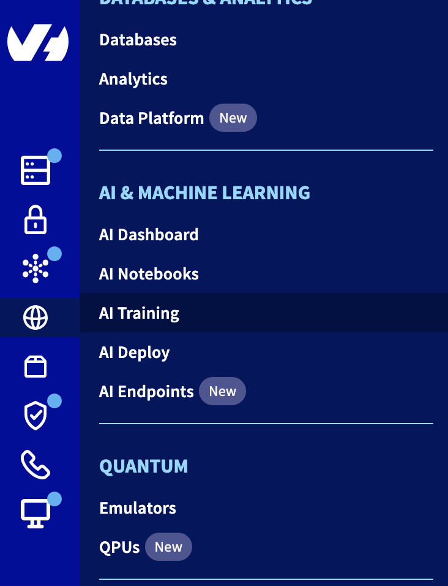{.thumbnail}

### Step 2 - Starting a job submission

Once you have read the general information and validated this service's contract terms, you can start submitting your jobs. Upon activating the AI Training service you grant OVHcloud access to your Object Storage containers. This access is only used to synchronise your data within **AI Training** with your containers.

From the **jobs** list in the dashboard you can start the job submission by clicking the `Launch a new Job`{.action} button.

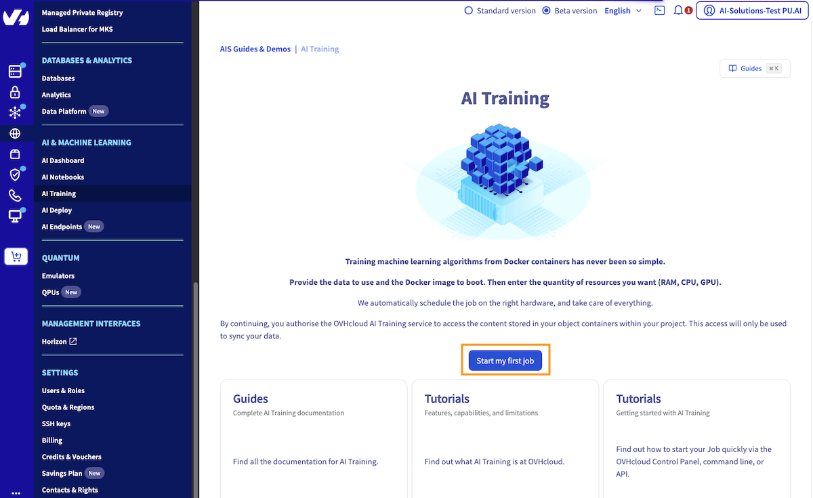{.thumbnail}

### Step 3 - Selecting a region for your job

Give a name to your job. This will make it easier to manage when you have multiple jobs running.

Each **job** is executed in an OVHcloud region. Each region has its own **AI Training** cluster with potentially varying capabilities. For more information, see the [capabilities](/pages/public_cloud/ai_machine_learning/training_guide_01_capabilities).

Select the desired region and click `Next`{.action}.

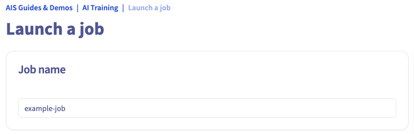{.thumbnail}

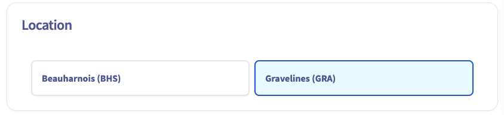{.thumbnail}

### Step 4 - Specifying the amount of resources

In this step you can either select the amount of GPUs or CPUs you need for your training workload.

The max amount of GPUs or CPUs you can select for your **job** is region-dependent. If you choose a GPU, a fixed ratio of CPU is applied based on the number of GPUs. Similarly, there is a fixed ratio of Memory based on the number of CPUs. For more information see the [capabilities](/pages/public_cloud/ai_machine_learning/training_guide_01_capabilities).

Once the amount of resources is set you can see a preview of the billing rate. Click `Next`{.action}.

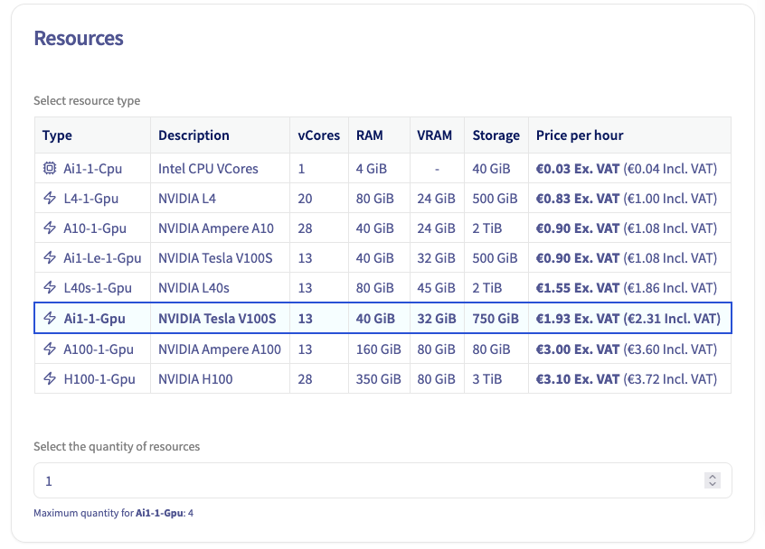{.thumbnail}

### Step 5 - Providing a Docker image

A job is basically a Docker container that is run within the OVHcloud infrastructure. You need to provide a Docker image to be executed. There are several options you can choose from:

#### Preset Images

OVHcloud provides a set of images from which you can choose to ease the submission of your first **jobs**. Provided images are essentially a JupyterLab environment bundled with some Deep Learning technology such as Tensorflow or MXNet. These images are planned to be removed, as the product is more focused on using custom images.

#### Custom Images

Preset images cannot cover all your needs so you can specify your own image if necessary. You can use any image that is accessible from **AI Training**.

This includes public images (e.g. Dockerhub), images within the shared registry or images in your added private registry. For more information, see how to [add a private registry](/pages/public_cloud/ai_machine_learning/gi_07_manage_registry).

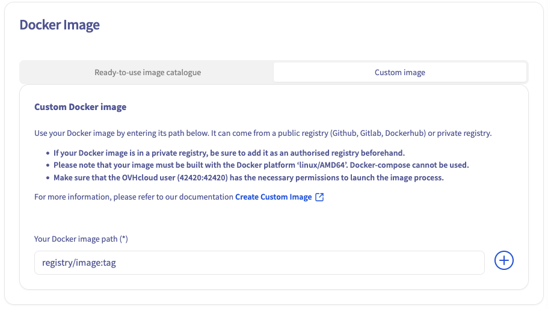{.thumbnail}

### Step 6 - Privacy Settings

Next, select your privacy settings.

> [!warning]
>
> *Public access* will expose your data and code to anyone getting the AI Training job link. Be careful and don't use it with sensitive data. On the other hand, *Restricted access* will ask a user and password combination or an AI token to access the job content, ensuring a secure environment.
>

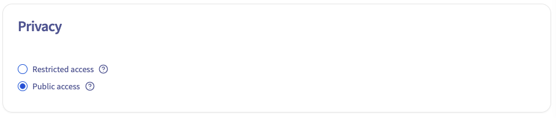{.thumbnail}

### Step 7 - Job lifecycle

> [!warning]
>
> Actually our main motivation is to keep the plateform up-to-date, in matter of security patches and new features alignment, so we need to update and restart hosts from time to time, which requires to get them free from any customer workload.
> This also allows us to address host-located incidents, e.g. when a single GPU fails due to faulty hardware (only 1 customer impacted, but we still need to stop the host for bringing it to PCI maintenance, so every remaining workload must be evicted or rescheduled elsewhere).

By default, your job will automatically shut down after 7 consecutive days of being in a RUNNING state, Rest assured that all your settings and data will be preserved. You have the option to enable Automatic Restart, which will automatically restart your job back on every 7 days, ensuring minimal disruption to your workflow. Alternatively, you can also contact [our support](/links/support-contact) to extend this automatic restart period from 7 to 28 days.

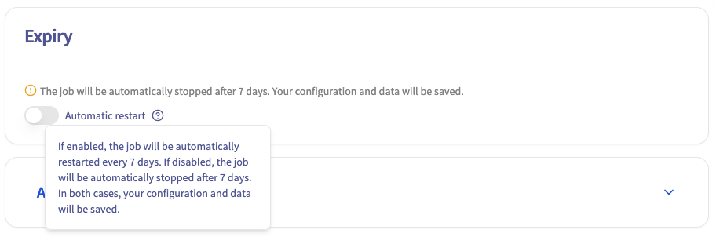{.thumbnail}

### Step 8 - Advanced configuration

*This step is optional.*

First, the Docker image you provided in Step 6 includes an entrypoint for your container. You can override this entrypoint by specifying your own command.

Then, by default, your AI Training job comes with **ephemeral storage** (local storage). But in this step, you can also link Object Storage containers and Git repositories to your job, either as input for your training workload or as output for your results (e.g. model weights).

If you want to learn more about configuring containers and Git repositories in the job, you can refer to this [model training example](/pages/public_cloud/ai_machine_learning/training_tuto_01_train_your_first_model). For now, we will launch a classic job without any external volumes added to it.

Finally, **SSH public keys** allow you to access your job remotely.

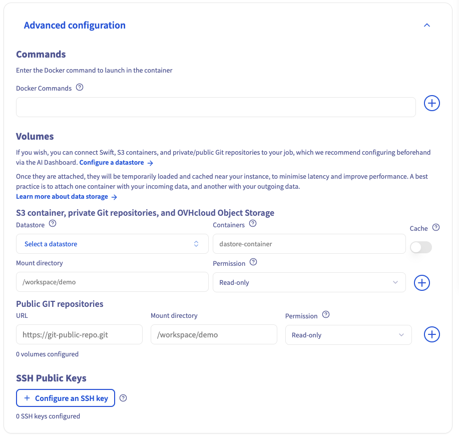{.thumbnail}

### Step 9 - Submitting your job

In the final step you get an overview of the **job** you configured before submission. You also get the equivalent command to use with the **`ovhai` CLI**.

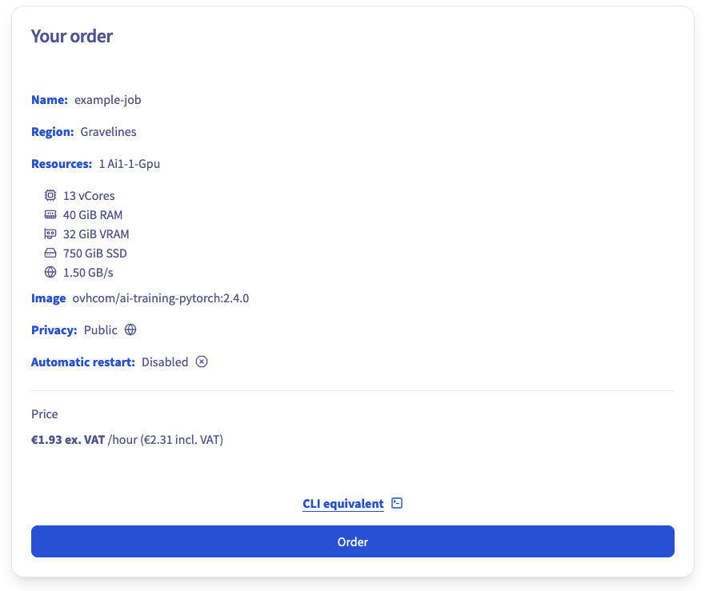{.thumbnail}

Click `Order`{.action} to confirm and launch the creation of your **job** to the cluster.

When your job is created, it will appear on your AI Training tab:

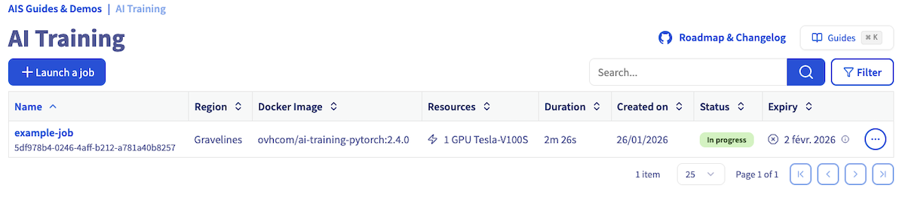{.thumbnail}

### Step 10 - Consulting your job

From this list you can access your job details either by clicking on its name or by clicking on `...`{.action} and selecting `Manage`. The details include several components, like the job resources, statuses, billing, logs and access url. This URL is of the form `https://<JOB-ID>.job.<REGION>.ai.cloud.ovh.net/`. Moreover, you can access any available port by adding it to the job URL this way: `https://<JOB-ID>-<PORT>.job.<REGION>.ai.cloud.ovh.net/`. You can check the list of available ports in the [capabilities](/pages/public_cloud/ai_machine_learning/training_guide_01_capabilities).

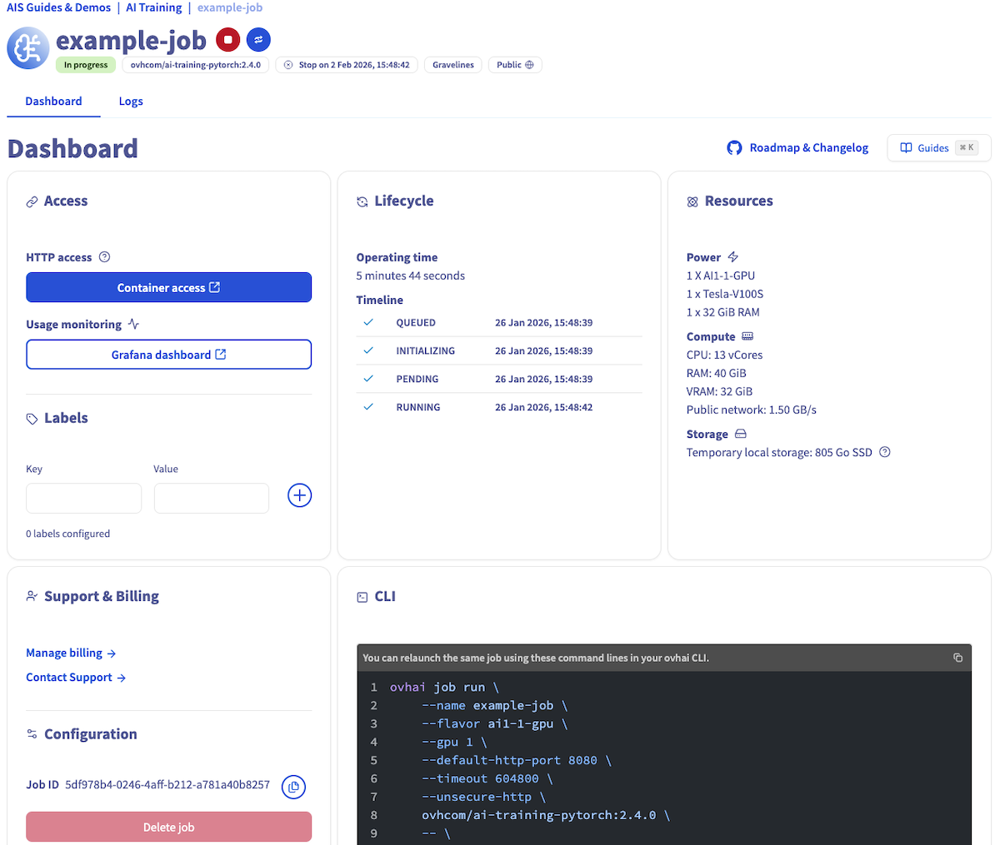{.thumbnail}

You can also check your job logs by clicking the `Logs`{.action} button.

### Step 11 - Stopping your job

If you are done using your job, if your model converged prematurely or if you just wish to interrupt your job you can do so from the **jobs** list and the job page.

From the list of **jobs** you can list the available actions at the far right of each entry and interrupt the job by clicking `Stop`{.action}. Alternatively, from the **job** details you can also interrupt the **job** from the list of actions by clicking the `🔴`{.action} stop button.

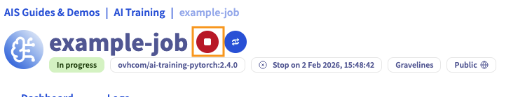{.thumbnail}

After that, if you no longer need your job, you can delete it. To do so, just click on the `...`{.action} button, and then select `Delete`{.action} action.

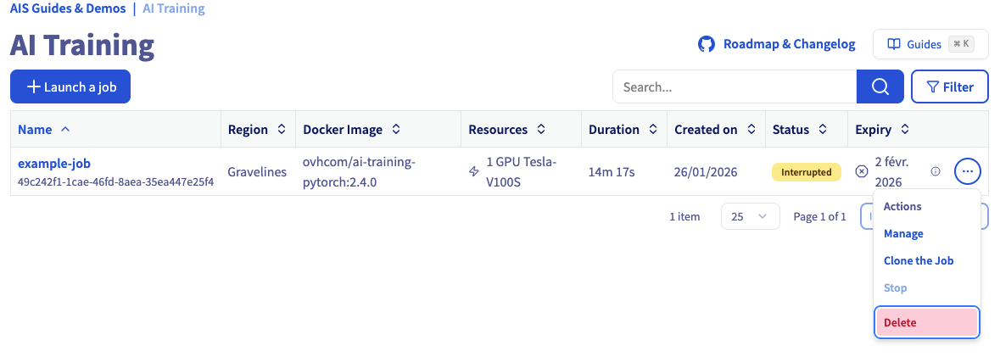{.thumbnail}

### Step 12 - Cloning your job

You can also click the `🔄`{.action} restart button to clone the job with the same configuration. This will launch a new job identical to the original (e.g., `example-job`), allowing you to rerun your workflow without re‑configuring the job.

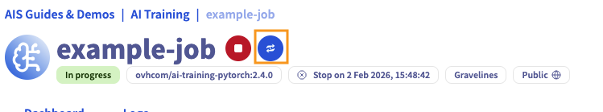{.thumbnail}

## Going further

The **AI Training** service is mainly supposed to be used through the **`ovhai` CLI**. The OVHcloud Control Panel only offers a subset of the features and is meant to help you get started before using the CLI. Discover how to [install the OVHcloud AI CLI](/pages/public_cloud/ai_machine_learning/cli_10_howto_install_cli).

If you need training or technical assistance to implement our solutions, contact your sales representative or click on [this link](/links/professional-services) to get a quote and ask our Professional Services experts for a custom analysis of your project.

## Feedback

Please feel free to send us your questions, feedback, and suggestions regarding AI Notebooks:

- In the #ai-notebooks channel of the OVHcloud [Discord server](https://discord.gg/ovhcloud), where you can engage with the community and OVHcloud team members.
