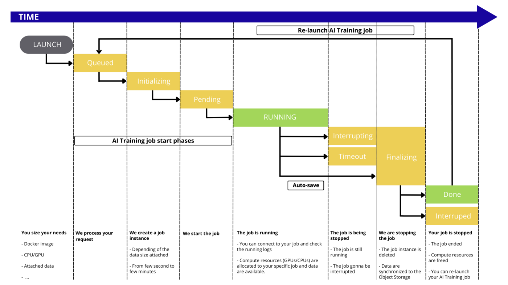
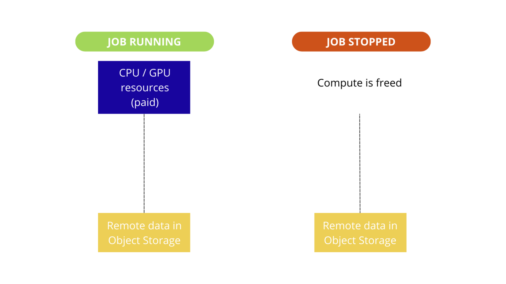
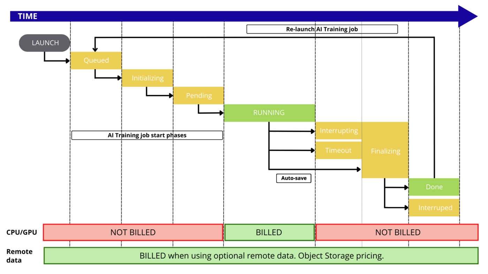

## Objective

The OVHcloud AI Training service provides you a container as a service platform, linked to CPU or GPU resources, without the hassle of installing or operating them. This guide will cover the lifecycle of an AI Training job, and associated billing.

## Introduction

AI Training jobs are linked to a Public Cloud project. The whole project is billed at the end of the month, with pay-as-you-go. It means you will only pay for what you consume, based on the compute resources you use (CPUs and GPUs) and their running time.

## AI Training job lifecycle

During its lifetime, the [AI Training job](/pages/public_cloud/ai_machine_learning/training_guide_03_concepts_jobs) will go through the following statuses:

- `QUEUED`: The job run request is about to be processed.
- `INITIALIZING`: The job instance is created and the data is synchronized from the Object Storage. To know more about the data synchronisation check out the [Data How it works](/pages/public_cloud/ai_machine_learning/gi_02_concepts_data#how-it-works) section.
- `PENDING`: The job is being started.
- `RUNNING`: The job is running, you can connect to it. Compute resources (GPUs/CPUs) are allocated to your specific job and data are available.
- `INTERRUPTING`: The job is still running but an interruption order was received and is about to be processed.
- `FINALIZING`: The job instance is deleted and the data is synchronized back to the Object Storage. To know more about the data synchronisation check out the [Data How it works](/pages/public_cloud/ai_machine_learning/gi_02_concepts_data#how-it-works) section.
- `DONE`: The job ended normally.
- `TIMEOUT`: The job is still running but is about to be interrupted because the timeout was reached.
- `INTERRUPTED`: The job is ended and was interrupted.
- `FAILED`: The job ended with an error, e.g. the process in the job finished with a non 0 exit code, Docker image could not be pulled. For more information, refer to [this section](/pages/public_cloud/ai_machine_learning/training_guide_07_troubleshooting#why-has-my-job-failed) of our [Troubleshooting documentation](/pages/public_cloud/ai_machine_learning/training_guide_07_troubleshooting).
- `ERROR`: The job ended due to a backend error. You may contact our support.

{.thumbnail}

## Billing principles

AI Training is a pay-per-use solution. You only pay for the resources consumption, during the `RUNNING` phase of your jobs.

Billing principle is quite simple, you select the amount of compute resource (CPUs or GPUs) you would like to work with and pay only for this.

**Included** in AI Training resources:

- AI Training managed service
- Dedicated CPU/GPU compute resources (based on the selected amount)
- Ephemeral local storage (size depends on the selected compute resources)
- Ingress/Egress network traffic

**Optional** with AI Training:

- Remote storage space, based on OVHcloud Object Storage pricing
- Egress traffic for remote Object storage

Visual explanations about paid items:

{.thumbnail}

A more detailed view:

{.thumbnail}

### Compute resources details

During the AI Training job creation, you can select **compute resources**, known as CPUs or GPUs.
Their official pricing is available in the [OVHcloud Control Panel](https://www.ovh.com/auth/?action=gotomanager&from=https://www.ovh.es/&ovhSubsidiary=es) or on the [OVHcloud Public Cloud website](https://www.ovhcloud.com/es-es/public-cloud/prices/).

Rates for compute are mentioned per hour to facilitate reading of the prices, but the billing granularity remains **per minute**.

### Storage details

#### Ephemeral local storage

Each compute resource (CPU or GPU) comes with local storage, that we can consider ephemeral since this storage space is not saved when you delete an AI Training job.

The sizing depends on the selected amount of compute resources, check the details on the [OVHcloud Public Cloud website](https://www.ovhcloud.com/es-es/public-cloud/prices/).

#### Remote Object storage

When working with remote data, you pay separately for the storage of this data.
The pricing of Object Storage is apart from the AI Training pricing.

### Pricing examples

#### Example 1: One CPU job for 10 days

We start one AI Training job with two CPUs and we keep it running for 10 days, then it is stopped.

- Compute resources: 2 x CPU (€0.03 / hour)
- Remote storage: Nothing
- Duration: 10 days then stopped

Price calculation for compute: 10 (days) x 24 (hours) x 2 (CPU) x €0.03 (price / CPU) = **€14.40**, billed at the end of the month

#### Example 2: One GPU job for 5 hours

We start one AI Training job with two GPUs and we keep it running for 5 hours, then it is stopped.

- Compute resources: 2 x GPU NVIDIA V100s (€1.93 / hour)
- Remote storage: Nothing
- Duration: 5 hours then stopped

Price calculation for compute: 5 (hours) x 2 (GPU) x €1.93 (price / GPU) = **€9.65 **, billed at the end of the month

## Feedback

Please send us your questions, feedback and suggestions to improve the service:

- On the OVHcloud [Discord server](https://discord.com/invite/vXVurFfwe9)

If you need training or technical assistance to implement our solutions, contact your sales representative or click on [this link](https://www.ovhcloud.com/es-es/professional-services/) to get a quote and ask our Professional Services experts for a custom analysis of your project.
