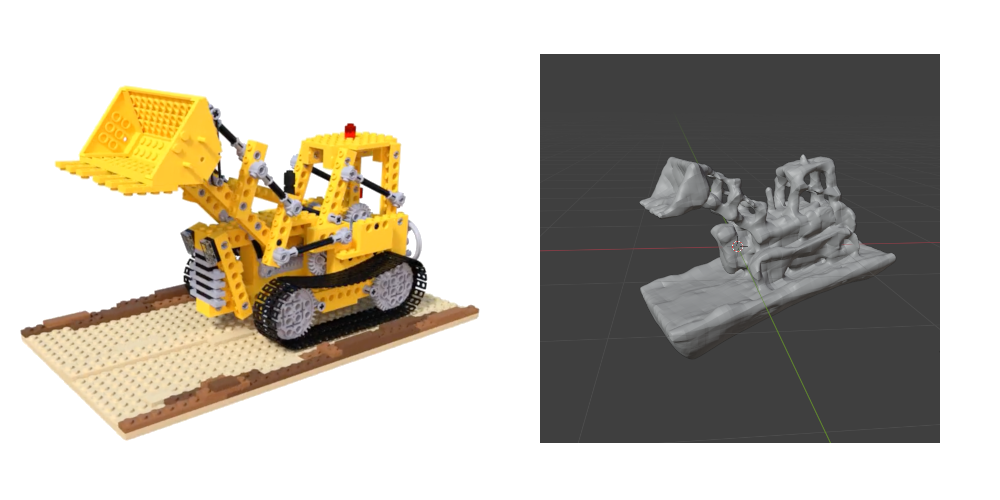

# Test NVIDIA/Neuralangelo using OVHcloud AI-Training

## Introduction

### The project

[Neuralangelo](https://research.nvidia.com/labs/dir/neuralangelo/) is a research project led by NVIDIA allowing to
perform High-Fidelity Neural Surface Reconstruction.
Starting from a video of a scene or an object, it recovers 3D surface structures from the video keyframes through an AI
model 

This tutorial aims at showing how to run NVIDIA sample use case with OVHcloud AI-Training jobs.

### This tutorial

This tutorial scenario is based on Neuralangelo [git repository]() and
[collab notebook](https://colab.research.google.com/drive/13u8DX9BNzQwiyPPCB7_4DbSxiQ5-_nGF#scrollTo=FUhJIThkeQoi)

After getting a sample video of a toy vehicle, we see how to put it through Neuralangelo model until we get a 3D mesh
file.

The processing will follow 3 main steps :
- Data preparation
- Data processing
- 3D model extraction

Each step will be run using an AI-Training job and these jobs will share their data using an AI-Training volume synced
with a S3 bucket.



### Makefile

A Makefile is provided [here](https://github.com/ovh/ai-training-examples/tree/main/jobs/neuralangelo/Makefile)
to run each of these steps, for each step the command underneath will be described.

The 3 main steps (prepare, process, extract) have their targets in the Makefile built the same way:
- Submit an AI-Training job and keep its JSON representation in logs/ directory
- Use the JSON file to keep track of job ID and get status or logs

## Pre-requisites

### Tooling

- git
- make
- jq
- blender
- python/pip
- ovhai

### Prepare projects

Clone neuralangelo and init git repositories:
```shell
make neuralangelo BlenderNeuralangelo
```

> [!primary]
> **Actual commands**
>
> ```shell
> git clone https://github.com/NVlabs/neuralangelo.git
> git -C neuralangelo submodule update --init --recursive
> git clone https://github.com/mli0603/BlenderNeuralangelo
> ```
>

Install ```gdown``` to fetch lego sample video
```shell
pip install gdown
```

Download sample video
```shell
gdown 1yWoZ4Hk3FgmV3pd34ZbW7jEqgqyJgzHy -O neuralangelo/input/
```

## Configure S3 bucket for ovhai

```shell
ovhai datastore add NEURALANGELO <s3_endpoint_url> <s3_region> <s3_access_key> --store-credentials-locally
```

> [!primary]
> Data store information (endpoint, region, access_key and secret key) can refer to an OVHcloud S3 bucket or any other
> provider
>
> Using ```--store-credentials-locally``` is needed here to be able to push/pull data from bucket
> using ovhai CLI in the next steps
>

## Prepare model input using COLMAP

Data preparation relies on the process described in
[Neuralangelo documentation](https://github.com/NVlabs/neuralangelo/blob/main/DATA_PROCESSING.md).

### Push neuralangelo project in the S3 bucket

```shell
make push-data
```

> [!primary]
> **Actual command**
> 
> ```shell
> ovhai bucket object upload neuralangelo-experiments-lego@NEURALANGELO .
> ```
> Note: As a bucket shall be unique in a S3 region, the Makefile uses current username in the bucket name
> (```experiments``` in this example)
>

### Extract pictures from video

Neuralangelo works on picture of the Object. These pictures are extracted from source video using
[COLMAP](https://colmap.github.io/).

Read detailed documentation for data preparation
[here](https://github.com/NVlabs/neuralangelo/blob/main/DATA_PROCESSING.md#self-captured-video-sequence).

```shell
make prepare
```

> [!primary]
> **Actual command**
>
> ```shell
> ovhai job run \
>		-o json \
>		-g 1 \
>		-f ai1-1-gpu \
>		-v neuralangelo-experiments-lego@NEURALANGELO/neuralangelo:/neuralangelo:rw:cache \
>		docker.io/chenhsuanlin/colmap:3.8 -- \
 >     		bash -c "cd /neuralangelo && \
>			bash projects/neuralangelo/scripts/preprocess.sh lego input/lego.mp4 2 object"
> ```
> Note: It takes approximately 8 min to run on 1 ai1-1-gpu GPU
> 

You can follow the training job status using following commands based on ```ovhai job get``` and ```ovhai job logs```
```shell
# Get updated info for the job
make prepare-job
```
```shell
# Get Job status
make prepare-status
```
```shell
# Get and follow job logs
make prepare-logs
```

Once the job is done, we get generated data from S3 bucket.
```shell
make pull-data
```

> [!primary]
> **Actual command**
>
> ```shell
> ovhai bucket object download neuralangelo-experiments-lego@NEURALANGELO
> ```


### Adjust COLMAP results

To get better results, we need to adjust the results bounding sphere.

Detailed documentation is available
[here](https://github.com/NVlabs/neuralangelo/blob/main/DATA_PROCESSING.md#inspect-and-adjust-colmap-results)

Here we chose the blender from command line way.

```shell
make adjust
```

> [!primary]
> **Actual command**
>
> ```shell
> blender --python BlenderNeuralangelo/start_blender_with_addon.py
> ```

Follow the process described
[here](https://github.com/mli0603/BlenderNeuralangelo?tab=readme-ov-file#2-locating-the-control-panel)
to adjust the bounding sphere.

Push adjusted configuration in the S3 bucket
```shell
make push-data
```

## Process data and generate model

```shell
make process
```

> [!primary]
> **Actual command**
>
> ```shell
> ovhai job run \
>		-o json \
>		-g 1 \
>		-f ai1-1-gpu \
>		-v neuralangelo-experiments-lego@NEURALANGELO/neuralangelo:/neuralangelo:rw:cache \
>		docker.io/chenhsuanlin/neuralangelo:23.04-py3 -- \
>      		bash -c "cd /neuralangelo && \
>			torchrun --nproc_per_node=1 train.py \
>				--logdir=logs/experiments/lego \
>				--show_pbar \
>				--config=projects/neuralangelo/configs/custom/lego.yaml \
>				--max_iter=1000"
> ```
> Note: To limit the time spent in processing, the iterations are set to 1000 but would need to be much more for a more
> detailed result (in Neuralangelo collab example, it is set to 20000).
> Here the step should take approximately 5 min to run on 1 ai1-1-gpu GPU (1 hour for 20000 iterations)
>

You can follow the training job status using following commands
```shell
# Get updated info for the job
make process-job
```
```shell
# Get Job status
make process-status
```
```shell
# Get and follow job logs
make process-logs
```

Once the job is done, we can run the 3D model extraction.

## Extract meshes from model

```shell
make extract
```

> [!primary]
> **Actual command**
>
> ```shell
> ovhai job run \
>		-o json \
>		-g 1 \
>		-f ai1-1-gpu \
>		-v neuralangelo-experiments-lego@NEURALANGELO/neuralangelo:/neuralangelo:rw:cache \
>		docker.io/chenhsuanlin/neuralangelo:23.04-py3 -- \
>      		bash -c "cd /neuralangelo && \
>		 	torchrun --nproc_per_node=1 projects/neuralangelo/scripts/extract_mesh.py \
>				--config=logs/experiments/lego/config.yaml \
>				--checkpoint=logs/experiments/lego/epoch_00020_iteration_000001000_checkpoint.pt \
>				--output_file=logs/experiments/lego/lego.ply \
>				--resolution=2048 --block_res=128 \
>				--textured"
> ```
> Note: The checkpoint should be set to the latest .pt file generated by process step in the
> ```neuralangelo/logs/experiments/lego/``` directory (the filename is stored in
> ```neuralangelo/logs/experiments/lego/latest_checkpoint.txt```)
> 
> It takes approximately 3 min to run on 1 ai1-1-gpu GPU
>

You can follow the training job status using following commands
```shell
# Get updated info for the job
make extract-job
```
```shell
# Get Job status
make extract-status
```
```shell
# Get and follow job logs
make extract-logs
```

Once the job is done, we get generated data from S3 bucket.
```shell
make pull-data
```

A .ply file is now available in ```neuralangelo/logs/experiments/lego/```, we are now able to open it with blender.

## Go further

### Neuralangelo configuration

A small subset of parameters are tunable using the Make command.
Each target can be tuned using a set of variables defined on top of the file.
As an example if you want to run the process step with another GPU flavor and over more iterations
```shell
make process FLAVOR=h100-1-gpu GPU=2 ITERATIONS=20000
```

To get deeper in Neuralangelo configuration, it takes its configuration from file
```neuralangelo/projects/neuralangelo/configs/custom/lego.yaml``` generated by preparation step, default values are set
in ```neuralangelo/projects/neuralangelo/configs/base.yaml```

It is possible to change it 
- either using ```torchrun``` command line parameters
- or editing the file directly and sync it to the S3 bucket using ```make data-push```

### Checkpoints rendering

If the process is configured with a large amount of iterations. Processing can be long. As Neuralangelo creates
intermediate checkpoints, we are able to try extraction on any intermediate model.

To perform this, we need use ```ovhai``` to trigger a ```data-push``` on the running job to sync the S3 content and use
previously described ```make extract``` command.
