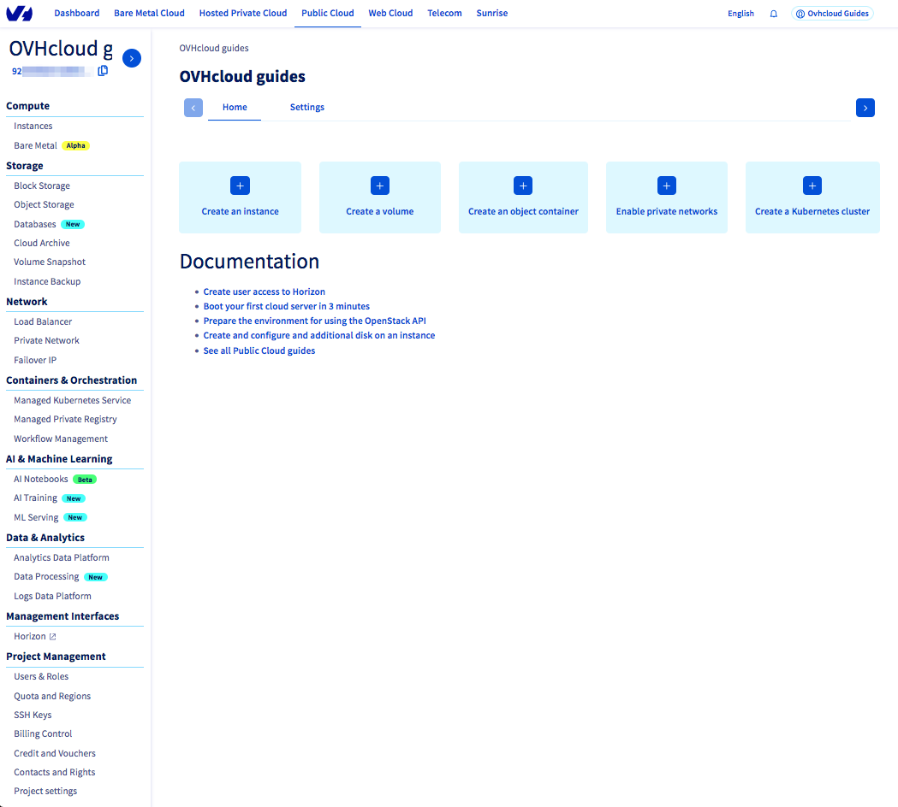
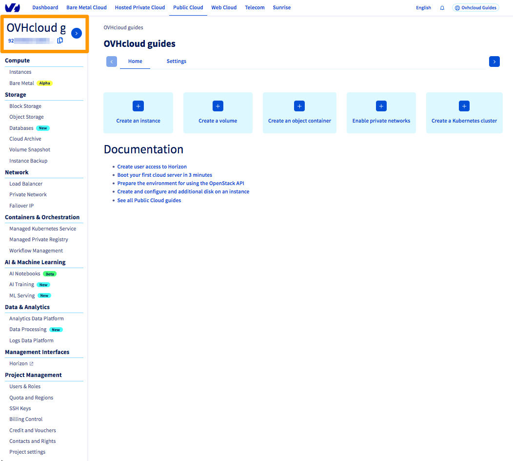
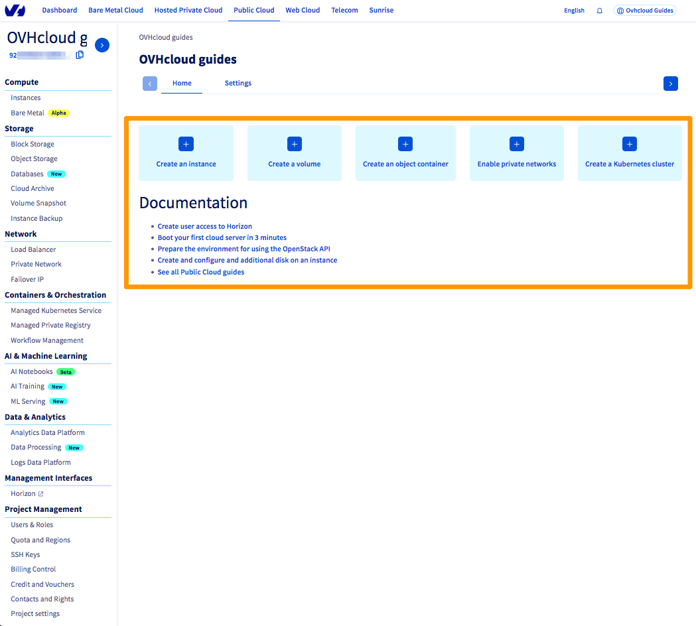
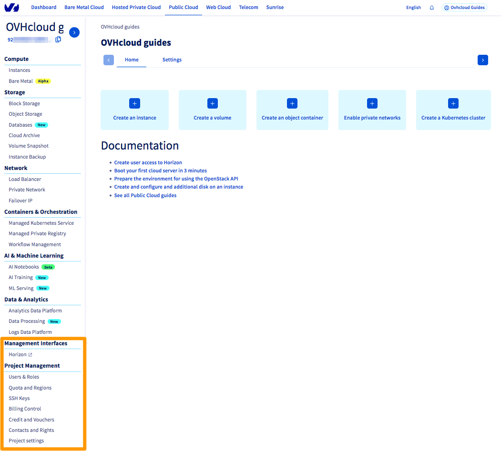

> [!primary]
> Diese Übersetzung wurde durch unseren Partner SYSTRAN automatisch erstellt. In manchen Fällen können ungenaue Formulierungen verwendet worden sein, z.B. bei der Beschriftung von Schaltflächen oder technischen Details. Bitte ziehen Sie im Zweifelsfall die englische oder französische Fassung der Anleitung zu Rate. Möchten Sie mithelfen, diese Übersetzung zu verbessern? Dann nutzen Sie dazu bitte den Button "Beitragen" auf dieser Seite.
>

**Letzte Aktualisierung am 06.12.2021**

## Ziel

Sie haben gerade Ihr Public Cloud Projekt erstellt und möchten mehr über das Benutzerinterface im OVHcloud Kundencenter erfahren.

**Diese Anleitung erklärt die wichtigsten Bereiche des Public Cloud Interface im OVHcloud Kundencenter.**

## Voraussetzungen

- Sie haben Zugriff auf Ihr [OVHcloud Kundencenter](https://www.ovh.com/auth/?action=gotomanager&from=https://www.ovh.de/&ovhSubsidiary=de).
- Sie haben ein erstes [Public Cloud Projekt](/pages/public_cloud/compute/create_a_public_cloud_project) erstellt.

## In der praktischen Anwendung

Sobald Ihr erstes Public Cloud Projekt erstellt wurde, werden Sie zum primären Public Cloud Interface weitergeleitet.

{.thumbnail}

### Zugriff auf Ihre OVHcloud Account-Informationen

Die Einstellungen Ihres OVHcloud Accounts bleiben jederzeit verfügbar, ebenso wie Benachrichtigungen oder die Spracheinstellung im Kundencenter.

{.thumbnail}

### Ihr Public Cloud Projekt

Da es möglich ist, mehrere Projekte (je nach Ihren Quotas) zu verwenden, werden Projektname und -ID links angezeigt. Somit ist stets ersichtlich, welches Projekt bearbeitet wird.

{.thumbnail}

Die Projekt-ID kann bei der Verwendung der CLI, manchen Support-Anfragen oder bei anderen Anfragen erforderlich sein. Sie können sie kopieren, indem Sie rechts auf das Icon klicken.

Sie können den Projektnamen im Tab `Einstellungen`{.action} bearbeiten. Geben Sie einen neuen Namen ein und klicken Sie auf `Update`{.action}.

{.thumbnail}

### Das Public Cloud Hauptmenü

{.thumbnail}

|Abschnitt|Beschreibung der Optionen|
|---|---|
|**Compute**|In diesem Bereich können Sie Instanzen erzeugen; diese Cloud Server sind *on demand* verfügbar.|
|**Storage**|In diesem Abschnitt finden Sie verschiedene Storage- und Datenbanklösungen, die jeweils einem bestimmten Bedarf und einer bestimmten Nutzung entsprechen.|
|**Network**|In diesem Abschnitt können Sie Ihre Public Cloud Ressourcen untereinander oder mit anderen OVHcloud Diensten vernetzen.|
|**Container and Orchestration**|Diese Rubrik bietet Ihnen verschiedene Tools zur Automatisierung Ihrer Architekturen und zur Erhöhung der Flexibilität.|
|**AI & Machine Learning**|In diesem Abschnitt finden Sie OVHcloud Tools für künstliche Intelligenz.|
|**Data & Analytics**|Diese Dienste unterstützen Sie bei der Lösung von Big Data und Data Analytics Problemen.|

### Shortcuts

Im Hauptsegment finden Sie Direktlinks zum schnellen Zugriff auf die Konfigurationsassistenten und relevante Anleitungen.

{.thumbnail}

#### Assistent zur Erstellung von Ressourcen

Für jede Ressource, die Sie im Kundencenter erstellen, wird Ihnen ein Konfigurationsassistent zur Verfügung gestellt, mit dem Sie die Ressource nach Ihren Bedürfnissen einrichten können.
 Die Einrichtungsschritte umfassen meistens den Standort der Ressource, das Modell, einige individuelle Parameter und in manchen Fällen den Abrechnungsmodus auswählen.

{.thumbnail}

### Die Verwaltungswerkzeuge

In Ihrem Public Cloud Projekt sind mehrere Management-Tools verfügbar, die sich im unteren Bereich der linken Menüleiste befinden.

{.thumbnail}

|Menüeintrag|Beschreibung|
|---|---|
|**Horizon**|Dies ist die unveränderte [grafische Oberfläche](/pages/public_cloud/compute/introducing_horizon), die für Openstack verfügbar ist. Benutzer, die mit diesem Interface vertraut sind, können es wie gewohnt verwenden.|
|**Users & Roles**|Ermöglicht die [Erstellung von Benutzern](/pages/public_cloud/compute/create_and_delete_a_user) und deren Berechtigungen. Diese Benutzer können direkt auf die APIs oder das Horizon-Interface zugreifen. Sie können zum Beispiel einen Benutzer für Ihre klassischen Wartungsarbeiten und einen Benutzer für Automatisierungswerkzeuge wie Terraform erstellen.|
|**Quota & Regions**|Dieses Tool erlaubt es Ihnen, die Standorte und die Begrenzungen der für Ihr Projekt verfügbaren Ressourcen zu steuern.  **Quota**: Unser System setzt nach bestimmten Kriterien (Anzahl bereits bezahlter Rechnungen, Verwendung anderer OVHcloud Produkte) Quotas (Limitierungen) für die Neuerstellung von Ressourcen ein, um Probleme mit Zahlungsausfällen zu vermeiden. Im Normalfall erhöht das System Ihre Quotas automatisch, wenn bestimmte Kriterien erfüllt werden. Hier können Sie beantragen, [eine Quota manuell zu erhöhen](/pages/public_cloud/compute/increasing_public_cloud_quota#manuelle-erhohung-der-ressourcenquote).  **Die Standorte**: Die Public Cloud ist an mehreren Standorten weltweit verfügbar. Darüber hinaus kann jeder Standort mehrere "Regionen" (OpenStack-spezifisches Konzept) umfassen. Für einen europäischen Kunden beispielsweise ist die APAC-Zone (Asien-Pazifik) standardmäßig deaktiviert. Bei Bedarf können Sie über dieses Menü neue Regionen aktivieren.|
|**SSH Keys**|Ein Werkzeug, mit dem Sie Ihre [SSH-Schlüssel](/pages/public_cloud/compute/public-cloud-first-steps#schritt-1-ssh-schlussel-erstellen) zentral verwalten können.|
|**Billing Control**|Public Cloud funktioniert nach dem Prinzip *pay as you go*, wobei die Rechnungen am Ende des Monats ausgestellt werden. In [diesem Menü](/pages/public_cloud/compute/analyze_billing) können Sie Ihren aktuellen Verbrauch einsehen, eine Prognose für die nächste Rechnung einsehen und natürlich Ihre vorherigen Rechnungen einsehen.|
|**Credit and Vouchers**|Dieses Menü erlaubt es Ihnen, den Verbrauch eines Coupons einzusehen, einen Coupon hinzuzufügen oder Guthaben direkt zu Ihrem Public Cloud Projekt [hinzuzufügen](/pages/account_and_service_management/managing_billing_payments_and_services/add_cloud_credit_to_project).|
|**Contacts and Rights**|Neben der Möglichkeit, den technischen Kontakt oder den Rechnungskontakt Ihres Projekts zu ändern, können Sie weitere [Kontakte (OVHcloud Kunden-Account) hinzufügen](/pages/public_cloud/compute/change_project_contacts), um Ihr Projekt technisch zu verwalten. Sie können auch Benutzer mit Berechtigung *read-only* hinzufügen.|
|**Project settings**|Dieses Tool erlaubt es Ihnen, die allgemeinen Einstellungen des Projekts wie den Namen, die Konfiguration als "Standardprojekt Ihres Accounts" sowie HDS-Kompatibilität zu konfigurieren oder Ihr [Public Cloud Projekt zu entfernen](/pages/public_cloud/compute/delete_a_project).|

## Weiterführende Informationen

[Erste Public Cloud Instanz erstellen und auf dieser einloggen](/pages/public_cloud/compute/public-cloud-first-steps)

Wenn Sie Schulungen oder technische Unterstützung bei der Implementierung unserer Lösungen benötigen, wenden Sie sich an Ihren Vertriebsmitarbeiter oder klicken Sie auf [diesen Link](https://www.ovhcloud.com/de/professional-services/), um einen Kostenvoranschlag zu erhalten und eine persönliche Analyse Ihres Projekts durch unsere Experten des Professional Services Teams anzufordern.

Für den Austausch mit unserer User Community gehen Sie auf <https://community.ovh.com/en/>.
