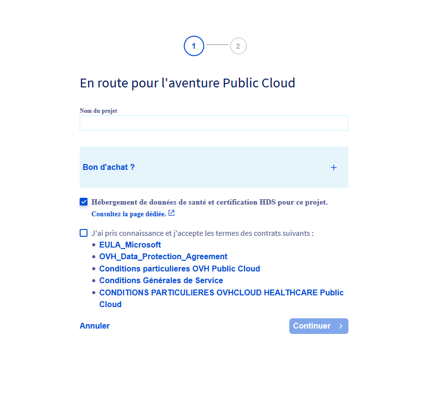
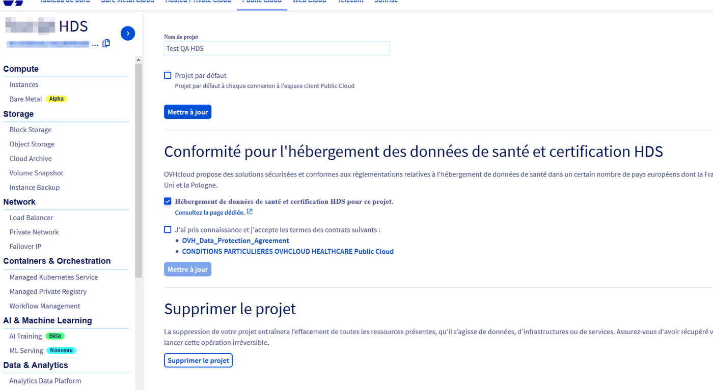

## Objective

To make your Public Cloud infrastructure and platforms compliant with [healthcare data hosting](https://www.ovhcloud.com/es/enterprise/certification-conformity/hds/) in France, they must necessarily be certified as a healthcare data hosting provider (HDS).

OVHcloud Public Cloud services are HDS certified for certain activities listed in the [certification reference](https://esante.gouv.fr/labels-certifications/hds/certification-des-hebergeurs-de-donnees-de-sante){.external} of the French Digital Health Agency.

The list of certified OVHcloud products is available on the page “[OVHcloud products HDS certification](/pages/account_and_service_management/account_information/hds_certification)”.

**Find out how to enable the option for hosting healthcare data on your Public Cloud project**

## Requirements

- You must be logged in to your [OVHcloud Control Panel](/links/manager){.external}.
- You must have signed up to the [Business or Enterprise level of support](https://www.ovhcloud.com/es/support-levels/) for your OVHcloud account.

## Instructions

### Enabling the HDS option when creating a new Public Cloud project

In your [OVHcloud Control Panel](/links/manager), create a new Public Cloud project.

If you have subscribed to the Business or Enterprise support level, you can then tick the `Healthcare data hosting and HDS certification for this project` box.

You will then have access to the special conditions for hosting healthcare data. Check the information and tick the box next to it. Click `Continue`{.action} to finish creating your project. The services in this project will be HDS certified, in accordance with the contractual conditions.

{.thumbnail}

### Enabling the HDS option on an existing Public Cloud project

In your [OVHcloud Control Panel](/links/manager), select the Public Cloud project for which you would like the services to be HDS certified.

Click `Settings`{.action}. If you have subscribed to the Business or Enterprise support level, you can then tick the `Healthcare data hosting and HDS certification for this project` box.

You will then have access to the special conditions for hosting healthcare data.

Review the information and check the box for accepting the contracts. Finally, click `Update`{.action} to finalize the HDS certification process for your project, in accordance with the contractual conditions.

{.thumbnail}

## Go further

[Public Cloud documentation](/products/public-cloud-compute)

Join our [community of users](/links/community).