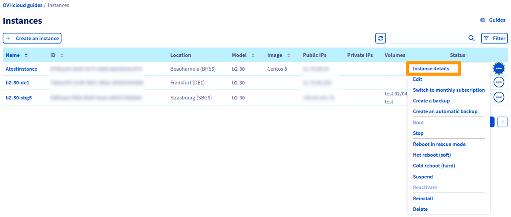
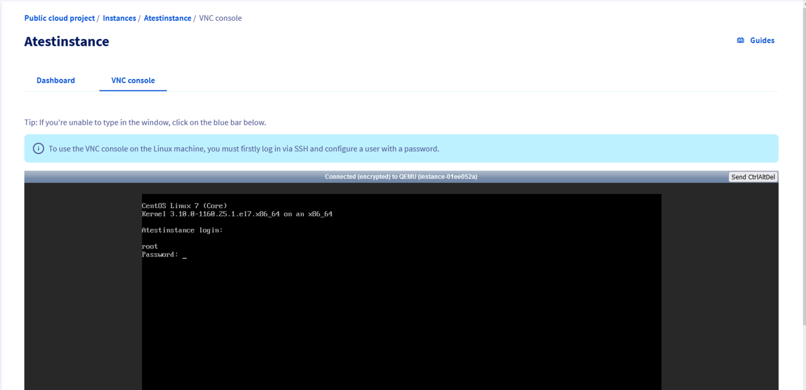
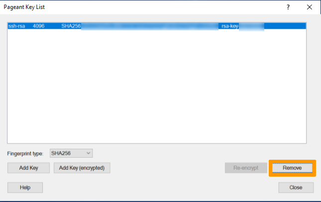

> [!primary]
> Questa traduzione è stata generata automaticamente dal nostro partner SYSTRAN. I contenuti potrebbero presentare imprecisioni, ad esempio la nomenclatura dei pulsanti o alcuni dettagli tecnici. In caso di dubbi consigliamo di fare riferimento alla versione inglese o francese della guida. Per aiutarci a migliorare questa traduzione, utilizza il pulsante "Contribuisci" di questa pagina.
>


## Obiettivo

Per eseguire alcune funzioni amministrative sul tuo server (ad esempio l'installazione di pacchetti), è necessario disporre di un elevato livello di accesso utente. Sui server Linux, questo accesso viene chiamato "root".

**Questa guida ti mostra come utilizzare root e creare una password per esso.**

## Prerequisiti

- Un'[istanza Public Cloud](/pages/public_cloud/compute/public-cloud-first-steps#step-3-crea-unistanza) nel tuo account OVHcloud
- Avere accesso allo [Spazio Cliente OVHcloud](https://www.ovh.com/auth/?action=gotomanager&from=https://www.ovh.it/&ovhSubsidiary=it)

## Procedura

### Impostare la password di root  <a name="settingtherootpassword"></a>

Per prima cosa accedi al server utilizzando una [connessione SSH](/pages/public_cloud/compute/public-cloud-first-steps#step-4-accedi-alla-tua-istanza) con il tuo utente predefinito.

Esegui il comando qui sotto e definisci una password per l’utente “root” (per motivi di sicurezza, la password non verrà mostrata):

```bash
~$ sudo passwd root
Enter new UNIX password:
Retype new UNIX password:
passwd: password updated successfully 
```

### Aggiorna il sistema (Debian/Ubuntu)

Per l’update dei pacchetti software installati sul server, utilizza questo comando:

```bash
~$ sudo apt update && sudo apt upgrade -y
```

### Aggiorna il sistema (CentOS e Fedora)

Per l’update del sistema operativo installato sul server, utilizza questo comando:

```bash
~$ sudo yum update
```

### Accedi come utente root

Per effettuare l’accesso come utente root, utilizza questo comando:

```bash
~$ sudo su -
~#
```

Quando richiesto, inserisci la password associata.


### Attiva la connessione root e l'autenticazione tramite password

#### Per le connessioni tramite la console VNC integrata nello Spazio cliente OVHcloud

Per prima cosa, [imposta la password di root](#settingtherootpassword).

In seguito, accedi alla console VNC:

Clicca sui `...`{.action} a destra dell’istanza e poi su `Dettagli dell'istanza`{.action}: 

{.thumbnail} 

Accedi alla sezione `Console VNC`{.action}. quando richiesto, inserisci il tuo nome di connessione come **root** e poi inserisci la tua password.

{.thumbnail} 

#### Per connessioni che utilizzano terminali Linux

Per prima cosa, [imposta la password di root](#settingtherootpassword).

In seguito, attiva l'autenticazione e la password di root nel tuo file **sshd_config**:

```bash
~$ sudo sed -i 's/#PermitRootLogin prohibit-password/PermitRootLogin yes/g' /etc/ssh/sshd_config

~$ sudo sed -i 's/PasswordAuthentication no/PasswordAuthentication yes/g' /etc/ssh/sshd_config
```

Riavvia il servizio SSH:

```bash
~$ service sshd restart
```

Una volta fatto questo, dovresti essere in grado di accedere al tuo server con l'utente root e la password impostata.

#### Per le connessioni che utilizzano Putty

Per prima cosa, [imposta la password di root](#settingtherootpassword).

In seguito, attiva l'autenticazione e la password di root nel tuo file **sshd_config**:

```bash
~$ sudo sed -i 's/#PermitRootLogin prohibit-password/PermitRootLogin yes/g' /etc/ssh/sshd_config

~$ sudo sed -i 's/PasswordAuthentication no/PasswordAuthentication yes/g' /etc/ssh/sshd_config
```

Riavvia il servizio SSH:

```bash
~$ service sshd restart
```

Nella lista delle chiavi del concorso Putty (*pageant key list*) è possibile eliminare la chiave SSH privata.

{.thumbnail}

Una volta fatto questo, dovresti essere in grado di accedere al tuo server con l'utente root e la password impostata.

## Per saperne di più

Se avete bisogno di formazione o di assistenza tecnica per implementare le nostre soluzioni, contattate il vostro rappresentante o cliccate su [questo link](https://www.ovhcloud.com/it/professional-services/) per ottenere un preventivo e richiedere un'analisi personalizzata del vostro progetto da parte dei nostri esperti del team Professional Services.

Contatta la nostra Community di utenti all’indirizzo <https://community.ovh.com/en/>.