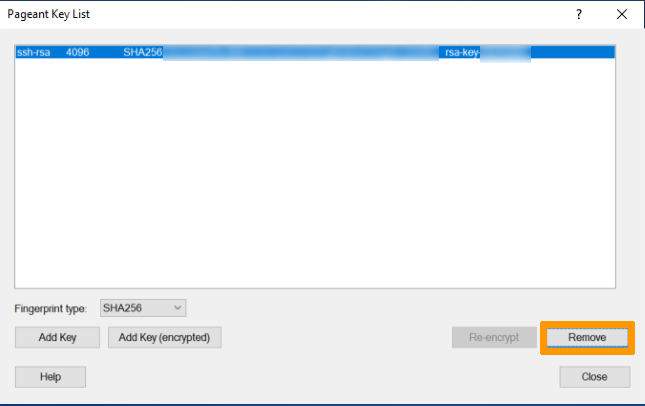

> [!primary]
> Tłumaczenie zostało wygenerowane automatycznie przez system naszego partnera SYSTRAN. W niektórych przypadkach mogą wystąpić nieprecyzyjne sformułowania, na przykład w tłumaczeniu nazw przycisków lub szczegółów technicznych. W przypadku jakichkolwiek wątpliwości zalecamy zapoznanie się z angielską/francuską wersją przewodnika. Jeśli chcesz przyczynić się do ulepszenia tłumaczenia, kliknij przycisk "Zgłóś propozycję modyfikacji" na tej stronie.
>

## Wprowadzenie

Aby wykonywać niektóre działania administracyjne na Twoim serwerze (np. instalacja pakietów), powinieneś posiadać dostęp z uprawnieniami administracyjnymi. W przypadku serwerów Linux poziom ten nazywany jest "root".

**Dowiedz się, jak się zalogować jako użytkownik root i ustawić dla niego hasło.**

## Wymagania początkowe

- [Instancja Public Cloud](/pages/public_cloud/compute/public-cloud-first-steps#krok-3-tworzenie-instancji) na Twoim koncie OVHcloud
- Dostęp do [Panelu client OVHcloud](/links/manager)

## W praktyce

### Ustawianie hasła root <a name="settingtherootpassword"></a>

Po pierwsze nawiąż [połączenie SSH](/pages/public_cloud/compute/public-cloud-first-steps#krok-4-polaczenie-z-instancja) z serwerem przy użyciu domyślnego użytkownika.

W wierszu polecenia ustaw hasło dla użytkownika "root" (ze względów bezpieczeństwa hasło to nie będzie się wyświetlało podczas jego wprowadzania):

```bash
~$ sudo passwd root
Enter new UNIX password:
Retype new UNIX password:
passwd: password updated successfully 
```

### Aktualizacja systemu (Debian i Ubuntu)

Aby zaktualizować _pakiety_ oprogramowania zainstalowane na Twoim serwerze, wprowadź następującą komendę: 

```bash
~$ sudo apt update && sudo apt upgrade -y
```

### Aktualizacja systemu (CentOS i Fedora)

Aby zaktualizować system operacyjny Twojego serwera, wprowadź następującą komendę:

```bash
~$ sudo yum update
```

### Logowanie jako użytkownik root

Aby zalogować się jako użytkownik root, wprowadź następującą komendę:

```bash
~$ sudo su -
~#
```

Następnie wprowadź hasło root.

### Włącz uwierzytelnianie loginu root i hasła

#### Dla połączeń przez wbudowaną konsolę VNC w Panelu klienta OVHcloud

Najpierw [ustaw hasło root](#settingtherootpassword).

Następnie przejdź do konsoli VNC:

Kliknij `...`{.action} po prawej stronie swojej instancji, a następnie wybierz opcję `Informacje o instancji`{.action}. 

{.thumbnail} 

Przejdź do karty `Konsola VNC`{.action}. W wierszu polecenia wpisz login jako **root**, a następnie wprowadź hasło.

{.thumbnail} 

#### Dla połączeń przy użyciu terminali Linux

Najpierw [ustaw hasło root](#settingtherootpassword).

Następnie włącz uwierzytelnianie loginu root i hasła w pliku **sshd_config**:

```bash
~$ sudo sed -i 's/#PermitRootLogin prohibit-password/PermitRootLogin yes/g' /etc/ssh/sshd_config

~$ sudo sed -i 's/PasswordAuthentication no/PasswordAuthentication yes/g' /etc/ssh/sshd_config
```

Zrestartuj usługę SSH:

```bash
~$ service sshd restart
```

Po zakończeniu operacji będziesz miał dostęp do serwera z ustawionym użytkownikiem root i hasłem.

#### Dla połączeń przy użyciu programu Putty

Najpierw [ustaw hasło root](#settingtherootpassword).

Następnie włącz uwierzytelnianie loginu root i hasła w pliku **sshd_config**:

```bash
~$ sudo sed -i 's/#PermitRootLogin prohibit-password/PermitRootLogin yes/g' /etc/ssh/sshd_config

~$ sudo sed -i 's/PasswordAuthentication no/PasswordAuthentication yes/g' /etc/ssh/sshd_config
```

Zrestartuj usługę SSH:

```bash
~$ service sshd restart
```

Na liście Putty authentication agent (*pageant key list*) usuń swój prywatny klucz SSH.

{.thumbnail}

Po zakończeniu operacji będziesz miał dostęp do serwera z ustawionym użytkownikiem root i hasłem.

## Sprawdź również

Jeśli potrzebujesz szkolenia lub pomocy technicznej w celu wdrożenia naszych rozwiązań, skontaktuj się z przedstawicielem handlowym lub kliknij [ten link](/links/professional-services), aby uzyskać wycenę i poprosić o spersonalizowaną analizę projektu od naszych ekspertów z zespołu Professional Services.

Przyłącz się do społeczności naszych użytkowników na stronie <https://community.ovh.com/en/>.
