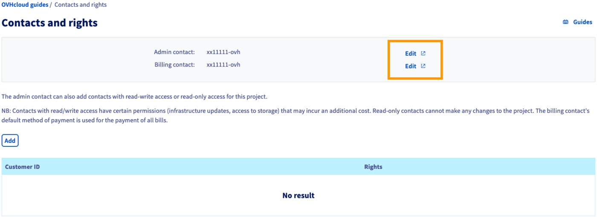
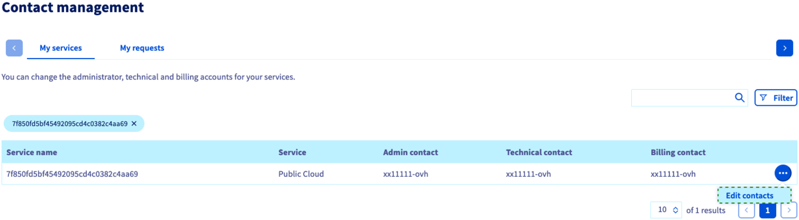

## Objective

You can change the contacts for project administration and billing of a Public Cloud project in the OVHcloud Control Panel. 
Modifying these contacts enables you to separate the technical management of services within a project from the project's billing.

**This guide explains how to change the contacts of a Public Cloud project in the OVHcloud Control Panel.**

## Requirements

- A [Public Cloud project](https://www.ovhcloud.com/en-ie/public-cloud/) in your OVHcloud account
- Access to the [OVHcloud Control Panel](https://www.ovh.com/auth/?action=gotomanager&from=https://www.ovh.ie/&ovhSubsidiary=ie)
- Admin and billing contacts in the same OVHcloud subsidiary

## Instructions

Log in to the [OVHcloud Control Panel](https://www.ovh.com/auth/?action=gotomanager&from=https://www.ovh.ie/&ovhSubsidiary=ie) and open your `Public Cloud`{.action} project. Click on `Contacts and Rights`{.action} in the **Project Management** section.

On this page you can see the administrative and billing contacts associated with your project.

{.thumbnail}

Click on one of the `Edit`{.action} buttons to modify the current contacts. This will open the **Contact management** section of your Control Panel.

The contacts of your Public Cloud project are displayed in the table. Click on the `...`{.action} button and then on `Edit contacts`{.action}.

{.thumbnail}

In the new window, enter the desired NIC handle for each contact you wish to change. Bear in mind that the OVHcloud accounts for `Admin` and `Billing` contacts have to be registered in the same OVHcloud subsidiary.

{.thumbnail}

Once you have clicked `Confirm`{.action}, both OVHcloud accounts affected by the change will receive a confirmation email. This email contains a token with which the contact change can be accepted in the tab `My requests`{.action} of the **Contact management** section.

For a more detailed explanation of this process, please consult our guide [Managing contacts for your services](/pages/account_and_service_management/account_information/managing_contacts).

## Go further

[Information regarding Public Cloud billing options](/pages/public_cloud/compute/analyze_billing)

[Managing contacts for your services](/pages/account_and_service_management/account_information/managing_contacts)

[Delegating projects](/pages/public_cloud/compute/delegate_projects)

Join our community of users on <https://community.ovh.com/en/>.