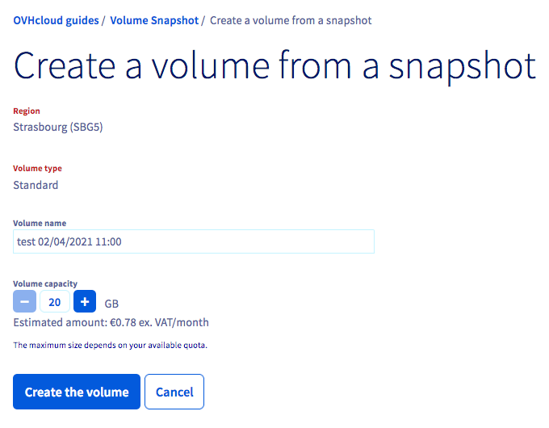
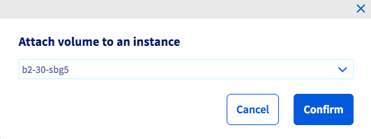

## Objective

You can attach additional disks to your Public Cloud instances based on previously created volume snapshots.

This may be useful in the following cases:

- If you want to restore additional disk data.
- If you want to have a highly available, high-performance storage space with your data.
- If you want to move your data to another instance.

**This guide explains how to create and configure an additional disk on one of your instances from an additional disk backup.**

## Requirements

- Access to the [OVHcloud Control Panel](https://www.ovh.com/auth/?action=gotomanager&from=https://www.ovh.co.uk/&ovhSubsidiary=GB)
- A [Public Cloud instance](https://www.ovhcloud.com/en-gb/public-cloud/){.external} in your OVHcloud account
- A volume snapshot in the same OpenStack region
- Administrative access (root) to your instance via SSH or RDP

## Instructions

### Creating the disk from a backup

Log in to [the OVHcloud Control Panel](https://www.ovh.com/auth/?action=gotomanager&from=https://www.ovh.co.uk/&ovhSubsidiary=GB) and open your `Public Cloud`{.action} project. Then click `Volume Snapshot`{.action} in the left-hand navigation bar under `Storage`.

To the right of the backup you want to create a volume from, click the `...`{.action} button, then `Create a volume`{.action}.

{.thumbnail}

Then enter the name and capacity of the new disk, and click `Create the volume`{.action}.

{.thumbnail}

It may take a few minutes to create the disk, depending on its size.

### Attaching the disk to an instance

Once the disk has been created, you can choose to attach it to an instance. To do this, click `Block Storage`{.action} in the left-hand navigation bar under `Storage`.

To the right of the volume of your choice, click on the `...`{.action} button, then `Attach to instance`{.action}.

{.thumbnail}

Now select the instance and click `Confirm`{.action} to attach the disk.

{.thumbnail}

The process of attaching the disk to your instance will then begin, and this may take a few minutes.

{.thumbnail}

> [!warning]
Make sure to not leave the current page in your OVHcloud Control Panel while the disk is being attached. This may interrupt the process.
>

Once the attachment is complete, you can follow these steps on how to configure the additional disk [using Linux](/pages/public_cloud/compute/create_and_configure_an_additional_disk_on_an_instance#using-linux) or [using Windows](/pages/public_cloud/compute/create_and_configure_an_additional_disk_on_an_instance#using-windows).

## Go further

Join our community of users on <https://community.ovh.com/en/>.
