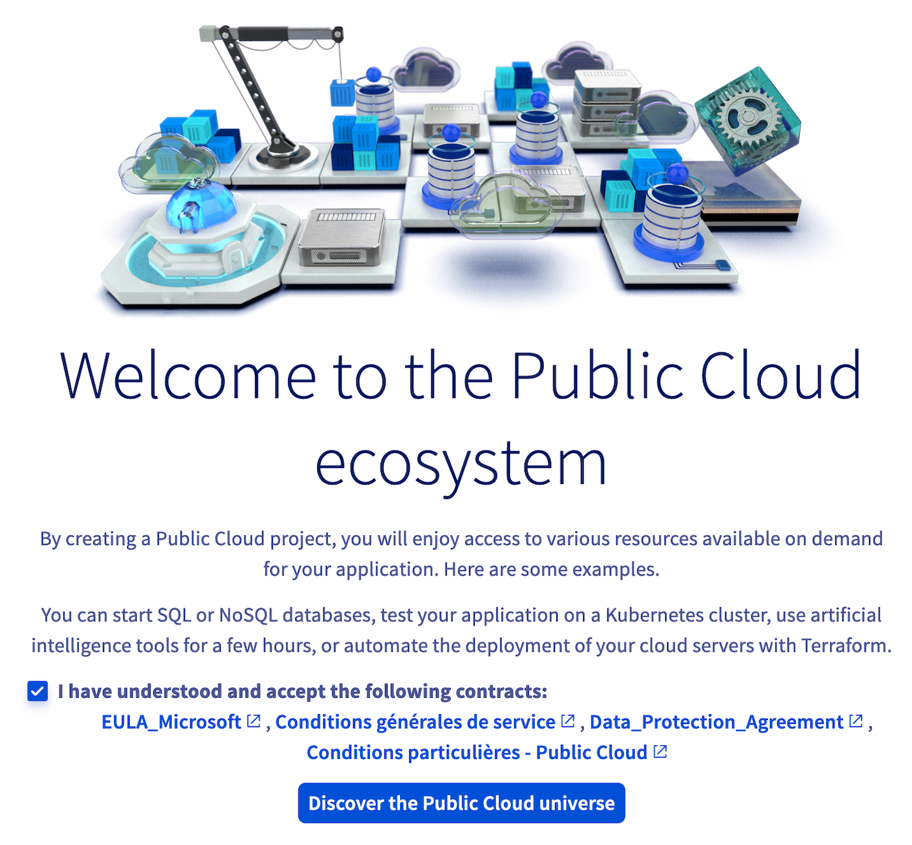
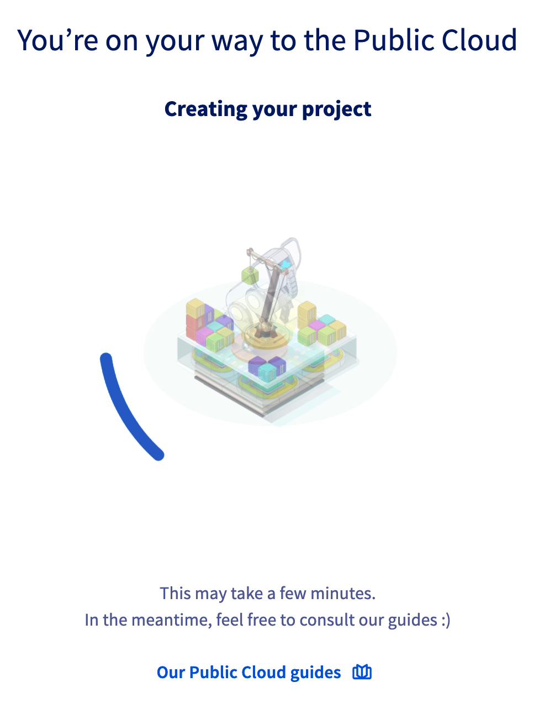
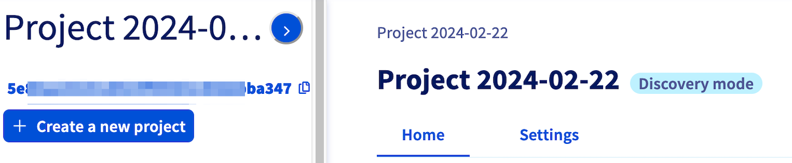

> [!primary]
> Diese Übersetzung wurde durch unseren Partner SYSTRAN automatisch erstellt. In manchen Fällen können ungenaue Formulierungen verwendet worden sein, z.B. bei der Beschriftung von Schaltflächen oder technischen Details. Bitte ziehen Sie im Zweifelsfall die englische oder französische Fassung der Anleitung zu Rate. Möchten Sie mithelfen, diese Übersetzung zu verbessern? Dann nutzen Sie dazu bitte den Button "Beitragen" auf dieser Seite.
>

## Ziel

Das Erstellen eines Projekts ist die Voraussetzung, um [Public Cloud Instanzen](https://www.ovhcloud.com/de/public-cloud/) verwenden zu können.

**Diese Anleitung erklärt die Schritte zur Erstellung Ihres ersten Public Cloud Projekts.**

## Voraussetzungen

- Sie haben Zugriff auf Ihr [OVHcloud Kundencenter](/links/manager).

## In der praktischen Anwendung

Loggen Sie sich in Ihrem [OVHcloud Kundencenter](/links/manager) ein. Klicken Sie oben auf der Seite auf `Public Cloud`{.action}.

Nachdem Sie die Vertragsbedingungen gelesen haben, bestätigen Sie diese, indem Sie das entsprechende Kästchen ankreuzen und auf `Das Public-Cloud-Universun entdecken`{.action} klicken.

{.thumbnail width="400"}

- Wenn Sie noch kein gültiges Zahlungsmittel in Ihrem OVHcloud Account haben, beginnt direkt der Erstellungsprozess des Public Cloud Projekts. Ihr Projekt wird dann zunächst im [Discovery-Modus](#discovery) erstellt.
- Wenn Sie bereits eine Zahlungsart in Ihrem OVHcloud Account hinterlegt haben, können Sie Ihr Public Cloud Projekt benennen und dann Ihre Zahlungsart auswählen.

{.thumbnail width="400"}

Sobald der Erstellungsprozess abgeschlossen ist, wird Ihr neues Public Cloud Projekt oben links im Bereich `Public Cloud`{.action} Ihres OVHcloud Kundencenters angezeigt:

{.thumbnail width="400"}

Sie haben ab sofort Zugriff auf das gesamte OVHcloud Public Cloud Ökosystem. Entdecken Sie dieses neue Interface in Ihrem Kundencenter in unserer Anleitung "[Einführung in das Public Cloud Interface](/pages/public_cloud/compute/03-public-cloud-interface-walk-me)".

> [!primary]
> **Discovery-Modus**
>
> Wenn es sich um Ihr erstes Public Cloud Projekt handelt und Sie keine Zahlungsart in Ihrem Account angegeben haben, ist Ihr Public Cloud Projekt auf den Discovery-Modus des OVHcloud Kundencenters beschränkt. Das bedeutet, dass Sie die Public Cloud Produkte durchsuchen und entdecken können, aber noch keine Ressourcen wie etwa Instanzen erstellen können.
>
> Um das volle Potenzial der Public Cloud auszuschöpfen und Ihre ersten Ressourcen zu verwenden, klicken Sie auf der Startseite Ihres Projekts auf `Projekt aktivieren`{.action}.
>
>{.thumbnail width="400"}

## Weiterführende Informationen

- [Erste Public Cloud Instanz erstellen und auf dieser einloggen](/pages/public_cloud/compute/public-cloud-first-steps)
- [Kontakte eines Projekts ändern](/pages/public_cloud/compute/change_project_contacts)
- [Projekte delegieren](/pages/public_cloud/compute/delegate_projects)
- [Ein Public Cloud Projekt löschen](/pages/public_cloud/compute/delete_a_project)
- [Informationen zu den Abrechnungsoptionen der Public Cloud](/pages/public_cloud/compute/analyze_billing)

Wenn Sie Schulungen oder technische Unterstützung bei der Implementierung unserer Lösungen benötigen, wenden Sie sich an Ihren Vertriebsmitarbeiter oder klicken Sie auf [diesen Link](/links/professional-services), um einen Kostenvoranschlag zu erhalten und eine persönliche Analyse Ihres Projekts durch unsere Experten des Professional Services Teams anzufordern.

Für den Austausch mit unserer User Community gehen Sie auf <https://community.ovh.com/en/>.
