<style>
details>summary {
    color:rgb(33, 153, 232) !important;
    cursor: pointer;
}
details>summary::before {
    content:'\25B6';
    padding-right:1ch;
}
details[open]>summary::before {
    content:'\25BC';
}
</style>

## Wprowadzenie

Możesz utworzyć dodatkowe dyski dla instancji Public Cloud.
Może to być przydatne w następujących przypadkach:

- Jeśli chcesz zwiększyć przestrzeń dyskową bez konieczności zmiany szablonu instancji.
- Jeśli chcesz dysponować przestrzenią dyskową o wysokiej dostępności i wysokiej wydajności.
- Jeśli chcesz przenieść przestrzeń dyskową i dane do innej instancji.
- Jeśli chcesz przygotować środowisko do korzystania z [Terraform](/pages/public_cloud/public_cloud_cross_functional/how_to_use_terraform).

**Dowiedz się, jak utworzyć dodatkowy dysk i skonfigurować go na Twojej instancji.**

## Wymagania początkowe

- Posiadanie instancji [Public Cloud](/pages/public_cloud/compute/public-cloud-first-steps) na koncie OVHcloud
- Dostęp administratora (sudo) do Twojej instancji przez SSH (Linux) lub RDP (Windows)

<!-- CP-NAV-START:publiccloud-projects -->
---
### Dostęp do Panelu klienta OVHcloud
- **Link bezpośredni:** [Public Cloud Projects](/links/control-panel/publiccloud-projects)
- **Ścieżka nawigacji:** `Public Cloud`{.action} > Wybierz projekt
---
<!-- CP-NAV-END:publiccloud-projects -->

> [!warning]
>
> Ta funkcja nie jest aktualnie dostępna dla instancji Metal.
>

## W praktyce

### Rodzaje wolumenów

OVHcloud oferuje trzy rodzaje wolumenów Block Storage, z których każdy jest dostosowany do specyficznych potrzeb w zakresie wydajności, pojemności i kosztów. Rozwiązania te przypisują trwałe wolumeny przestrzeni dyskowej do Twoich instancji z wysokim poziomem niezawodności i dostępności. Jeśli ta funkcja jest dostępna, szyfrowanie można włączyć podczas tworzenia woluminu dla wszystkich typów woluminów z wyjątkiem woluminów typu Classic Multi-Attach w regionach 3AZ.

/// details | **Classic - 500 IOPS gwarantowanych**

Wolumen Classic to niezawodne i ekonomiczne rozwiązanie do przechowywania danych, idealne do obsługi obciążeń o umiarkowanej wydajności. Oferuje 500 gwarantowanych IOPS, dzięki czemu nadaje się do następujących zastosowań:

- Hosting klasycznych aplikacji www
- Małe i średnie przechowywanie baz danych
- Archiwizacja i kopie zapasowe danych

W regionach 3AZ woluminy Classic są usługami regionalnymi, które korzystają z Erasure Coding rozproszonego między kilkoma strefami dostępności. Dzięki temu zyskujesz gwarancję dostępności danych bez wpływu na strefę i bez przerw w jej działaniu, pod warunkiem, że spełnione są wymagania odpornej architektury z możliwością wielokrotnego przyłączenia. Zapoznaj się z przewodnikiem "[Prawidłowe użycie i ograniczenia pamięci masowej Classic Multi-Attach w regionach 3AZ](/pages/public_cloud/compute/classic_block_multi_az_limitations)".

///

/// details | **High Speed Gen2 – 30 IOPS/GB i do 20 000 IOPS**

Wolumeny High Speed drugiej generacji są zoptymalizowane pod kątem najbardziej wymagających obciążeń. Wydajność skaluje się wraz z rozmiarem wolumenu:

- **IOPS**: 30 IOPS/GB (bazowo 3 000 IOPS dla 10–100 GB, do 20 000 IOPS)
- **Przepustowość**: 0,5 MB/s/GB (bazowo 50 MB/s dla 10–100 GB, do 512 MB/s)
- **Maksymalny rozmiar**: 12 TB

Ten typ wolumenu jest zalecany do następujących zastosowań:

- Big Data i analizy w czasie rzeczywistym
- Sztuczna inteligencja i Machine Learning
- Przetwarzanie dużych baz danych i przestrzeń dyskowa o wysokiej wydajności

///

> [!primary]
>
> **Nie można już zamawiać wolumenów High Speed (Gen1) za pośrednictwem Panelu klienta OVHcloud.** Zostały one zastąpione przez wolumeny High Speed Gen2 w tej samej cenie, oferujące lepszą wydajność dla wolumenów powyżej 100 GB. Wolumeny High Speed pozostają dostępne za pośrednictwem API, Terraform oraz OpenStack.
>
> Istniejące wolumeny High Speed są nadal obsługiwane. Możesz również [zmienić typ wolumenu Block Storage](/pages/public_cloud/compute/switch_volume_type), aby przeprowadzić ich migrację do Gen2.
>

{.thumbnail}

> [!primary]
>
> Każdy typ woluminu jest również dostępny w wersji zaszyfrowanej (**LUKS**). Wolumeny te zapewniają poufność danych bez wpływu na wydajność. Są one dostępne w Panelu klienta OVHcloud, jak również z narzędziami przedstawionymi w następnej sekcji, wskazując typ:`<volume_type>-luks`.
>

### Przypisz nowy wolumen

> [!tabs]
> **W Panelu klienta OVHcloud**
>>
>> Otwórz `Block Storage`{.action} w menu po lewej stronie, pod **Storage i backup**.
>>
>> Kliknij `Utwórz wolumen`{.action}.
>>
>> 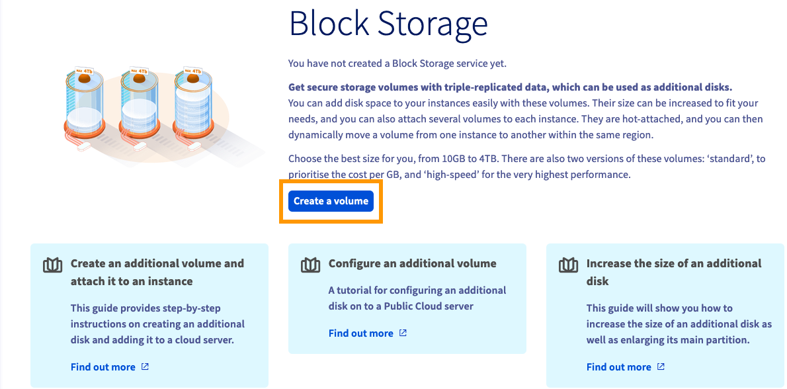{.thumbnail}
>>
>> Wybierz lokalizację, typ, szyfrowanie, pojemność oraz nazwę. Kliknij `Utwórz wolumen`{.action}.
>>
>> > [!warning]
>> >
>> > Uwaga: Wolumen musi być utworzony w tym samym regionie, co instancja, do której ma zostać przypisany. Jeśli utworzysz go w innym regionie, możesz go usunąć i odtworzyć w odpowiednim regionie.
>> >
>>
>> 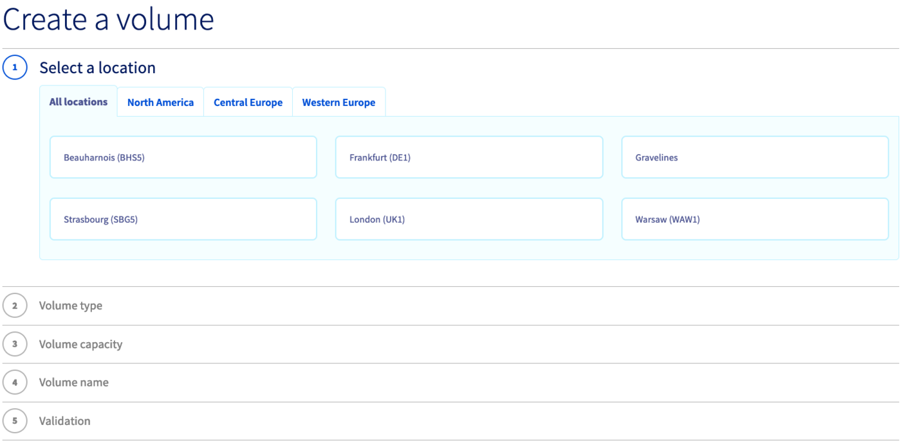{.thumbnail}
>>
>> Dysk pojawi się w Panelu klienta.
>>
>> 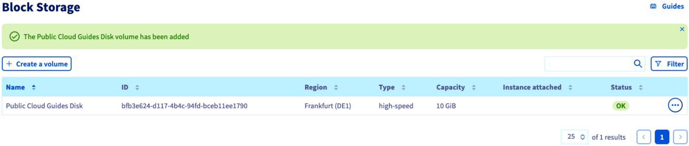{.thumbnail}
>>
>> Kliknij przycisk `...`{.action} obok wolumenu i wybierz `Przypisz do instancji`{.action}.
>>
>> 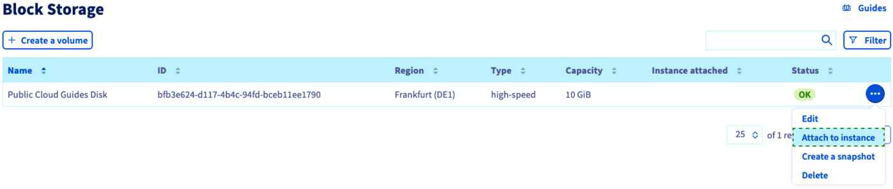{.thumbnail}
>>
>> Wybierz instancję i kliknij `Potwierdź`{.action}.
>>
>> 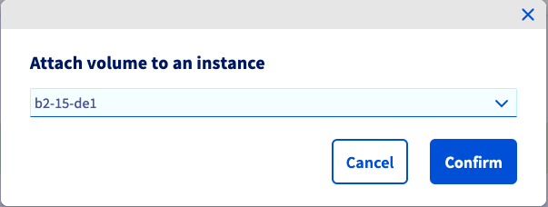{.thumbnail}
>>
>> Rozpocznie się proces przyłączania. Może to potrwać kilka minut.
>>
>> > [!warning]
>> > Nie opuszczaj bieżącej strony w Panelu klienta OVHcloud, gdy dysk jest podłączony. Mogłoby to spowodować przerwanie procesu.
>> >
>>
> **Przez Terraform**
>> > [!warning]
>> >
>> > Należy pamiętać, że typy woluminów `high-speed-gen2` i `luks` mogą nie być dostępne we wszystkich regionach.
>> >
>>
>> Typy woluminów:
>>
>> - Classic
>> - High-speed
>> - High-speed-gen2
>> - Classic-luks
>> - High-speed-luks
>> - High-speed-gen2-luks
>>
>> Typy kończące się na -luks są zaszyfrowane (LUKS).
>>
>> > [!warning]
>> >
>> > Utwórz wolumin **-luks** automatycznie generuje dedykowany klucz.
>> >
>> > Nie modyfikuj ani nie usuwaj tego klucza, jeśli jest on związany z wolumenem Block Storage. Dzięki temu dane znajdujące się na tym woluminie oraz wszystkie migawki będą definitywnie nieodwracalne.
>> >
>>
>> Aby utworzyć prosty wolumen Block Storage, potrzebujesz 3 elementów:
>>
>> - Nazwa wolumenu
>> - Region
>> - Rozmiar wolumenu w GB
>>
>> W naszym przykładzie utworzymy block storage w regionie **GRA11** o rozmiarze **10 GB**. Dodaj następujące linie w pliku o nazwie *simple_blockstorage.tf*:
>>
>> ```python
>> # Creation of a block storage volume
>> resource "openstack_blockstorage_volume_v3" "terraform_blockstorage" {
>>   name   = "terraform_blockstorage" # Name of the block storage volume
>>   size   = 10                       # Volume size
>>   region = "GRA11"                  # Region where the volume must be created
>>   volume_type = "volume_type"       # classic, high-speed, high-speed-gen2 or equivalent `-luks`
>> }
>> ```
>>
>> Następnie przypiszemy ją do instancji docelowej.
>>
>> > [!warning]
>> > Instancja i wolumin muszą znajdować się w tym samym regionie.
>> >
>>
>> Dodaj następujące wiersze poniżej poprzednich:
>>
>> ```python
>> # Attach the volume to the instance
>> resource "openstack_compute_volume_attach_v2" "volume_attach" {
>>   instance_id = "<your_instance_id>"
>>   volume_id   = openstack_blockstorage_volume_v3.terraform_volume.id
>> }
>> ```
>>
>> Utwórz i przypisz wolumen, uruchamiając:
>>
>> ```console
>> terraform apply
>> ```
>>
>> Wyjście powinno wyglądać tak:
>>
>> ```console
>> $ terraform apply
>> Terraform used the selected providers to generate the following execution plan. Resource actions are indicated with the following symbols:
>>   + create
>>
>> Terraform will perform the following actions:
>>
>>   # openstack_blockstorage_volume_v3.terraform_blockstorage will be created
>>   + resource "openstack_blockstorage_volume_v3" "terraform_blockstorage" {
>>       + attachment        = (known after apply)
>>       + availability_zone = (known after apply)
>>       + id                = (known after apply)
>>       + metadata          = (known after apply)
>>       + name              = "terraform_blockstorage"
>>       + region            = "GRA11"
>>       + size              = 10
>>       + volume_type       = "high-speed-gen2"
>>     }
>>
>>   # openstack_compute_volume_attach_v2.volume_attach will be created
>>   + resource "openstack_compute_volume_attach_v2" "volume_attach" {
>>       + device      = (known after apply)
>>       + id          = (known after apply)
>>       + instance_id = "11cc1279-xxxx-xxxx-xxxx-3ace4c954780"
>>       + region      = (known after apply)
>>       + volume_id   = (known after apply)
>>     }
>>
>> Plan: 2 to add, 0 to change, 0 to destroy.
>>
>> Do you want to perform these actions in workspace "test_terraform"?
>>   Terraform will perform the actions described above.
>>   Only 'yes' will be accepted to approve.
>>
>>   Enter a value: yes
>>
>> openstack_blockstorage_volume_v3.terraform_blockstorage: Creating...
>> openstack_blockstorage_volume_v3.terraform_blockstorage: Still creating... [10s elapsed]
>> openstack_blockstorage_volume_v3.terraform_blockstorage: Creation complete after 12s [id=daf3a86e-xxxx-xxxx-xxxx-ac7b6ffbb806]
>> openstack_compute_volume_attach_v2.volume_attach: Creating...
>> openstack_compute_volume_attach_v2.volume_attach: Still creating... [10s elapsed]
>> openstack_compute_volume_attach_v2.volume_attach: Creation complete after 14s [id=11cc1279-xxxx-xxxx-xxxx-3ace4c954780/daf3a86e-xxxx-xxxx-xxxx-ac7b6ffbb806]
>>
>> Apply complete! Resources: 2 added, 0 changed, 0 destroyed.
>> ```
>>
> **W interfejsie Horizon**
>> Przejdź do `Volumes`{.action} w menu rozwijanym, a następnie kliknij `Create Volume`{.action}.
>>
>> 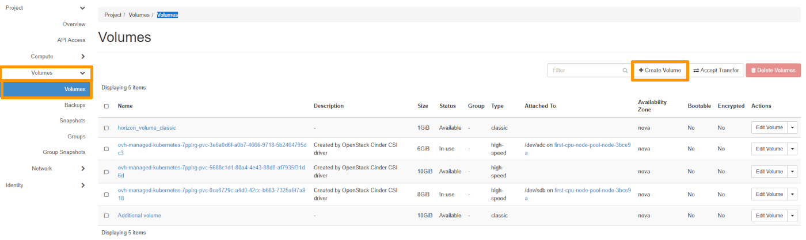{.thumbnail}
>>
>> Wprowadź nazwę wolumenu, wybierz typ, a następnie kliknij `Create Volume`{.action}.
>>
>> > [!warning]
>> >
>> > Pamiętaj, że jeśli typ woluminu `high-speed-gen2` lub `luks` nie pojawia się na liście, oznacza to, że nie jest dostępny w tym regionie.
>> >
>>
>> 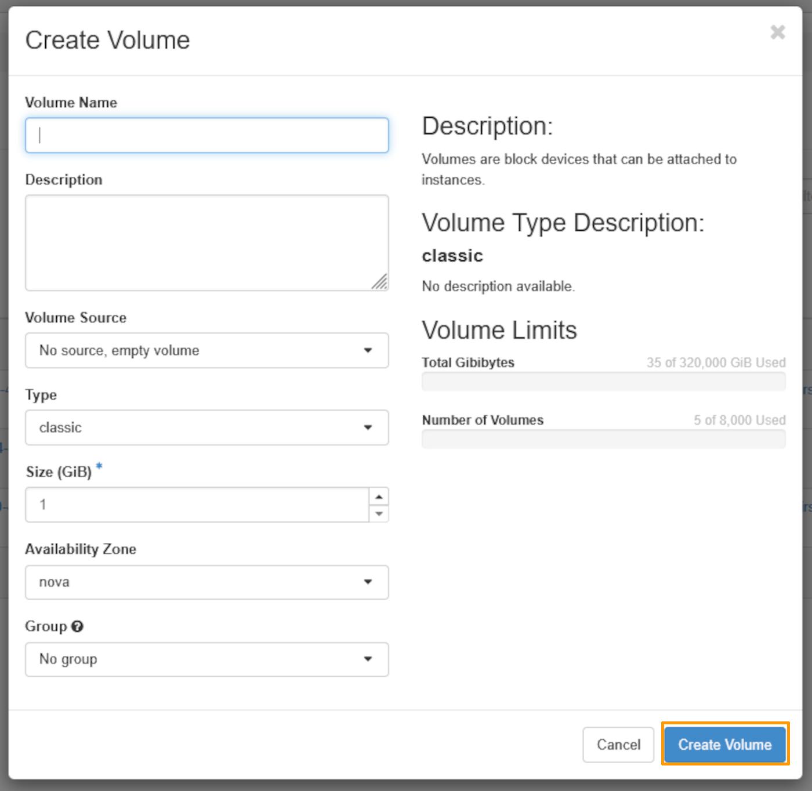{.thumbnail width="1000"}
>>
>> Kliknij ikonę strzałki na końcu wiersza `Edit Volume`, a następnie kliknij `Manage Attachments`{.action}.
>>
>> 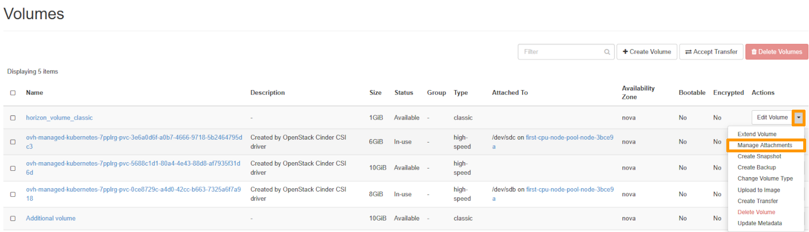{.thumbnail}
>>
>> Wybierz instancję i kliknij `Attach Volume`{.action}.
>>
>> 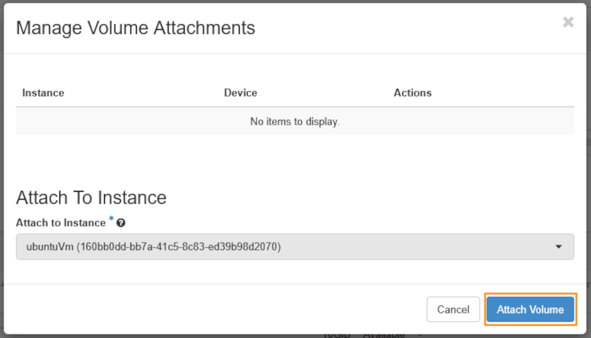{.thumbnail}
>>
> **Za pośrednictwem CLI OpenStack**
>> > [!warning]
>> >
>> > Pamiętaj, że jeśli typ woluminu `high-speed-gen2` lub `luks` nie pojawia się na liście, oznacza to, że nie jest dostępny w tym regionie.
>> >
>>
>> Typy woluminów:
>>
>> - Classic
>> - High-speed
>> - High-speed-gen2
>> - Classic-luks
>> - High-speed-luks
>> - High-speed-gen2-luks
>>
>> Typy kończące się na -luks są zaszyfrowane (LUKS).
>>
>> > [!warning]
>> >
>> > Utwórz wolumin **-luks** automatycznie generuje dedykowany klucz.
>> >
>> > Nie modyfikuj ani nie usuwaj tego klucza, jeśli jest on związany z wolumenem Block Storage. Dzięki temu dane znajdujące się na tym woluminie oraz wszystkie migawki będą definitywnie nieodwracalne.
>> >
>>
>> Wyświetl dostępne typy woluminów w regionie:
>>
>> ```bash
>> openstack volume type list
>> ```
>>
>> Utwórz wolumen, określając co najmniej rozmiar (w GB) i typ. Opcjonalnie dodaj nazwę.
>>
>> ```bash
>> openstack volume create --size 1 --type high-speed-gen2 volumeName # classic, high-speed, high-speed-gen2 or equivalent `-luks`
>> ```
>>
>> Aby przypisać wolumen do instancji dostępnej w regionie, użyj następującego polecenia:
>>
>> ```bash
>> openstack server add volume <server-id|server-name> <volume-id|volume-name>
>>
>> +-----------+-------------------------------------+
>> | Field | Value |
>> +-----------+-------------------------------------+
>> | ID | 7d3d670f- ****-****-****-60dd1e6**** |
>> | Server ID | 74317f97-****-****-80cf2d4**** |
>> | Volume ID | 7d3d670f-****-****-****-60dd1e6**** |
>> | Device | /dev/sdb |
>> | Tag | None |
>> +-----------+-------------------------------------+
>> ```
>>
> **Przez OVHcloud CLI**
>> > [!warning]
>> >
>> > Jeśli typ woluminu `high-speed-gen2` lub `luks` nie pojawia się na liście, oznacza to, że nie jest dostępny w tym regionie.
>> >
>>
>> | Opcja | Opis |
>> |--------|-------------|
>> | `<region>` | Region, w którym wolumen zostanie utworzony (np. `GRA11`) |
>> | `--name` | Nazwa wolumenu |
>> | `--size` | Rozmiar wolumenu w GB |
>> | `--type` | Typ wolumenu: `classic`, `high-speed`, `high-speed-gen2` lub równoważny wariant `-luks` |
>> | `--wait` | Poczekaj na zakończenie tworzenia przed wyjściem |
>>
>> Utwórz wolumen, podając region, nazwę, rozmiar w GB oraz typ:
>>
>> ```bash
>> ovhcloud cloud storage-block create <region> --name <volume-name> --size <size-in-GB> --type <volume-type> --wait
>> ```
>>
>> Po utworzeniu wolumenu przypisz go do instancji:
>>
>> | Parametr | Opis |
>> |-----------|-------------|
>> | `<volume_id>` | ID wolumenu, który ma zostać przypisany |
>> | `<instance_id>` | ID instancji, do której wolumen ma zostać przypisany |
>>
>> ```bash
>> ovhcloud cloud storage-block attach <volume_id> <instance_id>
>> ```
>>

### Konfiguracja nowego dysku

Poniższe przykłady zakładają, że jesteś zalogowany z podwyższonymi uprawnieniami.

#### Linux

Otwórz [połączenie SSH z Twoją instancją](/pages/public_cloud/compute/public-cloud-first-steps#connect-instance), następnie użyj poniższej komendy, aby wyświetlić powiązane dyski.

```bash
lsblk
```

```console
NAME MAJ:MIN RM SIZE RO TYPE MOUNTPOINT
vda 254:0 0 10G 0 disk
└─vda1 254:1 0 10G 0 part /
vdb 254:16 0 10G 0 disk
```

> [!primary]
>
> W tym przykładzie `vda` odnosi się do dysku domyślnego instancji. Dodatkowy dysk zostanie nazwany `vdb`.
>

Utwórz partycję na dodatkowym dysku:

Jeśli dodatkowy dysk jest mniejszy niż 2 TB:

```bash
sudo fdisk /dev/vdb
```

```console
Welcome to fdisk (util-linux 2.25.2).
Changes will remain in memory only, until you decide to write them.
Be careful before using the write command.

Device does not contain a recognized partition table.
Created a new DOS disklabel with disk identifier 0x95c4adcc.

Command (m for help): n

Partition type
p primary (0 primary, 0 extended, 4 free)
e extended (container for logical partitions)
Select (default p):
Using default response p.
Partition number (1-4, default 1):
First sector (2048-20971519, default 2048):
Last sector, +sectors or +size{K,M,G,T,P} (2048-20971519, default 20971519):

Created a new partition 1 of type 'Linux' and of size 10 GiB.

Command (m for help): w

The partition table has been altered.
Calling ioctl() to re-read partition table.
Syncing disks.
```

Jeśli dodatkowy dysk jest większy niż 2 TB:

```bash
sudo parted /dev/vdb
```

```console
GNU Parted 3.5
Using /dev/vdb
Welcome to GNU Parted! Type 'help' to view a list of commands.
(parted) help                                                             
  align-check TYPE N                       check partition N for TYPE(min|opt) alignment
  help [COMMAND]                           print general help, or help on COMMAND
  mklabel,mktable LABEL-TYPE               create a new disklabel (partition table)
  mkpart PART-TYPE [FS-TYPE] START END     make a partition
  name NUMBER NAME                         name partition NUMBER as NAME
  print [devices|free|list,all]            display the partition table, or available devices, or free space, or all found partitions
  quit                                     exit program
  rescue START END                         rescue a lost partition near START and END
  resizepart NUMBER END                    resize partition NUMBER
  rm NUMBER                                delete partition NUMBER
  select DEVICE                            choose the device to edit
  disk_set FLAG STATE                      change the FLAG on selected device
  disk_toggle [FLAG]                       toggle the state of FLAG on selected device
  set NUMBER FLAG STATE                    change the FLAG on partition NUMBER
  toggle [NUMBER [FLAG]]                   toggle the state of FLAG on partition NUMBER
  unit UNIT                                set the default unit to UNIT
  version                                  display the version number and copyright information of GNU Parted
(parted) mklabel gpt                                                      
(parted) mkpart primary 0 3750G                                           
Warning: The resulting partition is not properly aligned for best performance: 34s % 2048s != 0s
Ignore/Cancel? I                                                          
(parted) quit
```

Sformatuj partycję `vdb1`:

```bash
sudo mkfs.ext4 /dev/vdb1
```

```console
mke2fs 1.42.12 (29-Aug-2014)
Creating filesystem with 2621184 4k blocks and 655360 inodes
Filesystem UUID: 781be788-c4be-462b-b946-88429a43c0cf
Superblock backups stored on blocks:
32768, 98304, 163840, 229376, 294912, 819200, 884736, 1605632

Allocating group tables: done
Writing inode tables: done
Creating journal (32768 blocks): done
Writing superblocks and filesystem accounting information: done
```

Zamontuj partycję:


```bash
sudo mkdir /mnt/disk
```

```bash
sudo mount /dev/vdb1 /mnt/disk/
```

Sprawdź punkt montowania:

```bash
df -h
```

```console
Filesystem Size Used Avail Use% Mounted on
/dev/vda1 9.8G 840M 8.6G 9% /
udev 10M 0 10M 0% /dev
tmpfs 393M 5.2M 388M 2% /run
tmpfs 982M 0 982M 0% /dev/shm
tmpfs 5.0M 0 5.0M 0% /run/lock
tmpfs 982M 0 982M 0% /sys/fs/cgroup
/dev/vdb1 9.8G 23M 9.2G 1% /mnt/disk
```

> [!primary]
>
> Montowanie nie jest stałe, ponieważ dysk zostanie odłączony podczas restartu instancji. Aby zautomatyzować montaż, edytuj plik `fstab`.
>

Pobierz UUID nowego wolumenu:

```bash
sudo blkid
```

```console

/dev/vda1: UUID="51ba13e7-398b-45f3-b5f3-fdfbe556f62c" TYPE="ext4" PARTUUID="000132ff-01"
/dev/vdb1: UUID="2e4a9012-bf0e-41ef-bf9a-fbf350803ac5" TYPE="ext4" PARTUUID="95c4adcc-01"
```

Otwórz `/etc/fstab`:

```bash
sudo nano /etc/fstab
```

Dodaj poniższą linię, zastępując UUID własnym:

```console
UUID=2e4a9012-bf0e-41ef-bf9a-fbf350803ac5 /mnt/disk ext4 nofail 0 0
```

Zapisz i wyjdź. Dysk będzie automatycznie montowany po każdym restarcie.

#### Windows

Utwórz połączenie RDP (Remote Desktop) z instancją Windows.

Kliknij prawym przyciskiem myszy `Start`{.action} i otwórz `Zarządzanie dyskami`{.action}.

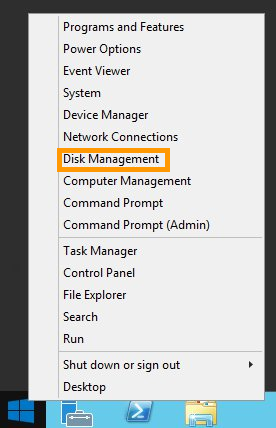{.thumbnail}

Dysk pojawi się jako nieznany wolumen z nieprzydzieloną przestrzenią.

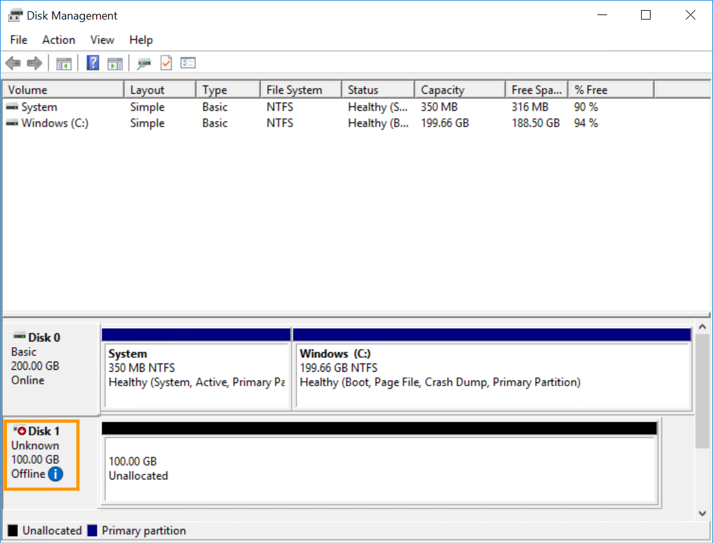{.thumbnail}

Jeśli dysk jest offline, zainicjuj go przez [interfejs Windows](#initDiskManagement) lub [DISKPART](#initDiskpart). W przeciwnym razie przejdź do [formatowania](#formatDiskManagement).

##### **Zainicjowanie dysku w zarządzaniu dyskami** <a name="initDiskManagement"></a>

Kliknij prawym przyciskiem myszy na dysk i wybierz `Online`{.action}.

Jeśli dysk jest offline, kliknij go prawym przyciskiem myszy i wybierz `Online`{.action}.

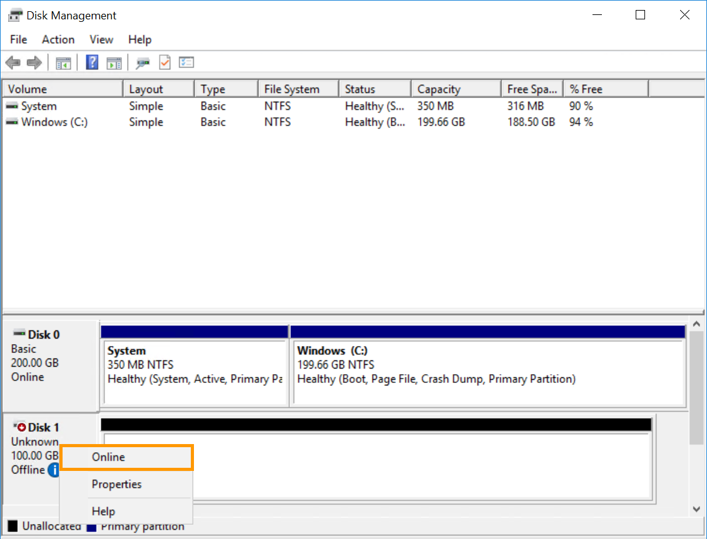{.thumbnail}

Kliknij prawym przyciskiem myszy ponownie i wybierz `Zainicjuj dysk`{.action}.

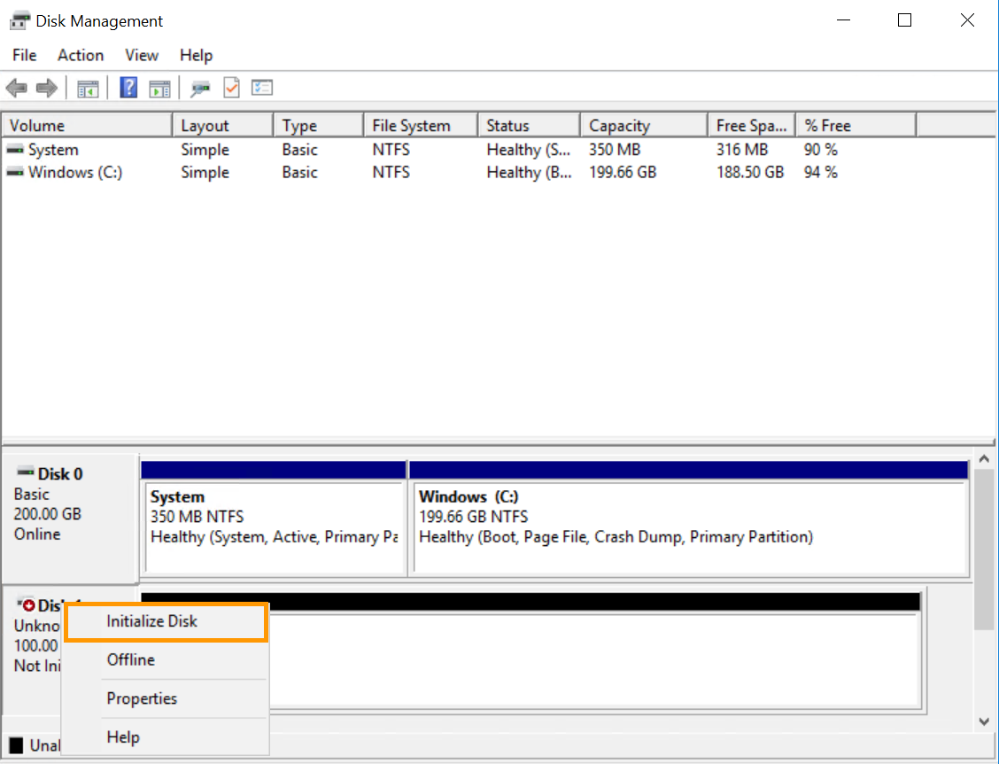{.thumbnail}

Następnie wybierz `MBR`{.action}, jeśli dodatkowy dysk ma mniej niż 2 TB, lub `GPT`{.action}, jeśli ma więcej niż 2 TB, a następnie kliknij `OK`{.action}.

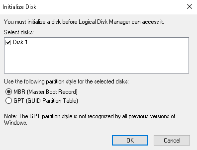{.thumbnail}

##### **Zainicjowanie dysku za pomocą DISKPART** <a name="initDiskpart"></a>

Kliknij prawym przyciskiem myszy `Start`{.action} i otwórz `Uruchom`{.action}.

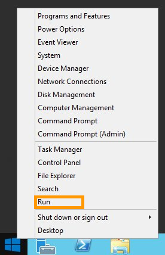{.thumbnail}

Wpisz `cmd` i kliknij `OK`{.action}.

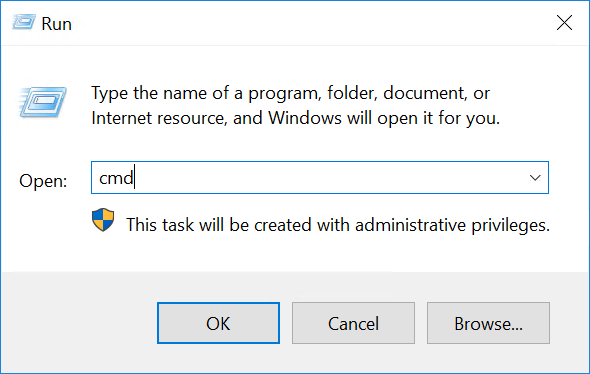{.thumbnail}

W wierszu poleceń otwórz DISKPART:

```console
C:\> diskpart
```

Wykonaj następujące polecenia DISKPART, aby przełączyć dysk w tryb online:

```console
DISKPART> san

SAN Policy : Offline Shared

DISKPART> san policy = OnlineAll

DiskPart successfully changed the SAN policy for the current operating system .

- Implementation of the strategy on the extra disk:
[Code] DISKPART> list disk

Disk ### Status Size Free Dyn Gpt
-------- ------------- ------- ------- --- ---
Disk 0 Online 200 GB 0 B
* Disk 1 Offline 10 GB 1024 KB

DISKPART> select disk 1

Disk 1 is now the selected disk.

DISKPART> attributes disk clear readonly

Disk attributes cleared successfully.

DISKPART> attributes disk

Current Read-only State : No
Read-only : No
Boot Disk : No
Pagefile Disk : No
Hibernation File Disk : No
Crashdump Disk : No
Clustered Disk : No

DISKPART> online disk

DiskPart successfully onlined the selected disk.
```

##### **Formatowanie dysku** <a name="formatDiskManagement"></a>

W narzędziu `Zarządzanie dyskami`{.action} kliknij prawym przyciskiem myszy dysk i wybierz `Nowy prosty wolumen...`{.action}.

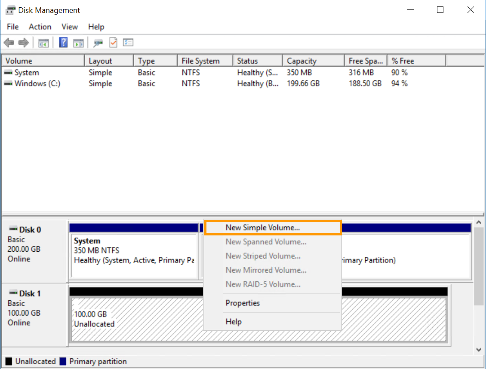{.thumbnail}

W kreatorze kliknij `Dalej`{.action}, aby zatwierdzić rozmiar woluminu (domyślnie maksymalny), a następnie kliknij `Dalej`{.action} ponownie.

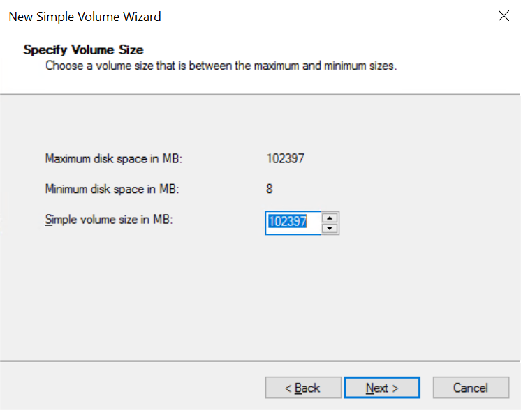{.thumbnail}

Zaakceptuj literę dysku lub wybierz inną, a następnie kliknij `Dalej`{.action}.

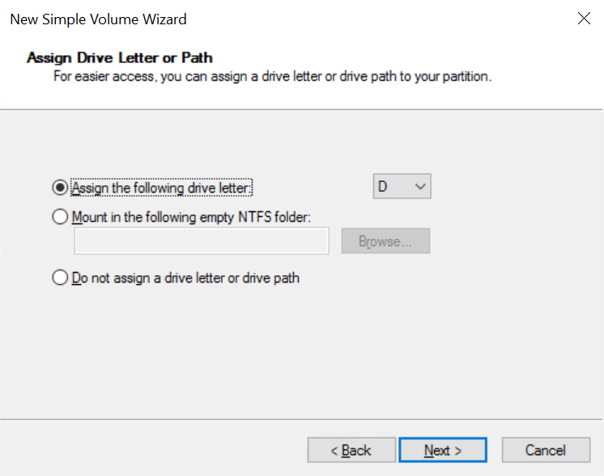{.thumbnail}

Nazwij wolumen (opcjonalnie) i kliknij `Dalej`{.action}.

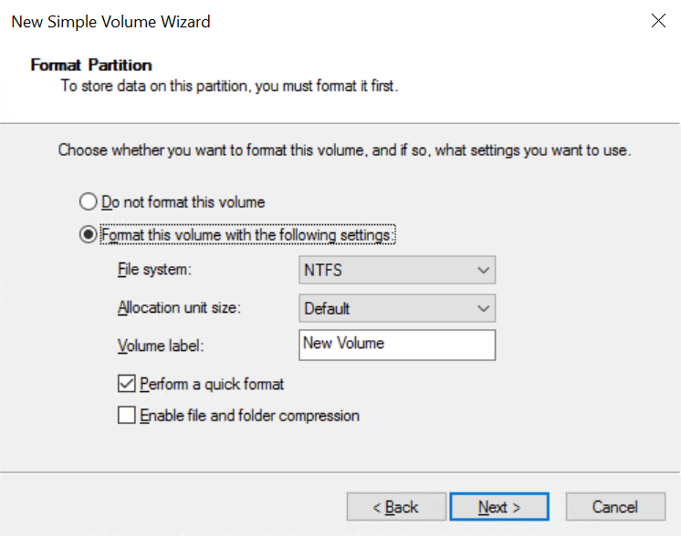{.thumbnail}

Kliknij `Zakończ`{.action}, aby sformatować dysk.

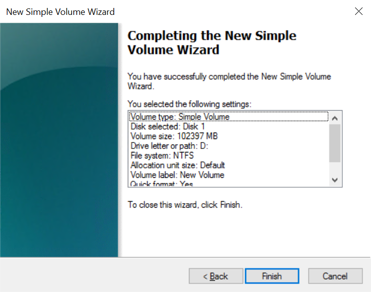{.thumbnail}

Dysk pojawi się w Eksploratorze plików jako napęd.

### Odłącz wolumen

Przed odłączeniem wolumenu odmontuj go w systemie operacyjnym.

> [!warning]
>
> Wyświetli się komunikat o błędzie, jeśli na dodatkowym dysku uruchomione jest oprogramowanie lub proces. W takim przypadku zaleca się zatrzymanie wszystkich procesów przed kontynuowaniem.
>

Oto jak **odmontować wolumin** z systemu operacyjnego przed odłączeniem go od instancji:

> [!tabs]
> **Linux**
>>
>> [Połącz się przez SSH](/pages/public_cloud/compute/public-cloud-first-steps#connect-instance), a następnie wyświetl powiązane dyski:
>>
>> ```bash
>> lsblk
>> ```
>>
>> ```console
>> NAME MAJ:MIN RM SIZE RO TYPE MOUNTPOINT
>> vda 254:0 0 10G 0 disk
>> └─vda1 254:1 0 10G 0 part /
>> vdb       8:0    0   10G  0 disk
>> └─vdb1    8:1    0   10G  0 part /mnt/disk
>> ```
>>
>> Odmontuj partycję:
>>
>> ```bash
>> sudo umount /dev/vdb1
>> ```
>>
>> Usuń identyfikator urządzenia z pliku fstab; w przeciwnym razie partycja zostanie ponownie zamontowana po restarcie.
>>
>> ```bash
>> sudo nano /etc/fstab
>> ```
>>
>> Zapisz i wyjdź z edytora.
>>
> **Windows**
>>
>> Utwórz połączenie RDP (Remote Desktop) z instancją Windows.
>>
>> Kliknij prawym przyciskiem myszy `Start`{.action} i otwórz `Zarządzanie dyskami`{.action}.
>>
>> {.thumbnail}
>>
>> Kliknij prawym przyciskiem myszy wolumen i wybierz `Zmień literę dysku i ścieżki...`{.action}.
>>
>> 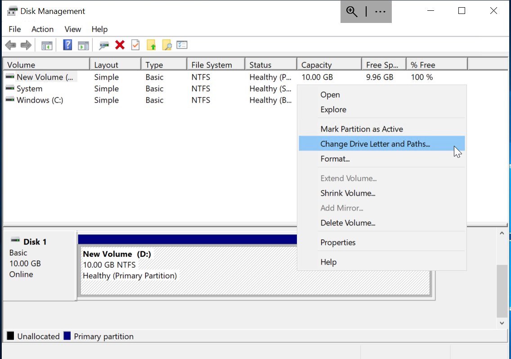{.thumbnail}
>>
>> Kliknij `Usuń`{.action}.
>>
>> 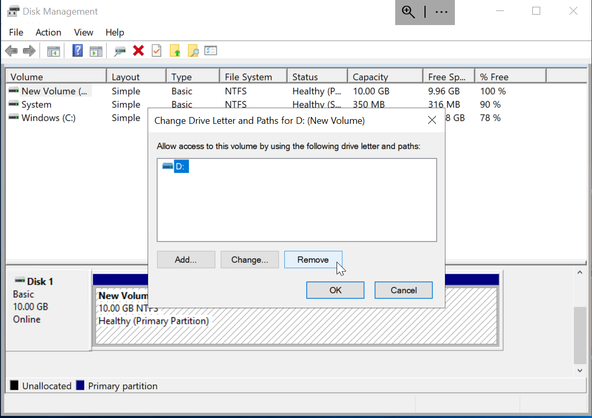{.thumbnail}
>>
>> Kliknij `Tak`{.action}, aby potwierdzić.
>>
>> 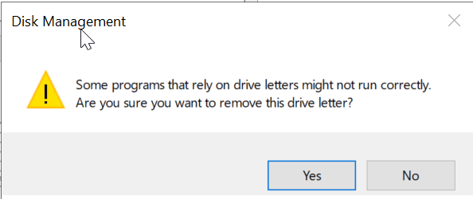{.thumbnail}
>>
>> Po zakończeniu możesz zamknąć okno Zarządzania dyskami.
>>

Na koniec odłączymy wolumin od instancji:

> [!tabs]
> **W Panelu klienta OVHcloud**
>>
>> Otwórz `Block Storage`{.action} w menu po lewej stronie, pod **Storage i backup**.
>>
>> Kliknij przycisk `...`{.action} obok odpowiedniego wolumenu i wybierz `Odłącz od instancji`{.action}.
>>
>> 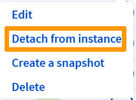{.thumbnail}
>>
>> Kliknij `Potwierdź`{.action}.
>>
>> 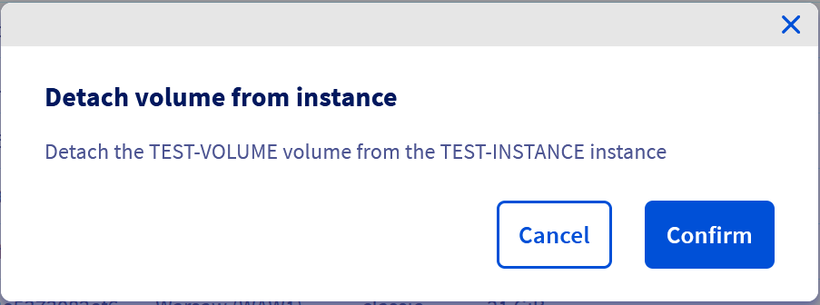{.thumbnail}
>>
> **Przez Terraform**
>> 
>> Usuń poniższe wiersze z pliku Terraform:
>>
>> ```python
>> # Attach the volume to the instance
>> resource "openstack_compute_volume_attach_v2" "volume_attach" {
>>   instance_id = "<your_instance_id>"
>>   volume_id   = openstack_blockstorage_volume_v3.terraform_volume.id
>> }
>> ```
>>
>> Wykonaj poniższą komendę, aby sprawdzić zaplanowane usunięcie:
>>
>> ```console
>> terraform plan
>> ```
>>
>> Wyjście powinno wyglądać tak:
>>
>> ```console
>> $ terraform plan
>> openstack_compute_volume_attach_v2.va_1: Refreshing state... [id=11cc1279-xxxx-xxxx-xxxx-3ace4c954780/daf3a86e-xxxx-xxxx-xxxx-ac7b6ffbb806]
>> openstack_blockstorage_volume_v3.terraform_volume: Refreshing state... [id=daf3a86e-xxxx-xxxx-xxxx-ac7b6ffbb806]
>>
>> Terraform used the selected providers to generate the following execution plan. Resource actions are indicated with the following symbols:
>>   - destroy
>>
>> Terraform will perform the following actions:
>>
>>   # openstack_compute_volume_attach_v2.va_1 will be destroyed
>>   # (because openstack_compute_volume_attach_v2.va_1 is not in configuration)
>>   - resource "openstack_compute_volume_attach_v2" "va_1" {
>>       - device      = "/dev/sdb" -> null
>>       - id          = "11cc1279-xxxx-xxxx-xxxx-3ace4c954780/daf3a86e-xxxx-xxxx-xxxx-ac7b6ffbb806" -> null
>>       - instance_id = "11cc1279-xxxx-xxxx-xxxx-3ace4c954780" -> null
>>       - region      = "GRA11" -> null
>>       - volume_id   = "daf3a86e-xxxx-xxxx-xxxx-ac7b6ffbb806" -> null
>>     }
>> 
>> Plan: 0 to add, 0 to change, 1 to destroy.
>> ```
>>
>> Zastosuj zmiany:
>>
>> ```console
>> terraform apply
>> ```
>>
>> Wyjście powinno wyglądać tak:
>>
>> ```console
>> $ terraform apply
>> openstack_compute_volume_attach_v2.va_1: Refreshing state... [id=11cc1279-xxxx-xxxx-xxxx-3ace4c954780/daf3a86e-xxxx-xxxx-xxxx-ac7b6ffbb806]
>> openstack_blockstorage_volume_v3.terraform_volume: Refreshing state... [id=daf3a86e-xxxx-xxxx-xxxx-ac7b6ffbb806]
>>
>> Terraform used the selected providers to generate the following execution plan. Resource actions are indicated with the following symbols:
>>   - destroy
>>
>> Terraform will perform the following actions:
>>
>>   # openstack_compute_volume_attach_v2.va_1 will be destroyed
>>   # (because openstack_compute_volume_attach_v2.va_1 is not in configuration)
>>   - resource "openstack_compute_volume_attach_v2" "va_1" {
>>       - device      = "/dev/sdb" -> null
>>       - id          = "11cc1279-xxxx-xxxx-xxxx-3ace4c954780/daf3a86e-xxxx-xxxx-xxxx-ac7b6ffbb806" -> null
>>       - instance_id = "11cc1279-xxxx-xxxx-xxxx-3ace4c954780" -> null
>>       - region      = "GRA11" -> null
>>       - volume_id   = "daf3a86e-xxxx-xxxx-xxxx-ac7b6ffbb806" -> null
>>     }
>>
>> Plan: 0 to add, 0 to change, 1 to destroy.
>> 
>> Do you want to perform these actions in workspace "test_terraform"?
>>   Terraform will perform the actions described above.
>>   Only 'yes' will be accepted to approve.
>>
>>   Enter a value: yes
>>
>> openstack_compute_volume_attach_v2.va_1: Destroying... [id=11cc1279-xxxx-xxxx-xxxx-3ace4c954780/daf3a86e-xxxx-xxxx-xxxx-ac7b6ffbb806]
>> openstack_compute_volume_attach_v2.va_1: Still destroying... [id=11cc1279-xxxx-xxxx-xxxx-3ace4c954780/daf3a86e-xxxx-xxxx-xxxx-ac7b6ffbb806, 10s elapsed]
>> openstack_compute_volume_attach_v2.va_1: Destruction complete after 17s
>>
>> Apply complete! Resources: 0 added, 0 changed, 1 destroyed.
>> ```
>>
> **Przez OVHcloud CLI**
>>
>> | Parametr | Opis |
>> |-----------|-------------|
>> | `<volume_id>` | ID wolumenu, który ma zostać odłączony |
>> | `<instance_id>` | ID instancji, od której wolumen ma zostać odłączony |
>>
>> ```bash
>> ovhcloud cloud storage-block detach <volume_id> <instance_id>
>> ```
>>

## Sprawdź również

[Zwiększ rozmiar dodatkowego dysku](/pages/public_cloud/compute/increase_the_size_of_an_additional_disk)

Dołącz do [grona naszych użytkowników](/links/community).
