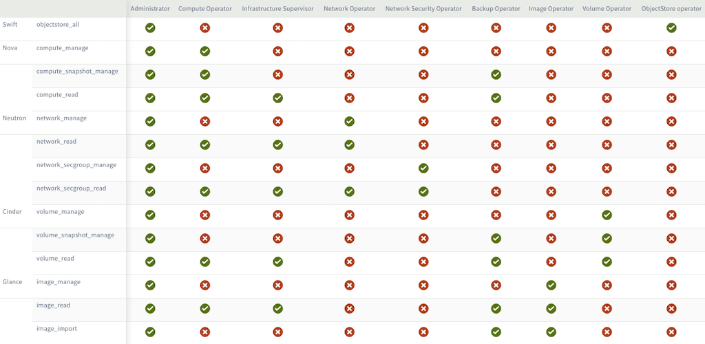
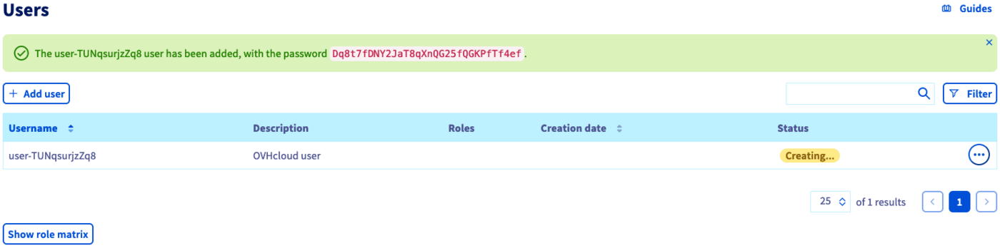
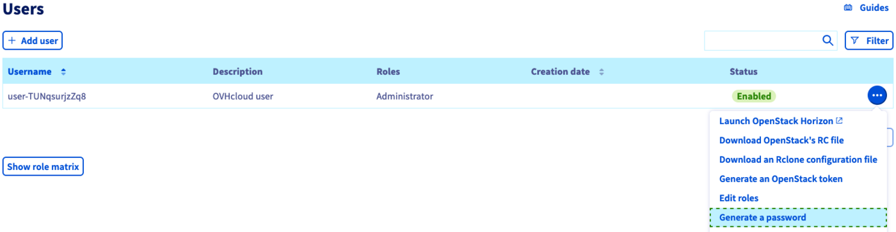
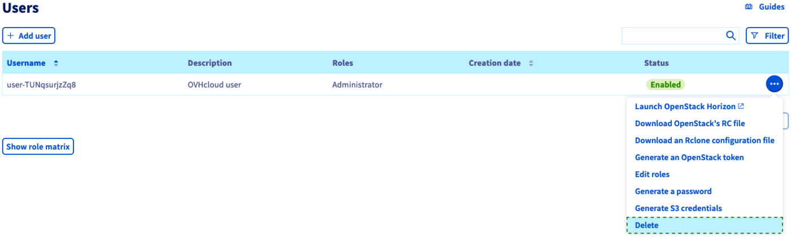

## Objective

Access to Horizon and the OpenStack APIs is established via username/password pairs called "OpenStack users". You can create as many OpenStack users as needed and assign them various access permissions.

**This guide explains how to manage OpenStack users in the OVHcloud Control Panel.**

<iframe width="560" height="315" src="https://www.youtube.com/embed/NC69nrb6QlA" title="YouTube video player" frameborder="0" allow="accelerometer; autoplay; clipboard-write; encrypted-media; gyroscope; picture-in-picture" allowfullscreen></iframe>

## Requirements

- A [Public Cloud project](https://www.ovhcloud.com/en/public-cloud/) in your OVHcloud account
- Access to the [OVHcloud Control Panel](https://ca.ovh.com/auth/?action=gotomanager&from=https://www.ovh.com/world/&ovhSubsidiary=we)

> [!primary]
>
> If the Public Cloud project concerned is the **first project** created in your customer account, OpenStack users will only be available after 7 days from the project's creation date.
>
> You may request to remove this security measure by creating a support ticket in the OVHcloud Control Panel.
>

## Instructions

### Creating an OpenStack user

Log in to the OVHcloud Control Panel and open your `Public Cloud`{.action} project. Click on `Users & Roles`{.action} the left-hand menu under "Project management". 

Click on the button `Create User`{.action}.

{.thumbnail}

The user description is not the username for the OpenStack user but a descriptive term to help you organise users and their permissions. Enter a description and click on `Next`{.action}.

{.thumbnail}

Now you can select user roles representing the permissions the user shall have. For each box checked, the user will gain access privileges according to the table below.

{.thumbnail}

Click on `Confirm`{.action} to create the OpenStack user. Username and password will be automatically generated and displayed in your Control Panel.

{.thumbnail}

Be sure to save the password shown in the green message box to a password manager at this time. The password cannot be recovered afterwards. However, you can always create a new password by clicking on `...`{.action} and selecting `Generate a password`{.action}.

{.thumbnail}

With the OpenStack user created, you can use its credentials to log into the [Horizon interface](/pages/public_cloud/compute/introducing_horizon) by clicking on the link `Horizon`{.action} in the left-hand menu.

### Deleting an OpenStack user

You can remove an OpenStack user in the [OVHcloud Control Panel](https://ca.ovh.com/auth/?action=gotomanager&from=https://www.ovh.com/world/&ovhSubsidiary=we). Click on `Users & Roles`{.action} the left-hand menu under "Project management". 

{.thumbnail}

Click on `...`{.action} and select `Delete`{.action}.

> [!warning]
>
> Deleting a user is permanent and will invalidate all associated tokens, even those with an expiry date not yet exceeded.
> 

## Go further

[Introducing Horizon](/pages/public_cloud/compute/introducing_horizon)

Join our community of users on <https://community.ovh.com/en/>.