## Objectif

Vous avez la possibilité de créer des instances directement depuis l'interface Horizon. Ceci vous permet, par exemple, de créer des instances multiples ou encore de configurer un groupe de sécurité et de l'appliquer à vos instances.

**Apprenez à créer une instance depuis l'interface Horizon.**

## Prérequis

- Posséder un [projet Public Cloud](/pages/public_cloud/compute/create_a_public_cloud_project) créé depuis votre compte OVHcloud.
- [Être connecté à l'interface Horizon](/pages/public_cloud/compute/introducing_horizon).

## En pratique

### Créer un réseau privé

En règle générale, nous vous recommandons de créer un réseau privé avant de créer une instance. Vous pourrez ultérieurement attacher ce réseau à votre instance.

Pour commencer, connectez-vous à l'interface Horizon. Si vous avez besoin d'aide pour réaliser cette manipulation, reportez-vous à [notre documentation](/pages/public_cloud/compute/introducing_horizon).

Cliquez ensuite sur `Network`{.action} dans le menu de gauche, puis sur `Networks`{.action}.

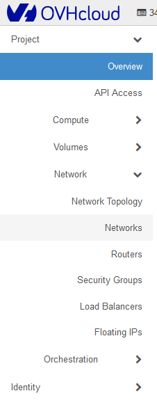{.thumbnail}

Cliquez sur `Create Network`{.action}

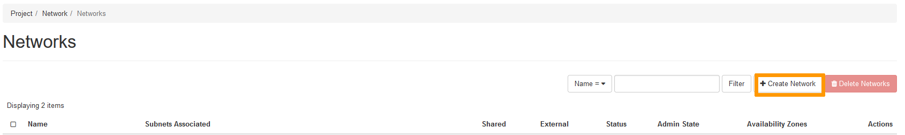{.thumbnail}

> [!tabs]
> 1. **Network (Réseau)**
>>
>> **Network Name :** Entrez un nom pour votre réseau. 
>> **Enable Admin State :** Laissez cette option cochée pour activer le réseau. 
>> **Create Subnet :** Laissez cette option cochée pour créer le sous-réseau. 
>> **Availability Zone Hints :** Laissez l’option par défaut.  
>>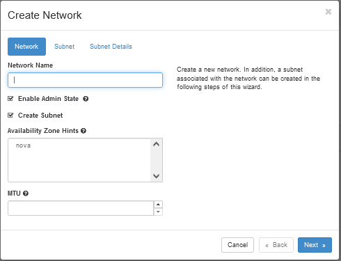{.thumbnail} 
>>
> 2. **Subnet (Sous-réseau)**
>>
>> **Subnet Name :** Entrez un nom pour votre sous-réseau. 
>> **Network Address :** Choisissez une plage de réseau privé. Par exemple : `192.168.0.0/24`. 
>> **IP Version :** Laissez cette valeur à IPv4. 
>> **Gateway IP :** Facultatif. Si elle n’est pas définie, une adresse Gateway IP est automatiquement sélectionnée. 
>> **Disable Gateway :** Laissez cette option désactivée.  
>>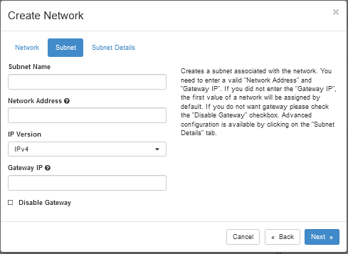{.thumbnail} 
>>
> 3. **Subnet Details (Détails du sous-réseau)**
>>
>> **Enable DHCP :**  Laissez cette option activée. 
>> **Allocation Pools :** Facultatif. Vous pouvez spécifier la plage dans laquelle les adresses IP sont sélectionnées. 
>> **DNS Name Servers :** Facultatif. Vous pouvez spécifier n'importe quel serveur de noms DNS. 
>> **Host Routes :** Facultatif. Vous pouvez spécifier n’importe quel itinéraire d’hôte.  
>>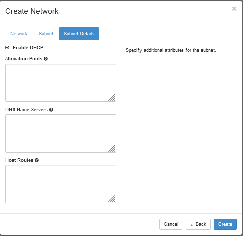{.thumbnail} 
>>

### Créer une instance

Dans l'interface Horizon, cliquez sur `Compute`{.action} dans le menu de gauche, puis sur `Instances`{.action}.

{.thumbnail}

La page qui s'ouvre permet de visualiser les instances actuellement en cours de création. Pour en créer une nouvelle, cliquez sur le bouton `Launch Instance`{.action}.

{.thumbnail}

Vous devrez ensuite compléter les informations demandées. Attention, cette grille n'est pas exhaustive.

**Détails**

{.thumbnail}

|Informations|Détails|
|---|---|
|Nom de l'instance (*Instance name*)|Spécifiez le nom souhaité pour l'instance qui sera lancée.|
|Description|Facultatif. Ajoutez une description si nécessaire.|
|Zone de disponibilité (*Availability zone*)|Laissez « nova » (choix par défaut).|
|Nombre|Spécifiez le nombre d'instances à créer.|

**Source**

{.thumbnail}

|Informations|Détails|
|---|---|
|Sélectionner la source de démarrage (*Boot Source*)|Cliquez sur la flèche déroulante pour sélectionner la source de lancement d'une instance (par exemple, « Image » ou « *Instance snapshot* (Instantané d'instance) »).|
|Créer un nouveau volume (*Create New Volume*)|Vous pouvez choisir de cocher cette option si vous souhaitez créer un volume dans lequel l'image du système d'exploitation spécifiée est copiée.|
|Taille du volume (*Volume size*) (Go)|Si vous avez choisi de créer un volume, laissez le système déterminer la taille à votre place.|
|Supprimer le volume lors de la suppression de l'instance (*Delete Volume on Instance Delete*)|Vous pouvez conserver l'option par défaut **No**. Si **Yes** est sélectionné, lorsque l'instance est supprimée, le volume l'est également.|
|Nom de l'image (*Image name*)|Sélectionnez l'image de l'instance (uniquement dans le cas d'un démarrage depuis une image) en cliquant sur la flèche vers le haut à côté de l'image de votre choix. Dans notre exemple, nous utilisons une sélection de CentOS 7.|
|Instantané d'instance (*Instance snapshot*)|Choisissez un instantané d'une instance (uniquement dans le cas d'un démarrage depuis un snapshot) en cliquant sur la flèche vers le haut à côté de l'image d'instantané d'instance de votre choix.|

**Flavor**

{.thumbnail}

Des *flavors* pré-construites sont disponibles pour vous, sélectionnez la *flavor* de votre choix sous l'onglet `Available`.

**Networks**

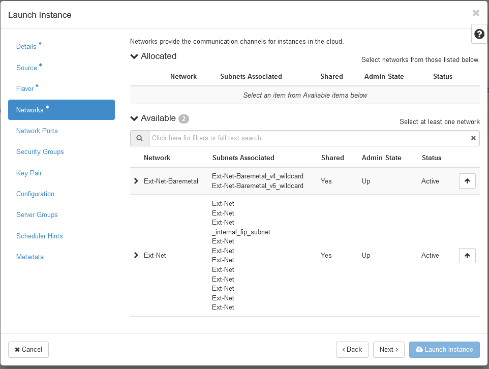{.thumbnail}

|Informations|Détails|
|---|---|
|Réseau (*Network*)|Sélectionnez, dans la liste des réseaux disponibles, le(s) réseau(x) pour l'Instance que vous souhaitez créer |
|Ext-Net|Représente le réseau public.|
|Mynewnetwork|Représente le réseau privé créé au début de ce guide.|

**Security Groups (Groupes de sécurité)**

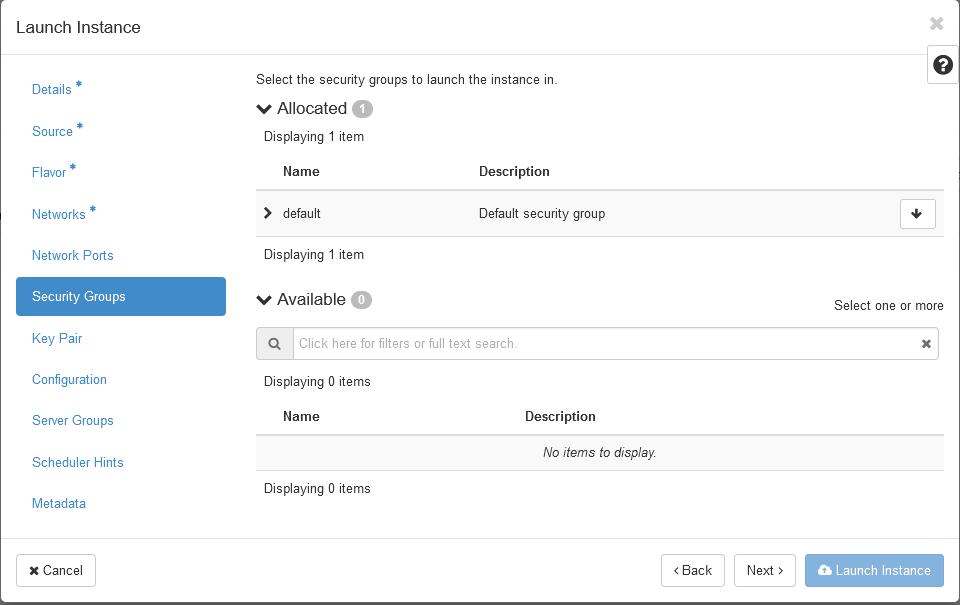{.thumbnail}

Pour plus d'informations, consultez [ce guide](/pages/public_cloud/compute/setup_security_group).

**Key Pairs (Paire de clés)**

> [!warning] 
> 
> Bien que le champ "Key Pair" ne soit pas obligatoire dans l'interface Horizon lors de la création d'une instance, l'enregistrement d'une clé SSH est absolument nécessaire pour pouvoir se connecter à une instance. Sans clé SSH, vous serez amené à redémarrer l'instance en mode rescue pour pourvoir créer un mot de passe ou ajouter une clé SSH dans le fichier approprié (pour plus d'informations, consultez le guide [Changer sa clé SSH en cas de perte](/pages/public_cloud/compute/replacing_lost_ssh_key#en-pratique)).
>

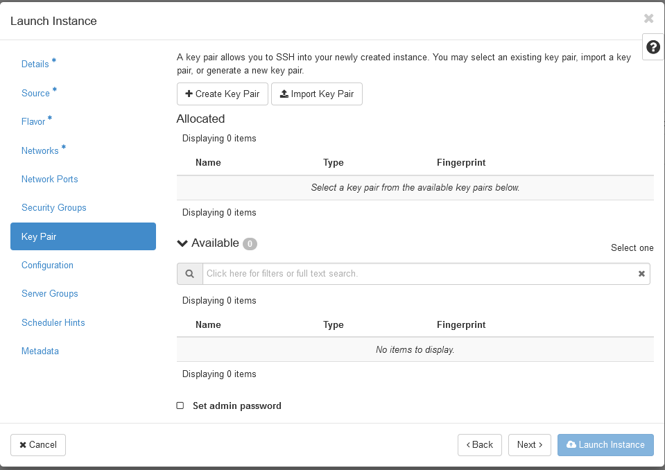{.thumbnail}

Dans cette section, vous pouvez créer une paire de clés, importer une paire de clés ou utiliser une paire de clés existante.

Pour plus d'informations sur la création d'une clé SSH, consultez [ce guide](/pages/public_cloud/compute/creating-ssh-keys-pci).

> [!tabs]
> **+ Create Key Pair**
>> 
>> Pour créer une paire de clés, cliquez sur le bouton `+ Create Key Pair`{.action}. Veuillez noter qu'avec cette option, des étapes supplémentaires doivent être effectuées avant de pouvoir vous connecter à l'instance, surtout si vous utilisez le logiciel Putty pour vous connecter à votre instance. Consultez [cette section](/pages/public_cloud/compute/public-cloud-first-steps#connect-instance) du guide correspondant.
>>
>> **Key Pair Name :** Entrez un nom pour votre clé. 
>> **Key Type :** Cliquez sur la `flèche déroulante` et sélectionnez `SSH Key`. 
>> Ensuite, cliquez sur `Create Keypair`{.action} pour commencer la création de la clé. 
>>
>> Une fois la paire de clés créée, cliquez sur `Copy Private Key to Clipboard`{.action}, puis sur `Done`{.action}.  
>>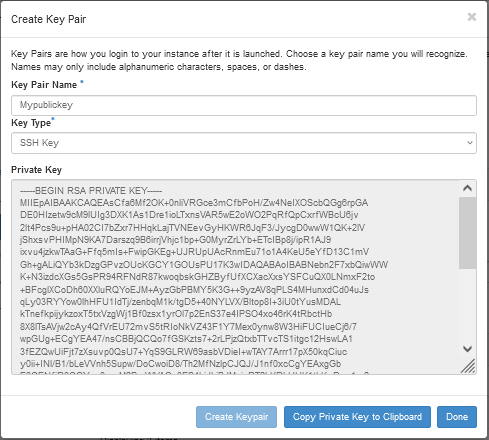{.thumbnail} 
>>
>> Une fois cela fait, la clé nouvellement créée sera automatiquement sélectionnée. Cliquez sur `Launch Instance`{.action} pour commencer la création de votre instance.  
>>
>>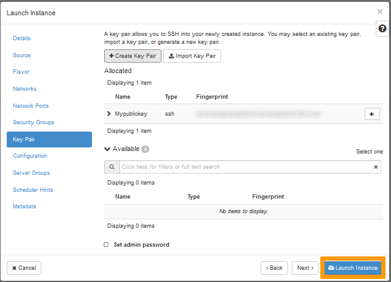{.thumbnail} 
>> 
> **Import Key Pair (Importer une paire de clés)**
>> Si vous préférez importer une clé SSH créée précédemment, cliquez sur le bouton `Import Key Pair`{.action}.
>>
>> **Key Pair Name :** Entrez un nom pour votre clé. 
>> **Key Type (Type de clé) :** Cliquez sur la `flèche déroulante` et sélectionnez `SSH Key`. 
>> **Load Public Key from a file (Charger la clé publique à partir d'un fichier) :** Cliquez sur `Browse`{.action} pour spécifier l'emplacement de la clé publique sur votre ordinateur. 
>> **Public Key :** Copiez et collez votre clé publique ici. 
>> Cliquez sur `Import Key Pair`{.action} pour importer la clé.  
>>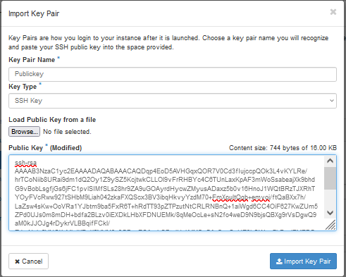{.thumbnail} 
>>
>> Une fois l'opération terminée, la clé importée sera automatiquement sélectionnée. Cliquez sur `Launch Instance`{.action} pour commencer la création de votre instance.  
>>
>>{.thumbnail} 

**Autres options**

Attention, ces options ne sont pas obligatoires pour la création d'une instance de base. Si vous souhaitez explorer davantage ces options, consultez la [documentation OpenStack officielle](https://docs.openstack.org/horizon/latest/user/launch-instances.html){.external}.

|Informations|Détails|
|---|---|
|Custom script source (*Source de script personnalisé*)|Spécifiez la source entre une « direct entry » ou un « file ».|
|Script data (*Données de script*)|Entrez le code de script dans le champ d'entrée (16 Ko maximum).|
|Script file (*Fichier de script*)|Cliquez sur `Browse`{.action} pour sélectionner le script de post-installation.|
|Disk partitioning (*Partitionnement des disques*)|Choisissez entre « automatic » et « manual ».|
|Configuration disk (*Disque de configuration*)|Configurez OpenStack pour écrire des métadonnées sur un disque de configuration spécifique qui sera attaché à l'Instance au lancement.|

## Aller plus loin

Échangez avec notre [communauté d'utilisateurs](/links/community).