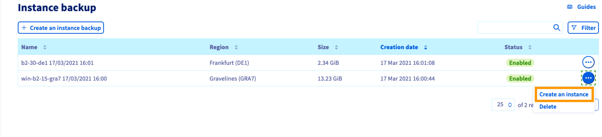
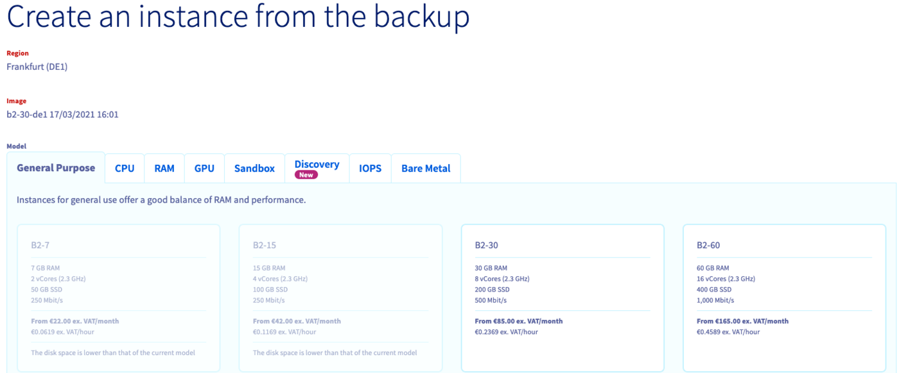
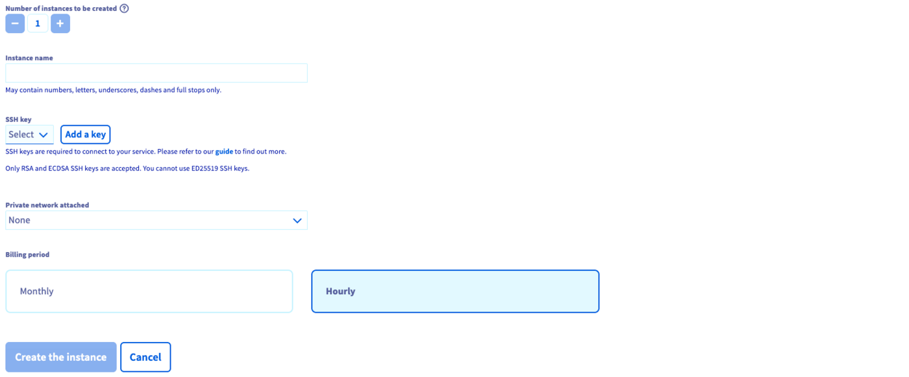
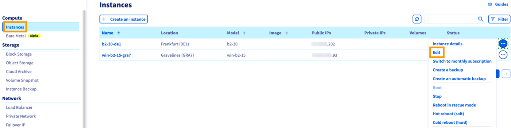
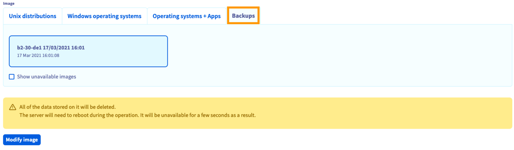

**Last updated 19th March 2021**

## Objective

The OVHcloud Control Panel enables you to [create backups of your instances](/pages/public_cloud/compute/save_an_instance) within a few clicks, as well as automating this process.
You can make use of these instance backups for two basic purposes:

- Creating a new instance with the backup as a template in order to duplicate the original instance, for example if you are configuring a load balancing infrastructure.
- Restoring instances from a backup, for example if recent changes broke critical configurations on the instance.

**This guide explains how to use backups to duplicate and restore your instances.**

## Requirements

- A backup of a [Public Cloud instance](https://www.ovhcloud.com/en-ca/public-cloud/instance-backup/)
- Access to the [OVHcloud Control Panel](https://ca.ovh.com/auth/?action=gotomanager&from=https://www.ovh.com/ca/en/&ovhSubsidiary=ca)

## Instructions

### Creating an instance from a backup

Log in to the [OVHcloud Control Panel](https://ca.ovh.com/auth/?action=gotomanager&from=https://www.ovh.com/ca/en/&ovhSubsidiary=ca) and open your `Public Cloud`{.action} project. Click on `Instance Backup`{.action} in the left-hand sidebar.

{.thumbnail}

Click on the `...`{.action} button in the row of the relevant backup, then select `Create an instance`{.action}.

You will see a shortened version of the instance creation page where you can decide on some options.

{.thumbnail}

Some elements are pre-defined:

- **Region**: Your instance will be created in the same data centre as your backup.
- **Image**: The image will correspond to your backup.
- **Model**: Only the models that are compatible with your image are available, depending on your quota.

{.thumbnail}

Choose the new instance's name, SSH key, vRack and billing period, then click on the `Create the instance`{.action} button.

For further information on creating an instance, please refer to [this guide](/pages/public_cloud/compute/public-cloud-first-steps).

> [!primary]
>
>In order to create the instance in a different data centre, you will first need to transfer the backup to the appropriate region. Please refer to our guide to [transferring an instance backup](/pages/public_cloud/compute/transfer_instance_backup_from_one_datacentre_to_another).
>

### Restoring an instance from a backup

Log in to the [OVHcloud Control Panel](https://ca.ovh.com/auth/?action=gotomanager&from=https://www.ovh.com/ca/en/&ovhSubsidiary=ca) and switch to the `Public Cloud`{.action} section. Click on `Instances`{.action} in the left-hand sidebar.

{.thumbnail}

Click on the `...`{.action} button in the row of the relevant instance, then select `Edit`{.action}.

This opens the page for editing an instance where you can change:

- the instance's name
- the instance's image
- the instance's model
- the instance's billing mode (from `hourly` to `monthly` only)

Make your changes if necessary and switch to the `Backups`{.action} tab of the **Image** section.

{.thumbnail}

Select from the list of available backups. Click on `Modify image`{.action} if you are certain that you want to overwrite the current image with the backup. 

The instance will have the status `Re-installation` until the process is completed. It might be necessary to refresh the page in the browser in order to see the current status.

> [!warning]
>
>As stated in the warning message, any data added after the backup creation will be lost.
>

## Go further

[First steps](/pages/public_cloud/compute/public-cloud-first-steps)

[Creating instance backups](/pages/public_cloud/compute/save_an_instance)

Join our community of users on <https://community.ovh.com/en/>.
