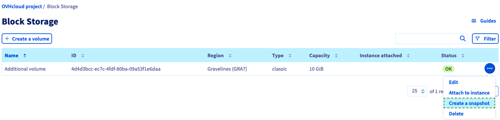
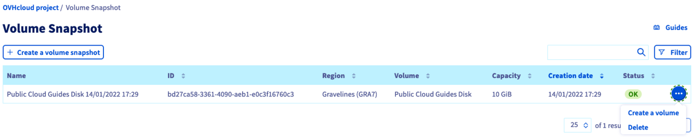

**Last updated 21st April 2023** 

## Objective

A **volume snapshot** is a recovery point stored within the same storage cluster as the original volume. Operations will be fast, but in case of an incident on the cluster, both volume and volume snapshot might be unavailable. Volume snapshot creation does not require the volume to be detached from the instance.

This is not to be confused with a **volume backup** which is an image created out of your volume, which is stored in the Object Storage cluster where the original volume is located. The level of resiliency is ideal and will allow you to quickly react to any incident on your volume, creating another volume from the backup. Volume backup creation requires the volume to be detached from the instance. For more information on this option, please consult this [guide](/pages/public_cloud/compute/volume-backup).

A snapshot of an additional volume serves two general purposes:

- You can create backups with a few clicks and keep them as long as needed.
- You can use the snapshot as a template for identical volumes.

**This guide explains how to create a volume snapshot in the OVHcloud Control Panel.**

## Requirements

- Access to the [OVHcloud Control Panel](https://ca.ovh.com/auth/?action=gotomanager&from=https://www.ovh.com.au/&ovhSubsidiary=au)
- A [Block storage volume](/pages/public_cloud/compute/create_and_configure_an_additional_disk_on_an_instance) created in your [Public Cloud](https://www.ovhcloud.com/en-au/public-cloud/) project

## Instructions

Log in to the [OVHcloud Control Panel](https://ca.ovh.com/auth/?action=gotomanager&from=https://www.ovh.com.au/&ovhSubsidiary=au), go to the `Public Cloud`{.action} section, and select the Public Cloud project concerned. Then open `Block Storage`{.action} in the left-hand navigation bar under **Storage**.

{.thumbnail}

In the row of the volume concerned, click on `...`{.action} and select `Create a snapshot`{.action} (It is not required to detach the volume from its instance first). However, if you wish to detach your volume, please consult this [section](/pages/public_cloud/compute/create_and_configure_an_additional_disk_on_an_instance#on-linux) of the corresponding guide for Linux and this [section](/pages/public_cloud/compute/create_and_configure_an_additional_disk_on_an_instance#on-windows) for Windows.

{.thumbnail}

In the popup window, you can enter a different name for the snapshot. Take note of the pricing information, then click on `Take a snapshot`{.action}.

The snapshot creation time may take several hours, depending on the amount of data present on the volume, the instance resource utilization at the time of the snapshot and other host-specific factors.

We therefore recommend that you perform your snapshots outside of your production hours. 

Other best practices include:

- Avoid creating snapshots during peak hours (04:00 AM - 10:00 PM Paris time).
- Install the qemu-guest agent if it is not installed or try to disable it if necessary.
- Try not to "solicit" the server too much during the snapshot creation phase (I/O limitation, RAM consumption, etc.).

Since a volume snapshot is a clone of the entire disk, it will have the maximum size of the original volume, regardless of the actual disk space allocation.

{.thumbnail}

Open the section `Volume Snapshot`{.action} in the left-hand navigation bar. After the snapshot is created, it will be added to this table.

Click on the button `...`{.action} to `Delete`{.action} a snapshot or to `Create a volume`{.action} based on the respective snapshot. You can find further information in [this guide](/pages/public_cloud/compute/create-volume-from-snapshot).

## Go further

[Creating a volume backup](/pages/public_cloud/compute/volume-backup)

[Creating a volume from a backup](/pages/public_cloud/compute/create-volume-from-snapshot)

[Creating and configuring an additional disk on an instance](/pages/public_cloud/compute/create_and_configure_an_additional_disk_on_an_instance)

[Increasing the size of an additional disk](/pages/public_cloud/compute/increase_the_size_of_an_additional_disk)

Join our community of users on <https://community.ovh.com/en/>.