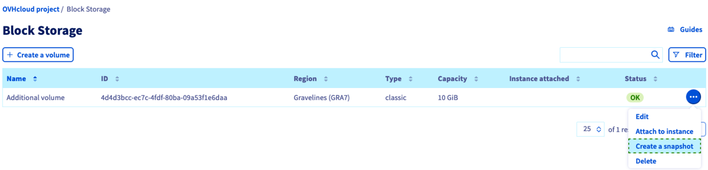
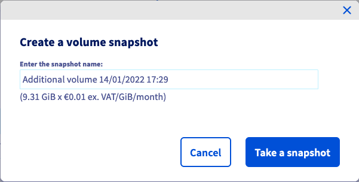
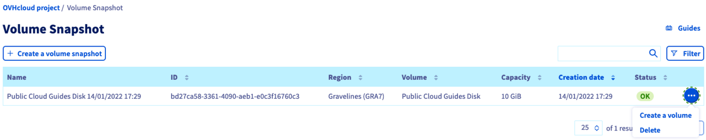

## Wprowadzenie

Snapshot **wolumenu** to punkt odzysku przechowywany w tym samym klastrze przestrzeni dyskowej, co oryginalny wolumen. Operacje tworzenia i przywracania są szybkie, ale w przypadku awarii na klastrze, wolumen i wolumen Snapshot mogą być niedostępne. 
Tworzenie wolumenu Snapshot nie wymaga odłączenia wolumenu od instancji.

Nie należy tego mylić z Backup **wolumenu** to obraz utworzony na podstawie wolumenu. Wolumen jest przechowywany w klastrze Object Storage w lokalizacji oryginalnego wolumenu.
Ten poziom odporności jest idealny i pozwala na szybką reakcję na każdy problem z wolumenem tworząc kolejny wolumen z kopii zapasowej. 
Tworzenie kopii zapasowej wolumenu wymaga odłączenia wolumenu od instancji. Więcej informacji na temat tej opcji można znaleźć w tym [przewodniku](/pages/public_cloud/compute/volume-backup).

Tworzenie snapshota dodatkowego wolumenu zwykle odpowiada dwóm celom:

- wykonywanie kopii zapasowych za pomocą kilku kliknięć i zachowanie czasu potrzebnego do wykonania;
- użyć snapshota jako szablonu dla tych samych wolumenów.

**Niniejszy przewodnik wyjaśnia, jak utworzyć w Panelu klienta snapshot wolumenu.**

## Wymagania początkowe

- Wolumen [Block storage](/pages/public_cloud/compute/create_and_configure_an_additional_disk_on_an_instance) utworzony w Twoim projekcie [Public Cloud](/pages/public_cloud/public_cloud_cross_functional/create_a_public_cloud_project)

<!-- CP-NAV-START:publiccloud-projects -->
---

### Dostęp do Panelu klienta OVHcloud

- **Link bezpośredni:** [Public Cloud Projects](/links/control-panel/publiccloud-projects)
- **Ścieżka nawigacji:** `Public Cloud`{.action} > Wybierz projekt

---
<!-- CP-NAV-END:publiccloud-projects -->

## W praktyce

Kliknij `Block Storage`{.action} na pasku nawigacji po lewej stronie w **Storage i Backup**.

{.thumbnail}

Po prawej stronie wybranego wolumenu kliknij przycisk `...`{.action}, a następnie `Utwórz kopię zapasową`{.action} (nie ma potrzeby odłączania najpierw wolumenu od instancji). Jeśli jednak chcesz odłączyć wolumen, zapoznaj się z sekcją "Odłącz wolumen" w [tym przewodniku](/pages/public_cloud/compute/create_and_configure_an_additional_disk_on_an_instance).

Następnie wybierz opcję `Volume Snapshot`{.action}, nadaj jej nazwę i kliknij przycisk `Utwórz kopię zapasową`{.action}.

{.thumbnail}

W oknie, które się pojawi możesz nadać inną nazwę snapshotowi. Zapoznaj się z informacjami dotyczącymi cennika, następnie kliknij `Utwórz snapshot`{.action}.

Czas tworzenia snapshota zależy od ilości danych zawartych w woluminie, wykorzystania zasobów instancji w momencie wykonania snapshota oraz innych czynników specyficznych dla hosta.

Zalecamy zatem wykonywanie kopii zapasowych snapshot poza godzinami produkcji.

Oto kilka innych dobrych praktyk:

- unikaj tworzenia snapshotów w godzinach szczytu (od 04:00 do 22:00 czasu paryskiego);
- zainstaluj agenta qemu-guest, jeśli nie jest to zrobione lub spróbuj go wyłączyć, jeśli to konieczne;
- staraj się nie przesadzać z serwerem podczas fazy tworzenia snapshota (ograniczenie I/O, zużycie pamięci RAM, itp.).

Ponieważ snapshot wolumenu jest klonem całego dysku, będzie miał maksymalny rozmiar oryginalnego wolumenu, niezależnie od rzeczywistego przydziału przestrzeni dyskowej.

{.thumbnail}

Otwórz sekcję `Snapshoty wolumenów`{.action} na pasku nawigacyjnym po lewej stronie. Po utworzeniu snapshota zostanie on dodany do tej tabeli.

Kliknij przycisk `...`{.action}, aby usunąć snapshot lub Utwórz wolumen z odpowiedniego snapshota. Więcej informacji znajdziesz w [tym przewodniku](/pages/public_cloud/compute/create-volume-from-snapshot).

## Sprawdź również

[Tworzenie kopii zapasowej wolumenu](/pages/public_cloud/compute/volume-backup)

[Tworzenie wolumenu z kopii zapasowej](/pages/public_cloud/compute/create-volume-from-snapshot)

[Zarządzanie wolumenem instancji Public Cloud](/pages/public_cloud/compute/create_and_configure_an_additional_disk_on_an_instance)

[Zwiększenie rozmiaru dodatkowego dysku](/pages/public_cloud/compute/increase_the_size_of_an_additional_disk)

Dołącz do [grona naszych użytkowników](/links/community).