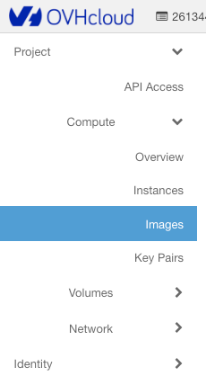
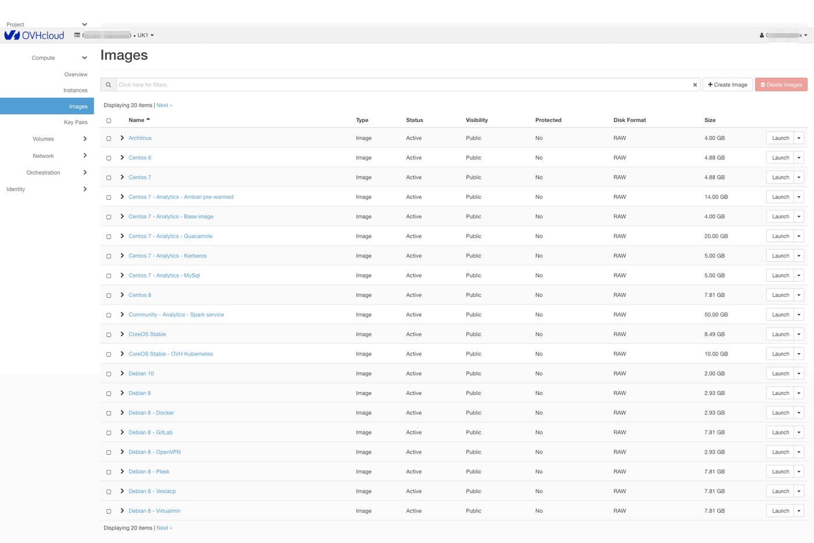
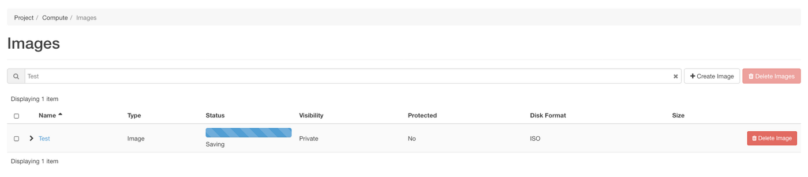
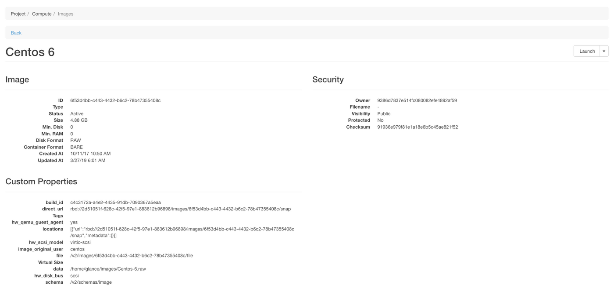

> [!primary]
> Esta tradução foi automaticamente gerada pelo nosso parceiro SYSTRAN. Em certos casos, poderão ocorrer formulações imprecisas, como por exemplo nomes de botões ou detalhes técnicos. Recomendamos que consulte a versão inglesa ou francesa do manual, caso tenha alguma dúvida. Se nos quiser ajudar a melhorar esta tradução, clique em "Contribuir" nesta página.
>

## Objetivo

A adição de imagens personalizadas é possível através do manager OpenStack Horizon
Esta operação permite-lhe, por exemplo, importar as suas imagens das antigas máquinas virtuais para o Public Cloud, com a condição que o seu formato ser compatível.

**Este guia explica as diferentes etapas para a criação, para dar inicio e eliminar imagens na interface Horizon onde gere os seus serviços OVHcloud.**

## Requisitos

- [Criar um acesso ao Horizon](/pages/public_cloud/compute/introducing_horizon)
- Aceder ao menu Imagens da interface OpenStack Horizon

{.thumbnail}

## Gestão das imagens

- Por predefinição, se nenhuma imagem foi criada, aparecerá a lista das imagens públicas por defeito:

{.thumbnail}

- É agora possível iniciar uma imagem a partir de um URL ou criar uma através do botão `Create Image`{.action}, o que abrirá o seguinte menu:

{.thumbnail}

Diferentes campos terão de ser preenchidos e alguns deles são obrigatórios (*) e outros facultativos:

- Image name (Nome da imagem) (\*)
- Image description (Descrição da imagem)
- Image file (Ficheiro da Imagem) (Envio a partir do seu computador local)
- Image format (Formato da Imagem) (\*):

|||
|---|---|
|AKI|Amazon Kernel Image|
|AMI|Amazon Machine Image|
|ARI|Amazon Ramdisk Image|
|ISO|ISO 9660|
|QCOW2|QEMU Emulator|
|RAW|Raw Disk Image|
|VDI|VirtualBox format|
|VHD|Microsoft format|
|VMDK|VMware format|

- Architecture (Arquitetura): x86_64
- Espaço de disco mínimo (em GB) : se não for especificado, o valor padrão será 0.
- RAM mínima (em MB): se não for especificado, o valor padrão será 0.

É igualmente possível definir se a imagem será pública e se estará protegida contra eliminação.
Uma vez efetuada a validação da escolha, a imagem é colocada na fila de espera para criação:

{.thumbnail}

Ao clicar no nome da imagem, obteremos detalhes sobre a mesma:

{.thumbnail}

Na coluna Ações será possível:

- iniciar a imagem selecionada a fim de criar uma instância e obteremos, então, no menu:

{.thumbnail}

- editar os detalhes da imagem (apenas para as imagens criadas por si);

- eliminar a imagem (apenas as imagens que foram criadas por si). Uma confirmação será solicitada:

{.thumbnail}

## Quer saber mais?
 
Fale com a nossa comunidade de utilizadores: <https://community.ovh.com/en/>.
