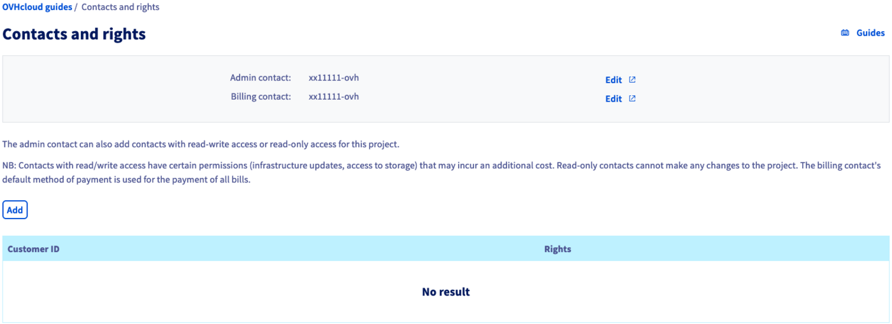
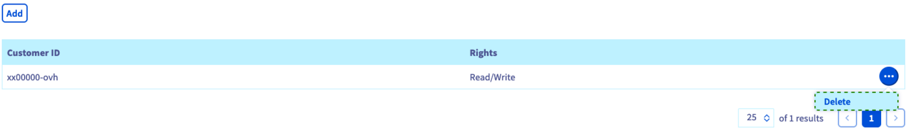

> [!primary]
> Tłumaczenie zostało wygenerowane automatycznie przez system naszego partnera SYSTRAN. W niektórych przypadkach mogą wystąpić nieprecyzyjne sformułowania, na przykład w tłumaczeniu nazw przycisków lub szczegółów technicznych. W przypadku jakichkolwiek wątpliwości zalecamy zapoznanie się z angielską/francuską wersją przewodnika. Jeśli chcesz przyczynić się do ulepszenia tłumaczenia, kliknij przycisk "Zgłóś propozycję modyfikacji" na tej stronie.
> 

## Wprowadzenie

W zależności od Twojego przypadku może zaistnieć konieczność udzielenia dostępu do Twojego projektu innym użytkownikom, bez zapewnienia im pełnego dostępu do Twoich usług. 
W tym celu możesz przekazać innym kontom klienta OVHcloud uprawnienia do odczytu lub odczytu / zapisu swoich projektów.

**Niniejszy przewodnik wyjaśnia, jak delegować uprawnienia dostępu do projektu Public Cloud w Panelu klienta.**

## Wymagania początkowe

- Posiadanie instancji [Public Cloud](https://www.ovhcloud.com/pl/public-cloud/) na Twoim koncie OVHcloud
- Dostęp do [Panelu klienta OVHcloud](https://www.ovh.com/auth/?action=gotomanager&from=https://www.ovh.pl/&ovhSubsidiary=pl)

## W praktyce 

Zaloguj się do [Panelu klienta OVHcloud](https://www.ovh.com/auth/?action=gotomanager&from=https://www.ovh.pl/&ovhSubsidiary=pl) i otwórz swój projekt `Public Cloud`{.action}. Kliknij `Contacts and Rights`{.action} w sekcji **Project Management**.

Na tej stronie możesz sprawdzić kontakty przypisane do Twojego projektu.

{.thumbnail}

Możesz kliknąć przycisk `Zmień`{.action}, aby zmienić aktualne kontakty. Postępuj zgodnie z instrukcjami zawartymi w przewodniku Zarządzanie [Zmiana kontaktów projektu](/pages/public_cloud/compute/change_project_contacts), aby zakończyć operację.

### Dodaj kontakty i uprawnienia

Kliknij przycisk `Dodaj`{.action}, aby dodać użytkownika i przypisać mu uprawnienia. W oknie, które się wyświetla wprowadź identyfikator użytkownika (w formacie xx00000-ovh), a następnie wybierz `Odczyt` lub `Odczyt/Zapis` w rozwijanym menu.

{.thumbnail}

> [!primary]
>
> Należy zauważyć, że prawa do `odczytu/zapisu` zezwalają na modyfikacje projektu, które mogą mieć wpływ na przyszłe faktury.
>
 
Kliknij `Dodaj`{.action}, aby zatwierdzić delegowanie dostępu. Otrzymasz wówczas e-mail z potwierdzeniem oraz nowy użytkownik, który będzie mógł otworzyć projekt w sekcji Public Cloud w Panelu klienta.

Po odświeżeniu strony w tabeli wyszczególnione są konta klienta OVHcloud oraz ich uprawnienia.

{.thumbnail}

Aby cofnąć dostęp, kliknij przycisk `...`{.action} i wybierz `Usuń`{.action}.

## Sprawdź również

[Uruchom instancję Public Cloud](/pages/public_cloud/compute/public-cloud-first-steps)

[Informacje o sposobie rozliczania usługi Public Cloud](/pages/public_cloud/compute/analyze_billing)

[Parametry dostępu i bezpieczeństwa w Horizon](/pages/public_cloud/compute/access_and_security_in_horizon)

Jeśli potrzebujesz szkolenia lub pomocy technicznej w celu wdrożenia naszych rozwiązań, skontaktuj się z przedstawicielem handlowym lub kliknij [ten link](https://www.ovhcloud.com/pl/professional-services/), aby uzyskać wycenę i poprosić o spersonalizowaną analizę projektu od naszych ekspertów z zespołu Professional Services.

Przyłącz się do społeczności naszych użytkowników na stronie <https://community.ovh.com/en/>.