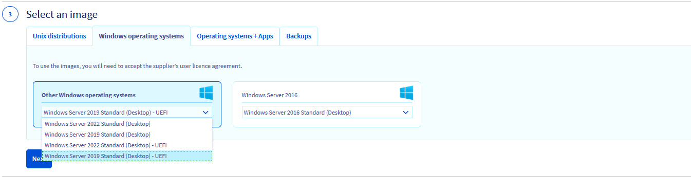
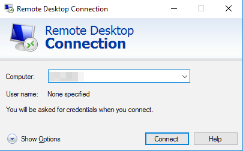

## Ziel

Die GPU Instanzen sind den Instanzen der 2017 Reihe technisch ähnlich, verfügen jedoch zusätzlich über eine Grafikkarte (Graphic Processing Unit oder GPU). Die verwendete Technologie (*pci_passthrough*) ermöglicht es dem Betriebssystem der Instanz, die GPU genau wie auf einer physischen Maschine zu steuern

Die angebotenen GPUs sind NVIDIA Tesla V100 und V100s.

> [!warning]
>
> Derzeit sind die meisten unserer alten GPU-Instanzen nur in den Regionen GRA7, GRA9, GRA11 und BHS5 verfügbar. Neuere Modelle sind derzeit nur in der Region GRA11 verfügbar.
> 

**In dieser Anleitung erfahren Sie, wie Sie eine GPU Instanz unter Linux oder Windows einrichten.**

## Voraussetzungen

- Sie haben ein [Public Cloud Projekt](https://www.ovhcloud.com/de/public-cloud) mit Zugriff auf die Regionen, in denen GPUs verfügbar sind (GRA7, GRA9, GRA11 und BHS5) in Ihrem Kunden-Account.
- [Ein SSH-Schlüssel](/pages/public_cloud/compute/public-cloud-first-steps#step-1-creating-ssh-keys) für die Bereitstellung einer Linux GPU Instanz erstellt.

## In der praktischen Anwendung

Nachfolgend finden Sie die Informationen, die zum Bereitstellen einer GPU Instanz unter Linux oder Windows erforderlich sind. Beachten Sie bitte, dass Sie das Instanz-Betriebssystem nicht ändern können, um von Linux auf Windows zu wechseln oder umgekehrt. Stellen Sie daher sicher, dass die Instanz in der Ausgangskonfiguration mit dem richtigen Betriebssystem erstellt wird.

### Unter Linux

Alle von uns angebotenen Images können auf einer GPU Instanz verwendet werden.

> [!primary]
>
> Wenn Sie mit dem manuellen Kompilieren eines Kernelmoduls nicht vertraut sind, empfehlen wir die Verwendung einer Distribution, die offiziell von NVIDIA unterstützt wird und für die _turnkey_ Treiber angeboten werden: <https://developer.nvidia.com/cuda-downloads>.
> 

Wenn Sie in Ihrem [OVHcloud Kundencenter](/links/manager) eingeloggt sind, klicken Sie auf den Tab `Public Cloud`{.action}. Wählen Sie Ihr Public Cloud Projekt aus und klicken Sie im linken Menü auf `Instances`{.action} im Tab **Compute**. Klicken Sie anschließend auf `Instanz erstellen`{.action} und wählen Sie eine GPU-kompatible Instanz aus:

{.thumbnail}

Folgen Sie anschließend den verbleibenden Schritten, wie in [dieser Anleitung](/pages/public_cloud/compute/public-cloud-first-steps#step-3-creating-an-instance) beschrieben. Dieser Vorgang kann einige Minuten dauern.

Die Instanz wird einige Sekunden später gestartet. Sie können sich dann anmelden und nach der Grafikkarte suchen: 

```bash
lspci | grep -i nvidia
00:05.0 3D-Controller: NVIDIA Corporation GV100GL [Tesla V100 PCIe 16GB] (rev a1)
```

Die Grafikkarte ist vorhanden, kann aber noch nicht verwendet werden. Dazu müssen Sie zuerst den NVIDIA-Treiber installieren. Die passenden Pakete finden Sie unter diesem Link: [Liste der verfügbaren Linux-Pakete](https://developer.download.nvidia.com/compute/cuda/repos/).

Die folgenden Befehle sind noch erforderlich:

```sh
wget URL_of_packet_to_download
sudo dpkg -i cuda-repo-XXXX-XXXXXX
sudo apt-get update
sudo apt-get upgrade
sudo apt-get install cuda
sudo reboot
```

> [!primary]
>
> Der Linux-Befehl kann je nach Version variieren. Im Zweifelsfall lesen Sie bitte die offizielle Dokumentation für Ihre Linux-Version.
> 

Nach dem Neustart der Instanz wird die Grafikkarte im NVIDIA-Dienstprogramm angezeigt:

```sh
nvidia-smi
Fri Dec  6 12:32:25 2019       
+-----------------------------------------------------------------------------+
| NVIDIA-SMI 418.67       Driver Version: 418.67       CUDA Version: 10.1     |
|-------------------------------+----------------------+----------------------+
| GPU  Name        Persistence-M| Bus-Id        Disp.A | Volatile Uncorr. ECC |
| Fan  Temp  Perf  Pwr:Usage/Cap|         Memory-Usage | GPU-Util  Compute M. |
|===============================+======================+======================|
|   0  Tesla V100-PCIE...  On   | 00000000:00:05.0 Off |                    0 |
| N/A   26C    P0    35W / 250W |      0MiB / 16130MiB |      5%      Default |
+-------------------------------+----------------------+----------------------+

+-----------------------------------------------------------------------------+
| Processes:                                                       GPU Memory |
|  GPU       PID   Type   Process name                             Usage      |
|=============================================================================|
|  No running processes found                                                 |
+-----------------------------------------------------------------------------+
```

Die GPU Instanz ist jetzt voll funktionsfähig und verwendbar.

### Unter Windows

Es gibt Inkompatibilitäten zwischen dem NVIDIA-Treiber und der Visualisierungslösung *KVM/pci_passthrough*. **Standard-Windows-Images funktionieren nicht.**

Wir stellen spezielle Images auf Basis eines virtuellen UEFI-BIOS zur Verfügung, die den ordnungsgemäßen Betrieb des Treibers ermöglichen:

{.thumbnail}

> [!warning]
>
> Wir bieten die Möglichkeit, die Sonderbilder auf einigen ausgewählten Modellen (T1-45, T1-90, T1-180, T2-45, T2-90, T2-180) zu installieren. Je nach ausgewählter Region sind diese speziellen Bilder möglicherweise nicht verfügbar.
>

Wenn Sie in Ihrem [OVHcloud Kundencenter](/links/manager) eingeloggt sind, gehen Sie in Ihr Public Cloud Projekt und klicken Sie im linken Menü im Tab **Compute** auf `Instances`{.action}. Klicken Sie anschließend auf `Instanz erstellen`{.action} und wählen Sie eine GPU-kompatible Instanz aus:

{.thumbnail}

Gehen Sie im nächsten Schritt auf den Tab `Windows-Distributionen` und klicken Sie auf den Dropdownpfeil, um das kompatible Windows-Abbild auszuwählen:

{.thumbnail}

Folgen Sie anschließend den verbleibenden Schritten, wie in [dieser Anleitung](/pages/public_cloud/compute/public-cloud-first-steps#step-3-creating-an-instance) beschrieben. Dieser Vorgang kann einige Minuten dauern.

#### Mit einer Windows-Instanz verbinden

Nachdem die Instanz fertig erstellt ist, muss die Windows-Installation abgeschlossen werden (_sysprep_). Klicken Sie hierzu auf `...`{.action} und dann auf `Instanz-Details`{.action}. Wechseln Sie zum Tab `VNC-Konsole`{.action}. Die Konsole sollte bereits das Post-Installationsfenster anzeigen.

{.thumbnail}

Legen Sie im ersten Schritt Ihre Standorteinstellungen fest, indem Sie eine Region, eine Sprache sowie das Tastaturlayout auswählen. Klicken Sie auf `Weiter`{.action}, um fortzufahren.

{.thumbnail}

Im zweiten Schritt wird der native “Administrator”-Account eingerichtet. Geben Sie zweimal Ihre Passphrase ein und klicken Sie auf `Beenden`{.action}, um den Installationsvorgang abzuschließen. Verwenden Sie das Augen-Symbol, um zu überprüfen, dass alle im Feld eingegebenen Zeichen dem Layout Ihrer Tastatur entsprechen.

Die Instanz wird neu gestartet und Sie können sich mithilfe dieser Login-Daten über einen Remotedesktop-Client einloggen. 

##### **Über Windows**

Verwenden Sie falls nötig die Windows-Suche und öffnen Sie den Windows-Client für Remote-Desktopverbindungen.

{.thumbnail}

Geben Sie die IPv4-Adresse Ihrer Instanz sowie “Administrator” als Benutzer und dann Ihre Passphrase ein. Normalerweise erscheint nun eine Warnungsmeldung, die Sie auffordert, die Verbindung aufgrund eines unbekannten Zertifikats zu bestätigen. Klicken Sie auf `Ja`{.action}, um sich mit Ihrer Instanz zu verbinden.

> [!primary]
>
Sollten bei diesem Vorgang Probleme auftreten, stellen Sie sicher, dass Remoteverbindungen (RDP) auf Ihrem Gerät erlaubt sind, indem Sie Ihre Systemeinstellungen, Firewall-Regeln und mögliche Netzwerkeinschränkungen kontrollieren.
>

Sobald Ihre GPU Instanz gestartet wurde, müssen Sie den NVIDIA-Treiber von der [offiziellen Webseite](https://www.nvidia.com/Download/index.aspx) installieren.

Anschließend müssen Sie nur noch den erforderlichen Treiber installieren, der dann in den Windows-Einstellungen angezeigt wird:

{.thumbnail}

{.thumbnail}

> [!warning]
>
> Wir können nicht garantieren, dass die Lösung mit allen zukünftigen Versionen des NVIDIA-Treibers funktioniert.
>
> Es wird dringend empfohlen, vor einem Update des NVIDIA-Treibers einen Snapshot Ihrer Instanz zu erstellen, damit Sie falls nötig zu einem vorherigen Zustand zurückkehren können.
>

## Weiterführende Informationen

Für den Austausch mit unserer User Community gehen Sie auf <https://community.ovh.com/en/>.
