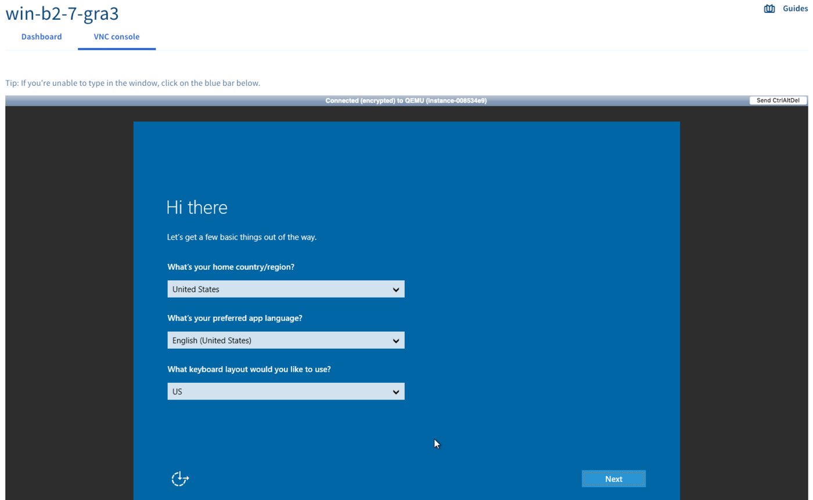

## Objective

GPU instances are technically similar to the instances from the older range, but they also have a graphics card (Graphic Processing Unit or GPU). The technology used (*pci_passthrough*) allows the instance’s operating system to control the GPU in exactly the same way a physical machine would.

> [!warning]
>
> At the moment, most of our old GPU instances (Tesla V100 and V100s) are only available in the GRA7, GRA9, GRA11, and BHS5 regions. The newer models (A100, H100, L4 and L40s) are only available in the GRA11 region for now.
>  

**This guide explains how to deploy a GPU instance on Linux or Windows**

## Requirements

- A Public Cloud project with access to the regions where most GPUs are available (GRA7, GRA9, GRA11 and BHS5)
- [An SSH key](/pages/public_cloud/compute/creating-ssh-keys-pci) created to deploy a linux GPU instance.

## Instructions

You will find the information needed to deploy a GPU instance on Linux or Windows below.

### On Linux

All the images we offer can be used on a GPU instance.

> [!primary]
>
> If you don’t feel comfortable with manually compiling a kernel module, we recommend using a distribution that is officially supported by Nvidia and for which they provide *turnkey* drivers: <https://developer.nvidia.com/cuda-downloads>.
> 

Once you have logged in to [your OVHcloud Control Panel](/links/manager), go to your Public Cloud project and click on `Instances`{.action} in the left-hand menu under the **Compute** tab. Next, click on `Create an instance`{.action} and choose a compatible GPU instance:

{.thumbnail}

Next, follow the remaining steps as detailed in [this guide](/pages/public_cloud/compute/public-cloud-first-steps#create-instance). This process may take a few minutes.

Once the instance is delivered, you can then log in and check for the graphics card: 

```bash
lspci | grep -i nvidia
00:05.0 VGA compatible controller: NVIDIA Corporation Device 1c03 (rev a1)
00:06.0 Audio device: NVIDIA Corporation Device 10f1 (rev a1)
```

The graphics card is there, but cannot be used yet. To do so, you must first install the NVIDIA driver. You can find the list of packages at this address: [List of available Linux packages](https://developer.download.nvidia.com/compute/cuda/repos/){.external}.

You will then need to enter the following commands:

```sh
wget URL_of_packet_to_download
sudo dpkg -i cuda-repo-XXXX-XXXXXX
sudo apt-get update
sudo apt-get upgrade
sudo apt-get install cuda
sudo reboot
```

> [!primary]
>
> The Linux command can vary based on your distribution. If in doubt, please check the official guide for your version of Linux.
> 

Once the instance has been rebooted, the graphics card will appear in the NVIDIA utility program:

```sh
nvidia-smi
Wed Apr 26 13:05:25 2017
+-----------------------------------------------------------------------------+
| NVIDIA-SMI 375.51                 Driver Version: 375.51                    |
|-------------------------------+----------------------+----------------------+
| GPU  Name        Persistence-M| Bus-Id        Disp.A | Volatile Uncorr. ECC |
| Fan  Temp  Perf  Pwr:Usage/Cap|         Memory-Usage | GPU-Util  Compute M. |
|===============================+======================+======================|
|   0  GeForce GTX 106...  Off  | 0000:00:05.0     Off |                  N/A |
|  0%   22C    P0    26W / 120W |      0MiB /  6072MiB |      0%      Default |
+-------------------------------+----------------------+----------------------+

+-----------------------------------------------------------------------------+
| Processes:                                                       GPU Memory |
|  GPU       PID  Type  Process name                               Usage      |
|=============================================================================|
|  No running processes found                                                 |
+-----------------------------------------------------------------------------+
```

The GPU instance is now fully functional and usable.

### On Windows

There are incompatibilities between the NVIDIA driver and the *KVM/pci_passthrough* virtualisation solution. **Windows standard images do not work.**

We offer special images, based on a virtual UEFI BIOS, which allow the driver to function correctly:

{.thumbnail}

> [!warning]
>
> We only offer the possiblity to install the special images on a few selected models (T1-45, T1-90, T1-180, T2-45, T2-90, T2-180). Additionally, depending on the region selected, these special images may not be available.
>

Once you have logged in to [your OVHcloud Control Panel](/links/manager), go to your Public Cloud project and click on `Instances`{.action} in the left-hand menu under the **Compute** tab. Next, click on `Create an instance`{.action} and choose a compatible GPU instance:

{.thumbnail}

In the next step, go to the `Windows operating systems` tab and click ont the drop-down arrow to select the compatible Windows image:

{.thumbnail}

Next, follow the remaining steps as detailed in [this guide](/pages/public_cloud/compute/public-cloud-first-steps#create-instance). This process may take a few minutes.

> [!warning]
>
> We cannot guarantee that the solution will work with all future versions of the NVIDIA driver.
>
> Before performing any update of the NVIDIA driver, we strongly recommend that you take a snapshot of your instnace, this will allow you to do a rollback if necessary.
>

#### Connecting to a Windows OS instance

After the instance has been created, the Windows installation needs to be finalised (_sysprep_). To achieve this, click on `...`{.action} and then on `Instance details`{.action}. Switch to the tab `VNC console`{.action}. The console should already display the post-installation interface.

{.thumbnail}

In the first step, decide on your localisation settings by selecting a region, a language and a keyboard layout. Click on `Next`{.action} to proceed.

{.thumbnail}

The second step requires to set up the default "Administrator" account. Enter your passphrase twice and click on `Finish`{.action} to complete the installation process. Use the eye symbol to check if all the characters entered into the fields match the actual layout of your keyboard.

The instance will reboot and you will be able to log in with these credentials using a remote desktop client. 

##### **From Windows**

Use the Windows Search if necessary and open the native "Remote Desktop Connection" client application.

{.thumbnail}

Enter the IPv4 address of your instance and "Administrator" as the user, then type your passphrase. Usually, a warning message will appear, asking to confirm the connection because of an unknown certificate. Click on `Yes`{.action} to log in to the instance.

> [!primary]
>
If you experience any issues with this procedure, verify that remote (RDP) connections are allowed on your device by checking your system settings, firewall rules and possible network restrictions.
>

Once you have connected to your instance, you will need to install the NVIDIA driver from the [official website](https://www.nvidia.com/Download/index.aspx){.external}.

Afterwards, all that’s left to do is to install the required driver, which will then be displayed here:

{.thumbnail}

{.thumbnail}

## Going further

Join our [community of users](/links/community).
