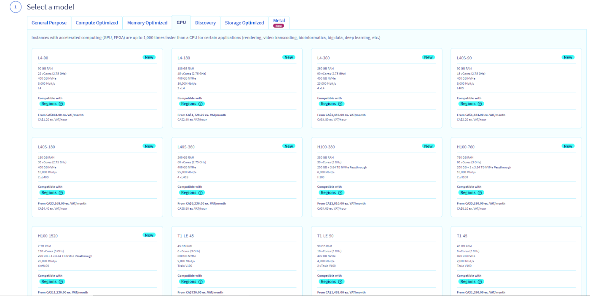
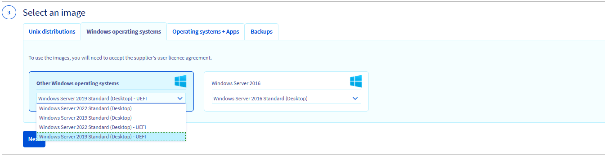
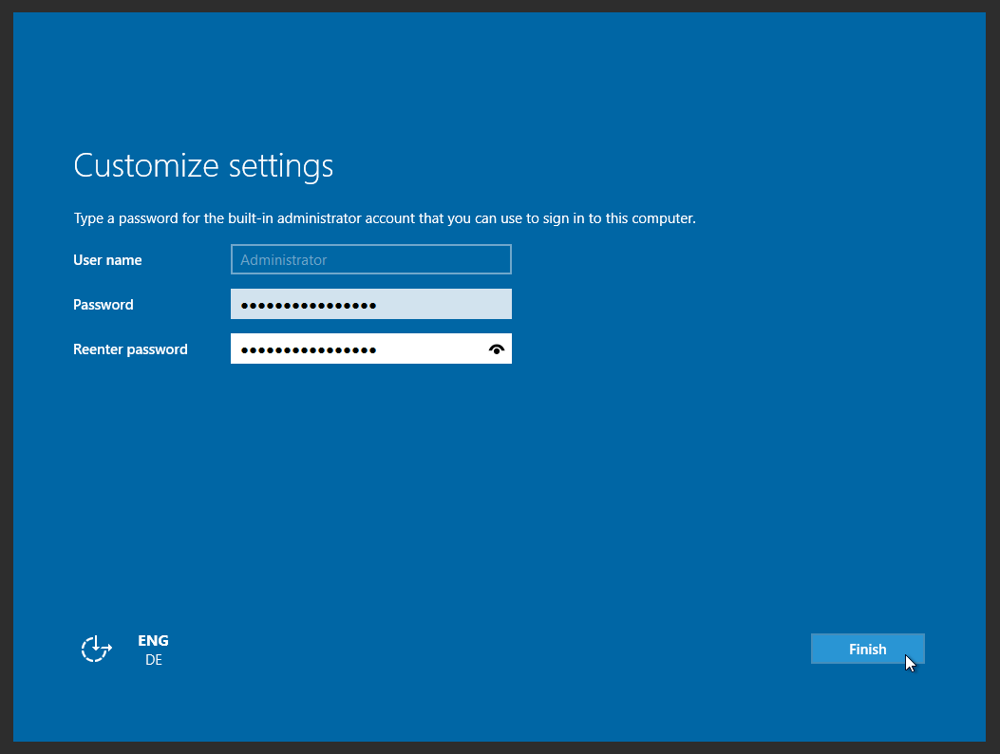
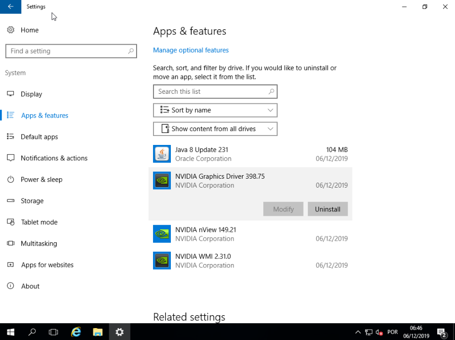
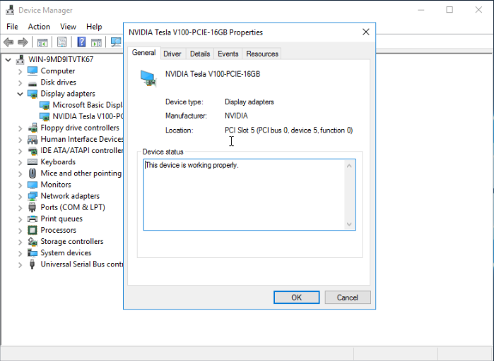

> [!primary]
> Esta traducción ha sido generada de forma automática por nuestro partner SYSTRAN. En algunos casos puede contener términos imprecisos, como en las etiquetas de los botones o los detalles técnicos. En caso de duda, le recomendamos que consulte la versión inglesa o francesa de la guía. Si quiere ayudarnos a mejorar esta traducción, por favor, utilice el botón "Contribuir" de esta página.
>

## Objetivo

Las instancias GPU son técnicamente similares a las instancias de la gama 2017, pero disponen además de una tarjeta gráfica (Graphic Processing Unit o GPU). La tecnología utilizada (*pci_passthrough*) permite que el sistema operativo de la instancia controle la GPU exactamente igual que en una máquina física.

> [!warning]
>
> Actualmente, la mayoría de nuestras antiguas instancias GPU (Tesla V100 and V100s) solo están disponibles en las regiones GRA7, GRA9, GRA11 y BHS5. Por el momento, los modelos más recientes (A100, H100, L4 and L40s) sólo están disponibles en GRA11.
> 

**Esta guía explica cómo instrumentar una instancia de GPU en Linux o Windows**

## Requisitos

- Un proyecto Public Cloud con acceso a las regiones en las que están disponibles la mayoría de las GPU (GRA7, GRA9, GRA11 y BHS5).
- [Una llave SSH](/pages/public_cloud/compute/creating-ssh-keys-pci) creada para desplegar una instancia GPU Linux.

## Procedimiento

A continuación, encontrará la información necesaria para instrumentar una instancia de GPU en Linux o Windows.

Tenga en cuenta que no puede cambiar el sistema operativo de la instancia de Linux a Windows, o viceversa. Por tanto, asegúrese de crear la instancia con el sistema operativo correcto por defecto.

### En Linux

Todas las imágenes que ofrecemos pueden utilizarse en una instancia de GPU.

> [!primary]
>
> Si no se siente a gusto con la compilación manual de un módulo kernel, le recomendamos usar una distribución con soporte oficial de Nvidia y para la que se proporcionen controladores *listos para usar*: <https://developer.nvidia.com/cuda-downloads>.
> 

Una vez conectado a su [área de cliente de OVHcloud](/links/manager), haga clic en la pestaña `Public Cloud`{.action}. Seleccione su proyecto de Public Cloud y haga clic en `Instances`{.action} en el menú de la izquierda de la pestaña **Compute**. A continuación, haga clic en `Crear una instancia`{.action} y seleccione una instancia GPU compatible:

{.thumbnail}

A continuación, siga los pasos que se describen en [esta guía](/pages/public_cloud/compute/public-cloud-first-steps#create-instance). Este proceso puede tardar unos minutos.

Una vez entregada la instancia, puede conectarse a ella y comprobar la presencia de la tarjeta gráfica:

```bash
lspci | grep -i nvidia
00:05.0 3D controller: NVIDIA Corporation GV100GL [Tesla V100 PCIe 16GB] (rev a1)
```

La tarjeta gráfica está ahí, pero todavía no puede utilizarse. Para ello, primero debe instalar el controlador NVIDIA. Puede encontrar la lista de los paquetes en esta dirección: [Lista de paquetes Linux disponibles](https://developer.download.nvidia.com/compute/cuda/repos/){.external}.

A continuación, deberá introducir los siguientes comandos:

```sh
wget URL_of_packet_to_download
sudo dpkg -i cuda-repo-XXXX-XXXXXX
sudo apt-get update
sudo apt-get upgrade
sudo apt-get install cuda
sudo reboot
```

> [!primary]
>
> El comando de Linux puede variar en función de su distribución. Si tiene dudas, consulte la guía oficial de su versión de Linux.
> 

Una vez reiniciada la instancia, la tarjeta gráfica aparecerá en la utilidad NVIDIA:

```sh
nvidia-smi
Fri Dec  6 12:32:25 2019       
+-----------------------------------------------------------------------------+
| NVIDIA-SMI 418.67       Driver Version: 418.67       CUDA Version: 10.1     |
|-------------------------------+----------------------+----------------------+
| GPU  Name        Persistence-M| Bus-Id        Disp.A | Volatile Uncorr. ECC |
| Fan  Temp  Perf  Pwr:Usage/Cap|         Memory-Usage | GPU-Util  Compute M. |
|===============================+======================+======================|
|   0  Tesla V100-PCIE...  On   | 00000000:00:05.0 Off |                    0 |
| N/A   26C    P0    35W / 250W |      0MiB / 16130MiB |      5%      Default |
+-------------------------------+----------------------+----------------------+
                                                                               
+-----------------------------------------------------------------------------+
| Processes:                                                       GPU Memory |
|  GPU       PID   Type   Process name                             Usage      |
|=============================================================================|
|  No running processes found                                                 |
+-----------------------------------------------------------------------------+
```

A partir de ahí, la instancia de GPU estará completamente funcional y podrá utilizarse.

### En Windows

Existen incompatibilidades entre el controlador NVIDIA y la solución de virtualización *KVM/pci_passthrough*. **Las imágenes estándar de Windows no funcionan.**

Proporcionamos imágenes especiales, basadas en una BIOS virtual UEFI, que permiten que el driver funcione correctamente:

{.thumbnail}

> [!warning]
>
> Ofrecemos la posibilidad de instalar imágenes especiales en algunos modelos seleccionados (T1-45, T1-90, T1-180, T2-45, T2-90, T2-180). Además, en función de la región seleccionada, es posible que estas imágenes especiales no estén disponibles.
>

Una vez conectado a [su área de cliente de OVHcloud](/links/manager), acceda a su proyecto Public Cloud y haga clic en `Instances`{.action} en el menú de la izquierda de la pestaña **Compute**. A continuación, haga clic en `Crear una instancia`{.action} y seleccione una instancia GPU compatible :

{.thumbnail}

En el siguiente paso, vaya a la pestaña `Distribuciones Windows` y haga clic en la flecha desplegable para seleccionar la imagen Windows compatible:

{.thumbnail}

A continuación, siga los pasos que se describen en [esta guía](/pages/public_cloud/compute/public-cloud-first-steps#create-instance). Este proceso puede tardar unos minutos.

#### Conexión a una instancia Windows

Una vez creada su instancia, deberá completar la instalación de Windows (_sysprep_). Para ello, haga clic en el botón `...`{.action} y seleccione `Detalles de la instancia`{.action}. Acceda a la pestaña `Consola VNC`{.action}. La consola deberá mostrar la interfaz de post-instalación.

{.thumbnail}

En primer lugar, seleccione el país, el idioma y la distribución del teclado. A continuación, haga clic en `Siguiente`{.action}.

{.thumbnail}

En segundo lugar, deberá configurar la cuenta del administrador por defecto. Introduzca su contraseña y, por último, haga clic en `Finalizar`{.action} para completar el proceso de instalación. Puede utilizar el icono con forma de ojo para comprobar que los caracteres introducidos en el campo de la contraseña coinciden con la distribución de su teclado.

La instancia se reiniciará y podrá conectarse utilizando sus claves desde un cliente de escritorio remoto. 

##### **En Windows**

Si lo necesita, utilice el cuadro de búsqueda de Windows y abra la aplicación de «Conexión a Escritorio remoto».

{.thumbnail}

Indique la dirección IPv4 de su instancia y el usuario "Administrator" y, a continuación, introduzca su frase de contraseña. Al tratarse de un certificado desconocido, es probable que aparezca un mensaje de aviso pidiéndole que confirme la conexión. Confirme que quiere conectarse a la instancia.

> [!primary]
>
> Si tiene problemas para conectarse, compruebe que el dispositivo permite las conexiones remotas (RDP). Para ello, consulte la configuración de su sistema, las reglas de firewall y las posibles restricciones de red.
>

Cuando se haya iniciado su instancia de GPU, deberá instalar el controlador NVIDIA desde el [sitio web oficial](https://www.nvidia.com/Download/index.aspx){.external}.

Después, todo lo que falta por hacer es instalar el controlador necesario, el cual se mostrará aquí:

{.thumbnail}

{.thumbnail}

> [!warning]
>
> No podemos garantizar que la solución funcione con todas las versiones futuras del driver NVIDIA.
>
> Antes de actualizar el driver NVIDIA, le recomendamos encarecidamente que realice un snapshot de su instancia para poder volver atrás en caso necesario.
>

## Más información

Interactúe con nuestra comunidad de usuarios en <https://community.ovh.com/en/>.