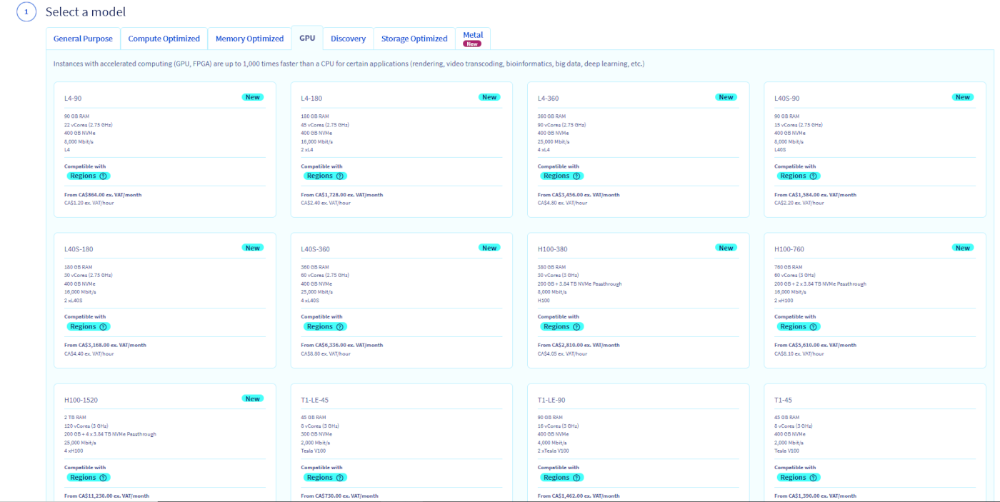

## Objectif

Les instances GPU sont techniquement similaires aux instances de la gamme 2017 mais disposent en plus d'une carte graphique (Graphic Processing Unit ou GPU). La technologie utilisée (*pci_passthrough*) permet au système d'exploitation de l'instance de contrôler le GPU exactement comme sur une machine physique.

Les GPU proposés sont les NVIDIA Tesla V100 et V100s. 

> [!warning]
>
> Pour le moment, la plupart de nos anciennes instances GPU sont uniquement disponibles dans les régions GRA7, GRA9, GRA11 et BHS5. Les modèles plus récents ne sont disponibles que dans la région GRA11 pour le moment.
>

**Ce guide vous explique comment déployer une instance GPU sous Linux ou sous Windows**

## Prérequis

- Un projet Public Cloud avec accès aux régions où la plupart des GPU sont disponibles (GRA7, GRA9, GRA11 et BHS5).
- [Une clé SSH](/pages/public_cloud/compute/public-cloud-first-steps#step-1-creating-ssh-keys) créée pour déployer une instance GPU Linux.

## En pratique

Vous trouverez ci-dessous les informations pour déployer une instance GPU via Linux ou via Windows.

### Sous Linux

Toutes les images que nous proposons peuvent être utilisées sur une instance GPU.

> [!primary]
>
> Si vous n'êtes pas à l'aise avec la compilation manuelle de module noyau, nous vous recommandons d'utiliser une distribution officiellement supportée par Nvidia, pour laquelle ils fournissent des drivers *clés-en-main* : <https://developer.nvidia.com/cuda-downloads>.
> 

Une fois connecté dans votre [espace client OVHcloud](/links/manager) dans votre project Public Cloud et cliquez sur `Instances`{.action} dans le menu de gauche sous l'onglet **Compute**. Ensuite, cliquez sur `Créer une instance`{.action} et choisissez une instance GPU compatible :

{.thumbnail}

Suivez ensuite les étapes restantes comme détaillé dans [ce guide](/pages/public_cloud/compute/public-cloud-first-steps#step-3-creating-an-instance). Ce processus peut prendre quelques minutes.

Une fois l'instance livrée, vous pouvez vous y connecter et vérifier la présence de la carte graphique :

```bash
lspci | grep -i nvidia
00:05.0 VGA compatible controller: NVIDIA Corporation Device 1c03 (rev a1)
00:06.0 Audio device: NVIDIA Corporation Device 10f1 (rev a1)
```

La carte graphique est présente mais n'est pas encore utilisable, il faut maintenant installer les drivers NVIDIA. Vous trouverez la liste des paquets à l'adresse suivante : [Liste des paquets Linux disponibles](http://developer.download.nvidia.com/compute/cuda/repos/){.external}.

Il suffira ensuite de taper les commandes suivantes :

```sh
wget URL_du_paquet_à_télécharger
sudo dpkg -i cuda-repo-XXXX-XXXXXX
sudo apt-get update
sudo apt-get upgrade
sudo apt-get install cuda
sudo reboot
```

> [!primary]
>
> La commande Linux peut varier en fonction de votre distribution. En cas de doute, consultez la documentation officielle de votre version de Linux.
> 

Une fois l'instance redémarrée, la carte graphique apparaît dans l'utilitaire NVIDIA :

```sh
nvidia-smi
Wed Apr 26 13:05:25 2017
+-----------------------------------------------------------------------------+
| NVIDIA-SMI 375.51                 Driver Version: 375.51                    |
|-------------------------------+----------------------+----------------------+
| GPU  Name        Persistence-M| Bus-Id        Disp.A | Volatile Uncorr. ECC |
| Fan  Temp  Perf  Pwr:Usage/Cap|         Memory-Usage | GPU-Util  Compute M. |
|===============================+======================+======================|
|   0  GeForce GTX 106...  Off  | 0000:00:05.0     Off |                  N/A |
|  0%   22C    P0    26W / 120W |      0MiB /  6072MiB |      0%      Default |
+-------------------------------+----------------------+----------------------+

+-----------------------------------------------------------------------------+
| Processes:                                                       GPU Memory |
|  GPU       PID  Type  Process name                               Usage      |
|=============================================================================|
|  No running processes found                                                 |
+-----------------------------------------------------------------------------+
```

L'instance GPU est désormais pleinement fonctionelle et utilisable.

### Sous Windows

Il y a des incompatibilités entre le driver Nvidia et la solution de virtualisation *KVM/pci_passthrough*. **Les images Windows standard ne fonctionnent pas.**

Nous fournissons des images spéciales, reposant sur un BIOS virtuel UEFI, qui permettent au driver de fonctionner correctement :

{.thumbnail}

> [!warning]
>
> Nous offrons la possibilité d'installer les images spéciales sur quelques modèles sélectionnés (T1-45, T1-90, T1-180, T2-45, T2-90, T2-180). En outre, selon la région sélectionnée, ces images spéciales peuvent ne pas être disponibles.
>

Une fois connecté à [votre espace client OVHcloud](/links/manager), rendez-vous dans votre projet Public Cloud et cliquez sur `Instances`{.action} dans le menu de gauche sous l'onglet **Compute**. Ensuite, cliquez sur `Créer une instance`{.action} et choisissez une instance GPU compatible :

{.thumbnail}

Dans l'étape suivante, rendez-vous dans l'onglet `Systèmes d'exploitation Windows` et cliquez sur la flèche déroulante pour sélectionner l'image Windows compatible :

{.thumbnail}

Suivez ensuite les étapes restantes comme détaillé dans [ce guide](/pages/public_cloud/compute/public-cloud-first-steps#step-3-creating-an-instance). Ce processus peut prendre quelques minutes.

> [!warning]
>
> Il ne nous est pas possible de garantir que la  solution fonctionnera avec toutes les versions futures du driver NVIDIA.
>
> Avant toute mise à jour du driver NVIDIA il est fortement recommandé de prendre un snapshot qui vous permettra de revenir en arrière le cas échéant.
>

#### Connexion à une instance Windows

Une fois l'instance créée, l'installation de Windows doit être finalisée (sysprep). Cliquez sur `...`{.action}, puis sur `Détails de l'instance`{.action}. Dirigez-vous sur l'onglet `Console VNC`{.action}. La console doit déjà afficher l'interface de post-installation.

{.thumbnail}

Dans la première étape, choisissez vos paramètres de localisation en sélectionnant une région, une langue et une configuration de clavier. Cliquez sur `Suivant`{.action} pour continuer.

{.thumbnail}

La deuxième étape nécessite la configuration du compte « Administrator » par défaut. Entrez votre mot de passe deux fois et cliquez sur `Terminer`{.action} pour valider le processus d'installation. Utilisez le symbole de l'oeil pour vérifier si tous les caractères saisis dans les champs correspondent à la configuration réelle de votre clavier.

L'instance redémarrera et vous pourrez vous connecter avec ces informations d'identification à l'aide d'un logiciel de bureau distant RDP (Remote Desktop Protocol).

##### **Depuis Windows**

Utilisez Windows Search si nécessaire et ouvrez l'application cliente native "Connexion Bureau à distance".

{.thumbnail}

Entrez l'adresse IPv4 de votre instance et "Administrator" en tant qu'utilisateur, puis tapez votre mot de passe. Habituellement, un message d'avertissement s'affiche, vous demandant de confirmer la connexion en raison d'un certificat inconnu. Cliquez sur `Oui`{.action} pour vous connecter à l'instance.

> [!primary]
>
Si vous rencontrez des problèmes avec cette procédure, vérifiez que les connexions distantes (RDP) sont autorisées sur votre machine en vérifiant les paramètres de votre système, les règles de pare-feu et les éventuelles restrictions réseau. 
>

Une fois connecté à votre instance, vous devrez installer le pilote NVIDIA depuis le [site officiel] (https://www.nvidia.com/Download/index.aspx){.external}.

Il rester à installer le pilote nécessaire, qui apparaîtra ensuite ici :

{.thumbnail}

{.thumbnail}

## Aller plus loin

Échangez avec notre communauté d'utilisateurs sur <https://community.ovh.com>.
