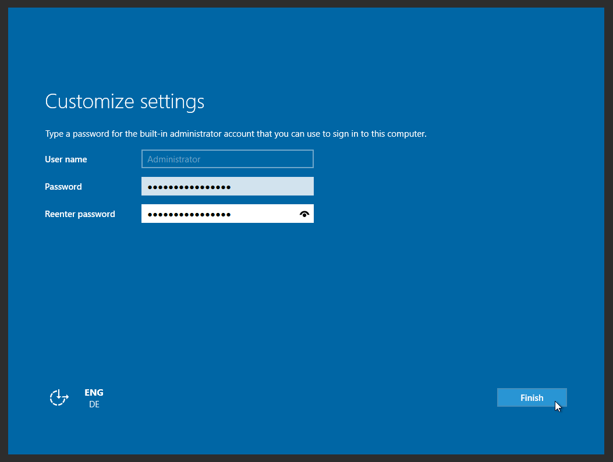

## Objetivo

As instâncias GPU são tecnicamente semelhantes às instâncias da gama 2017, mas dispõem também de uma placa gráfica (Unidade de Processamento Gráfico ou GPU). A tecnologia utilizada (*pci_passthrough*) permite ao sistema operativo da instância controlar a GPU tal como faria uma máquina física.

As GPU disponibilizadas são as NVIDIA Tesla V100 e V100s. 

> [!warning]
>
> Atualmente, a maior parte das nossas antigas instâncias GPU só estão disponíveis nas regiões GRA7, GRA9, GRA11 e BHS5. Os modelos mais recentes estão apenas disponíveis na região GRA11.
> 

**Este guia explica como criar uma instância GPU em Linux ou Windows**

## Requisitos

- Um projeto Public Cloud com acesso às regiões onde a maior parte das GPU estão disponíveis (GRA7, GRA9, GRA11 e BHS5).
- [Uma chave SSH](/pages/public_cloud/compute/public-cloud-first-steps#step-1-creating-ssh-keys) criada para criar uma instância GPU Linux.

## Instruções

Encontrará a informação necessária para criar uma instância GPU em Linux ou Windows abaixo.
Note que não é possível alterar o sistema operativo da instância de Linux para Windows, ou vice-versa. Por isso, certifique-se de que cria a instância com o sistema operativo predefinido correto.

### Em Linux

Todas as imagens que disponibilizamos são compatíveis com uma instância GPU.

> [!primary]
>
> Se não se sentir à vontade para compilar manualmente um módulo do kernel, recomendamos que utilize uma distribuição oficialmente suportada pela Nvidia e para a qual a Nvidia forneça drivers *prontos a usar*: <https://developer.nvidia.com/cuda-downloads>.
> 

Depois de aceder à [Área de Cliente OVHcloud](/links/manager), clique no separador `Public Cloud`{.action}. Selecione o seu projeto Public Cloud e clique em `Instances`{.action} no menu à esquerda no separador **Compute**. De seguida, clique em `Criar instância`{.action} e escolha uma instância GPU compatível:

{.thumbnail}

A seguir, siga os passos restantes, conforme descrito em [este guia](/pages/public_cloud/compute/public-cloud-first-steps#step-3-creating-an-instance). Este processo pode levar alguns minutos.

Depois de entregar a instância, poderá aceder à mesma e verificar a presença da placa gráfica:

```bash
lspci | grep -i nvidia
00:05.0 3D controller: NVIDIA Corporation GV100GL [Tesla V100 PCIe 16GB] (rev a1)
```

A placa gráfica está identificada, mas ainda não pode ser utilizada. Para o fazer, primeiro deve instalar o driver NVIDIA. Pode encontrar a lista dos pacotes no seguinte endereço: [Lista de pacotes Linux disponíveis](http://developer.download.nvidia.com/compute/cuda/repos/){.external}.

Em seguida, deve executar os seguintes comandos:

```sh
wget URL_of_packet_to_download
sudo dpkg -i cuda-repo-XXXX-XXXXXX
sudo apt-get update
sudo apt-get upgrade
sudo apt-get install cuda
sudo reboot
```

> [!primary]
>
> O comando Linux pode variar em função da sua distribuição. Em caso de dúvida, consulte o guia oficial da sua versão Linux.
> 

Uma vez reiniciada a instância, a placa gráfica surge no utilitário NVIDIA:

```sh
nvidia-smi
Fri Dec  6 12:32:25 2019       
+-----------------------------------------------------------------------------+
| NVIDIA-SMI 418.67       Driver Version: 418.67       CUDA Version: 10.1     |
|-------------------------------+----------------------+----------------------+
| GPU  Name        Persistence-M| Bus-Id        Disp.A | Volatile Uncorr. ECC |
| Fan  Temp  Perf  Pwr:Usage/Cap|         Memory-Usage | GPU-Util  Compute M. |
|===============================+======================+======================|
|   0  Tesla V100-PCIE...  On   | 00000000:00:05.0 Off |                    0 |
| N/A   26C    P0    35W / 250W |      0MiB / 16130MiB |      5%      Default |
+-------------------------------+----------------------+----------------------+
                                                                               
+-----------------------------------------------------------------------------+
| Processes:                                                       GPU Memory |
|  GPU       PID   Type   Process name                             Usage      |
|=============================================================================|
|  No running processes found                                                 |
+-----------------------------------------------------------------------------+
```

A instância GPU está agora totalmente funcional e utilizável.

### Em Windows

Existem incompatibilidades entre o driver NVIDIA e a solução de virtualização *KVM/pci_passthrough*. **As imagens padrão do Windows não funcionam.**
Por isso, oferecemos imagens especiais, baseadas numa BIOS virtual UEFI e que permitem um funcionamento correto do driver:

{.thumbnail}

> [!warning]
>
> Oferecemos a possibilidade de instalar imagens especiais em alguns modelos selecionados (T1-45, T1-90, T1-180, T2-45, T2-90, T2-180). Além disso, dependendo da região selecionada, estas imagens especiais podem não estar disponíveis.
>

Depois de aceder à [Área de Cliente OVHcloud](/links/manager), aceda ao seu projeto Public Cloud e clique em `Instances`{.action} no menu à esquerda no separador **Compute**. De seguida, clique em `Criar uma instância`{.action} e escolha uma instância GPU compatível:

{.thumbnail}

Na próxima etapa, vá à guia `Distribuições Windows` e clique na seta suspensa para selecionar a imagem do Windows compatível:

{.thumbnail}

A seguir, siga os passos restantes, conforme descrito em [este guia](/pages/public_cloud/compute/public-cloud-first-steps#step-3-creating-an-instance). Este processo pode levar alguns minutos.

#### Conexão a uma instância Windows

Depois de a instância ser criada, é preciso finalizar a instalação Windows (_sysprep_). Para isso, clique em `...`{.action} e em `Dados da instância`{.action}. Passe para o separador `Consola VNC`{.action}. A consola já deverá exibir a interface pós-instalação.

{.thumbnail}

No primeiro passo, configure a sua localização selecionando uma região, uma língua e um tipo de teclado. Para prosseguir, clique em `Avançar`{.action}.

{.thumbnail}

O segundo passo requer a configuração da conta predefinida «Administrator». Introduza duas vezes a sua frase de acesso e clique em `Concluir`{.action} para finalizar o processo de instalação. Use o símbolo do olho para verificar se todos os caracteres introduzidos nos campos correspondem à configuração real do seu teclado.

Depois de a instância ser reiniciada, poderá conectar-se com estas credenciais por meio de um cliente de ambiente de trabalho remoto. 

##### **A partir de Windows**

Use o Windows Search se necessário e abra a aplicação cliente nativa «Remote Desktop Connection».

{.thumbnail}

Introduza o endereço IPv4 da instância e indique «Administrator» como utilizador. Então, digite a frase de acesso. É possível que receba uma mensagem de aviso a pedir-lhe para confirmar a conexão devido a uma certificado desconhecido. Clique em `Sim`{.action} para se conectar à instância.

> [!primary]
>
Se encontrar problemas, verifique se a sua máquina permite conexões remotas (RDP): para isso, consulte as configurações de sistema, as regras de firewall e eventuais restrições de rede.
>

Depois de a sua instância GPU ser iniciada, deve instalar o driver NVIDIA a partir do [website oficial](https://www.nvidia.com/Download/index.aspx){.external}.

Depois desse processo, basta instalar o driver necessário que será depois apresentado aqui:

{.thumbnail}

{.thumbnail}


> [!warning]
>
> Não nos é possível garantir que a solução funcionará com todas as versões futuras do driver NVIDIA.
>
> Antes de qualquer atualização do driver NVIDIA, é fortemente recomendado que efetue uma snapshot da sua instância, o que lhe permitirá voltar atrás caso seja necessário.
>

## Vá mais longe

Junte-se à nossa comunidade de utilizadores em <https://community.ovh.com/en/>.