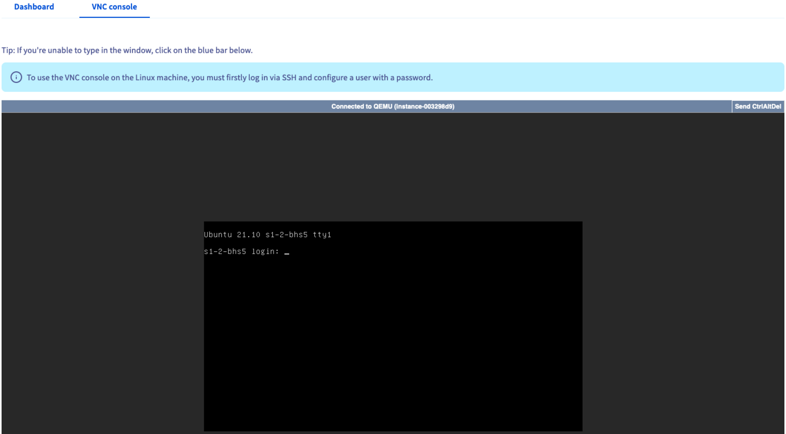

## Ziel

Sie können Ihre Public Cloud Instanzen in Ihrem [OVHcloud Kundencenter](/links/manager) verwalten.

**Diese Anleitung beschreibt die im OVHcloud Kundencenter verfügbaren Aktionen für eine Public Cloud Instanz.**

## Voraussetzungen

- Sie verfügen über ein [Public Cloud Projekt](/links/public-cloud/public-cloud) in Ihrem OVHcloud Kunden-Account.
- Sie haben eine [Public Cloud Instanz](/pages/public_cloud/compute/public-cloud-first-steps) in Ihrem Projekt erstellt.

<!-- CP-NAV-START:publiccloud-projects -->
---

### Zugriff auf das OVHcloud Kundencenter

- **Direkter Link:** [Public Cloud Projekte](/links/control-panel/publiccloud-projects)
- **Navigationspfad:** `Public Cloud`{.action} > Wählen Sie Ihr Projekt aus

---
<!-- CP-NAV-END:publiccloud-projects -->

## In der praktischen Anwendung

### Das Verwaltungsinterface für Instanzen verwenden

Klicken Sie im linken Menü auf `Instanzen`{.action}.

Diese Seite zeigt alle Ihre Public Cloud Instanzen und einige ihrer Eigenschaften an:

- Die ID der Instanz (erforderlich für bestimmte API-Aufrufe)
- Der Standort des Rechenzentrums, d.h. die Region der Instanz
- Das Modell der Instanz
- Das Image, d.h. das auf der Instanz installierte Betriebssystem
- Die IPv4-Adresse der Instanz
- Die private Adresse, die derzeit an die Instanz angehängt ist
- Zusätzliche Volumes (Disks), die derzeit mit der Instanz verbunden sind
- Der Status der Instanz, der anzeigt, ob sich die Instanz im Zustand `Aktiviert` befindet

### Verwaltungsoptionen im Instanz-Dashboard

Klicken Sie auf der Instanzverwaltungsseite auf den Namen der betreffenden Instanz.

Sie gelangen auf die Seite `Allgemeine Informationen`, die die wichtigsten Details und den Betriebsstatus Ihrer Instanz zusammenfasst (Status, Ressourcen, Netzwerk, Zugang und Metadaten).

Einige dieser Aktionen sind auch auf der Instanzverwaltungsseite verfügbar, wenn Sie auf den Button `...`{.action} in der Tabelle klicken.

#### Konfiguration einer Instanz bearbeiten

Klicken Sie auf `Image ändern`{.action} oder öffnen Sie `Zusätzliche Aktionen`{.action} und wählen Sie dann `Bearbeiten`{.action}.

Die neue Seite zeigt eine modifizierte Ansicht der Optionen zur [Erstellung von Instanzen](/pages/public_cloud/compute/public-cloud-first-steps), in der Sie die folgenden Elemente bearbeiten können:

- **Instanz umbenennen**: Sie können der Instanz einen Namen geben, um die Identifikation zu vereinfachen.
- **Image ändern**: Sie können ein anderes Betriebssystem für die Instanz auswählen. (Beachten Sie, dass bei der Reinstallation einer Instanz alle darauf gespeicherten Daten gelöscht werden.)
- **Modell ändern**: Sie können auf ein anderes Instanz-Modell wechseln. Weitere Informationen zu den Optionen finden Sie in [dieser Anleitung](/pages/public_cloud/compute/public-cloud-first-steps#model).
- **Abrechnungszeitraum ändern**: Sie können den Abrechnungszeitraum der Instanz von stündlicher auf monatliche Abrechnung ändern. Weitere Informationen finden Sie in [dieser Anleitung](/pages/account_and_service_management/managing_billing_payments_and_services/changing_hourly_monthly_billing).

#### Backup einer Instanz erstellen

Klicken Sie auf `Backup erstellen`{.action}.

Weitere Informationen finden Sie in unserer Anleitung "[Backup einer Instanz erstellen](/pages/public_cloud/compute/save_an_instance)".

#### Instanz löschen

Klicken Sie auf `Löschen`{.action}.

Diese Aktion löscht die Instanz und alle zugehörigen Daten endgültig.

Bestätigen Sie die Löschungsanfrage im angezeigten Fenster.

> [!warning]
> Das Löschen einer Instanz löscht nicht automatisch alle damit verbundenen Optionen (Storage, Snapshot, Backup, etc...). Stellen Sie sicher, dass alle anderen mit der Instanz verbundenen Optionen ebenfalls gelöscht werden, um deren Abrechnung zu stoppen.
>

#### Volume hinzufügen

Klicken Sie auf `Volume hinzufügen`{.action}.

Wählen Sie das Volume aus, das Sie der Instanz zuordnen möchten, und klicken Sie auf `Bestätigen`{.action}. Nach dem Anhängen ist das Volume sofort verfügbar und kann über das Betriebssystem der Instanz eingebunden werden.

#### DNS Reverse ändern

Klicken Sie auf `⋮`{.action} und dann auf `DNS Reverse ändern`{.action}.

Weitere Informationen finden Sie in der Anleitung "[Reverse DNS einer Instanz konfigurieren](/pages/public_cloud/compute/setup_instance_reverse)".

#### Firewall konfigurieren

Klicken Sie auf `⋮`{.action} und dann auf `Firewall konfigurieren`{.action}.

Weitere Informationen finden Sie in der Anleitung "[Edge Network Firewall aktivieren und konfigurieren](/pages/bare_metal_cloud/dedicated_servers/firewall_network)".

#### Private Netzwerke verwalten

Klicken Sie auf `⋮`{.action} und dann auf `Private Netzwerke verwalten`{.action}.

Weitere Informationen finden Sie in der Anleitung "[Ein privates Netzwerk mit Gateway erstellen](/pages/public_cloud/public_cloud_network_services/getting-started-02-create-private-network-gateway)".

#### Netzwerk hinzufügen

Klicken Sie auf `⋮`{.action} und dann auf `Netzwerk hinzufügen`{.action}.

Wählen Sie das gewünschte Netzwerk aus der Dropdown-Liste aus und klicken Sie auf `Bestätigen`{.action}.

#### Zusätzliche Aktionen

Klicken Sie auf `Zusätzliche Aktionen`{.action}

##### Automatisches Backup einer Instanz erstellen

Klicken Sie auf `Automatisches Backup erstellen`{.action}.

Weitere Informationen finden Sie in unserer Anleitung "[Backup einer Instanz erstellen](/pages/public_cloud/compute/save_an_instance#automatisches-backup-einer-instanz-erstellen)".

##### Instanz anhalten

Klicken Sie auf `Anhalten`{.action}.

Dadurch wird die Instanz in den Zustand `Ausgeschaltet` versetzt, aber Ihnen wird weiterhin der gleiche Preis für die Instanz berechnet. Weitere Informationen finden Sie in unserer Anleitung "[Aussetzen oder Pausieren einer Instanz](/pages/public_cloud/compute/suspend_or_pause_an_instance#anhalten-einer-instanz-suspend)".

Klicken Sie auf `Starten`{.action}, um die Instanz zu reaktivieren.

##### Rescue-Modus verwenden

Klicken Sie auf `Neustart im Rescue-Modus`{.action}.

Dies aktiviert den Rescue-Modus der Instanz. Weitere Informationen finden Sie in unserer Anleitung "[Rescue-Modus auf einer Public Cloud Instanz aktivieren](/pages/public_cloud/compute/put_an_instance_in_rescue_mode)".

##### Instanz neu starten

> [!warning]
> Die Hot-Reboot-Option ist derzeit für Metal Instanzen nicht verfügbar.
>

- Klicken Sie auf `Soft Reboot durchführen`{.action}, um einen Neustart auf Software-Ebene durchzuführen.
- Klicken Sie auf `Hard Reboot durchführen`{.action}, um einen Neustart auf Hardware-Ebene durchzuführen.

Bestätigen Sie die Neustart-Anfrage im angezeigten Fenster.

##### Instanz aussetzen (*shelve*)

Klicken Sie auf `Aussetzen`{.action}.

Dadurch wird die Instanz in den Zustand "*shelved*" versetzt, hier als `Ausgesetzt` angezeigt. Weitere Informationen zu den verschiedenen Aussetzungszuständen einer Instanz finden Sie in unserer Anleitung "[Aussetzen oder Pausieren einer Instanz](/pages/public_cloud/compute/suspend_or_pause_an_instance#aussetzen-einer-instanz-shelve)".

Klicken Sie auf `Reaktivieren`{.action}, um den Status `Aktiviert` der Instanz wiederherzustellen.

##### Instanz neu installieren

Klicken Sie auf `Neu installieren`{.action}.

Diese Aktion installiert die Instanz mit demselben Betriebssystem neu, sofern das Image weiterhin unterstützt wird.

Beachten Sie, dass bei einer Reinstallation **alle Daten**, die derzeit auf Ihrer Instanz gespeichert sind, gelöscht werden.

### Auf die VNC-Konsole zugreifen 

Klicken Sie im linken Menü auf `Instanzen`{.action}. Klicken Sie auf der Instanzverwaltungsseite auf den Namen der Instanz in der Tabelle.

Wechseln Sie vom Dashboard zum Tab `VNC-Konsole`{.action}.

{.thumbnail}

Die VNC-Konsole bietet direkten Zugriff auf Ihre Instanz. Damit dieser Zugang funktioniert, müssen Sie zuerst einen Benutzernamen und ein Passwort auf der Instanz konfigurieren.

Weitere Informationen zu den notwendigen Schritten finden Sie in unserer Anleitung "[Erstellung einer Public Cloud Instanz](/pages/public_cloud/compute/public-cloud-first-steps#vnc-console)".

## Weiterführende Informationen

[Erste Public Cloud Instanz erstellen und auf dieser einloggen](/pages/public_cloud/compute/public-cloud-first-steps)

[Einführung in Horizon](/pages/public_cloud/public_cloud_cross_functional/introducing_horizon)

Wenn Sie Schulungen oder technische Unterstützung bei der Implementierung unserer Lösungen benötigen, wenden Sie sich an Ihren Vertriebsmitarbeiter oder klicken Sie auf [diesen Link](/links/professional-services), um einen Kostenvoranschlag zu erhalten und eine persönliche Analyse Ihres Projekts durch unsere Experten des Professional Services Teams anzufordern.

Treten Sie unserer [User Community](/links/community) bei.
