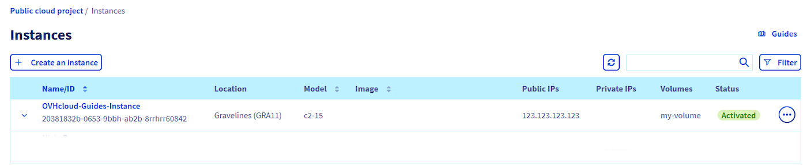

> [!primary]
> Questa traduzione è stata generata automaticamente dal nostro partner SYSTRAN. I contenuti potrebbero presentare imprecisioni, ad esempio la nomenclatura dei pulsanti o alcuni dettagli tecnici. In caso di dubbi consigliamo di fare riferimento alla versione inglese o francese della guida. Per aiutarci a migliorare questa traduzione, utilizza il pulsante "Contribuisci" di questa pagina.
>

## Obiettivo

Le istanze Public Cloud possono essere gestite direttamente dallo [Spazio Cliente](/links/manager).

**Questa guida ti mostra le operazioni disponibili nello Spazio Cliente OVHcloud per un'istanza Public Cloud.**

## Prerequisiti

- Un [progetto Public Cloud](https://www.ovhcloud.com/it/public-cloud/) nel tuo account OVHcloud
- Un'[istanza Public Cloud](/pages/public_cloud/compute/public-cloud-first-steps) nel tuo progetto
- Avere accesso allo [Spazio Cliente OVHcloud](/links/manager)

## Procedura

Accedi allo [Spazio Cliente OVHcloud](/links/manager) e apri il tuo progetto `Public Cloud`{.action}. 

### Utilizza l'interfaccia di gestione delle istanze

Clicca sulle `Instances`{.action} nel menu a sinistra. 

{.thumbnail}

In questa pagina sono elencate tutte le tue istanze Public Cloud e alcune delle loro proprietà:

- l'ID dell'istanza, necessario per alcune chiamate API;
- localizzazione del datacenter, cioè la regione dell'istanza;
- il modello dell'istanza;
- l'immagine, cioè il sistema operativo installato sull'istanza;
- indirizzo IPv4 dell'istanza;
- l'indirizzo privato attualmente collegato all'istanza;
- i volumi (dischi) aggiuntivi attualmente associati all'istanza;
- lo stato dell'istanza, che indica se è allo stato `Attivato`.

### Opzioni di gestione sul pannello di controllo dell'istanza

Nella pagina di gestione delle istanze, clicca sul nome dell'istanza.

Seleziona l'opzione scelta nel riquadro di sinistra "Gestione".

{.thumbnail}

Queste azioni sono disponibili anche sulla pagina di gestione delle istanze se cliccate sul pulsante `...`{.action} nella tabella.

#### Modifica la configurazione dell’istanza

Clicca su `Modifica`{.action}.

Visualizzi una nuova pagina con una versione modificata delle opzioni [di creazione dell'istanza](/pages/public_cloud/compute/public-cloud-first-steps), in cui puoi modificare questi elementi:

- **Modifica il nome**: per facilitare l'identificazione, assegna un nome all'istanza.
- **Modifica l'immagine**: è possibile scegliere un altro sistema operativo per l'istanza (ricordati che la reinstallazione di un'istanza comporta la cancellazione di tutti i dati).
- **Modifica il modello**: è possibile modificare il modello di istanza Per maggiori informazioni sulle opzioni, consulta [questa guida](/pages/public_cloud/compute/public-cloud-first-steps#step-3-crea-unistanza).
- **Modifica il periodo di fatturazione**: è possibile modificare il periodo di fatturazione dell'istanza da una fatturazione oraria a mensile. Per maggiori informazioni, consulta [questa guida](/pages/account_and_service_management/managing_billing_payments_and_services/changing_hourly_monthly_billing).

#### Crea un backup di un'istanza

Clicca su `Crea un backup`{.action}.

Per maggiori informazioni, consulta la guida [Salva un'istanza](/pages/public_cloud/compute/save_an_instance). 

#### Crea un backup automatico di un'istanza

Clicca su `Crea un backup automatizzato`{.action}.

Per maggiori informazioni, consulta la guida [Salva un'istanza](/pages/public_cloud/compute/save_an_instance#creare-un-backup-automatizzato-di-unistanza).

#### Arrestare un'istanza

Clicca su `Arresta`{.action}.

In questo modo l'istanza passerà allo stato `Spento`, ma all'utente verrà comunque addebitato lo stesso prezzo per l'istanza. Per maggiori informazioni, consulta la nostra guida [Sospendi o metti in pausa un’istanza](/pages/public_cloud/compute/suspend_or_pause_an_instance#nello-spazio-cliente-ovhcloud).

Clicca su `Comincia ora`{.action} per riattivare l'istanza.

#### Utilizza la modalità Rescue

Clicca su `Riavvia in modalità Rescue`{.action}.

Questa operazione attiverà la modalità Rescue dell'istanza. Per maggiori informazioni, consulta la guida [Attivare il Rescue mode su un’istanza Public Cloud](/pages/public_cloud/compute/put_an_instance_in_rescue_mode).

#### Riavvia l’istanza

> [!warning]
> L'opzione di riavvia a caldo (soft) non è attualmente disponibile per le istanze Metal.
>

- Clicca su `Riavvia a caldo (soft)`{.action} per effettuare un riavvio a livello software.
- Clicca su `Riavvia a freddo (hard)`{.action} per avviare un riavvio a livello hardware.

Conferma la richiesta di riavvio nella nuova finestra.

#### Sospendere (*shelve*) un'istanza

Clicca su `Sospesa`{.action}.

Questa azione posizionerà l'istanza nello stato "*shelved*", visualizzato come `Sospesa`. Per maggiori informazioni sui diversi stati di sospensione dell'istanza, consulta la guida [Sospendi o metti in pausa un’istanza](/pages/public_cloud/compute/suspend_or_pause_an_instance#sospendere-shelve-unistanza).

Clicca su `Riattiva`{.action} per ripristinare lo stato `Attivato` dell'istanza.

#### Reinstalla l’istanza

Clicca su `Reinstalla`{.action}.

Questa azione reinstallerà l'istanza con lo stesso sistema operativo, a condizione che l'immagine sia sempre supportata.

Ti ricordiamo che la reinstallazione **elimina tutti i dati** archiviati sulla tua istanza.

#### Elimina l’istanza

Clicca su `Elimina`{.action}.

Questa azione comporta la cancellazione definitiva dell'istanza e di tutti i suoi dati.

Nella nuova finestra, conferma l'operazione.

> [!warning]
> L'eliminazione di un'istanza non comporta l'eliminazione automatica di tutte le opzioni associate (storage, snapshot, backup, ecc...). Assicurati che tutte le altre opzioni associate all'istanza siano eliminate per interrompere la fatturazione.
>

### Accedi alla console VNC 

Clicca sulle `Instances`{.action} nel menu a sinistra. Nella pagina di gestione delle istanze, clicca sul nome dell'istanza nella tabella.

Clicca sulla scheda `Console VNC`{.action}.

{.thumbnail}

La console VNC fornisce un accesso diretto all'istanza. Per il corretto funzionamento dell'accesso, è necessario configurare un nome utente e una password sull'istanza. 

Per maggiori informazioni, consulta la nostra guida [Creare e connettersi a un’istanza Public Cloud](/pages/public_cloud/compute/public-cloud-first-steps#connect-to-instance) a essa.

## Per saperne di più

[Creare e connettersi a un’istanza Public Cloud](/pages/public_cloud/compute/public-cloud-first-steps)

[Presentazione di Horizon](/pages/public_cloud/compute/introducing_horizon)

Se avete bisogno di formazione o di assistenza tecnica per implementare le nostre soluzioni, contattate il vostro rappresentante o cliccate su [questo link](/links/professional-services) per ottenere un preventivo e richiedere un'analisi personalizzata del vostro progetto da parte dei nostri esperti del team Professional Services.

Contatta la nostra Community di utenti all’indirizzo <https://community.ovh.com/en/>.