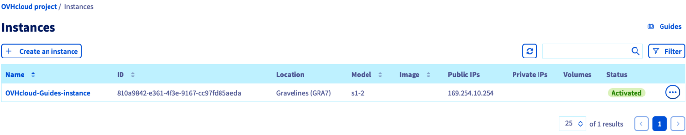
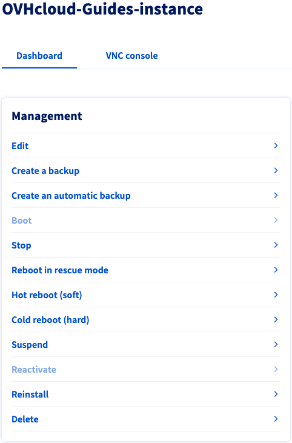
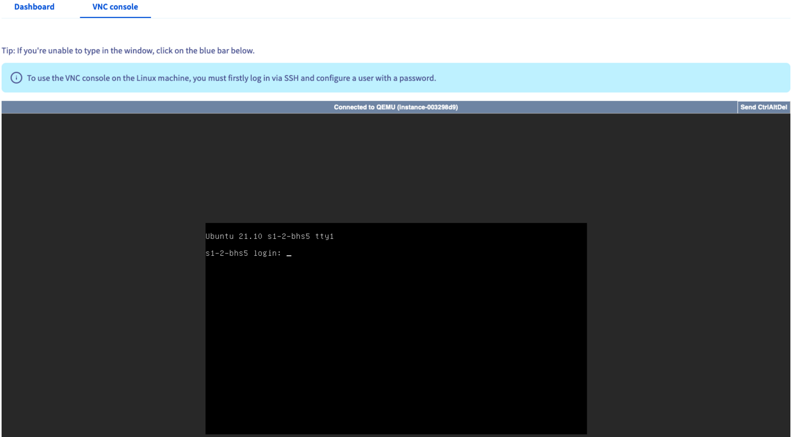

> [!primary]
> Esta tradução foi automaticamente gerada pelo nosso parceiro SYSTRAN. Em certos casos, poderão ocorrer formulações imprecisas, como por exemplo nomes de botões ou detalhes técnicos. Recomendamos que consulte a versão inglesa ou francesa do manual, caso tenha alguma dúvida. Se nos quiser ajudar a melhorar esta tradução, clique em "Contribuir" nesta página.
>

## Objetivo

Pode gerir as suas instâncias Public Cloud na sua [Área de Cliente](https://www.ovh.com/auth/?action=gotomanager&from=https://www.ovh.pt/&ovhSubsidiary=pt).

**Este guia explica em pormenor as ações disponíveis na Área de Cliente OVHcloud para uma instância Public Cloud.**

## Requisitos

- Um [projeto Public Cloud](https://www.ovhcloud.com/pt/public-cloud/) na sua conta OVHcloud
- Uma [instância Public Cloud](/pages/public_cloud/compute/public-cloud-first-steps) no seu projeto
- Ter acesso à [Área de Cliente OVHcloud](https://www.ovh.com/auth/?action=gotomanager&from=https://www.ovh.pt/&ovhSubsidiary=pt)

## Instruções

Ligue-se à sua [Área de Cliente OVHcloud](https://www.ovh.com/auth/?action=gotomanager&from=https://www.ovh.pt/&ovhSubsidiary=pt) e abra o seu projeto `Public Cloud`{.action}. 

### Utilizar a interface de gestão das instâncias

Clique em `Instances`{.action} no menu à esquerda. 

{.thumbnail}

Esta página lista o conjunto das suas instâncias Public Cloud e algumas das suas propriedades:

- ID da instância, necessária para determinadas chamadas API;
- a localização do datacenter, ou seja, a região da instância;
- O modelo da instância;
- imagem, ou seja, o SO instalado na instância;
- o endereço IPv4 da instância;
- os volumes (discos) adicionais atualmente associados à instância;
- o estado da instância, indicando se está no estado `Ativado`.

### Opções de gestão no painel de controlo da instância

Na página de gestão das instâncias, clique no nome de uma instância.

Selecione a opção desejada no quadro da esquerda "Gestão".

{.thumbnail}

Estas ações também estão disponíveis na página de gestão das instâncias, se clicar no botão `...`{.action} na tabela.

#### Editar a configuração de uma instância

Clique em `Editar`{.action}.

A nova página que aparece apresenta uma versão modificada das opções [de criação de instância](/pages/public_cloud/compute/public-cloud-first-steps), na qual pode modificar os seguintes elementos:

- **Modificar o nome**: pode atribuir um nome à instância para uma maior facilidade de identificação.
- **Modificar a imagem**: pode escolher outro sistema operativo para a instância (tenha em atenção que a reinstalação de uma instância eliminará todos os dados que contém).
- **Modificar o modelo**: pode alterar o modelo de instância. Para mais informações sobre as opções, consulte [este manual](/pages/public_cloud/compute/public-cloud-first-steps#3o-passo-criacao-de-uma-instancia).
- **Alterar o período de faturação**: pode alterar o período de faturação da instância de uma faturação à hora para uma faturação mensal. Para mais informações, consulte [este guia](/pages/account_and_service_management/managing_billing_payments_and_services/changing_hourly_monthly_billing).

#### Criar um backup de uma instância

Clique em `Criar um backup`{.action}.

Para mais informações, consulte o manual "[Guardar uma instância](/pages/public_cloud/compute/save_an_instance)". 

#### Criar um backup automático de uma instância

Clique em `Criar um backup automatizado`{.action}.

Para mais informações, consulte o manual "[Guardar uma instância](/pages/public_cloud/compute/save_an_instance#criar-um-backup-automatizado-de-uma-instancia)".

#### Suspender uma instância

Clique em `Parar`{.action}.

Esta ação terá por efeito suspender a instância. Para mais informações, consulte o nosso manual "[Suspender ou colocar em pausa uma instância](/pages/public_cloud/compute/suspend_or_pause_an_instance#parar-suspend-uma-instancia)".

Clique em `Iniciar`{.action} para reativar a instância.

#### Utilizar o modo rescue

Clique em `Reiniciar em modo de rescue`{.action}.

Isto irá ativar o modo de rescue da instância. Consulte o nosso manual [Passar uma instância em modo de rescue](/pages/public_cloud/compute/put_an_instance_in_rescue_mode) para obter informações detalhadas.

#### Reiniciar uma instância

> [!warning]
> A opção de reboot a quente (soft) não está atualmente disponível para as instâncias Metal.
>

- Clique em `Reboot a quente (soft)`{.action} para efetuar um reboot ao nível de software.
- Clique em `Reiniciar a frio (hard)`{.action} para lançar um reboot ao nível material.

Confirme o pedido de reboot na janela que aparecer.

#### Suspender (*shelve*) uma instância

Clique em `Suspender`{.action}.

Isto colocará a instância no estado "*shelved*", apresentado aqui como `Suspended`. Consulte o nosso manual "[Suspender ou colocar em pausa uma instância](/pages/public_cloud/compute/suspend_or_pause_an_instance#suspender-shelve-uma-instancia)" para obter mais informações sobre os diferentes estados de suspensão de uma instância.

Clique em `Reativar`{.action} para restaurar o estado `Ativado` da instância.

#### Reinstalar uma instância

Clique em `Reinstalar`{.action}.

Esta ação reinstalará a instância com o mesmo sistema operativo, desde que a imagem seja sempre tomada a cargo.

Tenha em atenção que a reinstalação **elimina todos os dados** atualmente armazenados na sua instância.

#### Eliminar uma instância

Clique em `Eliminar`{.action}.

Esta ação terá por efeito eliminar definitivamente a instância, bem como todos os seus dados.

Confirme o pedido de eliminação na janela que aparecer.

### Aceder à consola VNC

Clique em `Instances`{.action} no menu à esquerda. Na página de gestão das instâncias, clique no nome da instância.

A seguir, clique no separador `Console VNC`{.action}.

{.thumbnail}

A consola VNC fornece um acesso direto à sua instância. Para que este acesso funcione, primeiro tem de configurar um nome de utilizador e uma palavra-passe na instância. 

Para mais informações, consulte o nosso manual "[Criação e conexão a uma primeira instância Public Cloud](/pages/public_cloud/compute/public-cloud-first-steps#connect-to-instance)".

## Quer saber mais?

[Criação e conexão a uma primeira instância Public Cloud](/pages/public_cloud/compute/public-cloud-first-steps)

[Apresentação do Horizon](/pages/public_cloud/compute/introducing_horizon)

Se precisar de formação ou de assistência técnica para implementar as nossas soluções, contacte o seu representante comercial ou clique em [esta ligação](https://www.ovhcloud.com/pt/professional-services/) para obter um orçamento e solicitar uma análise personalizada do seu projecto aos nossos especialistas da equipa de Serviços Profissionais.

Junte-se à nossa comunidade de utilizadores em <https://community.ovh.com/en/>.