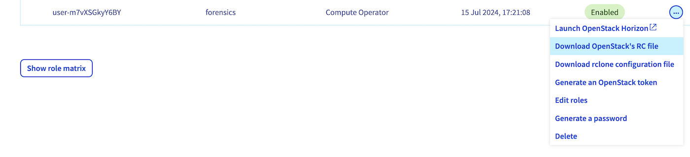

## Objectif

Dans le cas d'un incident de sécurité, réaliser des investigations numériques sur les données du disque peut s'avérer nécessaire tout comme investiguer la RAM pour récolter des indices d'intérêt. Ce guide vous accompagnera pas à pas pour récupérer les données nécessaires à vos investigations.

## Prérequis

- S'assurer que vos investigations portent sur une instance Public Cloud car ce guide ne s'appliquera que pour les instances Public Cloud.
- Avoir la [OpenStack CLI](/pages/public_cloud/compute/prepare_the_environment_for_using_the_openstack_api) prête à être utilisée sur votre système.
- Un [utilisateur OpenStack](/pages/public_cloud/compute/create_and_delete_a_user) a été créé avec (a minima) les rôles _Compute Operator_ et _Backup Operator_.

## En pratique

### Récupérer la RAM d'une instance Public Cloud active

OVHcloud n'a aucun accès à votre instance et OpenStack ne propose aucune fonctionnalité permettant de capturer la RAM d'une instance en cours d'exécution. Par conséquent, dans cette situation, nous vous recommandons de vous connecter sur votre instance et de lancer l'outil de capture de votre choix.

### Récupérer le disque d'une instance Public Cloud

Afin de récupérer le disque d'une instance Public Cloud, le moyen le plus simple est d'utiliser [l'utilitaire en ligne de commande OpenStack](https://docs.openstack.org/newton/user-guide/common/cli-overview.html). Si l'outil n'a pas été installé sur votre système, vous pouvez lire [notre guide](/pages/public_cloud/compute/prepare_the_environment_for_using_the_openstack_api) ainsi que [notre guide pour créer un utilisateur OpenStack](/pages/public_cloud/compute/create_and_delete_a_user).

#### Réaliser une copie de sauvegarde

Tout d'abord, nous allons réaliser une copie de sauvegarde de l'instance Public Cloud. Cette opération peut être faite soit [en utilisant l'espace client OVHcloud](/pages/public_cloud/compute/save_an_instance) ou bien en utilisant la OpenStack CLI. Dans ce guide, nous appliquerons la seconde option.

> [!primary]
>
> En dehors des instances Metal, cette action est transparente et ne redémarrera pas votre instance.

Vous devez commencer par récupérer le fichier `openrc.sh`. Dans le menu de gauche de l'univers Public Cloud, sous la catégorie "Project Management", rendez-vous dans la section `Utilisateurs & Roles`{.action}, puis, à droite de votre utilisateur OpenStack, cliquez sur le bouton `...`{.action} et sélectionnez `Télécharger le fichier OpenStack RC`{.action}. Une boîte de dialogue vous demandera de choisir la _Region_ afin de vous permettre de télécharger le bon fichier de configuration. Sélectionnez la même _Region_ que l'instance Public Cloud que vous souhaitez investiguer.

{.thumbnail}

> [!warning]
> Ce fichier ne peut pas être utilisé sous Windows. Nous recommandons d'utiliser WSL sous Windows pour utiliser la CLI OpenStack puisque cela résoud de nombreuses problématiques.
>
> Cette [documentation](/pages/public_cloud/compute/loading_openstack_environment_variables) vous aidera à configurer les bonnes variables d'environnement sous Windows.

Le fichier `openrc.sh` peut maintenant être chargé en utilisant la commande `source openrc.sh`. Vous serez invité à saisir le mot de passe de l'utilisateur sélectionné.

Une fois fait, vous pouvez lancer la commande `openstack list server` qui listera toutes vos instances déployées sur la région que vous avez précédemment choisie et où vous devriez retrouver l'instance que vous souhaitez investiguer :

```bash
$ source openrc.sh
Please enter your OpenStack Password:
$ openstack server list
+--------------------------------+------------------------+---------+----------------------------------+-----------+-----------+
| ID                             | Name                   | Status  | Networks                         | Image     | Flavor    |
+--------------------------------+------------------------+---------+----------------------------------+-----------+-----------+
| f1f231ae-d4e8-4d3d-9014-       | pwned-instance         | ACTIVE  | Ext-Net=2001:41d0:xxx:xxx::xxxx, | Debian 12 | d2-2      |
| 103c2d564aec                   |                        |         | 51.91.xxx.xxx                    |           |           |
| e5579236-240f-4c65-bafd-       | another-running-vm     | ACTIVE  | Ext-Net=2001:41d0:xxx:xxx::xxxx, |           | win-c2-15 |
| ca1c94c3f8ef                   |                        |         | 57.128.xxx.xxx                   |           |           |
+--------------------------------+------------------------+---------+----------------------------------+-----------+-----------+
```

Afin de réaliser une sauvegarde de l'instance `pwned-instance`, lancez la commande suivante :

```bash
$ openstack server image create --name "the-instance-backup-name" "pwned-instance"
+------------+-------------------------------------------------------------------------------------------------------------------------+
| Field      | Value                                                                                                                   |
+------------+-------------------------------------------------------------------------------------------------------------------------+
| created_at | 2024-07-16T10:39:56Z                                                                                                    |
| file       | /v2/images/571fb4f4-c714-483c-abe6-9dfcdfcf0498/file                                                                    |
| id         | 571fb4f4-c714-483c-abe6-9dfcdfcf0498                                                                                    |
| min_disk   | 25                                                                                                                      |
| min_ram    | 0                                                                                                                       |
| name       | the-instance-backup-name                                                                                                |
| owner      | 565ce1846b2a4c080377xxxxxxxxxx73                                                                                        |
| properties | base_image_ref='93fcbb57-6bf3-4d03-949b-3afdf98e77f1', build_id='aa816ca5-f59a-439c-94a9-b1e18ed564ee',                 |
|            | data='/home/glance/images/Debian-12.raw', distro_family='debian', hw_disk_bus='scsi', hw_qemu_guest_agent='yes',        |
|            | hw_scsi_model='virtio-scsi', hypervisor_type='qemu', image_build_date='2024-07-01 12:48:37',                            |
|            | image_original_user='debian', image_type='snapshot', instance_uuid='f1f231ae-d4e8-4d3d-9014-103c2d564aec',              |
|            | locations='[]', os_hidden='False', owner_project_name='686981609xxxxxx2',                                               |
|            | owner_user_name='565ce1846b2a4c080377xxxxxxxxxx73', support_rtm='no', user_id='85265a173b7c4c26ba48899xxxxxxxx8'        |
| protected  | False                                                                                                                   |
| schema     | /v2/schemas/image                                                                                                       |
| status     | queued                                                                                                                  |
| tags       |                                                                                                                         |
| updated_at | 2024-07-16T10:39:56Z                                                                                                    |
| visibility | private                                                                                                                 |
+------------+-------------------------------------------------------------------------------------------------------------------------+
```

En fonction de la taille du disque de votre instance, la sauvegarde de votre instance peut prendre jusqu'à 15 minutes. Dans cet exemple, l'action de sauvegarder une instance de type D2-2 a pris moins d'une minute. Malheureusement, OpenStack ne fournit aucun indice de progression sur la tâche en cours. Il vous faudra donc exécuter la commande suivante de façon périodique jusqu'à ce que le statut de l'image devienne `active` :

```bash
$ openstack image list --private
+--------------------------------------+------------------------------+--------+
| ID                                   | Name                         | Status |
+--------------------------------------+------------------------------+--------+
| c192a909-eb84-424b-9e2b-a50c0409ee9b | backup-vm 02/02/2023 00:18   | active |
| 571fb4f4-c714-483c-abe6-9dfcdfcf0498 | the-instance-backup-name     | queued |
+--------------------------------------+------------------------------+--------+
$ openstack image list --private
+--------------------------------------+------------------------------+--------+
| ID                                   | Name                         | Status |
+--------------------------------------+------------------------------+--------+
| c192a909-eb84-424b-9e2b-a50c0409ee9b | backup-vm 02/02/2023 00:18   | active |
| 2123093f-b2fc-45b2-b50c-2288c4475d1e | the-instance-backup-name     | active |
+--------------------------------------+------------------------------+--------+
```


#### Télécharger la copie de sauvegarde

Maintenant que la sauvegarde a été faite, nous allons pouvoir télécharger l'image de cette sauvegarde en local pour pouvoir mener les investigations. La commande suivante vous permettra de télécharger l'image sur votre système :

```bash
$ openstack image save --file my_local_file.qcow2 the-instance-backup-name
$ ls -lrth
total 1.2G
-rw-r--r-- 1 debian debian 1.3K Jul 15 15:57 openrc.sh
-rw-r--r-- 1 debian debian 1.2G Jul 16 10:43 my_local_file.qcow2
```

De même que précédemment, cette commande ne vous affichera aucune barre de progression. Attendez jusqu'à ce que la commande vous rende la main, ce qui indiquera que le téléchargement est terminé. Vous devriez alors voir l'image sur votre disque. Il est tout à fait possible que la taille du fichier soit inférieure à la taille du disque de votre instance. En effet, le redimensionnement automatique du disque est activé.

#### Manipuler des images au format qcow2

Le format de fichier `qcow2` signifie _QEMU Copy On Write_. Il s'agit du format d'image de disque utilisé par défaut par _QEMU_. Pour manipuler ces fichiers, _QEMU_ fournit des outils qui vous seront très certainement utiles.

##### Monter des images qcow2

Pour monter des images `qcow2`, assurez-vous que _QEMU_ est disponible sur votre système.

Vous devez commencer par activer sur votre système le support de _Network Block Device (NBD)_ afin de pouvoir utiliser `qemu-nbd`. Voici la commande :

```bash
$ sudo modprobe nbd max_part=8
```

Puis, vous pouvez charger l'image en tant que _network block device_ :

```bash
$ sudo qemu-nbd --connect /dev/nbd0 my_local_file.qcow2
```

Ainsi, le périphérique peut être utilisé comme n'importe quel autre périphérique de stockage et être monté :

```bash
$ fdisk -l /dev/nbd0
Disk /dev/nbd0: 25 GiB, 26843545600 bytes, 52428800 sectors
Units: sectors of 1 * 512 = 512 bytes
Sector size (logical/physical): 512 bytes / 512 bytes
I/O size (minimum/optimal): 512 bytes / 512 bytes
Disklabel type: gpt
Disk identifier: 6CBB44F1-D559-9B42-A076-7C0EA2B76310

Device        Start      End  Sectors  Size Type
/dev/nbd0p1  262144 52428766 52166623 24.9G Linux root (x86-64)
/dev/nbd0p14   2048     8191     6144    3M BIOS boot
/dev/nbd0p15   8192   262143   253952  124M EFI System

Partition table entries are not in disk order.

$ sudo mount -o ro /dev/nbd0p1 ./the-disk
$ ls the-disk/
bin  boot  dev  etc  home  lib  lib64  lost+found  media  mnt  opt  proc  root  run  sbin  srv  sys  tmp  usr  var
```

Une fois que vous avez terminé, vous pouvez libérer l'image :

```bash
$ sudo umount ./the-disk
$ sudo qemu-nbd --disconnect /dev/nbd0
/dev/nbd0 disconnected
```

##### Convertir une image qcow2 en raw

Malheureusement, le format de fichier `qcow2` n'est pas supporté pas les logiciels de forensics. Pour utiliser ce type de solution, vous devrez procéder à la conversion du format `qcow2` vers le format `raw`.

_QEMU_ fournit un convertisseur que vous pouvez utiliser en utilisant la ligne de commande suivante :

```bash
$ qemu-img convert -f qcow2 my_local_file.qcow2 -O raw my_local_file.raw
$ ls -lrth
-rw-r--r-- 1 debian debian 1.3K Jul 15 15:57 openrc.sh
drwxr-xr-x 2 debian debian 4.0K Jul 16 10:18 the-disk
-rw-r--r-- 1 debian debian 1.1G Jul 16 10:19 my_local_file.qcow2
-rw-r--r-- 1 debian debian  25G Jul 16 10:24 my_local_file.raw
```

> [!primary]
>
> A noter que le fichier `raw` produit aura strictement la taille du disque de l'instance. En effet, le format `raw` ne supporte pas l'allocation de taille dynamique, contrairement au format `qcow2`.

## Aller plus loin

Le convertisseur de _QEMU_ supporte un grand nombre de formats de fichier en sortie, comme expliqué dans la documentation suivante : <https://docs.openstack.org/image-guide/convert-images.html>

Si vous avez besoin d'une formation ou d'une assistance technique pour la mise en oeuvre de nos solutions, contactez votre commercial ou cliquez sur [ce lien](/links/professional-services) pour obtenir un devis et demander une analyse personnalisée de votre projet à nos experts de l’équipe Professional Services.

Échangez avec notre [communauté d'utilisateurs](/links/community).