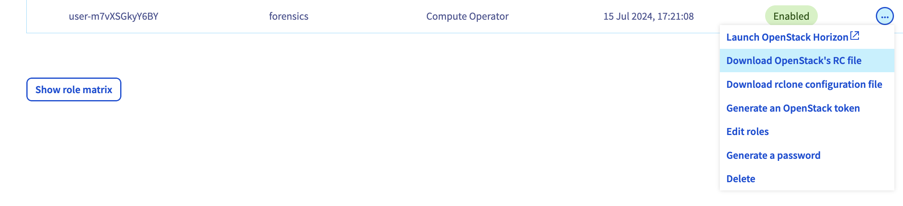

## Objective

In case of a Security Incident, performing forensics on the disk(s) of a Public Cloud instance(s) could be required as well as investigating the RAM to recover important artefacts.

This guide aims to detail how to do so step by step.

## Requirements

- Make sure you are investigating a Public Cloud instance since this guide is only working for Public Cloud instances.
- The [OpenStack CLI](/pages/public_cloud/compute/prepare_the_environment_for_using_the_openstack_api) ready to be used on your system.
- An [OpenStack user](/pages/public_cloud/compute/create_and_delete_a_user) has been created with (at least) the _Compute Operator_ and _Backup Operator_ roles.

## Instructions

### Recovering the RAM of a running Public Cloud instance

OVHcloud has no access to your instance and OpenStack has no feature to dump the RAM of a running instance. Consequently in this situation, we recommend you to connect to the instance and run a memory capture tool.

### Recovering the disk of a Public Cloud instance

In order to recover the disk of a Public Cloud instance, the easiest way is to use the [OpenStack Command Line Interface](https://docs.openstack.org/newton/user-guide/common/cli-overview.html). If the tool is not installed on your system, you can read the [following guide](/pages/public_cloud/compute/prepare_the_environment_for_using_the_openstack_api) as well as [the guide to create an OpenStack user](/pages/public_cloud/compute/create_and_delete_a_user).

#### Perform a backup

First, we are going to perform a backup of the Public Cloud instance. The operation can be done either [using the OVHcloud Control Panel](/pages/public_cloud/compute/save_an_instance) or using the OpenStack CLI. We are going to use the latter one.

> [!primary]
>
> Except for Metal instances, this action is transparent and won't reboot your instance.

You need to recover the `openrc.sh` file. In the `Users & Roles`{.action} section of the left-hand menu under "Project Management", click the `...`{.action} button and then `Download OpenStack's RC file`{.action}. A popup will ask you to choose the _Region_ the configuration file should be configured with. Pick the same _Region_ as the Public Cloud instance you want to investigate.

{.thumbnail}

> [!warning]
> This file cannot be used on Windows. We recommend using WSL on Windows to run the OpenStack CLI since it does solve several issues such as this one.
>
> This [documentation](/pages/public_cloud/compute/loading_openstack_environment_variables) can help you deal with the required environment variables on Windows.

The `openrc.sh` file can now be loaded using the command `source openrc.sh`. A prompt will ask you for the OpenStack password you configured when creating the user.

Once you're done, you can run the command `openstack list server` which should list all the instances deployed on the previously selected region:

```bash
$ source openrc.sh
Please enter your OpenStack Password:
$ openstack server list
+--------------------------------+------------------------+---------+----------------------------------+-----------+-----------+
| ID                             | Name                   | Status  | Networks                         | Image     | Flavor    |
+--------------------------------+------------------------+---------+----------------------------------+-----------+-----------+
| f1f231ae-d4e8-4d3d-9014-       | pwned-instance         | ACTIVE  | Ext-Net=2001:41d0:xxx:xxx::xxxx, | Debian 12 | d2-2      |
| 103c2d564aec                   |                        |         | 51.91.xxx.xxx                    |           |           |
| e5579236-240f-4c65-bafd-       | another-running-vm     | ACTIVE  | Ext-Net=2001:41d0:xxx:xxx::xxxx, |           | win-c2-15 |
| ca1c94c3f8ef                   |                        |         | 57.128.xxx.xxx                   |           |           |
+--------------------------------+------------------------+---------+----------------------------------+-----------+-----------+
```

In order to perform a backup of the instance `pwned-instance`, run the following command:

```bash
$ openstack server image create --name "the-instance-backup-name" "pwned-instance"
+------------+-------------------------------------------------------------------------------------------------------------------------+
| Field      | Value                                                                                                                   |
+------------+-------------------------------------------------------------------------------------------------------------------------+
| created_at | 2024-07-16T10:39:56Z                                                                                                    |
| file       | /v2/images/571fb4f4-c714-483c-abe6-9dfcdfcf0498/file                                                                    |
| id         | 571fb4f4-c714-483c-abe6-9dfcdfcf0498                                                                                    |
| min_disk   | 25                                                                                                                      |
| min_ram    | 0                                                                                                                       |
| name       | the-instance-backup-name                                                                                                |
| owner      | 565ce1846b2a4c080377xxxxxxxxxx73                                                                                        |
| properties | base_image_ref='93fcbb57-6bf3-4d03-949b-3afdf98e77f1', build_id='aa816ca5-f59a-439c-94a9-b1e18ed564ee',                 |
|            | data='/home/glance/images/Debian-12.raw', distro_family='debian', hw_disk_bus='scsi', hw_qemu_guest_agent='yes',        |
|            | hw_scsi_model='virtio-scsi', hypervisor_type='qemu', image_build_date='2024-07-01 12:48:37',                            |
|            | image_original_user='debian', image_type='snapshot', instance_uuid='f1f231ae-d4e8-4d3d-9014-103c2d564aec',              |
|            | locations='[]', os_hidden='False', owner_project_name='686981609xxxxxx2',                                               |
|            | owner_user_name='565ce1846b2a4c080377xxxxxxxxxx73', support_rtm='no', user_id='85265a173b7c4c26ba48899xxxxxxxx8'        |
| protected  | False                                                                                                                   |
| schema     | /v2/schemas/image                                                                                                       |
| status     | queued                                                                                                                  |
| tags       |                                                                                                                         |
| updated_at | 2024-07-16T10:39:56Z                                                                                                    |
| visibility | private                                                                                                                 |
+------------+-------------------------------------------------------------------------------------------------------------------------+
```

Depending on the size of the instance's disk, the backup process can take up to 15min. In this example, the backup of the D2-2 flavour took less than a minute. Unfortunately OpenStack does not provide a way to track the progress. You can only run the following command periodically and wait for the image to have the `active` status:

```bash
$ openstack image list --private
+--------------------------------------+------------------------------+--------+
| ID                                   | Name                         | Status |
+--------------------------------------+------------------------------+--------+
| c192a909-eb84-424b-9e2b-a50c0409ee9b | backup-vm 02/02/2023 00:18   | active |
| 571fb4f4-c714-483c-abe6-9dfcdfcf0498 | the-instance-backup-name     | queued |
+--------------------------------------+------------------------------+--------+
$ openstack image list --private
+--------------------------------------+------------------------------+--------+
| ID                                   | Name                         | Status |
+--------------------------------------+------------------------------+--------+
| c192a909-eb84-424b-9e2b-a50c0409ee9b | backup-vm 02/02/2023 00:18   | active |
| 2123093f-b2fc-45b2-b50c-2288c4475d1e | the-instance-backup-name     | active |
+--------------------------------------+------------------------------+--------+
```

#### Download the snapshot

Now the backup has been performed, we can download the image file to work locally. The following command will download the image on your system:

```bash
$ openstack image save --file my_local_file.qcow2 the-instance-backup-name
$ ls -lrth
total 1.2G
-rw-r--r-- 1 debian debian 1.3K Jul 15 15:57 openrc.sh
-rw-r--r-- 1 debian debian 1.2G Jul 16 10:43 my_local_file.qcow2
```

This command won't show any progress bar. Wait a bit until the process quits and you should see the image on your system. It is entirely possible that the file size is smaller than the instance's disk size. Automatic provisioning of the disk size may occur.

#### How to deal with qcow2 images

The `qcow2` file format stands for _QEMU Copy On Write_. As you may guess this is the default disk image format used by _QEMU_.
To deal with these files, _QEMU_ provides several tools that you will probably need.

##### Mounting qcow2 images

To mount `qcow2` images, make sure _QEMU_ is available on your system.

You will have first to enable the _Network Block Device (NBD)_ on your system to be able to use `qemu-nbd`. To do so, run this command:

```bash
$ sudo modprobe nbd max_part=8
```

You can now connect to the image as a network block device:

```bash
$ sudo qemu-nbd --connect /dev/nbd0 my_local_file.qcow2
```

The device can now be used as any other device and mounted:

```bash
$ fdisk -l /dev/nbd0
Disk /dev/nbd0: 25 GiB, 26843545600 bytes, 52428800 sectors
Units: sectors of 1 * 512 = 512 bytes
Sector size (logical/physical): 512 bytes / 512 bytes
I/O size (minimum/optimal): 512 bytes / 512 bytes
Disklabel type: gpt
Disk identifier: 6CBB44F1-D559-9B42-A076-7C0EA2B76310

Device        Start      End  Sectors  Size Type
/dev/nbd0p1  262144 52428766 52166623 24.9G Linux root (x86-64)
/dev/nbd0p14   2048     8191     6144    3M BIOS boot
/dev/nbd0p15   8192   262143   253952  124M EFI System

Partition table entries are not in disk order.

$ sudo mount -o ro /dev/nbd0p1 ./the-disk
$ ls the-disk/
bin  boot  dev  etc  home  lib  lib64  lost+found  media  mnt  opt  proc  root  run  sbin  srv  sys  tmp  usr  var
```

Once you're done, you can disconnect the image:

```bash
$ sudo umount ./the-disk
$ sudo qemu-nbd --disconnect /dev/nbd0
/dev/nbd0 disconnected
```

##### From qcow2 to raw image

Unfortunately the `qcow2` file format is not supported by the forensics softwares. If you want to use such a software, you'll need to convert the `qcow2` file to a `raw` file.

_QEMU_ provides a converter you can use by entering the following command:

```bash
$ qemu-img convert -f qcow2 my_local_file.qcow2 -O raw my_local_file.raw
$ ls -lrth
-rw-r--r-- 1 debian debian 1.3K Jul 15 15:57 openrc.sh
drwxr-xr-x 2 debian debian 4.0K Jul 16 10:18 the-disk
-rw-r--r-- 1 debian debian 1.1G Jul 16 10:19 my_local_file.qcow2
-rw-r--r-- 1 debian debian  25G Jul 16 10:24 my_local_file.raw
```

> [!primary]
>
> Note that the output `raw` file size of this command will be the actual size of the instance's disk. Although the `qcow2` file format supports dynamic allocation, this is not the case for the `raw` file format.

## Go further

The _QEMU_ convertion tool supports many output file formats as explained in this documentation: <https://docs.openstack.org/image-guide/convert-images.html>

If you need training or technical assistance to implement our solutions, contact your sales representative or click on [this link](/links/professional-services) to get a quote and ask our Professional Services experts for assisting you on your specific use case of your project.

Join our [community of users](/links/community).
